<!-- .slide: class="title-slide" -->

<p class="kicker">СДП 2026/27 · Семинар 1 · 8 октомври</p>

# Увод: сложност, тестване и `double`

Структури от данни и програмиране — семинарни упражнения

<p class="small">Записки: <a href="notes.md">notes.md</a> · Задачи: <a href="exercises.md">exercises.md</a></p>

---

## План за днес

| Време | Какво правим |
|---|---|
| 10 мин | Как работят семинарите |
| 25 мин | **Setup sprint** — проектът се билдва и първият тест става зелен |
| ☕ | почивка |
| 15 мин | Сложност: $O$, $\Omega$, $\Theta$ и как се брои |
| 30 мин | Практика: формули за цикли, дубликати, експеримент с удвояване |
| 10 мин | Обобщение и какво следва |

---

## Как работят семинарите

<div class="cols">
<div>

**Всяка седмица — един и същ ритъм**

- 10 мин загрявка (въпроси от миналия път)
- 15 мин кратък преговор на теорията
- 20 мин писане на код на живо
- 35 мин задачи по двойки
- 10 мин разбор и типични грешки

</div>
<div>

**Материали — всичко е в едно repo**

- слайдове (тези) — в GitHub Pages
- `notes.md` — пълни записки по темата
- `exercises.md` — задачи ★ / ★★ / ★★★
- `starter/` — код за попълване
- `tests/` — проверяват решението ви

</div>
</div>

<div class="box task">

Лекциите са в началото на седмицата, семинарът упражнява **темата от предходната седмица**. Оценяването и контролните са по правилата на лектора — вижте материалите от лекциите.

</div>

---

## Как проверявате сами решенията си

- Всяка задача идва с **тестове, които падат**, докато не я решите.
- Решението е готово, когато `ctest` е **зелен**.
- Еталонните решения се публикуват в понеделник след семинара в `solutions/`.
- Искате мнение за вашия код? **Fork** на repo-то → пишете ми с линк.

<div class="box good">

Цел за днес: до почивката всеки има работещ проект и **поне един зелен тест**.

</div>

---

<!-- .slide: data-background-color="#e3eefb" -->

# Setup sprint

<p class="small">25 минути · по двойки · вдигнете ръка при първа червена грешка, не след десетата</p>

---

## Стъпка 1 — клониране и отваряне

```bash
git clone https://github.com/MishoMish/fmi-kn-sdp-2026-2027-seminar.git
cd fmi-kn-sdp-2026-2027-seminar
```

Отворете **папката** (не отделен файл) в редактора си:

| Редактор | Какво става |
|---|---|
| VS Code + CMake Tools | разпознава `CMakePresets.json`, пита за preset → `default` |
| CLion | Settings → Build → CMake → включете preset-а `default` |
| Visual Studio 2022 | File → Open → Folder; preset-ите са в лентата горе |
| Терминал | командите от следващия слайд |

<p class="small">Нямате компилатор или CMake? → <a href="../../SETUP.md">SETUP.md</a> за Windows / macOS / Linux.</p>

---

## Стъпка 2 — configure, build, test

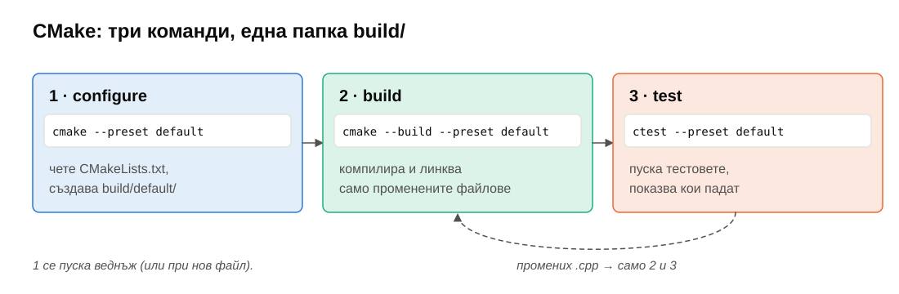

```bash
cmake --preset default            # веднъж
cmake --build --preset default    # след всяка промяна
ctest --preset default            # пуска тестовете
```

---

## Стъпка 3 — червено

Очакван резултат — почти всичко пада. Това е **правилно**:

```text
 1 - w01/starter: Task 0: the answer is 42 (Failed)
 2 - w01/starter: Task 1a: stepped loop (Failed)
 ...
6% tests passed, 15 tests failed out of 16
```

Пуснете само една задача:

```bash
ctest --preset default -R "Task 0"
./build/default/w01_tests "[task0]"     # директно, с подробен изход
```

---

## Стъпка 4 — зелено

Отворете `weeks/01-intro-complexity-testing/starter/first_green.cpp`:

```cpp
int answer() {
    // TODO: make the test pass. Rebuild, then run ctest again.
    return 0;
}
```

Поправете → **build** → **test**:

```text
1/1 Test #1: w01/starter: Task 0: the answer is 42 ...   Passed
```

<div class="box good fragment">

🎉 Това е целият работен цикъл за семестъра: **промяна → build → test**.

</div>

---

## Какво всъщност стана? От код до изпълним файл

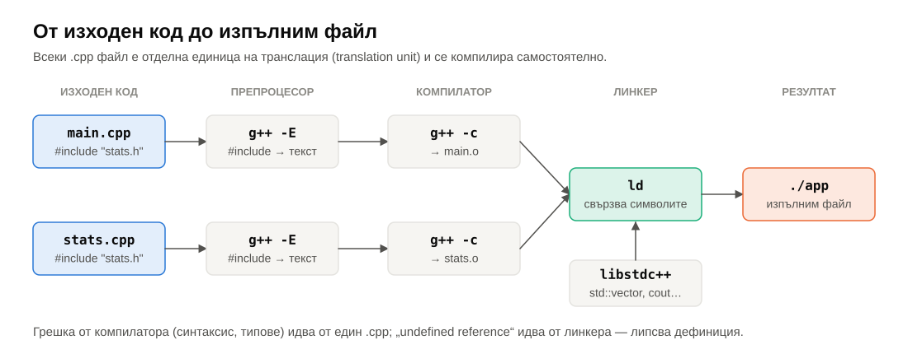

- **Компилатор** греши за един `.cpp` (синтаксис, типове).
- **Линкер** греши за цялата програма: `undefined reference to 'answer()'` = декларация има, дефиниция няма.

---

## Ако нещо не тръгва

| Симптом | Причина | Решение |
|---|---|---|
| `cmake: command not found` | няма CMake | SETUP.md → инсталация |
| `No CMAKE_CXX_COMPILER could be found` | няма компилатор | Windows: VS 2022 „Desktop C++“; macOS: `xcode-select --install`; Ubuntu: `sudo apt install build-essential` |
| `CMake 3.21 or higher is required` | стара версия | обновете CMake |
| `Could not find preset` | отворена е грешна папка | отворете **корена** на repo-то |
| нищо не помага | — | резервен вариант: само `g++` (следващ слайд) |

---

## Резервен вариант: само с `g++`

От папката на седмицата:

```bash
cd weeks/01-intro-complexity-testing
g++ -std=c++17 -c ../../third_party/catch2/catch_amalgamated.cpp -o catch.o   # веднъж, ~30 s
g++ -std=c++17 -I starter -I ../../third_party/catch2 \
    tests/*.cpp starter/*.cpp catch.o -o w01_tests
./w01_tests
```

<p class="small">Работи на всяка машина с компилатор за C++17. Catch2 е вътре в repo-то — не трябва интернет.</p>

---

<!-- .slide: data-background-color="#f6f5f2" -->

# ☕ Почивка

<p class="small">Ако проектът още не се билдва — останете, ще го оправим сега.</p>

---

## Сложност: какво броим?

<div class="cols">
<div>

- **Размер на входа** $n$ — брой елементи, цифри, върхове…
- **Елементарна операция** — сравнение, присвояване, аритметика: константно време.
- $T(n)$ = брой операции **в най-лошия случай** за вход с размер $n$.
- **Пространствена сложност** — допълнителна памет освен входа.

</div>
<div>

```cpp
int sum(const std::vector<int>& v) {
    int s = 0;              // 1
    for (int x : v) {       // n пъти
        s += x;             // 1
    }
    return s;               // 1
}
```

$T(n) = 2 + n \Rightarrow \Theta(n)$ време, $\Theta(1)$ допълнителна памет.

</div>
</div>

---

## Защо асимптотика?

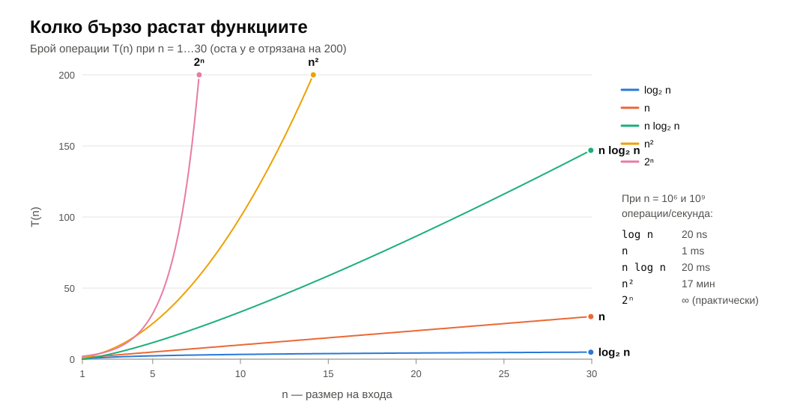

Константите зависят от машината. **Формата на растежа** — не.

---

## $O$, $\Omega$, $\Theta$ — дефиниции

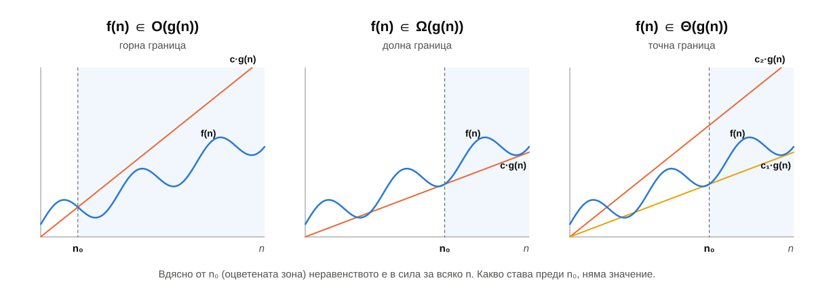

---

## Формално

- $f \in O(g) \iff \exists c > 0, n_0 : \forall n \ge n_0,\ f(n) \le c \cdot g(n)$
- $f \in \Omega(g) \iff \exists c > 0, n_0 : \forall n \ge n_0,\ f(n) \ge c \cdot g(n)$
- $f \in \Theta(g) \iff f \in O(g) \text{ и } f \in \Omega(g)$

<div class="box task">

Внимание: $O$ е **горна** граница, не „точната“ сложност. Вярно е, че $n \in O(n^2)$ — просто не е полезно. Когато знаем точната граница, казваме $\Theta$.

</div>

---

## Пример: $3n^2 + 5n + 2 \in \Theta(n^2)$

<div class="cols">
<div>

**Горна граница** ($O$): за $n \ge 1$

$3n^2 + 5n + 2 \le 3n^2 + 5n^2 + 2n^2 = 10n^2$

→ $c = 10$, $n_0 = 1$ <!-- .element: class="fragment" -->

</div>
<div>

**Долна граница** ($\Omega$): за $n \ge 1$

$3n^2 + 5n + 2 \ge 3n^2$

→ $c = 3$, $n_0 = 1$ <!-- .element: class="fragment" -->

</div>
</div>

<div class="box good fragment">

Правило: **запазете водещия член, махнете константата**. Но го знайте защо работи — горното е доказателството.

</div>

---

## Как се брои: зависими цикли

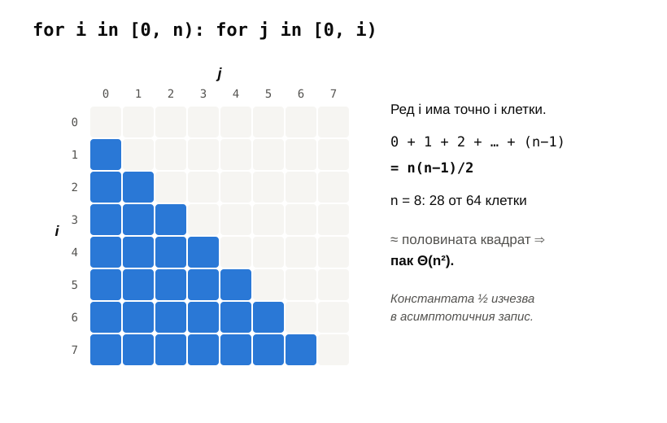

---

## Как се брои: цикъл с удвояване

<div class="r-stack">
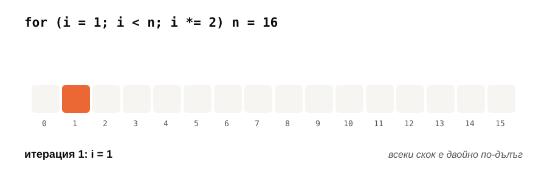
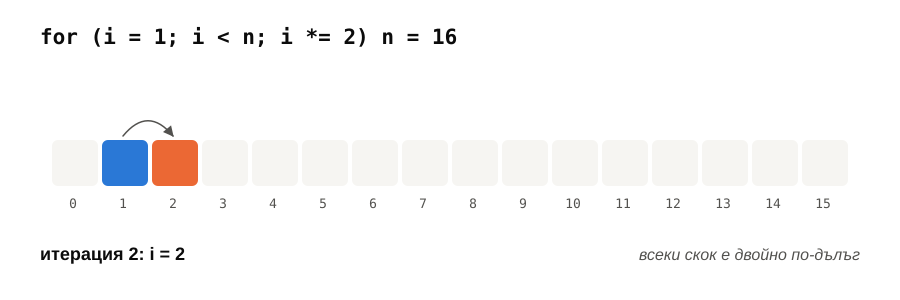
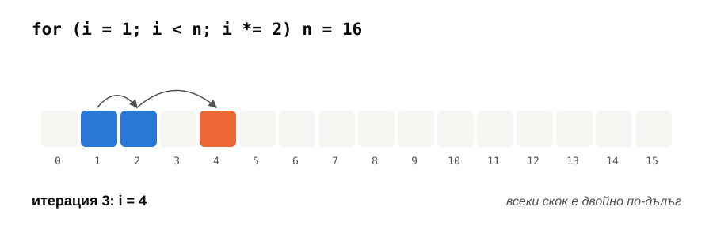
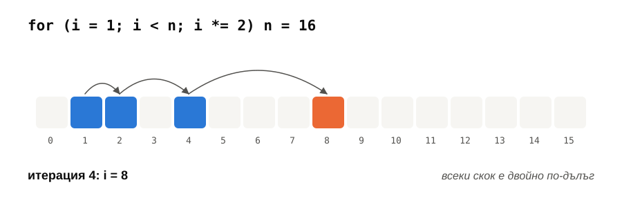
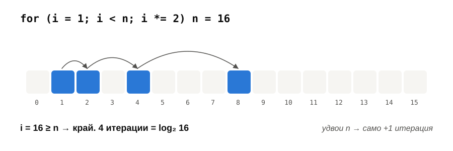
</div>

$i$ се удвоява → след $k$ стъпки $i = 2^k$ → цикълът спира, когато $2^k \ge n$ → $\Theta(\log n)$ итерации.

---

## Най-лош, най-добър, среден случай

```cpp
int indexOf(const std::vector<int>& v, int target) {
    for (std::size_t i = 0; i < v.size(); ++i) {
        if (v[i] == target) return static_cast<int>(i);
    }
    return -1;
}
```

| Случай | Кога | Сравнения |
|---|---|---|
| най-добър | `target` е първи | $1$ → $\Theta(1)$ |
| най-лош | няма го | $n$ → $\Theta(n)$ |
| среден | равномерно на случайна позиция | $\approx n/2$ → $\Theta(n)$ |

<p class="small">Без уточнение „сложност“ означава <strong>най-лош случай</strong> — това е гаранция.</p>

---

## Тестване: червено → зелено → рефакторинг

<div class="cols">
<div>

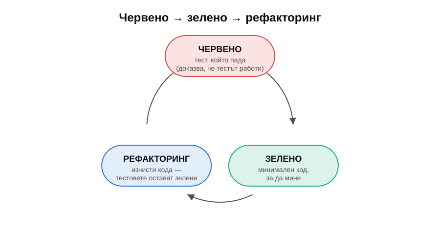

</div>
<div>

```cpp
#include <catch_amalgamated.hpp>
#include "duplicates.h"

TEST_CASE("two equal elements") {
    // Arrange
    std::vector<int> v{7, 7};
    // Act + Assert
    REQUIRE(hasDuplicateNaive(v));
}
```

- **Граничните случаи** първо: празно, един елемент, в двата края.
- **Сравнение с наивното решение** върху случайни входове.

</div>
</div>

---

<!-- .slide: data-background-color="#fde8df" -->

# Практика <span class="timer">30 мин</span>

<p class="small">По двойки. Задачите са в <a href="exercises.md">exercises.md</a>, кодът — в <code>starter/</code>.</p>

---

## Задача 1 — точни формули за цикли

Шест цикъла в `tests/loops.h`. За всеки — **точна** формула в `starter/loop_formulas.cpp`.

```cpp
for (i = 0; i < n; ++i)
    for (j = i + 1; j < n; ++j)
        for (k = j + 1; k < n; ++k)
            ++count;                 // колко пъти? → formulaTriple(n)
```

| | Цикъл | Трудност |
|---|---|---|
| a, b, c | стъпка 3; квадрат; триъгълник | ★ |
| d, e | удвояване; три вложени | ★★ |
| f | `for (i = n; i > 0; i /= 2) for (j < i)` | ★★★ |

<p class="small">Тестът проверява формулата ви за стотици стойности на n и показва първата, за която греши.</p>

---

## Задача 2 — един проблем, три алгоритъма

„Има ли повторение във вектора?“ — `starter/duplicates.h`

| Функция | Идея | Време | Памет |
|---|---|---|---|
| `hasDuplicateNaive` | всяка двойка | $\Theta(n^2)$ | $\Theta(1)$ |
| `hasDuplicateSorting` | сортирай копие, гледай съседи | $\Theta(n \log n)$ | $\Theta(n)$ |
| `hasDuplicateHashing` | `std::unordered_set` | $\Theta(n)$ средно | $\Theta(n)$ |

Шаблони са (`template <typename T>`) → работят за `int`, `std::string`, `char`… Тестовете проверяват и трите.

---

## Задача 3 — експеримент с удвояване ★★

```bash
cmake --preset release && cmake --build --preset release --target w01_bench
./build/release/w01_bench
```

Предскажете отношението $T(2n)/T(n)$ за всеки алгоритъм, **преди** да пуснете.

| Алгоритъм | Предсказание за $T(2n)/T(n)$ |
|---|---|
| naive, $\Theta(n^2)$ | $\approx 4$ <!-- .element: class="fragment" --> |
| sorting, $\Theta(n \log n)$ | малко над 2 <!-- .element: class="fragment" --> |
| hashing, $\Theta(n)$ | $\approx 2$ <!-- .element: class="fragment" --> |

---

## Задача 3 — резултатът

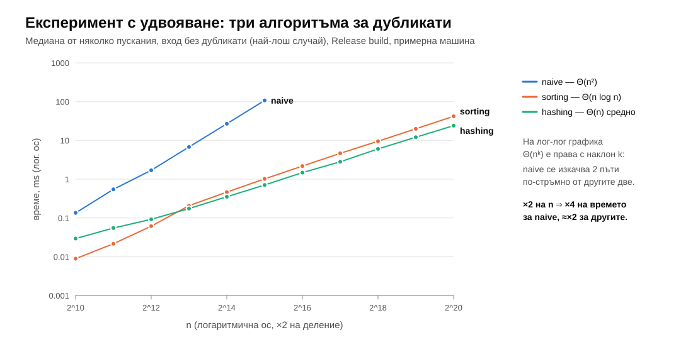

---

## `double`: три въпроса за загрявка

Какво ще отпечата?

```cpp
std::cout << (0.1 + 0.2 == 0.3) << '\n';     // ?
double nan = 0.0 / 0.0;
std::cout << (nan == nan) << '\n';           // ?
std::cout << (-0.0 == 0.0) << ' ' << 1.0 / -0.0 << '\n';   // ?
```

<div class="fragment">

<span class="answer">0</span> — 0.1 няма точно двоично представяне ·
<span class="answer">0</span> — NaN не е равно на нищо, дори на себе си ·
<span class="answer">1 -inf</span> — равни са, но се държат различно

</div>

---

## Защо 0.1 + 0.2 ≠ 0.3

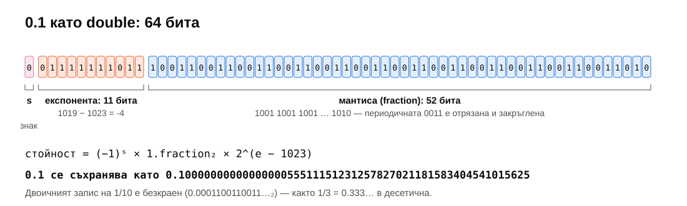

---

## Специалните стойности

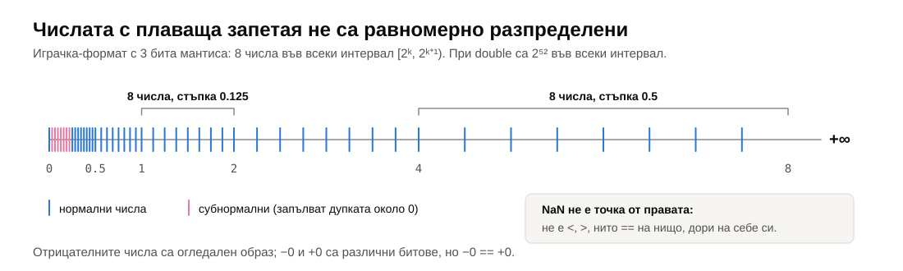

---

## Специалните стойности — какво да помните

| Израз | Резултат | Внимание |
|---|---|---|
| `1.0 / 0.0` | `inf` | не е грешка, не хвърля изключение |
| `0.0 / 0.0`, `inf - inf` | `NaN` | всяко сравнение с NaN е `false` |
| `-0.0 == 0.0` | `true` | но `1/-0.0 == -inf` |
| `std::sort` с NaN | **недефинирано поведение** | `<` не е strict weak ordering |

---

## Задачи 4–6 — за бързите

- **Задача 4 ★★** — напишете собствен `TEST_CASE` за дубликатите (идея: `0.0` и `-0.0` дубликати ли са?).
- **Задача 5 ★★** — `starter/floating.cpp`: `isNaN` без `std::isnan`, `isNegativeZero`, `almostEqual`, `kahanSum`.
- **Задача 6 ★★★** — `nanLastLess`: компаратор, с който `std::sort` подрежда числата и слага NaN накрая.

<div class="box warn">

`almostEqual` с **относителна** и **абсолютна** граница — никога `a == b` за изчислени `double`, никога само фиксирано `1e-9`.

</div>

---

## Обобщение

- Работен цикъл: **промяна → build → test**. Червеното е информация, не провал.
- $T(n)$ брои операции в **най-лошия случай**; $O$ / $\Omega$ / $\Theta$ — горна / долна / точна граница.
- Вложени зависими цикли → сума → формула. Удвояване/разполовяване → $\log n$.
- Експериментът потвърждава анализа: $\times 2$ на $n$ → $\times 4$ при $\Theta(n^2)$.
- `double` е приближение: сравнявайте с толеранс, пазете се от NaN.

---

## До следващия път

- Довършете задачи 1–3 (и 4–6, ако сте любопитни).
- Прочетете [notes.md](notes.md) — там е цялата теория от лекцията, с доказателствата.
- **Следващия четвъртък:** какво прави компилаторът с кода ни, кеш и локалност, контейнери.

<div class="box task">

**Изходен въпрос:** колко пъти се изпълнява тялото на `for (i = 1; i < n; i *= 3)` за $n = 100$? А за произволно $n$?

</div>
