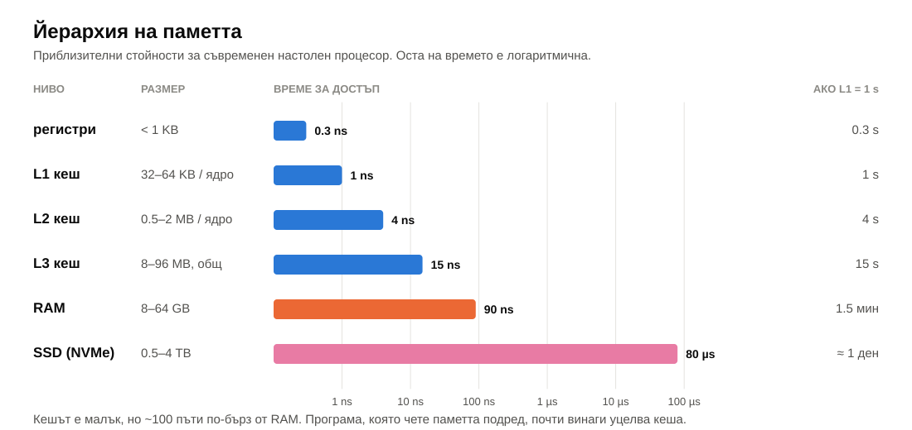
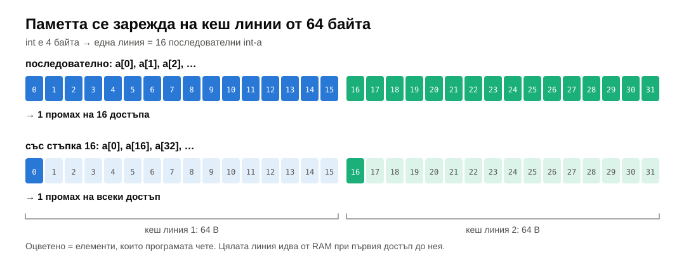
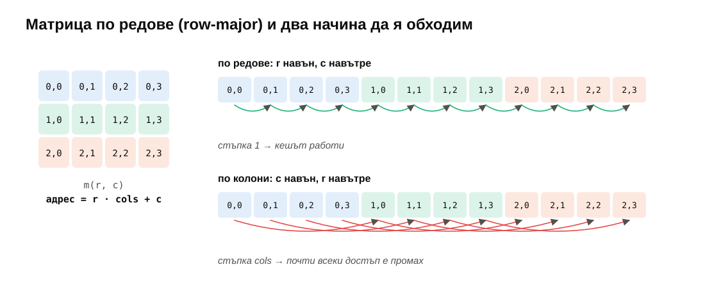
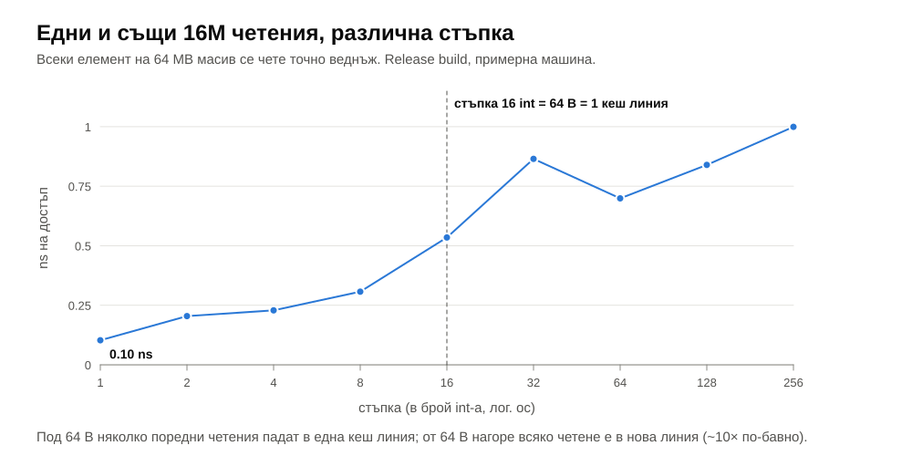
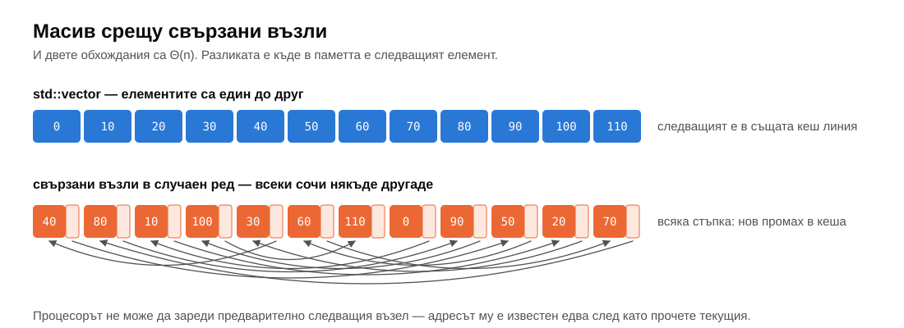
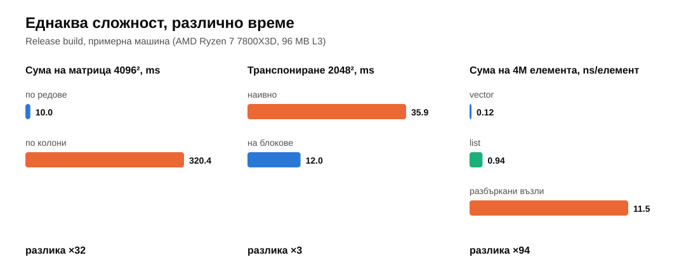
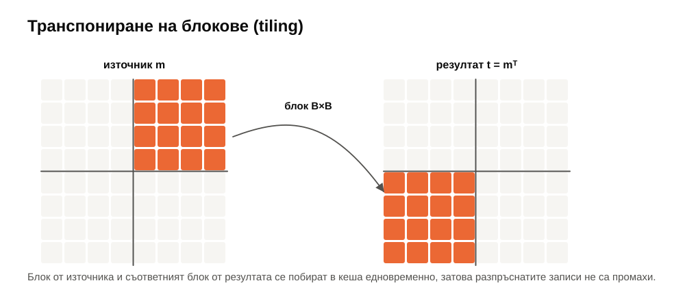
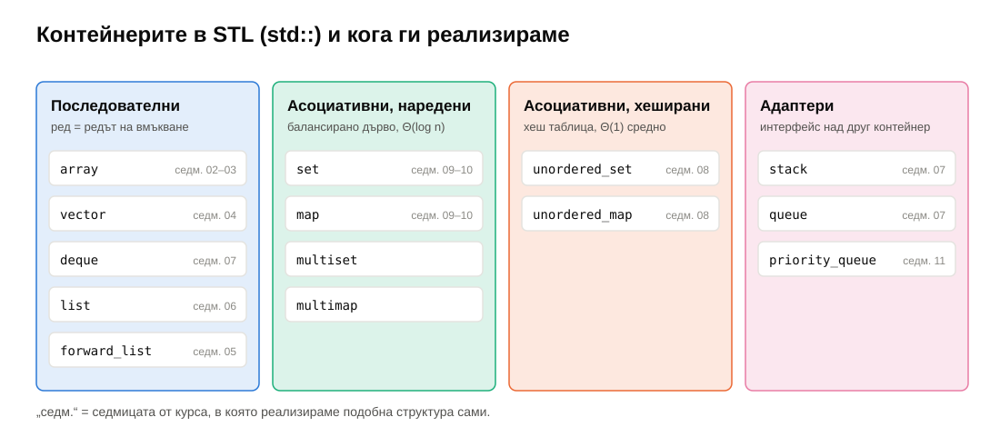
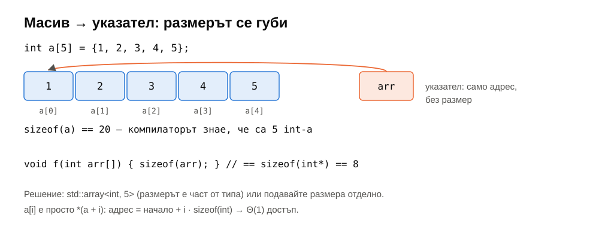

# Седмица 02 — Компилаторът, локалност, контейнери, масиви

> Семинар 2 · четвъртък, 15 октомври 2026 · [слайдове](https://mishomish.github.io/fmi-kn-sdp-2026-2027-seminar/slides/?w=02-compiler-locality-containers) · [задачи](exercises.md) · [примери за Compiler Explorer](godbolt/) · [starter код](starter/) · [тестове](tests/)

Миналата седмица броихме операции и пренебрегнахме константите. Тази седмица гледаме къде се крият те: какво прави компилаторът с кода ни и колко струва достъпът до паметта. Двата алгоритъма в един експеримент по-долу са $\Theta(n^2)$ и правят **едни и същи** операции — а единият е 32 пъти по-бавен.

Блоковете **💡 Любопитно** и **🔬 За напреднали** са извън задължителния материал.

## Съдържание

1. [Какво прави компилаторът с кода ни](#1-какво-прави-компилаторът-с-кода-ни)
2. [Локалност и кеш](#2-локалност-и-кеш)
3. [Контейнери](#3-контейнери)
4. [Масиви](#4-масиви)
5. [Обобщение](#5-обобщение)
6. [Речник](#6-речник)
7. [Литература](#7-литература)

---

## 1. Какво прави компилаторът с кода ни

### 1.1. Правилото „като че ли“

Стандартът на C++ описва поведението на програмата върху **абстрактна машина**: какво се отпечатва, какво се записва във файлове, какво се чете от `volatile` променливи. Компилаторът има право да генерира **какъвто и да е** машинен код, стига наблюдаемото поведение да е същото — правилото **as-if** („като че ли“).

Следствие: машинният код често няма нищо общо с „ред по ред“ превод на изходния. Цикли изчезват, функции се вграждат, променливи никога не стигат до паметта.

### 1.2. Нива на оптимизация

| Флаг (GCC/Clang) | Какво прави | Кога |
|---|---|---|
| `-O0` | без оптимизации; всяка променлива живее в паметта, кодът следва изходния ред по ред | по подразбиране; удобно за дебъгер |
| `-Og` | оптимизации, които не пречат на дебъгването | дебъгване на по-бърз код |
| `-O1`, `-O2` | стандартният набор: вграждане, премахване на мъртъв код, разпределение на регистри… | `-O2` е обичайното за продукционен код |
| `-O3` | плюс по-агресивни трансформации на цикли и векторизация | изчислително тежък код |
| `-Os` | оптимизация по размер на кода | вградени системи |

В CMake: build type `Debug` дава `-O0 -g`, а `Release` — `-O3 -DNDEBUG` (за GCC/Clang; при MSVC: `/O2`). Затова preset-ът `release` в курса е **единственият**, с който мерим време. `-DNDEBUG` изключва и `assert`.

### 1.3. Compiler Explorer

[Compiler Explorer](https://godbolt.org) (наричан и godbolt, по името на автора си, Matt Godbolt) показва в реално време машинния код, който генерира избран компилатор. Цветовете свързват всеки ред от изходния код с инструкциите, получени от него.

За примерите в курса ви трябват около дузина инструкции (синтаксис на Intel, x86-64):

| Инструкция | Значение |
|---|---|
| `mov a, b` | `a = b` |
| `add a, b` / `sub a, b` | `a += b` / `a -= b` |
| `imul a, b` | `a *= b` |
| `lea a, [b + c*4]` | `a = b + c*4` — аритметика с адреси, често ползвана за обикновено събиране |
| `shr a, 1` / `sar` / `shl` | побитово отместване (деление / умножение по степен на 2) |
| `cmp a, b` + `jl` / `jge` / `jne`… | сравнение и условен преход |
| `call f` / `ret` | извикване на функция / връщане |
| `test a, a` | сравнение с нула |

**Регистри.** По конвенцията на Linux/macOS (System V) първите аргументи на функция са в `rdi`, `rsi`, `rdx`, `rcx` (`edi`, `esi`… за 32-битови стойности), а резултатът се връща в `rax` / `eax`. `[rdi]` означава „паметта на адрес `rdi`“.

Всички примери от тази седмица са в [godbolt/](godbolt/) — всеки с линк, който отваря Compiler Explorer с кода и компилаторите вече настроени.

### 1.4. Каталог на оптимизациите

**Сгъване и разпространение на константи** (constant folding / propagation). Изрази, чиято стойност е известна при компилация, се пресмятат при компилация.

**Вграждане** (inlining). Тялото на малка функция се копира на мястото на извикването: няма `call`, а освен това кодът става видим за останалите оптимизации. Пример B:

```cpp
static int square(int x) { return x * x; }
int answer() { return square(6) + square(2) + 2; }
```

```text
answer():              ; GCC -O2
        mov     eax, 42
        ret
```

След вграждането изразът е `6*6 + 2*2 + 2` — константа.

**Премахване на мъртъв код** (dead code elimination). Код, чийто резултат не се използва и няма наблюдаем ефект, се изтрива. Пример C попълва локален масив от 1000 елемента и никога не го чете; при `-O2` от функцията остава само `ret`. Затова бенчмарките „използват“ резултата си (`volatile` sink) — иначе мерим празна функция.

**Замяна на цикъл с формула.** Компилаторите разпознават индукционни променливи и прости рекурентни зависимости. Пример A:

```cpp
int sumTo(int n) {
    int total = 0;
    for (int i = 0; i < n; ++i) total += i;
    return total;
}
```

```text
sumTo(int):            ; Clang -O2
        test    edi, edi
        jle     .LBB0_1
        lea     eax, [rdi - 1]
        lea     ecx, [rdi - 2]
        imul    rcx, rax
        shr     rcx
        lea     eax, [rdi + rcx]
        dec     eax
        ret
.LBB0_1:
        xor     eax, eax
        ret
```

Няма цикъл: Clang пресмята $(n-1) + \frac{(n-1)(n-2)}{2} = \frac{n(n-1)}{2}$ — точно формулата от задача 1c от седмица 01. Функцията стана $\Theta(1)$. (GCC 15 при `-O2` запазва цикъла, само го развива по две итерации на стъпка — различните компилатори разпознават различни шаблони.)

> [!NOTE]
> Това **не** значи, че асимптотиката е без значение, защото „компилаторът ще оправи“. Компилаторът разпознава само тесни шаблони. Няма компилатор, който да превърне сортиране с мехурче в merge sort.

**Изнасяне на инварианти от цикъла** (loop-invariant code motion). Изчисление, което не зависи от итерацията, се прави веднъж преди цикъла.

**Намаляване на силата** (strength reduction). Скъпи операции се заменят с евтини: `i * 8` с отместване, умножение по индекса в цикъл — с добавяне на константа към указател.

**Развиване на цикли** (loop unrolling). Тялото се повтаря няколко пъти на итерация, за да има по-малко проверки и преходи.

**Векторизация** (SIMD). Съвременните процесори имат инструкции, които обработват няколко числа наведнъж. Пример E (`-O3 -march=x86-64-v3`): `vaddps ymm0, ymm1, ymm2` събира **8** `float`-а с една инструкция.

**Размяна на цикли** (loop interchange). При `-O3` GCC може сам да размени два вложени цикъла, за да обхожда паметта последователно. Точно това се случи при първата версия на бенчмарка за тази седмица: сумата на `int` матрица по колони беше **толкова бърза, колкото** по редове — компилаторът беше обърнал циклите. С `double` не може: събирането на числа с плаваща запетая не е асоциативно (седмица 01, §5.9), така че друг ред на събиране дава друг резултат, а това е наблюдаемо.

### 1.5. Недефинираното поведение е разрешение за оптимизация

Компилаторът **приема**, че програмата няма недефинирано поведение (UB), и оптимизира съответно. Пример D:

```cpp
bool plusOneIsBigger(int x)              { return x + 1 > x; }
bool plusOneIsBiggerUnsigned(unsigned x) { return x + 1 > x; }
```

```text
plusOneIsBigger(int):            ; GCC -O2
        mov     eax, 1           ; винаги true
        ret
plusOneIsBiggerUnsigned(unsigned):
        cmp     edi, -1          ; false само за x == UINT_MAX
        setne   al
        ret
```

Препълването на `int` е UB, следователно „не се случва“, следователно `x + 1 > x` е винаги вярно. Препълването на `unsigned` е дефинирано (превърта до 0), затова там проверката остава.

Други класически случаи:

- **Четене извън масив.** Компилаторът може да приеме, че индексът е в границите, и да премахне ваши проверки „след факта“.
- **Указател, дерефериран преди проверка за `nullptr`.** След `*p` компилаторът знае, че `p != nullptr`, и може да изтрие последващото `if (p == nullptr)`.
- **Безкраен цикъл без странични ефекти** може да бъде премахнат.

Поуката: UB не е „каквото прави процесорът“. Програма с UB може да работи в Debug и да се държи различно в Release. Preset-ът `asan` (AddressSanitizer + UBSan) хваща голяма част от тези грешки по време на изпълнение.

### 1.6. Какво компилаторът **не може** да направи вместо вас

- Да смени алгоритъма — освен в тесни случаи като `sumTo`.
- Да промени **разположението на данните в паметта**. Ако сте избрали свързан списък, обхождането ще скача из паметта (§2.6), каквито и флагове да подадете.
- Да пренареди събиране на `double` (без `-ffast-math`).
- Да векторизира, ако не може да докаже, че указателите не се застъпват (aliasing). `__restrict` в пример E е обещанието, че `out` не се застъпва с `a` и `b`.

> [!TIP]
> **💡 Любопитно.** Compiler Explorer започва през 2012 г. като вътрешен инструмент: Matt Godbolt искал да убеди колегите си, че използването на C++ итератори вместо индекси не прави кода по-бавен. Днес това е стандартният инструмент на C++ общността, а „godbolt it“ е глагол.

---

## 2. Локалност и кеш

### 2.1. Йерархия на паметта

Процесорът изпълнява инструкция за под наносекунда, а четенето от основната памет (RAM) отнема около 100 ns. За да не чака, между процесора и RAM има няколко нива **кеш** памет — малки, но много по-бързи.



| Ниво | Размер (типично) | Достъп (приблизително) |
|---|---|---|
| регистри | под 1 KB | < 1 ns |
| L1 кеш | 32–64 KB на ядро | ~1 ns (4–5 такта) |
| L2 кеш | 0.5–2 MB на ядро | ~3–5 ns |
| L3 кеш | 8–96 MB, общ за ядрата | ~10–20 ns |
| RAM | 8–64 GB | ~80–100 ns |
| SSD (NVMe) | 0.5–4 TB | ~20–100 µs |

Колкото по-далеч от процесора, толкова по-голямо и по-бавно. Кешът работи автоматично — програмата не го управлява явно, но **начинът, по който достъпва паметта**, решава дали кешът помага.

### 2.2. Кеш линии

Кешът не зарежда отделни байтове, а **кеш линии** — блокове от обикновено **64 байта**. Ако програмата прочете `a[0]` (един `int`, 4 байта), в кеша идват `a[0]` … `a[15]`.



- **Попадение** (cache hit): търсеният байт вече е в кеша — бързо.
- **Промах** (cache miss): трябва да се зареди линия от по-долно ниво — бавно.

Освен това процесорът има **prefetcher**: щом забележи, че четем последователно (или с постоянна стъпка), той зарежда следващите линии предварително, още преди да сме ги поискали.

### 2.3. Временна и пространствена локалност

- **Пространствена локалност** (spatial): ако сме прочели адрес $x$, скоро ще прочетем и съседните адреси. Пример: обхождане на масив подред. Възползва се от кеш линиите и prefetcher-а.
- **Временна локалност** (temporal): ако сме прочели адрес $x$, скоро ще го прочетем отново. Пример: брояч в цикъл, малка таблица, която ползваме постоянно. Възползва се от това, че кешът пази наскоро използваното.

Програми с добра локалност работят почти изцяло от кеша; програми с лоша локалност чакат RAM при всеки достъп.

### 2.4. Обхождане на матрица: по редове или по колони

C и C++ пазят двумерните масиви **по редове** (row-major): първо целият ред 0, после целият ред 1 и т.н. Елементът $(r, c)$ на матрица с `cols` колони е на позиция $r \cdot \text{cols} + c$ — това е задача 1 (`Matrix::index`).



```cpp
for (r = 0; r < rows; ++r)          // по редове: стъпка 1 в паметта
    for (c = 0; c < cols; ++c)
        total += m(r, c);

for (c = 0; c < cols; ++c)          // по колони: стъпка cols в паметта
    for (r = 0; r < rows; ++r)
        total += m(r, c);
```

И двата цикъла правят точно $\text{rows} \cdot \text{cols}$ събирания. Но при матрица $4096 \times 4096$ от `double` втората версия прескача по $4096 \cdot 8 = 32\,768$ байта на всяка стъпка: всеки достъп е в нова кеш линия, а докато се върнем в същата линия за следващата колона, тя отдавна е изхвърлена от кеша.

| Обхождане | Време | |
|---|---|---|
| по редове | 10.0 ms | |
| по колони | 320.4 ms | **×32 по-бавно** |

*(`w02_bench`, част 1; Release build, AMD Ryzen 7 7800X3D)*

> [!NOTE]
> **🔬 За напреднали.** Fortran, MATLAB и R пазят матриците **по колони** (column-major). NumPy по подразбиране е по редове, но поддържа и двата реда. Когато код на C++ ползва библиотеки за линейна алгебра (BLAS, LAPACK), разликата в реда е честа причина за грешки.

### 2.5. Експеримент със стъпката

Част 3 на бенчмарка чете всеки елемент на масив от 64 MB **точно веднъж**, но в различен ред: първо със стъпка 1, после 2, 4, …, 256 (с отместване, така че накрая всеки елемент е прочетен).



До стъпка 16 `int`-а (= 64 B) няколко поредни четения попадат в една и съща кеш линия. От 64 B нагоре всяко четене е в нова линия и цената на достъп спира да зависи от стъпката. Разликата тук е ~10× — на машина с по-малък L3 кеш (масивът от 64 MB тук се побира в 96 MB L3) е още по-голяма.

### 2.6. Гонене на указатели

Част 4 сумира 4 милиона числа в три структури:



| Структура | Време на елемент |
|---|---|
| `std::vector` | 0.12 ns |
| `std::list` (току-що създаден — възлите са алокирани един след друг) | 0.94 ns |
| свързани възли в случаен ред на паметта | 11.5 ns — **×94 спрямо vector** |

Всички са $\Theta(n)$. Векторът е последователен (prefetcher-ът работи, компилаторът векторизира). При свързаните възли адресът на следващия елемент е известен **едва след като прочетем текущия** — процесорът не може да зарежда напред и чака паметта на всяка стъпка. Новосъздаден `std::list` е по-бърз от разбърканите възли само защото алокаторът случайно ги е подредил последователно; в реална програма, след много вмъквания и изтривания, списъкът прилича на третия случай.



Това е основният практически аргумент в курса за свързани списъци (седмици 05–06): те печелят при вмъкване и изтриване в средата, но губят при обхождане.

### 2.7. Алгоритми, съобразени с кеша: транспониране на блокове

Наивното транспониране чете матрицата по редове, но пише резултата по колони — едната страна винаги е с лоша локалност. **Транспонирането на блокове** (tiling) обработва матрицата на квадрати $B \times B$: блокът от източника и съответният блок от резултата се побират в кеша едновременно.



```cpp
for (r0 = 0; r0 < rows; r0 += B)
    for (c0 = 0; c0 < cols; c0 += B)
        for (r = r0; r < min(r0 + B, rows); ++r)
            for (c = c0; c < min(c0 + B, cols); ++c)
                t(c, r) = m(r, c);
```

Пак $\Theta(n^2)$, същият брой копирания, но ~3× по-бързо (2048 × 2048, B = 32: 35.9 ms срещу 12.0 ms). Същата идея стои зад бързото умножение на матрици, обработката на изображения и базите данни.

> [!NOTE]
> **🔬 За напреднали: структура от масиви срещу масив от структури.** `std::vector<Particle>`, където `Particle` е `{x, y, z, mass, charge, …}`, е масив от структури (AoS). Ако цикълът ползва само `x`, той все пак зарежда в кеша и всички останали полета. Структура от масиви (SoA) — `struct Particles { std::vector<float> x, y, z, mass; }` — държи всяко поле последователно. Игрите и научните изчисления масово ползват SoA точно заради кеша.

> [!TIP]
> **💡 Любопитно: „Числа, които всеки програмист трябва да знае“.** Списък с порядъци, популяризиран от Jeff Dean (Google) около 2010 г.: достъп до L1 ~0.5 ns, неправилно предсказан преход ~5 ns, достъп до RAM ~100 ns, изпращане на пакет до другия край на света и обратно ~150 ms. Конкретните числа се менят с годините, но съотношенията между тях — почти не.

---

## 3. Контейнери

### 3.1. Абстрактен тип данни и структура от данни

- **Абстрактен тип данни** (АТД) казва **какво** може: кои операции и какво правят. Пример: „стек — `push`, `pop`, `top`; `pop` премахва последно добавения“.
- **Структура от данни** казва **как**: конкретно разположение в паметта и алгоритми за операциите. Стекът може да е върху динамичен масив или върху свързан списък.

Един АТД — много структури, с различни цени на операциите. Повечето от курса е точно това: за всеки АТД разглеждаме няколко реализации и сравняваме цените.

### 3.2. Какво е контейнер

**Контейнер** е обект, който съхранява колекция от други обекти (елементи) и **притежава** паметта им: когато контейнерът бъде унищожен, унищожава и елементите си. Контейнерите в STL имат еднакъв основен интерфейс:

| Операция | В STL | Пример |
|---|---|---|
| размер, празен ли е | `size()`, `empty()` | `v.size()` |
| достъп | `[]`, `at()`, `front()`, `back()` | `v[3]`, `m.at("key")` |
| вмъкване | `push_back`, `push_front`, `insert`, `emplace` | `v.push_back(7)` |
| изтриване | `pop_back`, `erase`, `clear` | `v.erase(it)` |
| търсене | `find`, `count`, `contains` (C++20) | `s.find(7)` |
| обхождане | `begin()`, `end()` | `for (int x : v)` |
| сравнение, копиране | `==`, `<`, копиращ конструктор | `a == b` |

### 3.3. Видове контейнери



- **Последователни** (sequence): елементите са в реда, в който сме ги подредили. `array`, `vector`, `deque`, `list`, `forward_list`.
- **Асоциативни, наредени**: елементите са сортирани по ключ; реализирани с балансирано дърво. `set`, `map`, `multiset`, `multimap`.
- **Асоциативни, хеширани** (unordered): без определен ред; реализирани с хеш таблица. `unordered_set`, `unordered_map`, …
- **Адаптери**: ограничен интерфейс върху друг контейнер. `stack`, `queue`, `priority_queue`.

### 3.4. Цената на операциите

| Операция | `vector` | `deque` | `list` | `set` / `map` | `unordered_set` / `_map` |
|---|---|---|---|---|---|
| достъп по индекс | $\Theta(1)$ | $\Theta(1)$ | $\Theta(n)$ | — | — |
| вмъкване/изтриване в края | $\Theta(1)$ аморт. | $\Theta(1)$ | $\Theta(1)$ | — | — |
| вмъкване/изтриване в началото | $\Theta(n)$ | $\Theta(1)$ | $\Theta(1)$ | — | — |
| вмъкване/изтриване в средата (по итератор) | $\Theta(n)$ | $\Theta(n)$ | $\Theta(1)$ | $\Theta(\log n)$ | $\Theta(1)$ средно |
| търсене по стойност | $\Theta(n)$ | $\Theta(n)$ | $\Theta(n)$ | $\Theta(\log n)$ | $\Theta(1)$ средно |
| локалност при обхождане | отлична | добра | лоша | лоша | средна |

Последният ред не е в учебниците по асимптотика, но в практиката често решава (§2.6).

### 3.5. Итераторите — връзката между контейнери и алгоритми

Всеки контейнер дава `begin()` и `end()` — **итератори** към първия елемент и към позицията **след** последния. Интервалът е полуотворен: $[\text{begin}, \text{end})$. Празен контейнер има `begin() == end()`.

Алгоритмите в `<algorithm>` работят с итератори, не с контейнери — затова един и същ `std::sort`, `std::find`, `std::remove` работи с `vector`, `deque`, обикновен масив и т.н.:

```cpp
std::vector<int> v{5, 3, 8};
int a[] = {5, 3, 8};
std::sort(v.begin(), v.end());
std::sort(std::begin(a), std::end(a));     // указателят е итератор
```

Шаблоните в задача 3 (`removeAllNaive`, `removeAllLinear`) работят по същия начин — с всеки контейнер, който има `begin`, `end` и `erase`. Как се пише собствен итератор — в седмица 06.

### 3.6. Инвалидиране на итератори

Итераторът сочи към конкретно място в контейнера. Някои операции **инвалидират** итераторите — след тях итераторът вече не е валиден и използването му е UB.

| Контейнер | Какво инвалидира итераторите |
|---|---|
| `vector` | `push_back` / `insert`, ако се наложи преоразмеряване — **всички**; иначе — от точката на вмъкване нататък. `erase` — от изтрития елемент нататък. |
| `deque` | вмъкване в средата — всички; `erase` в средата — всички |
| `list` | само итераторите към изтритите елементи |

Класическата грешка при изтриване в цикъл:

```cpp
for (auto it = v.begin(); it != v.end(); ++it)
    if (*it == x) v.erase(it);          // ГРЕШНО: it е невалиден след erase, после ++it
```

Правилно — `erase` връща итератор към следващия елемент:

```cpp
for (auto it = v.begin(); it != v.end(); )
    if (*it == x) it = v.erase(it);     // не увеличаваме — erase вече е преместил it
    else ++it;
```

Дори коректната версия е $\Theta(n^2)$ за `vector` при много съвпадения: всеки `erase` мести всички следващи елементи с една позиция. Линейното решение — **erase-remove**:

```cpp
v.erase(std::remove(v.begin(), v.end(), x), v.end());
```

`std::remove` не трие нищо: за едно минаване премества запазените елементи напред и връща новия „логически край“; `erase` отрязва опашката наведнъж. Това е задача 3.

> [!NOTE]
> **🔬 За напреднали.** От C++20 има `std::erase(v, x)` и `std::erase_if(v, pred)`, които правят точно erase-remove в една функция — за всички стандартни контейнери.

### 3.7. Как да изберем контейнер

1. **По подразбиране — `std::vector`.** Най-добра локалност, най-малко памет, най-бърз в огромна част от реалните случаи, дори когато асимптотично друг изглежда по-подходящ.
2. Размерът е известен при компилация и е малък → `std::array`.
3. Вмъкване/изтриване в двата края → `std::deque`.
4. Търсене по ключ → `std::unordered_map` (или `std::map`, ако ви трябва наредба или „следващия по-голям ключ“).
5. Много вмъквания/изтривания в средата **и** вече държите итератори към тези места → `std::list`. Рядко.
6. Не сте сигурни → измерете.

---

## 4. Масиви

### 4.1. Масивът като структура от данни

**Масив** е последователност от елементи от един и същ тип, разположени **непрекъснато** в паметта. Затова адресът на $i$-тия елемент се пресмята директно:

$$\text{адрес}(a[i]) = \text{адрес}(a[0]) + i \cdot \text{sizeof}(T)$$

Това е причината достъпът по индекс да е $\Theta(1)$ — независимо от размера на масива и от $i$. В C++ `a[i]` е по дефиниция `*(a + i)`.

Цената: размерът на масива е **фиксиран**. Вмъкване в средата изисква преместване на всички следващи елементи — $\Theta(n)$. Динамичният масив (седмица 04) решава проблема с размера, но не и с вмъкването в средата.

### 4.2. Масиви в стил C

```cpp
int a[5] = {1, 2, 3, 4, 5};
int b[5] = {};            // всички са 0
int c[]  = {7, 8, 9};     // размерът (3) се извежда
```

Капани:

- **Няма проверка на границите.** `a[5]` и `a[-1]` компилират и са UB — четат/пишат чужда памет. AddressSanitizer (preset `asan`) ги хваща.
- **Разпадане до указател** (decay). При подаване на функция масивът се превръща в указател към първия елемент — и размерът се губи:



```cpp
void f(int arr[]) {                     // всъщност: void f(int* arr)
    std::cout << sizeof(arr);           // 8 (размерът на указател), не 20
}
```

- **Не може да се копира или сравнява с `=` / `==`.** `a == b` сравнява адреси, не съдържание.

Ако все пак трябва функция за C масив, подайте размера отделно или вземете масива **по референция** с шаблон, който извежда размера:

```cpp
template <typename T, std::size_t N>
constexpr std::size_t length(const T (&)[N]) { return N; }

int a[5];
length(a);    // 5 — N се извежда при компилация
```

(Стандартната библиотека има точно това: `std::size(a)` от C++17.)

### 4.3. Многомерни масиви

`int m[3][4]` е масив от 3 масива по 4 `int`-а — 12 последователни `int`-а, по редове. `m[r][c]` е на позиция $r \cdot 4 + c$.

За матрица с размер, известен чак по време на изпълнение, има два подхода:

| | `std::vector<std::vector<int>>` | един блок + `r * cols + c` (класът `Matrix`) |
|---|---|---|
| Памет | всеки ред е отделна алокация, някъде в паметта | един непрекъснат блок |
| Локалност между редовете | няма гаранция | пълна |
| Алокации | rows + 1 | 1 |
| Може ли редовете да са с различна дължина | да | не |

За числени изчисления почти винаги се ползва вторият подход.

### 4.4. `std::array`

`std::array<T, N>` е тънка обвивка около C масив, без никаква допълнителна цена по време на изпълнение, но с поведение на нормален тип:

```cpp
std::array<int, 5> a{1, 2, 3, 4, 5};
a.size();          // 5 — размерът е част от типа
a.at(7);           // хвърля std::out_of_range
auto b = a;        // копира всички елементи
a == b;            // сравнява съдържанието
std::sort(a.begin(), a.end());
```

Подава се на функции като всеки друг обект: `void f(const std::array<int, 5>& a)` — без разпадане, размерът се знае.

**`[]` или `at()`?** Пример F в Compiler Explorer: `v[i]` се компилира до две инструкции; `v.at(i)` добавя сравнение с размера и извикване на функция, която хвърля изключение. Разликата е малка, но в най-вътрешния цикъл се усеща. Обичайната практика: `at()` при вход от потребителя или при съмнение, `[]` в проверен вътрешен цикъл — и тестове с ASan.

### 4.5. Сравнение

| | C масив | `std::array<T, N>` | `std::vector<T>` |
|---|---|---|---|
| Размер | фиксиран, при компилация | фиксиран, при компилация | променлив |
| Памет | стек (или статична) | стек (или статична) | heap |
| Знае размера си | не (след разпадане) | да | да |
| Копиране / `==` | не | да | да |
| Проверка на границите | не | с `at()` | с `at()` |
| Цена спрямо C масив | — | нулева | една алокация, 3 указателя |

> [!NOTE]
> **🔬 За напреднали: `std::span` (C++20).** Невладеещ „изглед“ към последователни елементи — указател плюс дължина. `void f(std::span<const int> s)` приема C масив, `std::array` и `std::vector` еднакво, без копиране и без загуба на размера.

---

## 5. Обобщение

| Тема | Да запомните |
|---|---|
| Компилаторът | правилото „като че ли“: всяка трансформация е позволена, ако наблюдаемото поведение е същото. Мерим само в Release. |
| Оптимизации | константи, вграждане, мъртъв код, цикли → формули, векторизация, размяна на цикли. Не сменя алгоритъма и разположението на данните. |
| UB | компилаторът приема, че UB няма — и оптимизира на тази база. `asan` preset-ът хваща голяма част. |
| Кеш | линии от 64 B; попадение ~1 ns, RAM ~100 ns. |
| Локалност | последователен достъп ≫ разпръснат. Матрица по колони: ×32. Разбъркани възли: ×94 спрямо vector. |
| Контейнери | АТД ≠ структура. Итераторите свързват контейнерите с алгоритмите. `erase` инвалидира итератори. Erase-remove: $\Theta(n)$. |
| Избор | по подразбиране `std::vector`; иначе — по таблицата в §3.4 и с измерване. |
| Масиви | непрекъснати → $\Theta(1)$ достъп; C масивите губят размера си; `std::array` — същото, но безопасно. |

---

## 6. Речник

| Български | English |
|---|---|
| правило „като че ли“ | as-if rule |
| сгъване на константи | constant folding |
| вграждане | inlining |
| премахване на мъртъв код | dead code elimination |
| развиване на цикъл | loop unrolling |
| размяна на цикли | loop interchange |
| векторизация | vectorization (SIMD) |
| застъпване на указатели | pointer aliasing |
| йерархия на паметта | memory hierarchy |
| кеш линия | cache line |
| попадение / промах в кеша | cache hit / cache miss |
| предварително зареждане | prefetching |
| пространствена / временна локалност | spatial / temporal locality |
| стъпка | stride |
| по редове / по колони | row-major / column-major |
| гонене на указатели | pointer chasing |
| обработка на блокове | tiling / blocking |
| абстрактен тип данни | abstract data type (ADT) |
| контейнер | container |
| последователен / асоциативен контейнер | sequence / associative container |
| адаптер | container adaptor |
| итератор | iterator |
| инвалидиране на итератор | iterator invalidation |
| разпадане на масив до указател | array-to-pointer decay |
| проверка на границите | bounds checking |

---

## 7. Литература

- R. Bryant, D. O'Hallaron. *Computer Systems: A Programmer's Perspective*, 3rd ed. — гл. 5 (оптимизация на програми), гл. 6 (йерархия на паметта).
- U. Drepper. [„What Every Programmer Should Know About Memory“](https://people.freebsd.org/~lstewart/articles/cpumemory.pdf), 2007.
- M. Godbolt. [„What Has My Compiler Done for Me Lately?“](https://www.youtube.com/watch?v=bSkpMdDe4g4), CppCon 2017.
- [cppreference — Containers library](https://en.cppreference.com/w/cpp/container) (вкл. таблицата за инвалидиране на итератори).
- [Compiler Explorer](https://godbolt.org)
