# Седмица 03 — Линейни структури, масив, двоично търсене

> Семинар 3 · четвъртък, 22 октомври 2026 · [слайдове](https://mishomish.github.io/fmi-kn-sdp-2026-2027-seminar/slides/?w=03-array-binary-search) · [задачи](exercises.md) · [starter код](starter/) · [тестове](tests/)

Тази седмица пишем първия си контейнер — масив с фиксиран капацитет, като клас — и първия си „истински“ алгоритъм: двоично търсене. И двете изглеждат прости. И при двете повечето хора правят грешка от първия опит: при класа — в копирането, при търсенето — в граничните случаи. Затова и двете ще пишем около **инварианти**.

Блоковете **💡 Любопитно** и **🔬 За напреднали** са извън задължителния материал.

## Съдържание

1. [Линейни структури от данни](#1-линейни-структури-от-данни)
2. [Масивът като структура от данни](#2-масивът-като-структура-от-данни)
3. [Обектно-ориентирана реализация](#3-обектно-ориентирана-реализация)
4. [Двоично търсене](#4-двоично-търсене)
5. [Обобщение](#5-обобщение)
6. [Речник](#6-речник)
7. [Литература](#7-литература)

---

## 1. Линейни структури от данни

**Линейна структура** е колекция, в която елементите са подредени в редица: има първи и последен елемент, а всеки друг има точно един **предходен** и точно един **следващ**. Абстрактният тип данни (седмица 02, §3.1) е **редица** (sequence): достъп по позиция, вмъкване, изтриване, обхождане в реда на елементите.

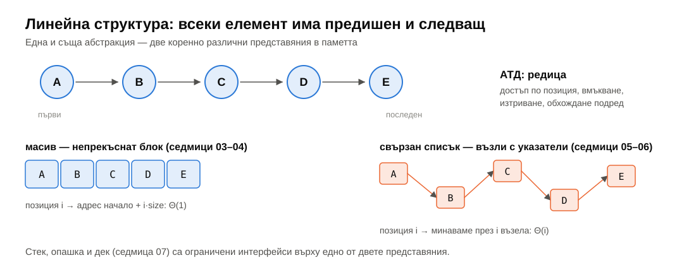

Има две основни представяния в паметта, и почти всичко до средата на семестъра е вариация на едно от тях:

| | Непрекъснато (масив) | Свързано (списък) |
|---|---|---|
| Как е в паметта | един блок, елемент до елемент | възли, свързани с указатели |
| Достъп до позиция $i$ | $\Theta(1)$ — адресна аритметика | $\Theta(i)$ — обхождане от началото |
| Вмъкване/изтриване на дадено място | $\Theta(n)$ — преместване | $\Theta(1)$ — пренасочване на указатели |
| Памет на елемент | само данните | данните + 1–2 указателя |
| Локалност | отлична | лоша (седмица 02, §2.6) |
| Седмици | 03 (фиксиран), 04 (динамичен) | 05 (едносвързан), 06 (двусвързан) |

**Стек**, **опашка** и **дек** (седмица 07) не са нови представяния, а **ограничени интерфейси**: позволяват достъп само до краищата. Реализират се върху масив или върху списък.

---

## 2. Масивът като структура от данни

### 2.1. Свойства

- **Хомогенен:** всички елементи са от един тип, следователно с еднакъв размер.
- **Непрекъснат:** елементите са един след друг в паметта.
- **Пряк достъп:** адресът на $a[i]$ е $\text{начало} + i \cdot \text{sizeof}(T)$ — $\Theta(1)$ за всяко $i$.
- **Фиксиран капацитет:** колко елемента **може** да побере, се решава при създаването.

Различаваме **капацитет** (`capacity`, колко място е заделено) и **размер** (`size`, колко елемента реално има). Масив с капацитет 100 и размер 3 съдържа 3 елемента и място за още 97.

### 2.2. Цената на операциите

| Операция | Сложност | Защо |
|---|---|---|
| достъп `a[i]` | $\Theta(1)$ | адресна аритметика |
| добавяне/премахване в края | $\Theta(1)$ | никой не се мести |
| вмъкване на позиция $i$ | $\Theta(n - i)$ | всички от $i$ нататък се местят надясно |
| изтриване на позиция $i$ | $\Theta(n - i)$ | всички след $i$ се местят наляво |
| търсене, несортиран | $\Theta(n)$ | трябва да видим всеки елемент |
| търсене, сортиран | $\Theta(\log n)$ | двоично търсене (§4) |

При вмъкване на случайна позиция се местят средно $n/2$ елемента — $\Theta(n)$.

### 2.3. Вмъкване и изтриване: в коя посока се мести

При вмъкване на позиция $i$ освобождаваме място, като местим елементите **отзад напред**: първо последният отива една позиция надясно, после предпоследният и т.н. В обратния ред бихме презаписали елемент, който още не сме преместили.

<details>
<summary>Вмъкване стъпка по стъпка: insertAt(2, X)</summary>

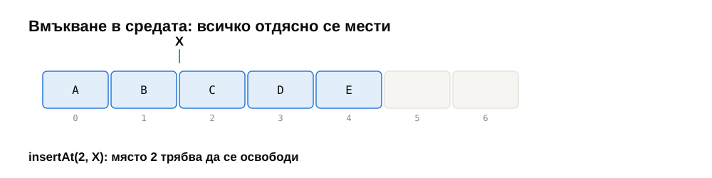
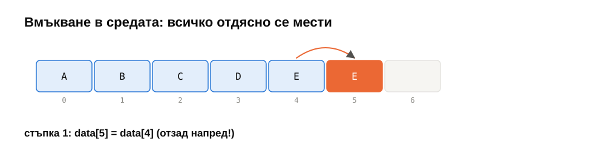
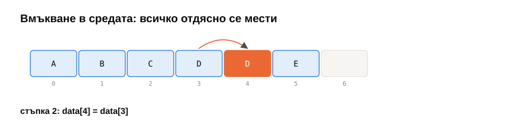
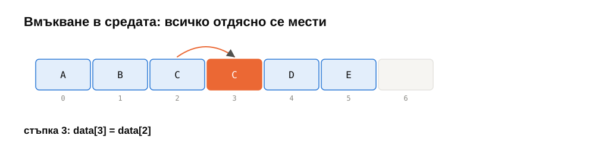
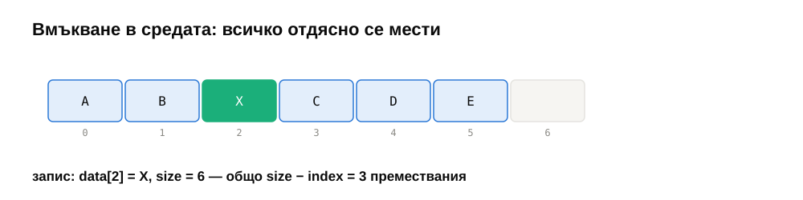

</details>

```cpp
for (std::size_t i = size_; i > index; --i)      // отзад напред
    data_[i] = std::move(data_[i - 1]);
data_[index] = value;
++size_;
```

При изтриване е обратното — местим **отпред назад**, всеки елемент на мястото на предишния. В стандартната библиотека: `std::move_backward` (за вмъкване) и `std::move` (за изтриване) правят точно това.

> [!TIP]
> **💡 Любопитно: „swap and pop“.** Ако редът на елементите **няма** значение, изтриване на позиция $i$ може да е $\Theta(1)$: поставяме последния елемент на мястото на изтрития и намаляваме размера. Игрите ползват това постоянно за списъци с обекти.

---

## 3. Обектно-ориентирана реализация

Целта е клас `FixedArray<T>`: масив с капацитет, избран при създаването, който сам управлява паметта си и пази коректността си.

### 3.1. Интерфейсът — какво обещаваме

| Метод | Поведение | При грешка |
|---|---|---|
| `FixedArray(capacity)` | празен масив с даден капацитет | — |
| `size()`, `capacity()`, `empty()`, `full()` | заявки | — |
| `operator[](i)` | достъп **без** проверка | UB при $i \ge$ `size()` |
| `at(i)` | достъп **с** проверка | `std::out_of_range` |
| `pushBack(x)`, `popBack()` | край | `std::length_error` (пълен) / `std::out_of_range` (празен) |
| `insertAt(i, x)`, `removeAt(i)` | позиция $i$ | `std::out_of_range` / `std::length_error` |
| `begin()`, `end()` | итератори | — |

Два начина да се справим с невалидна заявка:

- **Предусловие** (precondition): „извикващият е длъжен да не подава невалиден индекс“. Нарушението е UB, но операцията е най-бърза. Така е `operator[]` — и в `std::vector`.
- **Проверка + изключение:** операцията сама открива проблема и хвърля. Малко по-бавно, но безопасно. Така е `at()`.

Хубаво е да предложим и двете — програмистът избира. Важно правило: **неуспешна операция не променя обекта**. Ако `pushBack` хвърли, защото масивът е пълен, `size()` трябва да е същият като преди.

### 3.2. Представянето и инвариантът

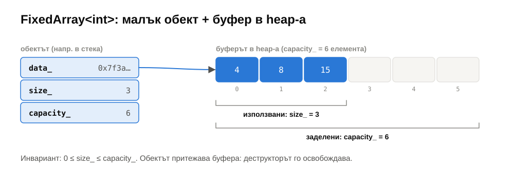

```cpp
template <typename T>
class FixedArray {
    T* data_;              // буфер с capacity_ елемента в heap-а
    std::size_t size_;     // колко от тях се ползват
    std::size_t capacity_;
};
```

**Инвариант на класа** е твърдение за данните, което е вярно **винаги, когато обектът е видим отвън**:

> `data_` сочи към буфер от `capacity_` елемента, притежаван от този обект, и $0 \le$ `size_` $\le$ `capacity_`; елементите в употреба са `data_[0]` … `data_[size_ − 1]`.

- **Конструкторът** го установява.
- **Всеки публичен метод** го запазва: може да го наруши временно по време на работа, но трябва да го възстанови, преди да върне (или да хвърли).

Затова данните са `private`: ако всеки можеше да промени `size_`, никой не би могъл да гарантира инварианта.

### 3.3. RAII: ресурсът живее колкото обекта

```cpp
explicit FixedArray(std::size_t capacity)
    : data_(new T[capacity]{}), size_(0), capacity_(capacity) {}

~FixedArray() { delete[] data_; }
```

**RAII** (Resource Acquisition Is Initialization): ресурсът (тук — паметта) се заема в конструктора и се освобождава в деструктора. Деструкторът се извиква **автоматично** при излизане от обхвата — и при нормален изход, и при изключение. Не може да забравим `delete[]`.

`explicit` забранява неявното преобразуване: без него `FixedArray<int> a = 5;` би компилирало и създало масив с капацитет 5 — почти сигурно не това, което програмистът е имал предвид.

### 3.4. Копиране: плитко и дълбоко

Ако не напишем копиращ конструктор, компилаторът генерира такъв, който копира полетата едно по едно — включително **указателя** `data_`:

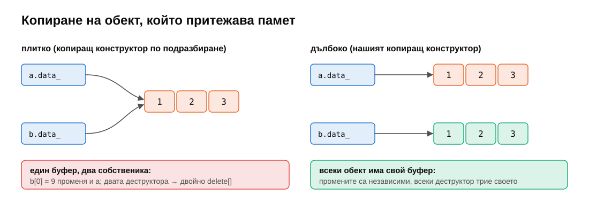

```cpp
FixedArray<int> a(3, {1, 2, 3});
FixedArray<int> b = a;    // плитко: b.data_ == a.data_
b[0] = 9;                 // променя и a[0]!
}                         // ~b: delete[] буфера; ~a: delete[] СЪЩИЯ буфер → UB
```

Затова клас, който **притежава** ресурс, трябва сам да дефинира какво значи копиране — **дълбоко копие**: нов буфер, копирани елементи.

**Правилото на трите:** ако клас има нужда от собствен деструктор, копиращ конструктор или копиращ оператор за присвояване, почти сигурно има нужда и от трите. (В седмица 04 ще станат пет — с преместването.)

```cpp
FixedArray(const FixedArray& other)
    : data_(new T[other.capacity_]{}), size_(other.size_), capacity_(other.capacity_) {
    std::copy(other.begin(), other.end(), data_);
}
```

### 3.5. Копиращ оператор за присвояване

Присвояването е по-трудно от конструирането: обектът вече притежава буфер, който трябва да се освободи. Наивният вариант има два бъга:

```cpp
FixedArray& operator=(const FixedArray& other) {
    delete[] data_;                          // 1. при a = a току-що изтрихме и other.data_
    data_ = new T[other.capacity_];          // 2. ако new хвърли, data_ сочи изтрита памет
    std::copy(other.begin(), other.end(), data_);
    size_ = other.size_;
    capacity_ = other.capacity_;
    return *this;
}
```

**Идиомът copy-and-swap** решава и двата:

```cpp
FixedArray& operator=(const FixedArray& other) {
    FixedArray copy(other);   // може да хвърли — *this още е непокътнат
    swap(copy);               // noexcept: разменяме трите полета
    return *this;             // старият буфер умира с copy
}
```

- **Самоприсвояване** `a = a` работи: копираме себе си, разменяме, старият буфер се унищожава.
- **Силна гаранция при изключения:** ако копирането хвърли, `*this` е точно какъвто беше.
- Цената: временно заемаме памет и за двата буфера.

Връщаме `*this` по референция, за да работи веригата `a = b = c`.

### 3.6. Константност и итератори

```cpp
T& operator[](std::size_t i);               // за промяна
const T& operator[](std::size_t i) const;   // за константни обекти
```

Константен метод (`const` след скобите) обещава да не променя обекта; само такива могат да се викат върху `const FixedArray&`. Затова заявките (`size`, `empty`…) са `const`, а методите за достъп имат по две версии.

**Указателят е итератор.** `begin()` връща `data_`, `end()` връща `data_ + size_` — и веднага работят range-based `for`, `std::sort`, `std::find`, `std::accumulate`, както и нашето двоично търсене (§4). Собствен клас за итератор ще пишем, когато елементите не са последователни (седмица 06).

### 3.7. Шаблон: какво изискваме от `T`

`new T[capacity]{}` създава `capacity` обекта още при конструиране — значи `T` трябва да има конструктор по подразбиране, а `pushBack` ползва присвояване. Повечето типове го имат, но не всички.

> [!NOTE]
> **🔬 За напреднали.** `std::vector` не създава обекти в неизползваната част: заделя „сурова“ памет (`std::allocator<T>::allocate`) и конструира всеки елемент на място едва при `push_back` (*placement new*). Така работи и с типове без конструктор по подразбиране, и не плаща за конструиране на неизползвани елементи. В седмица 04 ще видим защо това има значение.

### 3.8. Как се тества контейнер

Освен граничните случаи (празен, пълен, индекс 0, индекс `size()`), най-ефективният тест е **сравнение с модел**: правим едни и същи случайни операции върху нашия контейнер и върху `std::vector`, и след всяка проверяваме, че съдържанието съвпада. Тестът `"random operations behave like std::vector"` прави 2000 такива стъпки. Ако има бъг в `insertAt` на позиция 0 при почти пълен масив, този тест го намира — без да сме се сетили за конкретния случай.

---

## 4. Двоично търсене

### 4.1. Идеята

В **сортиран** масив сравняваме търсената стойност със средния елемент. Ако е по-малка, тя (ако я има) е в лявата половина; иначе — в дясната. Всяко сравнение изхвърля половината от останалите кандидати.

След $k$ стъпки остават $n / 2^k$ кандидата. Търсенето приключва, когато не остане нито един: при $k = \lfloor \log_2 n \rfloor + 1$.

| $n$ | Линейно (най-лош случай) | Двоично (най-лош случай) |
|---|---|---|
| 1 000 | 1 000 | 10 |
| 1 000 000 | 1 000 000 | 20 |
| 1 000 000 000 | 1 000 000 000 | 30 |

**Предусловието** е сортираният вход. Двоичното търсене не проверява дали входът е сортиран (това би било $\Theta(n)$) — на несортиран вход просто връща грешен отговор.

### 4.2. Инвариантът

Двоичното търсене е известно с това, че е лесно за обяснение и трудно за писане без грешка. Сигурният начин е да започнем от **инварианта**, а не от кода. Търсим `lowerBound`: първата позиция с елемент $\ge$ стойността.

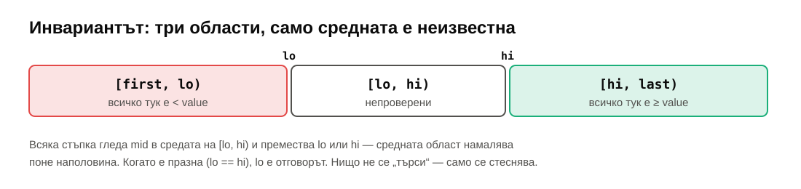

> **Инвариант:** всеки елемент в $[\text{first}, lo)$ е $<$ value; всеки елемент в $[hi, \text{last})$ е $\ge$ value.

- **Начало:** $lo = \text{first}$, $hi = \text{last}$ — двете области са празни, инвариантът е тривиално верен.
- **Стъпка:** гледаме $mid \in [lo, hi)$.
  - $v[mid] < $ value → и всичко преди $mid$ е $<$ value (сортирано е) → $lo = mid + 1$.
  - $v[mid] \ge $ value → $hi = mid$.
  - И в двата случая инвариантът остава верен, а $hi - lo$ **строго** намалява.
- **Край:** $lo = hi$. Всичко преди $lo$ е $<$ value, всичко от $lo$ нататък е $\ge$ value — значи $lo$ е отговорът.

```cpp
template <typename It, typename T>
It lowerBound(It first, It last, const T& value) {
    It lo = first, hi = last;
    while (lo != hi) {
        It mid = lo + (hi - lo) / 2;
        if (*mid < value) lo = mid + 1;
        else              hi = mid;
    }
    return lo;
}
```

<details>
<summary>lowerBound(…, 61) стъпка по стъпка</summary>

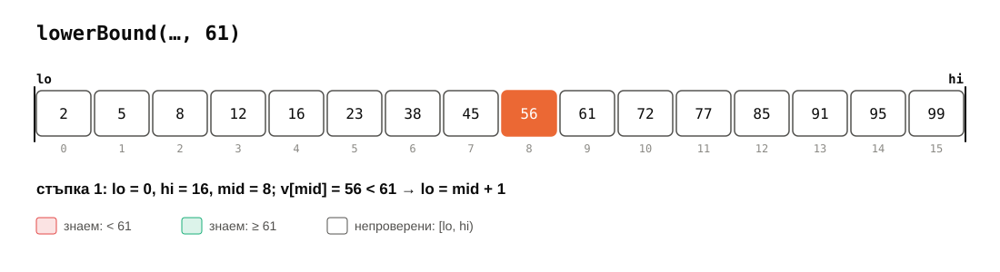
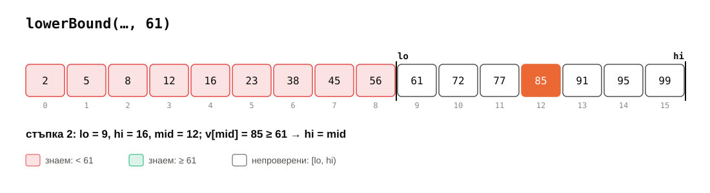
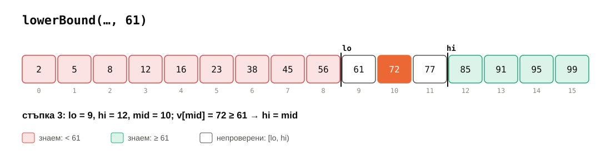
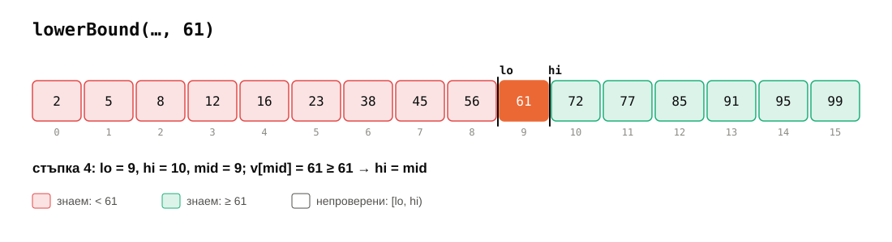
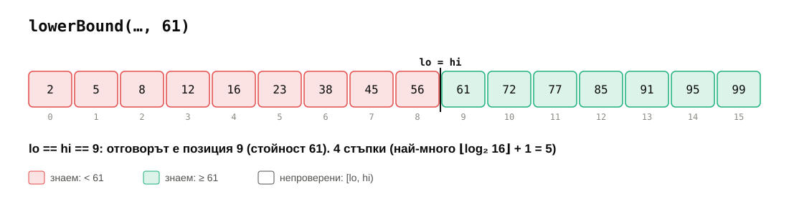

</details>

Забележете какво **няма** в кода: проверка за равенство, специален случай за празен масив, `-1`. Всички те са покрити от инварианта.

### 4.3. Разновидности

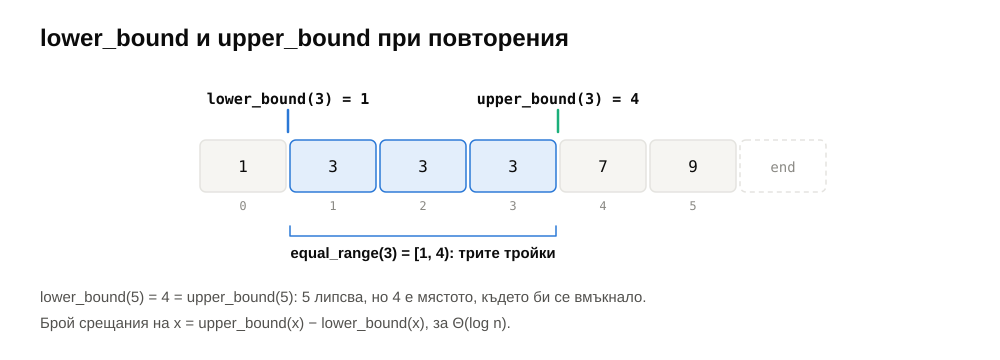

| Функция | Връща | Въпросът в цикъла |
|---|---|---|
| `lower_bound(x)` | първата позиция с елемент $\ge x$ | `*mid < x`? |
| `upper_bound(x)` | първата позиция с елемент $> x$ | `!(x < *mid)`, т.е. `*mid <= x`? |
| `equal_range(x)` | двойката (lower, upper) | |
| `binary_search(x)` | дали $x$ е там | `lower_bound` и проверка на намерения елемент |

Полезни следствия:

- **Брой срещания** на $x$: `upper_bound(x) − lower_bound(x)`, за $\Theta(\log n)$.
- **Къде да вмъкнем** $x$, за да остане масивът сортиран: `lower_bound(x)` (или `upper_bound(x)` — след равните).
- **`contains(x)`**: `it = lower_bound(x)`, отговорът е `it != last && !(x < *it)`. Използваме само `<`, а не `==` — така работи с всеки компаратор.

**Компаратор.** Ако масивът е сортиран с друга наредба (напр. намаляващо, `std::greater<>`), търсенето трябва да ползва **същата**. Затова функциите приемат `less` като параметър — както `std::sort` и `std::lower_bound`.

### 4.4. Класически грешки

**1. Препълване при пресмятане на средата.** С целочислени индекси `mid = (lo + hi) / 2` препълва, когато `lo + hi > INT_MAX` — за масив над ~1 милиард елемента. Правилно: `mid = lo + (hi - lo) / 2`. (С итератори `lo + hi` дори не компилира — още един плюс.)

**2. Безкраен цикъл.** При затворен интервал $[lo, hi]$ и `lo = mid` (вместо `mid + 1`): когато $hi = lo + 1$, $mid = lo$ и нищо не се променя. Правило: всяка стъпка трябва **строго** да намалява интервала — проверете за интервал с дължина 1 и 2.

**3. Смесване на затворен и полуотворен интервал.** `hi = n - 1` (затворен) с условие `while (lo < hi)` (полуотворен) пропуска последния елемент. Изберете едното — в курса винаги $[lo, hi)$, както в STL.

**4. Несортиран вход** или вход, сортиран с **друг** компаратор — грешен отговор без никакъв сигнал.

> [!TIP]
> **💡 Любопитно.** Според Knuth (*TAOCP*, том 3) първото публикувано описание на двоичното търсене е от 1946 г., а първото, което работи коректно за **всяко** $n$, е от 1962 г. Jon Bentley разказва в *Programming Pearls*, че когато давал задачата на професионални програмисти, около 90% от решенията им имали бъг. А през 2006 г. Joshua Bloch откри, че `Arrays.binarySearch` в Java съдържа точно грешка 1 (`(low + high) / 2`) — около 9 години след като беше добавена, — и със същата грешка беше и примерът в книгата на Bentley.

### 4.5. В стандартната библиотека

```cpp
#include <algorithm>
auto it  = std::lower_bound(v.begin(), v.end(), x);
auto it2 = std::upper_bound(v.begin(), v.end(), x);
auto [a, b] = std::equal_range(v.begin(), v.end(), x);
bool has = std::binary_search(v.begin(), v.end(), x);
```

Капан: `std::lower_bound` работи с всеки forward итератор, но придвижването на итератор към средата е $\Theta(1)$ само за итератори с **произволен достъп** (`vector`, масив, `deque`). За `std::set` или `std::list` е $\Theta(n)$ стъпки. За `std::set` ползвайте **метода** `s.lower_bound(x)` — той слиза по дървото за $\Theta(\log n)$.

### 4.6. Двоично търсене по отговора

Двоичното търсене не изисква масив. Изисква само **монотонен предикат**: функция $p(x)$, която е `false` за всички $x$ до някаква граница и `true` за всички след нея. Търсим първото `true`.

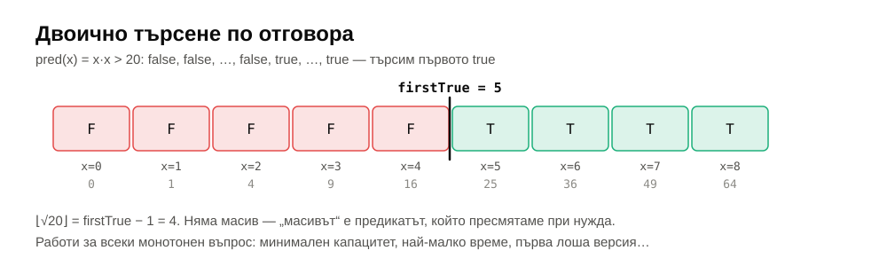

```cpp
// най-малкото x в [lo, hi) с pred(x) == true, или hi
std::uint64_t firstTrue(std::uint64_t lo, std::uint64_t hi, Pred pred) {
    while (lo < hi) {
        std::uint64_t mid = lo + (hi - lo) / 2;
        if (pred(mid)) hi = mid;
        else           lo = mid + 1;
    }
    return lo;
}
```

Това е същият цикъл като `lowerBound` — „масивът“ е предикатът, пресметнат при нужда. Примери:

- $\lfloor \sqrt{n} \rfloor$: първото $x$ с $x^2 > n$, минус 1 (задача 5). Внимание: $x \cdot x$ препълва за големи $x$ — пита се `x > n / x`.
- Най-малкият капацитет на камион, с който пратките се превозват за $D$ дни: $p(c)$ = „с капацитет $c$ стигат ли $D$ дни“ — монотонно по $c$.
- **`git bisect`**: коя е първата версия, в която тестът пада? $p(\text{версия})$ = „тестът пада“. Между 1000 версии — 10 компилации вместо 1000.

### 4.7. Колко бързо е на практика

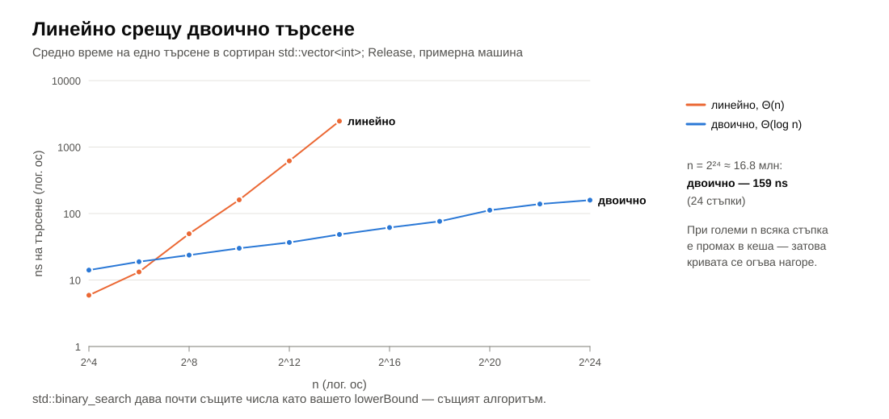

При 16 елемента линейното търсене е по-бързо — константите доминират. Някъде около 64–256 елемента двоичното го изпреварва, а при 16 000 елемента е ~40× по-бързо. За 16 милиона елемента двоичното търсене отнема ~160 ns — 24 стъпки, но повечето от тях са промахи в кеша (седмица 02): средата на огромен масив почти никога не е в кеша.

> [!NOTE]
> **🔬 За напреднали: по-бързо от двоичното търсене.** (1) *Branchless* вариантът заменя `if` с условно присвояване и избягва неправилно предсказани преходи. (2) *Eytzinger layout* пренарежда сортирания масив като пирамида в широчина (корен, после двете деца, после четирите внуци…), така че първите стъпки на всяко търсене са в едни и същи няколко кеш линии. На големи масиви това дава ×2–×4 (Khuong & Morin, 2017).

> [!NOTE]
> **🔬 За напреднали: защо $\log n$ е оптималното.** Всеки алгоритъм, който търси само чрез сравнения, може да се представи като двоично дърво на решенията: всяко сравнение има два изхода. За $n + 1$ възможни отговора (позиции за вмъкване) дървото има поне $n + 1$ листа, следователно височина поне $\lceil \log_2(n+1) \rceil$. Значи двоичното търсене е **оптимално** сред алгоритмите, базирани на сравнения. (Хеш таблиците от седмица 08 не сравняват — затова могат по-бързо.)

---

## 5. Обобщение

| Тема | Да запомните |
|---|---|
| Линейни структури | непрекъснато (масив) или свързано (списък) представяне; стек/опашка — ограничени интерфейси |
| Масив | $\Theta(1)$ достъп; вмъкване/изтриване на позиция — $\Theta(n)$; размер ≠ капацитет |
| Преместване | при вмъкване — отзад напред; при изтриване — отпред назад |
| Инвариант на класа | установява се от конструктора, пази се от всеки публичен метод; затова данните са `private` |
| RAII | ресурс в конструктора, освобождаване в деструктора |
| Копиране | клас, който притежава ресурс → дълбоко копие; правило на трите; copy-and-swap за `operator=` |
| Грешки | `[]` без проверка (предусловие), `at()` с проверка; неуспешна операция не променя обекта |
| Двоично търсене | инвариант $[\text{first}, lo) <$ value $\le [hi, \text{last})$; $\Theta(\log n)$; `mid = lo + (hi − lo) / 2` |
| Разновидности | `lower_bound`, `upper_bound`, `equal_range`; брой срещания = upper − lower |
| По отговора | работи за всеки монотонен предикат: $\lfloor\sqrt n\rfloor$, `git bisect` |

---

## 6. Речник

| Български | English |
|---|---|
| линейна структура | linear data structure |
| редица | sequence |
| предходен / следващ | predecessor / successor |
| капацитет / размер | capacity / size |
| инвариант на класа | class invariant |
| предусловие | precondition |
| капсулиране | encapsulation |
| заемане на ресурс при инициализация | RAII |
| плитко / дълбоко копие | shallow / deep copy |
| правило на трите / петте | rule of three / five |
| самоприсвояване | self-assignment |
| копиране и размяна | copy-and-swap |
| силна гаранция при изключения | strong exception guarantee |
| константен метод | const member function |
| двоично търсене | binary search |
| долна / горна граница (в STL смисъл) | lower bound / upper bound |
| монотонен предикат | monotone predicate |
| двоично търсене по отговора | binary search on the answer |
| дърво на решенията | decision tree |
| тест чрез сравнение с модел | model-based (differential) testing |

---

## 7. Литература

- J. Bentley. *Programming Pearls*, 2nd ed. — колона 4, „Writing Correct Programs“ (двоичното търсене чрез инварианти).
- D. Knuth. *The Art of Computer Programming*, том 3, §6.2.1.
- J. Bloch. [„Extra, Extra — Read All About It: Nearly All Binary Searches and Mergesorts are Broken“](https://research.google/blog/extra-extra-read-all-about-it-nearly-all-binary-searches-and-mergesorts-are-broken/), 2006.
- P.-V. Khuong, P. Morin. [„Array Layouts for Comparison-Based Searching“](https://arxiv.org/abs/1509.05053), *ACM JEA*, 2017.
- [cppreference — `std::lower_bound`](https://en.cppreference.com/w/cpp/algorithm/lower_bound)
- [C++ Core Guidelines — C.21: правило на нулата / петте](https://isocpp.github.io/CppCoreGuidelines/CppCoreGuidelines#Rc-five)
