# Седмица 04 — Динамичен масив

> Семинар 4 · четвъртък, 29 октомври 2026 · [слайдове](https://mishomish.github.io/fmi-kn-sdp-2026-2027-seminar/slides/?w=04-dynamic-array) · [задачи](exercises.md) · [starter код](starter/) · [тестове](tests/)

Миналата седмица `FixedArray` хвърляше изключение, когато се напълни. Тази седмица масивът расте сам — така работи `std::vector`. Идеята е проста (нов по-голям буфер, преместване, освобождаване на стария), но в нея има три неочевидни неща: **колко** да расте, за да е бързо; защо `pushBack` е $\Theta(1)$, въпреки че понякога струва $\Theta(n)$; и как да **преместваме** вместо да копираме.

Блоковете **💡 Любопитно** и **🔬 За напреднали** са извън задължителния материал.

## Съдържание

1. [Растеж](#1-растеж)
2. [Колко да расте](#2-колко-да-расте)
3. [Амортизиран анализ](#3-амортизиран-анализ)
4. [Свиване, `reserve`, инвалидиране](#4-свиване-reserve-инвалидиране)
5. [Семантика на преместването](#5-семантика-на-преместването)
6. [Правилото на петте и гаранциите при изключения](#6-правилото-на-петте-и-гаранциите-при-изключения)
7. [`std::vector`](#7-stdvector)
8. [Обобщение](#8-обобщение) · [Речник](#9-речник) · [Литература](#10-литература)

---

## 1. Растеж

**Динамичен масив** е масив, който сам увеличава капацитета си, когато се напълни. Представянето е същото като на `FixedArray` — указател към буфер, размер, капацитет — и инвариантът също: $0 \le \text{size} \le \text{capacity}$.

Когато `pushBack` не намери свободно място, масивът се **преоразмерява** (reallocation):

1. Заделя нов буфер с по-голям капацитет.
2. Записва **новия** елемент в новия буфер.
3. Прехвърля старите елементи в новия буфер.
4. Освобождава стария буфер и започва да сочи новия.

<details>
<summary>pushBack при пълен масив, стъпка по стъпка</summary>

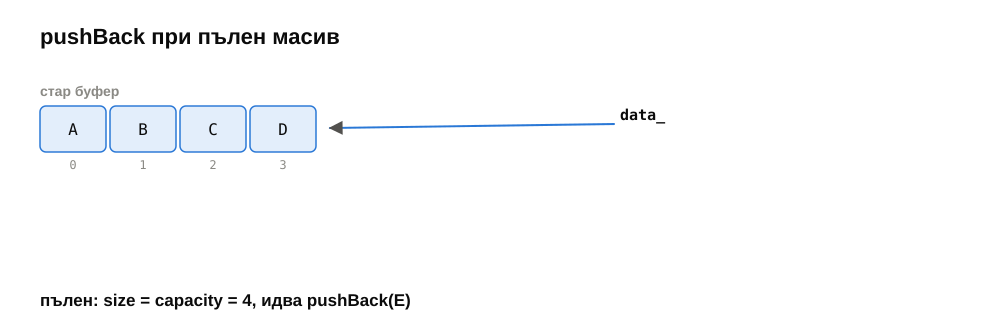
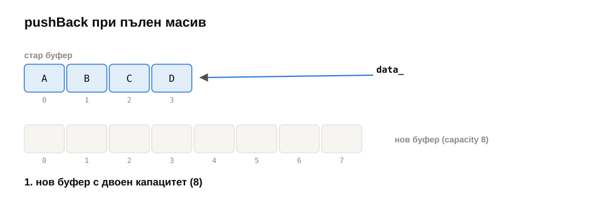
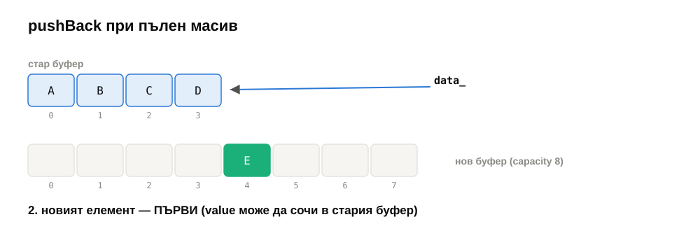
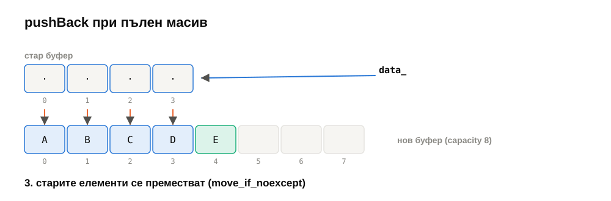
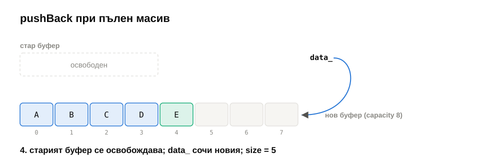

</details>

**Защо новият елемент е преди старите?** Защото `value` може да е референция към елемент на **същия** масив:

```cpp
a.pushBack(a[0]);    // напълно легален код
```

Ако първо преместим старите елементи, `a[0]` вече е „преместен“ (празен низ, например), а ако първо освободим стария буфер — `value` сочи освободена памет. И двете са бъгове, които често „работят“ при обикновено пускане и се хващат само с AddressSanitizer. Еталонното решение за тази седмица първоначално имаше точно този бъг — тестът `pushBack of an element of the same array` го хвана.

---

## 2. Колко да расте

### 2.1. Адитивно: $+c$

При капацитет $0, c, 2c, 3c, \ldots$ преоразмеряванията за $n$ добавяния прехвърлят

$$c + 2c + 3c + \ldots + \left\lfloor \tfrac{n}{c} \right\rfloor c \approx \frac{n^2}{2c}$$

елемента. Това е $\Theta(n^2)$ общо — $\Theta(n)$ **средно на добавяне**, колкото и голямо да е $c$. Константата $c$ само дели времето, не променя класа.

### 2.2. Мултипликативно: $\times k$

При капацитет $1, 2, 4, 8, \ldots$ (удвояване, $k = 2$) последното преоразмеряване преди $n$-тия елемент е при капацитет $C < n$, а всички прехвърляния са

$$1 + 2 + 4 + \ldots + C = 2C - 1 < 2n.$$

Общо $\Theta(n)$ — **$\Theta(1)$ на добавяне** средно. Същото важи за всяко $k > 1$: геометричната сума е $\le C \cdot \frac{k}{k-1}$.

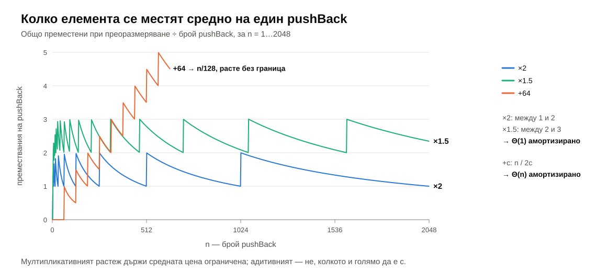

| Стратегия | Прехвърляния общо за $n$ добавяния | На едно добавяне | Неизползвана памет (най-лошо) |
|---|---|---|---|
| $+c$ | $\approx n^2 / 2c$ | $\Theta(n)$ | $< c$ елемента |
| $\times 2$ | $< 2n$ | $\Theta(1)$, между 1 и 2 | до 50% |
| $\times 1.5$ | $< 3n$ | $\Theta(1)$, между 2 и 3 | до 33% |

Компромисът е памет срещу копиране: по-голям множител — по-малко преоразмерявания, но повече празно място.

> [!TIP]
> **💡 Любопитно: защо MSVC и folly ползват 1.5, а не 2.** При удвояване новият буфер ($2^{k+1}$) винаги е по-голям от **сбора** на всички стари ($1 + 2 + \ldots + 2^k = 2^{k+1} - 1$), така че освободените стари буфери никога не стигат за нов и алокаторът не може да ги преизползва. При множител под златното сечение ($\varphi \approx 1.618$) след няколко стъпки сборът на освободените буфери вече стига. libstdc++ (GCC) и libc++ (Clang) ползват 2; MSVC и `folly::fbvector` на Facebook — 1.5.

---

## 3. Амортизиран анализ

### 3.1. Какво значи „амортизирано $\Theta(1)$“

Повечето `pushBack` струват 1 (записват елемента). Някои — тези, които преоразмеряват — струват $1 + \text{size}$. Най-лошият случай за **една** операция е $\Theta(n)$. Но:

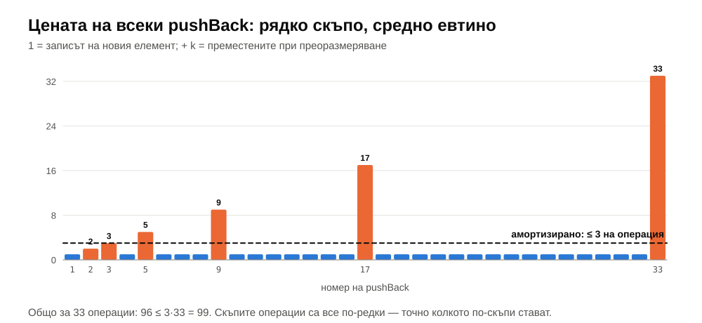

**Амортизираната цена** на операция е цената ѝ, усреднена по **най-лошата възможна последователност** от операции: ако всяка последователност от $m$ операции струва най-много $m \cdot a$, амортизираната цена е $a$.

> [!IMPORTANT]
> Амортизираната цена **не е** средна цена в смисъла на вероятност. Няма „случаен вход“ и „очаквана стойност“ — гаранцията е за **всяка** последователност. Сравнете с хеш таблиците (седмица 08), които са $\Theta(1)$ *средно* — там лош вход може да направи всяка операция $\Theta(n)$.

Три класически метода за доказване:

**Агрегатен метод.** Сумираме цената на цялата последователност и делим. За $n$ добавяния: $n$ записа + $< 2n$ прехвърляния $< 3n$ → амортизирано $< 3$.

**Счетоводен метод** (accounting). Всяко добавяне „плаща“ 3 единици: 1 за собствения запис и 2 „спестява“ в елемента, който записва. Когато масивът с капацитет $k$ се напълни, половината му елементи ($k/2$, добавени след последното преоразмеряване) имат по 2 спестени единици — общо $k$, точно колкото струва прехвърлянето на всичките $k$. Спестяванията никога не стават отрицателни, значи 3 на операция стигат.

> [!NOTE]
> **🔬 За напреднали: метод на потенциала.** Дефинираме „потенциал“ на структурата $\Phi = 2 \cdot \text{size} - \text{capacity}$ (след първото добавяне $\Phi \ge 0$). Амортизираната цена на операция е реалната цена плюс $\Delta\Phi$.
> - Добавяне без преоразмеряване: реална цена 1, $\Delta\Phi = 2$ → амортизирано **3**.
> - Добавяне с преоразмеряване при $\text{size} = \text{capacity} = k$: реална цена $1 + k$; преди $\Phi = 2k - k = k$, след $\Phi = 2(k+1) - 2k = 2$; $\Delta\Phi = 2 - k$ → амортизирано $1 + k + 2 - k =$ **3**.
>
> Сумата на амортизираните цени е реалната сума плюс $\Phi_{\text{край}} - \Phi_{\text{начало}} \ge$ реалната сума. Методът се оказва най-мощен за сложни структури (splay дървета, Фибоначиеви пирамиди).

> [!TIP]
> **💡 Любопитно.** Амортизираното $\Theta(1)$ не помага, когато е важна **всяка** отделна операция: игра с 60 кадъра в секунда има 16 ms на кадър, и един `push_back`, който неочаквано копира 10 милиона елемента, се вижда като засичане. Затова в такъв код се прави `reserve` предварително, а някои библиотеки преоразмеряват **постепенно** — прехвърлят по няколко елемента на всяко добавяне.

---

## 4. Свиване, `reserve`, инвалидиране

### 4.1. Кога да свиваме

Ако масивът расте при пълно запълване, изглежда естествено да се свива при запълване $1/2$. Това е грешка: редуването на `pushBack` и `popBack` точно около границата преоразмерява масива при **всяка** операция.

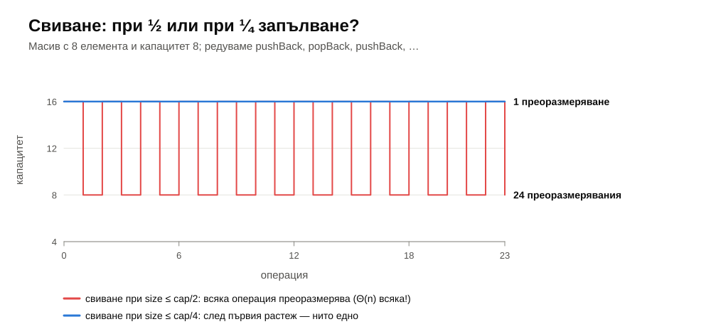

Решението е **хистерезис**: свиване наполовина при запълване $\le 1/4$. Тогава след всяко преоразмеряване масивът е запълнен наполовина и до следващото трябват поне $\Theta(\text{capacity})$ операции — амортизираната цена остава $\Theta(1)$.

`std::vector` изобщо не се свива сам. `shrink_to_fit()` е **молба** към реализацията (може да бъде игнорирана), а `clear()` не освобождава памет.

### 4.2. `reserve` и `resize`

| | `reserve(n)` | `resize(n)` |
|---|---|---|
| Какво променя | капацитета (ако $n >$ capacity) | размера |
| Нови елементи | не | да, $T\{\}$ |
| Кога | знаем предварително колко елемента ще добавим | искаме точно $n$ елемента |

Ако броят елементи е известен, `reserve(n)` преди цикъла премахва **всички** преоразмерявания:

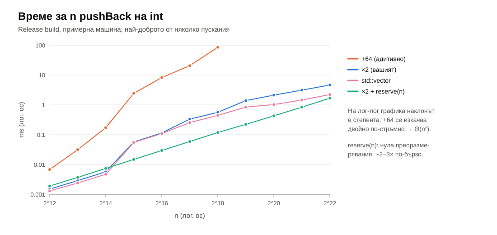

На примерната машина: 4 милиона `pushBack` на `int` — 4.6 ms с удвояване, 1.7 ms с `reserve`. Адитивният растеж (+64) отнема 85 ms още при 262 144 елемента — и се изкачва два пъти по-стръмно.

### 4.3. Инвалидиране

Преоразмеряването мести всички елементи — значи **всеки** указател, референция и итератор към тях става невалиден:

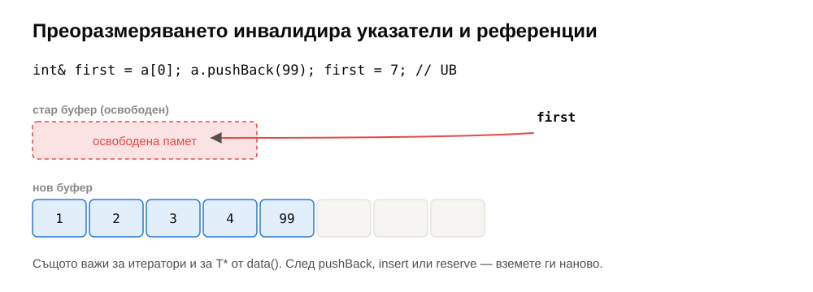

```cpp
std::vector<int> v{1, 2, 3, 4};
int& first = v[0];
auto it = v.begin();
v.push_back(5);        // може да преоразмери
first = 7;             // UB, ако е преоразмерил
++it;                  // UB, ако е преоразмерил
```

Правило: след операция, която може да преоразмери (`push_back`, `insert`, `emplace_back`, `reserve`, `resize`), вземете указателите и итераторите наново — или първо направете `reserve`, ако знаете колко ще добавите.

---

## 5. Семантика на преместването

### 5.1. Проблемът

Преоразмеряването на `DynamicArray<std::string>` с 1000 низа копира 1000 низа — 1000 нови алокации и копирания на символи, след което веднага унищожава оригиналите. Ненужно: старите низове никой повече няма да ползва. Можем просто да **вземем** буферите им.

### 5.2. lvalue, rvalue и `T&&`

- **lvalue** — нещо с име и адрес, което ще живее и след израза: `a`, `v[3]`, `*p`.
- **rvalue** — временна стойност, която умира в края на израза: `std::string("x")`, `a + b`, резултатът на функция, връщаща по стойност.

**rvalue референция** `T&&` се свързва само с rvalue. Затова две версии на една функция се разделят естествено:

```cpp
void pushBack(const T& value);   // lvalue: трябва да копираме
void pushBack(T&& value);        // rvalue: можем да преместим
```

`std::move(x)` **не мести нищо**. Това е само преобразуване (`static_cast<T&&>(x)`), което казва „третирай `x` като rvalue — свършил съм с него“. Самото преместване се случва в конструктора или оператора, който получи `T&&`.

### 5.3. Преместващ конструктор и оператор

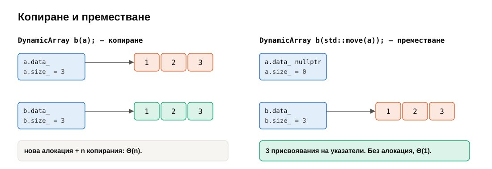

```cpp
DynamicArray(DynamicArray&& other) noexcept
    : data_(std::exchange(other.data_, nullptr)),
      size_(std::exchange(other.size_, 0)),
      capacity_(std::exchange(other.capacity_, 0)) {}
```

`std::exchange(x, y)` присвоява `y` на `x` и връща старата стойност на `x`. Три присвоявания на указатели и числа — без алокация, $\Theta(1)$, без значение колко са елементите.

**Състоянието след преместване.** Стандартът изисква преместеният обект да е **валиден, но неопределен**: може да бъде унищожен и да му се присвои нова стойност; нищо повече не е гарантирано. Нашият `DynamicArray` е по-щедър — остава празен и използваем, както `std::vector` на практика.

```cpp
DynamicArray& operator=(DynamicArray&& other) noexcept {
    DynamicArray taken(std::move(other));   // other става празен
    swap(taken);                            // старото ни съдържание отива в taken
    return *this;                           // и умира с него
}
```

### 5.4. `noexcept` и `std::move_if_noexcept`

При преоразмеряване искаме **силна гаранция** (седмица 03, §3.5): ако нещо хвърли изключение, масивът остава какъвто беше.

- Ако **копираме** старите елементи и копирането хвърли — нищо страшно: старите са непокътнати, освобождаваме новия буфер.
- Ако **местим** старите елементи и преместването на петия хвърли — първите четири вече са „изпразнени“. Старият масив е развален, а новият е непълен.

Затова `std::vector` мести при преоразмеряване **само ако преместването е `noexcept`**; иначе копира. Това прави `std::move_if_noexcept(x)`: връща `T&&`, ако преместващият конструктор на `T` е `noexcept`, и `const T&` в противен случай. Задача 4 проверява точно това с два типа, които броят копиранията и преместванията си.

Поуката за собствените ви класове: **маркирайте преместващите операции с `noexcept`**. Иначе `std::vector<ВашКлас>` тихо ще копира при всяко преоразмеряване.

> [!NOTE]
> **🔬 За напреднали: `emplace_back`.** `push_back(T(args...))` създава временен обект и после го мести. `emplace_back(args...)` създава обекта **директно** в буфера, като препраща аргументите на конструктора на `T` (*perfect forwarding*, `template <typename... Args> void emplace_back(Args&&... args)` и `std::forward<Args>(args)...`). При `std::vector<std::pair<int, std::string>>` това спестява един временен обект.

---

## 6. Правилото на петте и гаранциите при изключения

### 6.1. Петте специални функции

| Функция | Подпис | Кога се вика |
|---|---|---|
| деструктор | `~T()` | обектът умира |
| копиращ конструктор | `T(const T&)` | `T b(a);`, `T b = a;`, подаване по стойност |
| копиращ оператор | `T& operator=(const T&)` | `b = a;` |
| преместващ конструктор | `T(T&&) noexcept` | `T b(std::move(a));`, връщане по стойност |
| преместващ оператор | `T& operator=(T&&) noexcept` | `b = std::move(a);` |

**Правилото на петте:** клас, който сам управлява ресурс, дефинира и петте (или изрично забранява някои с `= delete`).

**Правилото на нулата:** клас, чиито полета сами управляват ресурсите си (`std::vector`, `std::string`, `std::unique_ptr`), **не пише нито една** — генерираните от компилатора вършат правилното нещо. Това е предпочитаният стил в реален код: правилото на петте е за класове като `DynamicArray`, чиято единствена работа е да управляват ресурс.

> [!WARNING]
> Ако дефинирате деструктор или копираща операция, компилаторът **не генерира** преместващи операции — и „преместването“ тихо става копиране. Ако дефинирате преместваща операция, копиращите стават `= delete`. Затова или и петте, или нито една.

### 6.2. Нива на гаранция при изключения

| Ниво | Обещание | Пример в `DynamicArray` |
|---|---|---|
| **без изключения** (nothrow) | операцията не хвърля | `swap`, преместванията, `size()` |
| **силна** (strong) | ако хвърли, обектът е какъвто беше | `pushBack`, `reserve`, копиращото присвояване (copy-and-swap) |
| **базова** (basic) | ако хвърли, обектът е валиден (инвариантът е запазен), но съдържанието може да е друго | `resize` при хвърлящ `T{}` |
| без гаранция | всичко е възможно | никоя операция в курса |

---

## 7. `std::vector`

### 7.1. Нашето опростяване

`DynamicArray` заделя `new T[capacity]` — това **създава** `capacity` обекта още при заделянето. Последствия: `T` трябва да има конструктор по подразбиране; празните места съдържат истински обекти; `popBack` не може да унищожи обект, а само да му присвои `T{}`.

`std::vector` разделя **заделяне на памет** и **създаване на обекти**: заделя сурова памет (`std::allocator<T>::allocate`), създава всеки елемент на място едва при добавяне (`::new (p) T(value)` — *placement new*) и го унищожава при премахване (`p->~T()`). Така работи с всякакви типове и не плаща за неизползвани места. Това е материал за курс по C++ — за нашите цели `new T[]` е достатъчно добро.

### 7.2. Интерфейсът

| `DynamicArray` | `std::vector` | Сложност |
|---|---|---|
| `pushBack(x)` | `push_back(x)`, `emplace_back(args...)` | $\Theta(1)$ амортизирано |
| `popBack()` | `pop_back()` | $\Theta(1)$ |
| `reserve(n)` | `reserve(n)` | $\Theta(\text{size})$, ако расте |
| `resize(n)` | `resize(n)` | $\Theta(\lvert n - \text{size} \rvert)$ + евентуално преоразмеряване |
| `shrinkToFit()` | `shrink_to_fit()` (необвързващо) | $\Theta(\text{size})$ |
| — | `insert(it, x)`, `erase(it)` | $\Theta(n)$ |
| — | `clear()` (капацитетът остава) | $\Theta(\text{size})$ |

> [!TIP]
> **💡 Любопитно: `std::vector<bool>`.** Специализацията за `bool` пази по **един бит** на елемент — 8 пъти по-малко памет. Цената: `v[i]` не може да върне `bool&` (няма адрес на бит), а връща **прокси обект**, който се държи като референция. Затова `auto& x = v[0];` не компилира, `&v[0]` не е `bool*`, и `std::vector<bool>` формално не е контейнер. Шаблонът „Proxy“ е тема на седмица 07.

---

## 8. Обобщение

| Тема | Да запомните |
|---|---|
| Растеж | нов буфер → **новият елемент първо** → прехвърляне → освобождаване |
| Стратегия | $\times k$ → $\Theta(1)$ амортизирано; $+c$ → $\Theta(n)$ на добавяне, колкото и голямо да е $c$ |
| Амортизирано | гаранция за **всяка** последователност; не е вероятностна средна стойност |
| Методи | агрегатен ($< 3n$ общо), счетоводен (3 монети на добавяне), потенциал ($\Phi = 2 \cdot$ size $-$ capacity) |
| Свиване | при $\le 1/4$, не при $1/2$ — иначе всяка операция преоразмерява |
| `reserve` | ако знаете $n$ — без нито едно преоразмеряване |
| Инвалидиране | преоразмеряването инвалидира всички указатели, референции, итератори |
| Преместване | `std::move` е само cast; преместващият конструктор „краде“ буфера за $\Theta(1)$ |
| `noexcept` | без него `std::vector` копира вместо да мести при преоразмеряване |
| Правила | петте — за класове, управляващи ресурс; нулата — за всички останали |

---

## 9. Речник

| Български | English |
|---|---|
| динамичен масив | dynamic array (resizable array) |
| преоразмеряване | reallocation |
| множител на растеж | growth factor |
| амортизирана цена | amortized cost |
| агрегатен / счетоводен метод / метод на потенциала | aggregate / accounting / potential method |
| хистерезис | hysteresis |
| неизползвано място | slack / spare capacity |
| преместване | move |
| rvalue референция | rvalue reference |
| преместен обект (състояние след преместване) | moved-from object |
| валиден, но неопределен | valid but unspecified |
| правило на петте / нулата | rule of five / rule of zero |
| гаранция при изключения: без / силна / базова | nothrow / strong / basic exception guarantee |
| заделяне на сурова памет | raw allocation |
| създаване на място | placement new |
| препращане | perfect forwarding |

---

## 10. Литература

- T. Cormen и др. *Introduction to Algorithms* — глава „Amortized Analysis“ (гл. 17 в 3-то изд., гл. 16 в 4-то), вкл. динамичните таблици.
- S. Meyers. *Effective Modern C++* — Items 23–29 (преместване и препращане).
- [folly — FBVector: „Memory Handling“](https://github.com/facebook/folly/blob/main/folly/docs/FBVector.md) (защо 1.5).
- [cppreference — `std::vector`](https://en.cppreference.com/w/cpp/container/vector), [`std::move_if_noexcept`](https://en.cppreference.com/w/cpp/utility/move_if_noexcept)
- [C++ Core Guidelines — C.20–C.22 (правилата на нулата и петте), C.66 (`noexcept` преместване)](https://isocpp.github.io/CppCoreGuidelines/CppCoreGuidelines#Rc-zero)
