# Седмица 05 — Свързани списъци. Едносвързан списък

> Семинар 5 · четвъртък, 5 ноември 2026 · [слайдове](https://mishomish.github.io/fmi-kn-sdp-2026-2027-seminar/slides/?w=05-singly-linked-list) · [задачи](exercises.md) · [starter код](starter/) · [тестове](tests/)

Масивът държи елементите един до друг — затова достъпът е $\Theta(1)$, а вмъкването в началото е $\Theta(n)$. Свързаният списък прави обратния избор: всеки елемент живее отделно и **знае къде е следващият**. Вмъкването навсякъде, където вече сме стигнали, става $\Theta(1)$; достъпът до позиция $i$ — $\Theta(i)$.

Тази седмица е и седмицата на указателите. Почти всяка грешка в свързан списък е един от три вида: забравен краен случай (празен списък, последен елемент), грешен ред на две присвоявания, или изгубен/двойно освободен възел. Всяка от трите има лек.

Блоковете **💡 Любопитно** и **🔬 За напреднали** са извън задължителния материал.

## Съдържание

1. [Какво е свързан списък](#1-какво-е-свързан-списък)
2. [Видове](#2-видове)
3. [Операциите стъпка по стъпка](#3-операциите-стъпка-по-стъпка)
4. [Реализация: `SinglyLinkedList<T>`](#4-реализация-singlylinkedlistt)
5. [Класически алгоритми с указатели](#5-класически-алгоритми-с-указатели)
6. [Списък или масив?](#6-списък-или-масив)
7. [Обобщение](#7-обобщение) · [Речник](#8-речник) · [Литература](#9-литература)

---

## 1. Какво е свързан списък

**Свързан списък** е последователност от **възли** (nodes). Всеки възел пази стойност и указател към следващия възел; последният сочи `nullptr`.

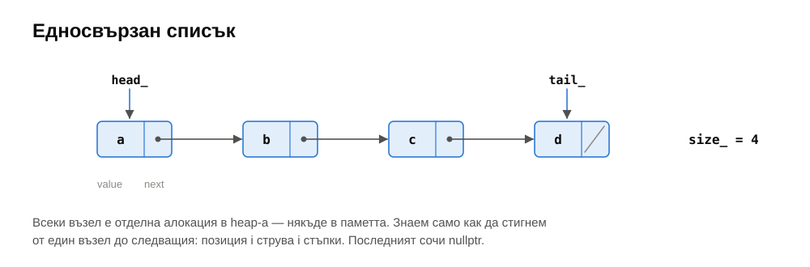

```cpp
struct Node {
    T value;
    Node* next;
};
```

Списъкът като обект пази указател към първия възел (`head_`), често и към последния (`tail_`), и броя елементи (`size_`). Възлите са отделни алокации в heap-а, разпръснати из паметта; редът им се определя **само** от указателите.

Следствия:

- **Няма адресна аритметика.** За да стигнем позиция $i$, тръгваме от `head_` и правим $i$ стъпки: $\Theta(i)$.
- **Вмъкване и изтриване не местят нищо.** Ако вече сме при възел $p$, вмъкването след него пренасочва два указателя: $\Theta(1)$, независимо от размера.
- **Указателите и референциите към елементи не се инвалидират** при вмъкване и изтриване на **други** елементи — за разлика от динамичния масив (седмица 04, §4.3).

---

## 2. Видове

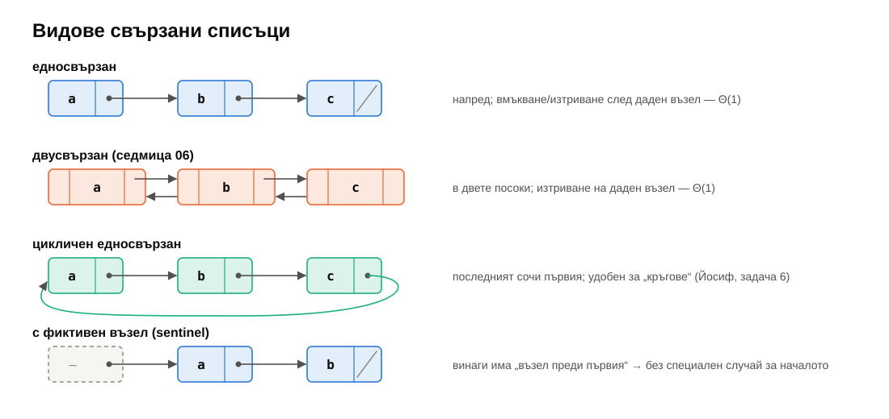

| Вид | Указатели във възела | Предимство | Цена |
|---|---|---|---|
| **едносвързан** | `next` | най-малко памет; вмъкване/изтриване **след** даден възел — $\Theta(1)$ | изтриване на **даден** възел изисква предшественика му |
| **двусвързан** (седмица 06) | `next`, `prev` | обхождане назад; изтриване на даден възел — $\Theta(1)$ | още 8 B на възел |
| **цикличен** | последният сочи първия | „кръгови“ задачи (задача 6), обхождане от всеки възел | краят не е `nullptr` — лесно се получава безкраен цикъл |
| **с фиктивен възел** (sentinel) | един постоянен възел преди първия | никакъв специален случай за началото | един допълнителен възел |

`std::forward_list` е едносвързан, `std::list` е двусвързан (на практика цикличен, с фиктивен възел).

---

## 3. Операциите стъпка по стъпка

### 3.1. Вмъкване в началото

<details>
<summary>pushFront стъпка по стъпка</summary>

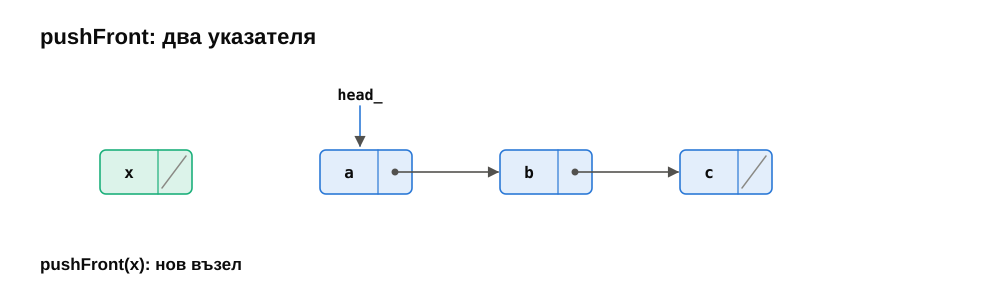
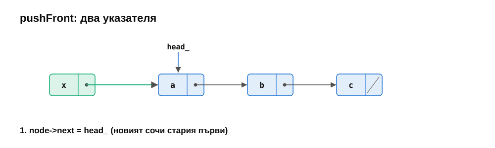
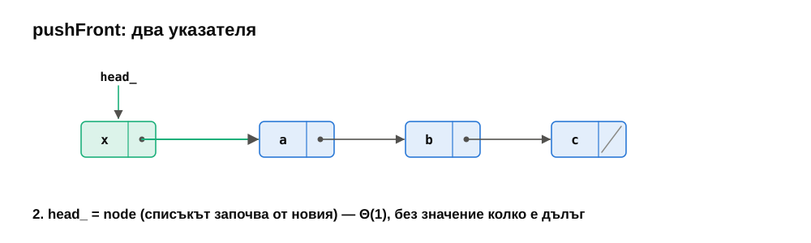

</details>

```cpp
head_ = new Node{value, head_};     // новият сочи стария първи; head_ сочи новия
if (tail_ == nullptr) tail_ = head_;
++size_;
```

Два указателя, $\Theta(1)$. Ако списъкът е бил празен, новият възел е и последен — без втория ред `tail_` би останал `nullptr`, и следващият `pushBack` би сочил грешно.

### 3.2. Вмъкване в средата

За да вмъкнем на позиция $i$, ни трябва възелът **преди** нея (`prev`, позиция $i - 1$). Стигането до него е $\Theta(i)$; самото вмъкване е $\Theta(1)$.

<details>
<summary>Вмъкване в средата стъпка по стъпка</summary>

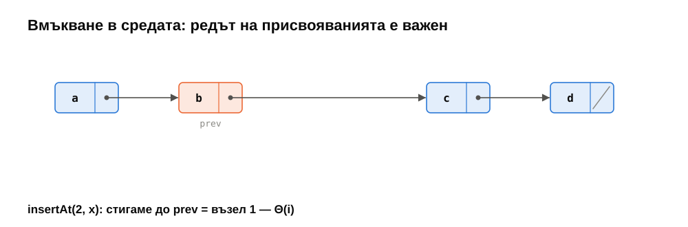
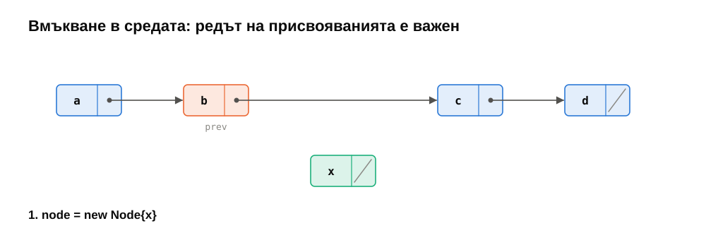
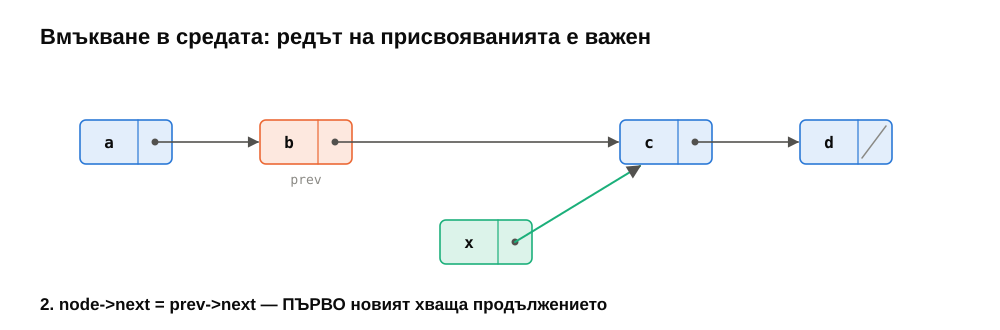
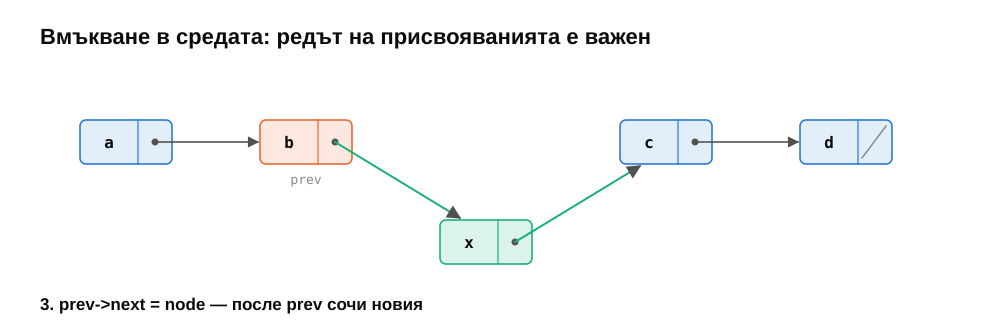

</details>

```cpp
Node* node = new Node{value, prev->next};   // 1. новият хваща продължението
prev->next = node;                          // 2. prev сочи новия
```

**Редът е важен.** Ако първо напишем `prev->next = node`, губим единствения указател към останалата част от списъка — тя „изтича“ (memory leak) и списъкът се скъсва.

### 3.3. Изтриване

<details>
<summary>Изтриване стъпка по стъпка</summary>

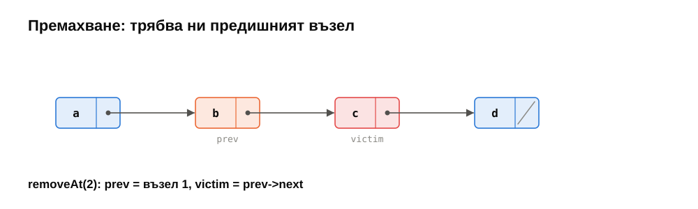
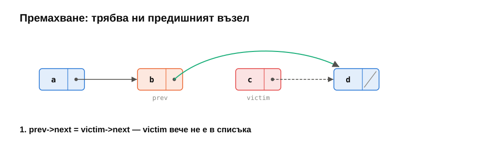
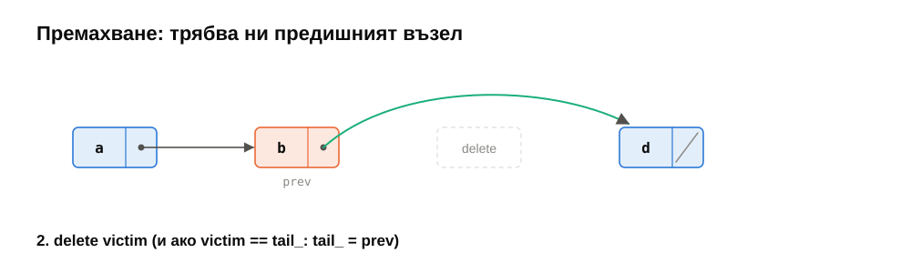

</details>

```cpp
Node* victim = prev->next;
prev->next = victim->next;      // заобикаляме victim
if (victim == tail_) tail_ = prev;
delete victim;                  // едва сега: преди това victim->next ни трябваше
```

В едносвързан списък не можем да изтрием възел, ако знаем само него — трябва ни предшественикът, за да пренасочим `prev->next`. Затова интерфейсите на едносвързани списъци говорят за „изтриване **след**“ (`std::forward_list::erase_after`).

### 3.4. Цената на операциите

| Операция | Едносвързан (с `tail_`) | Динамичен масив |
|---|---|---|
| вмъкване/изтриване в началото | $\Theta(1)$ | $\Theta(n)$ |
| вмъкване в края | $\Theta(1)$ | $\Theta(1)$ амортизирано |
| изтриване в края | $\Theta(n)$ — трябва предпоследният | $\Theta(1)$ |
| достъп до позиция $i$ | $\Theta(i)$ | $\Theta(1)$ |
| вмъкване/изтриване след даден възел | $\Theta(1)$ | — |
| търсене | $\Theta(n)$ | $\Theta(n)$ ($\Theta(\log n)$, ако е сортиран) |
| памет на `int` | ~32 B | 4 B (+ до 100% резерв) |

Изтриването в **края** е $\Theta(n)$ дори с `tail_`: след изтриването `tail_` трябва да сочи предпоследния възел, а до него стигаме само отначало. Двусвързаният списък (седмица 06) решава точно това.

---

## 4. Реализация: `SinglyLinkedList<T>`

### 4.1. Инвариантът

```text
size_ == броят възли, достижими от head_
size_ == 0  ⇔  head_ == nullptr  ⇔  tail_ == nullptr
иначе tail_ е последният възел и tail_->next == nullptr
всички възли са притежание на списъка
```

Повечето бъгове в свързани списъци са нарушения на втория и третия ред — `tail_`, който сочи изтрит възел, или `head_ == nullptr` при `tail_ != nullptr`. Затова тестовете проверяват `front()` и `back()` след **всяка** операция (`checkInvariant`).

### 4.2. Крайните случаи

За всяка операция питайте:

1. Списъкът е **празен**?
2. Списъкът има **един** елемент — и след операцията ще е празен?
3. Операцията засяга **първия** възел (`head_`)?
4. Операцията засяга **последния** възел (`tail_`)?

| Операция | Опасният случай |
|---|---|
| `pushFront` | празен списък: и `tail_` трябва да сочи новия |
| `pushBack` | празен списък: и `head_` трябва да сочи новия |
| `popFront` | последният елемент: `tail_` трябва да стане `nullptr` |
| `removeAt(size − 1)` | `tail_` трябва да се върне на предишния |
| `insertAt(size, x)` | е всъщност `pushBack` — `tail_` се мести |
| `reverse` | `tail_` трябва да стане старият `head_` |

### 4.3. Унищожаване: итеративно, не рекурсивно

```cpp
void clear() noexcept {
    while (head_ != nullptr) {
        Node* next = head_->next;   // запомняме, ПРЕДИ да изтрием
        delete head_;
        head_ = next;
    }
    tail_ = nullptr;
    size_ = 0;
}
```

Изкушаващата рекурсивна версия (`~Node() { delete next; }`) прави рекурсия с дълбочина $n$. За милион елемента това е милион кадъра в стека — стекът (обикновено 1–8 MB) препълва и програмата се срива. Тестът `clear, and a long list` проверява точно това.

### 4.4. Копиране и преместване

- **Копиране** — дълбоко, в същия ред. С `tail_` и $\Theta(1)$ `pushBack` е $\Theta(n)$. Без `tail_` (или с `insertAt(size(), x)`, който обхожда до края) би било $1 + 2 + \ldots + n = \Theta(n^2)$ — тестът с 200 000 елемента би отнел минути.
- **Преместване** — открадваме трите полета (`head_`, `tail_`, `size_`), оставяме другия празен. $\Theta(1)$, без нито една алокация.
- Копиращото присвояване — copy-and-swap; преместващото — преместване във временен обект и `swap` (седмица 04, §5.3).

Внимание при копиращия конструктор: ако копирането на елемент хвърли по средата, деструкторът на **недовършения** обект **не** се вика (конструкторът не е завършил) — вече създадените възли трябва да се освободят ръчно (`try`/`catch` + `clear()`).

### 4.5. Указател към указател

> [!NOTE]
> **🔬 За напреднали: `Node** link`.** Изтриването на първия възел и изтриването на възел в средата изглеждат различно: първото променя `head_`, второто — `prev->next`. Но и двете са **указател към текущия възел**. Ако пазим **адреса** на този указател — `Node** link`, първо `&head_`, после `&prev->next` — изтриването става един и същ ред: `*link = cur->next`.
>
> 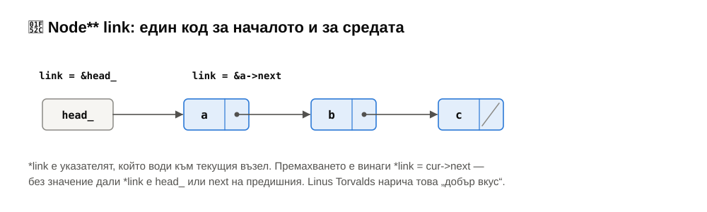
>
> ```cpp
> for (Node** link = &head_; *link != nullptr; ) {
>     Node* cur = *link;
>     if (cur->value == value) { *link = cur->next; delete cur; }
>     else                     { link = &cur->next; }
> }
> ```
>
> Така е написано `removeAll` в еталонното решение. Linus Torvalds дава точно този пример (в TED интервю от 2016 г.) като разлика между код с и без „добър вкус“: правилният подход премахва специалния случай, вместо да го обработва.

---

## 5. Класически алгоритми с указатели

### 5.1. Обръщане на място

<details>
<summary>reverse() стъпка по стъпка</summary>

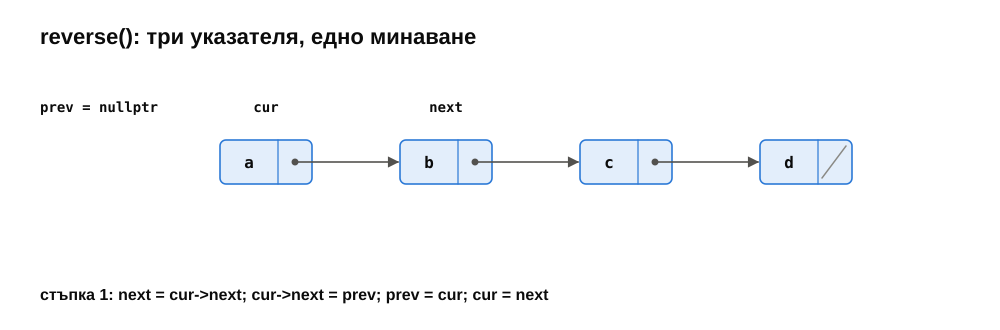
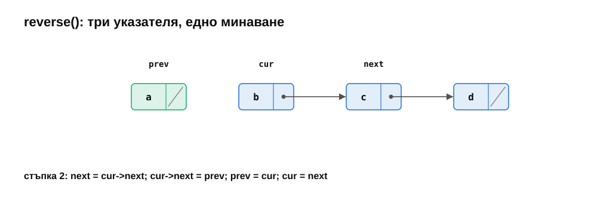
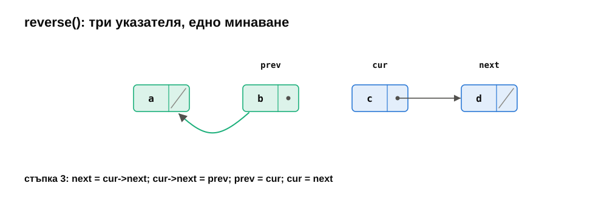
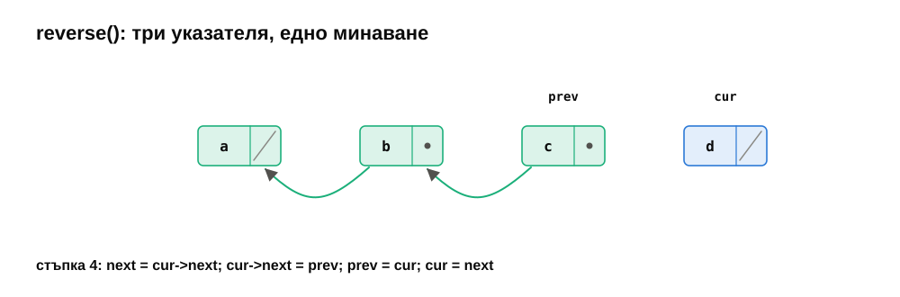
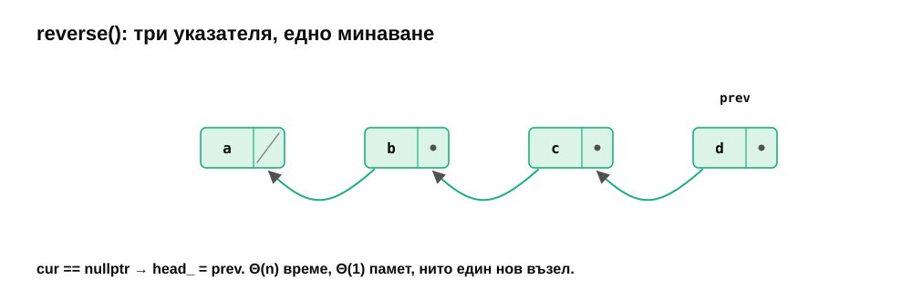

</details>

```cpp
Node* prev = nullptr;
Node* cur = head_;
while (cur != nullptr) {
    Node* next = cur->next;   // запомни продължението
    cur->next = prev;         // обърни стрелката
    prev = cur;               // придвижи двата указателя
    cur = next;
}
head_ = prev;
```

$\Theta(n)$ време, $\Theta(1)$ допълнителна памет, без нито една алокация и без копиране на стойности — само $n$ присвоявания на указатели. Масивът се обръща също за $\Theta(n)$, но с $n/2$ размени на **стойности**.

### 5.2. Два указателя с различна скорост

**Средата на списъка** за едно минаване: `slow` прави една стъпка, `fast` — две. Когато `fast` стигне края, `slow` е изминал половината.

**$k$-тият от края** за едно минаване: преместваме `lead` $k$ стъпки напред, после движим `lead` и `trail` заедно. Когато `lead` падне от края, `trail` е на $k$ позиции от него.

### 5.3. Има ли цикъл? (Флойд)

В клас като `SinglyLinkedList` цикъл не може да се получи — инвариантът го забранява. Но при „голи“ възли (или при бъг) `next` може да сочи назад, и наивното обхождане никога не свършва.

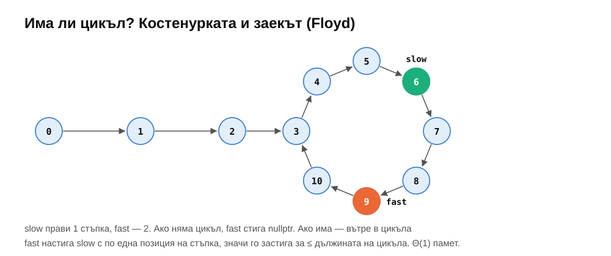

**Алгоритъмът на Флойд** („костенурката и заекът“): `slow` прави една стъпка, `fast` — две.

- Без цикъл `fast` стига `nullptr` → няма цикъл.
- С цикъл двамата влизат в него; оттам нататък `fast` намалява разстоянието до `slow` с **точно 1** на стъпка, значи го настига след най-много толкова стъпки, колкото е дълъг цикълът.

$\Theta(n)$ време, $\Theta(1)$ памет. Алтернативата — множество от вече видените възли — е $\Theta(n)$ памет.

> [!NOTE]
> **🔬 За напреднали: къде започва цикълът.** Ако след срещата преместим единия указател в началото и движим двата по една стъпка, те се срещат точно в началото на цикъла. Доказателство: нека пътят до цикъла е $\mu$, дължината на цикъла $\lambda$, а срещата е $t$ стъпки след началото на цикъла. `slow` е изминал $\mu + t$, `fast` — $2(\mu + t)$, и разликата е кратна на $\lambda$: $\mu + t \equiv 0 \pmod \lambda$, т.е. $\mu \equiv -t$. Значи от точката на срещата още $\mu$ стъпки водят до началото на цикъла — точно колкото и от началото на списъка.

### 5.4. Сливане на два сортирани списъка

Две сортирани вериги се сливат в една **без нито една алокация** — само пренасочване на `next`. Трикът е **фиктивен възел** на стека: `ListNode dummy; ListNode* tail = &dummy;` — винаги имаме „възел преди резултата“, към който да закачим следващия, и първият елемент не е специален случай.

```cpp
while (a != nullptr && b != nullptr) {
    if (b->value < a->value) { tail->next = b; b = b->next; }
    else                     { tail->next = a; a = a->next; }
    tail = tail->next;
}
tail->next = (a != nullptr) ? a : b;   // остатъкът — наведнъж
return dummy.next;
```

Изборът `b < a` (строго) прави сливането **стабилно**: при равни стойности възелът от `a` остава първи. Тази функция е сърцето на сортирането чрез сливане (седмица 12), а при списъци сортирането чрез сливане е естественият избор: не изисква допълнителна памет и пряк достъп.

### 5.5. Задачата на Йосиф

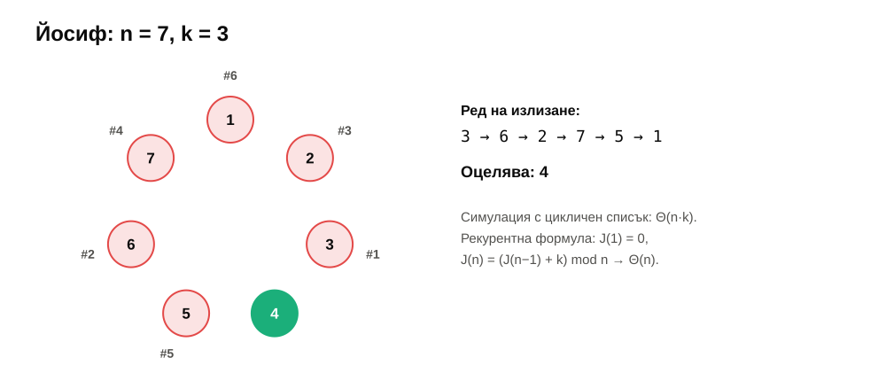

$n$ души стоят в кръг; броим по $k$ и всеки $k$-ти излиза. Кой остава последен? Цикличният списък моделира кръга буквално: последният възел сочи първия, и пазим указател към възела **преди** текущия — за да можем да изтрием следващия за $\Theta(1)$. Симулацията е $\Theta(n \cdot k)$.

> [!TIP]
> **💡 Любопитно.** Според историка Йосиф Флавий (I в.) при обсадата на Йотапата 41 въстаници решили да се самоубият по този начин, вместо да се предадат. Йосиф пресметнал къде да застане, за да остане последен — и се предал на римляните. За $n = 41$, $k = 3$ отговорът е позиция 31 (тестът го проверява). Задачата има и точна формула: $J(1) = 0$, $J(n) = (J(n-1) + k) \bmod n$ — $\Theta(n)$ без никакъв списък.

---

## 6. Списък или масив?

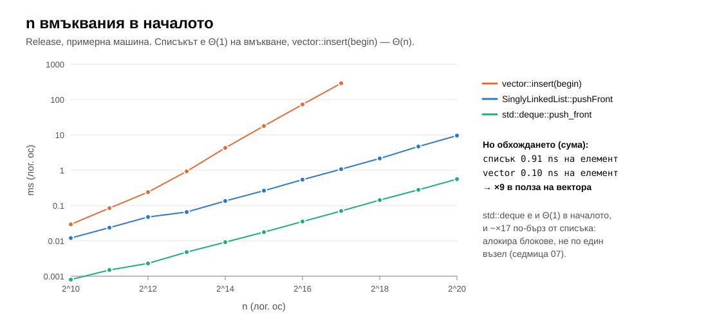

| | Свързан списък печели | Масив печели |
|---|---|---|
| вмъкване/изтриване в началото | ✔ ($\Theta(1)$ срещу $\Theta(n)$) | |
| вмъкване/изтриване в средата, когато **вече сме там** | ✔ | |
| указатели към елементи, които не се инвалидират | ✔ | |
| сливане/разделяне на последователности без копиране | ✔ | |
| достъп по индекс | | ✔ |
| обхождане | | ✔ (~×9 на примерната машина) |
| памет | | ✔ (~8× по-малко за `int`) |
| сортиране, двоично търсене | | ✔ |

На примерната машина: милион `pushFront` в нашия списък — 9.5 ms; `vector::insert(begin)` е 306 ms още при 131 072 елемента ($\Theta(n^2)$). Но **сумата** на елементите е ~0.9 ns на елемент в списъка срещу 0.1 ns във вектора. А `std::deque` прави `push_front` ~17 пъти по-бързо от нашия списък — също $\Theta(1)$, но алокира памет на блокове, вместо по един възел (седмица 07).

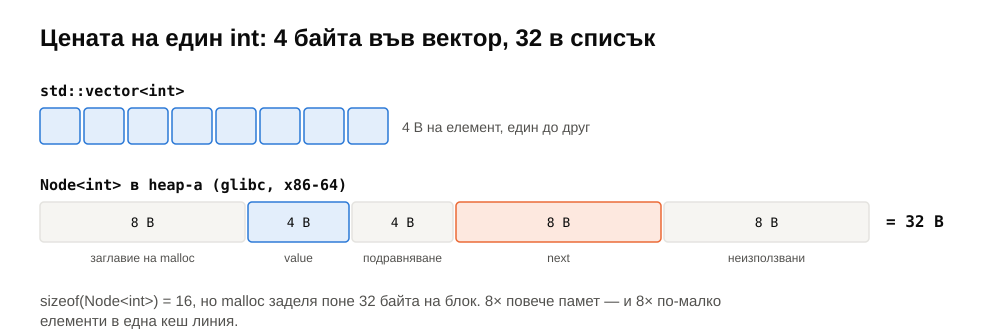

Поуката: свързаният списък е правилният избор по-рядко, отколкото учебниците предполагат. Bjarne Stroustrup показва (в лекция от 2012 г.), че дори за вмъкване на случайни позиции в сортирана последователност `std::vector` бие `std::list` за всякакви разумни размери — защото намирането на позицията (обхождане) доминира, а там масивът е много по-бърз. Списъците блестят, когато **вече държите** указател към мястото: LRU кеш, списък от свободни блокове в алокатор, планировчик на задачи в ядро на ОС.

---

## 7. Обобщение

| Тема | Да запомните |
|---|---|
| Структура | възли с `next`; `head_`, `tail_`, `size_`; редът е само в указателите |
| Цена | начало и „след даден възел“ — $\Theta(1)$; позиция $i$ — $\Theta(i)$; изтриване в края — $\Theta(n)$ (едносвързан) |
| Видове | едносвързан, двусвързан, цикличен, с фиктивен възел |
| Ред на присвояванията | при вмъкване — първо новият хваща продължението, после предишният сочи новия |
| Крайни случаи | празен, един елемент, първи възел, последен възел — `tail_`! |
| Унищожаване | итеративно; рекурсията препълва стека при милион възела |
| Копиране | $\Theta(n)$ благодарение на `tail_`; преместване — кражба на три полета |
| Алгоритми | обръщане с три указателя; бърз/бавен указател (среда, цикъл); сливане с фиктивен възел |
| Избор | списъкът печели, когато вече сте на мястото; иначе масивът (локалност, памет) |

---

## 8. Речник

| Български | English |
|---|---|
| свързан списък | linked list |
| възел | node |
| едносвързан / двусвързан / цикличен | singly / doubly / circular linked |
| глава / опашка (на списъка) | head / tail |
| фиктивен възел, страж | sentinel (dummy) node |
| предшественик / наследник | predecessor / successor |
| пренасочване на указатели | relinking |
| изтичане на памет | memory leak |
| висящ указател | dangling pointer |
| препълване на стека | stack overflow |
| бавен и бърз указател | slow and fast pointers (tortoise and hare) |
| засичане на цикъл | cycle detection |
| сливане | merge |
| стабилно (за сливане/сортиране) | stable |
| указател към указател | pointer to pointer |

---

## 9. Литература

- T. Cormen и др. *Introduction to Algorithms* — §10.2 „Linked lists“ (вкл. фиктивни възли).
- D. Knuth. *The Art of Computer Programming*, том 2, §3.1, упр. 6 (алгоритъмът на Флойд за намиране на цикъл).
- R. Graham, D. Knuth, O. Patashnik. *Concrete Mathematics*, §1.3 „The Josephus Problem“.
- B. Stroustrup. [„Why you should avoid Linked Lists“](https://www.youtube.com/watch?v=YQs6IC-vgmo), GoingNative 2012.
- [cppreference — `std::forward_list`](https://en.cppreference.com/w/cpp/container/forward_list), [`std::list`](https://en.cppreference.com/w/cpp/container/list)
- [Linus Torvalds за „добрия вкус“ в кода](https://www.ted.com/talks/linus_torvalds_the_mind_behind_linux), TED 2016.
