# Седмица 06 — Двусвързан списък, итератори, изтичане на памет

> Семинар 6 · четвъртък, 12 ноември 2026 · [слайдове](https://mishomish.github.io/fmi-kn-sdp-2026-2027-seminar/slides/?w=06-doubly-linked-list-iterators) · [задачи](exercises.md) · [starter код](starter/) · [тестове](tests/)

Три теми, които се допълват. **Двусвързаният списък** с фиктивен възел премахва всички специални случаи от миналата седмица. **Итераторите** са начинът да обхождаме *всеки* контейнер — и да пишем алгоритми, които не знаят нищо за контейнера. А **изтичането на памет** е грешката, която свързаните структури правят най-лесно — и която без инструменти почти не се вижда.

Блоковете **💡 Любопитно** и **🔬 За напреднали** са извън задължителния материал.

## Съдържание

1. [Двусвързан списък](#1-двусвързан-списък)
2. [Фиктивният възел](#2-фиктивният-възел)
3. [Шаблонът Iterator](#3-шаблонът-iterator)
4. [Итератор за `List<T>`](#4-итератор-за-listt)
5. [Категории итератори и алгоритми](#5-категории-итератори-и-алгоритми)
6. [Изтичане на памет и как се открива](#6-изтичане-на-памет-и-как-се-открива)
7. [Списък или вектор — пак](#7-списък-или-вектор--пак)
8. [Обобщение](#8-обобщение) · [Речник](#9-речник) · [Литература](#10-литература)

---

## 1. Двусвързан списък

Всеки възел пази указател и към **следващия**, и към **предишния**:

```cpp
struct Node {
    Node* prev;
    Node* next;
    T value;
};
```

Цената е още 8 байта на възел и два указателя повече за поддържане при всяка промяна. Печалбата:

| Операция | Едносвързан (седмица 05) | Двусвързан |
|---|---|---|
| изтриване в края | $\Theta(n)$ | $\Theta(1)$ |
| изтриване на **даден** възел | трябва ни предшественикът | $\Theta(1)$ — той е в `prev` |
| вмъкване **преди** даден възел | $\Theta(n)$ | $\Theta(1)$ |
| обхождане назад | невъзможно | $\Theta(1)$ на стъпка |
| памет на възел (`int`, 64 бита) | 16 B (+ malloc) | 24 B (+ malloc) |

**Инвариант:** за всеки възел `n` — `n->next->prev == n` и `n->prev->next == n`. Всяка операция, която пипа един от двата указателя и забравя другия, нарушава инварианта — и обхождането напред и назад започва да дава различни резултати. Затова тестовете обхождат списъка в **двете** посоки след всяка промяна (`checkLinks`).

---

## 2. Фиктивният възел

### 2.1. Идеята

Миналата седмица всяка операция имаше специални случаи: празен списък, първи възел, последен възел, `tail_`. Причината е, че първият възел няма предшественик, а последният — наследник.

**Фиктивният възел** (sentinel) е възел без стойност, който стои „преди първия и след последния“. Списъкът става **кръг** през него:

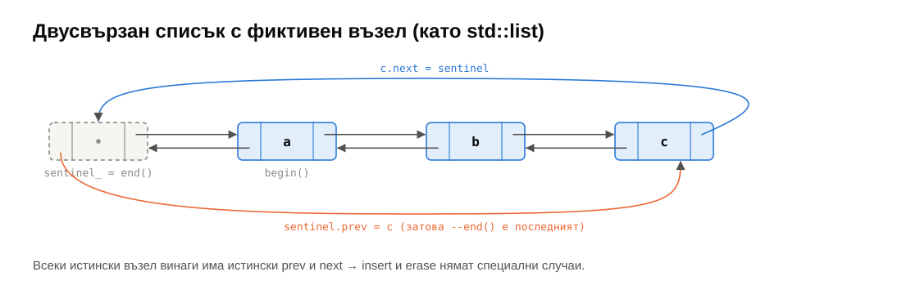

- `sentinel.next` е първият елемент, `sentinel.prev` — последният.
- Празен списък е фиктивният възел, сочещ себе си:

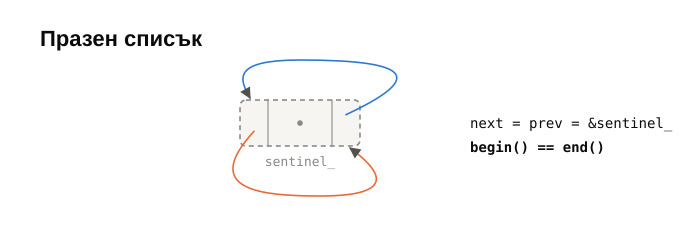

Сега **всеки** истински възел винаги има истински `prev` и истински `next`. Вмъкването и изтриването имат по **един** случай.

### 2.2. Вмъкване

<details>
<summary>insert стъпка по стъпка</summary>

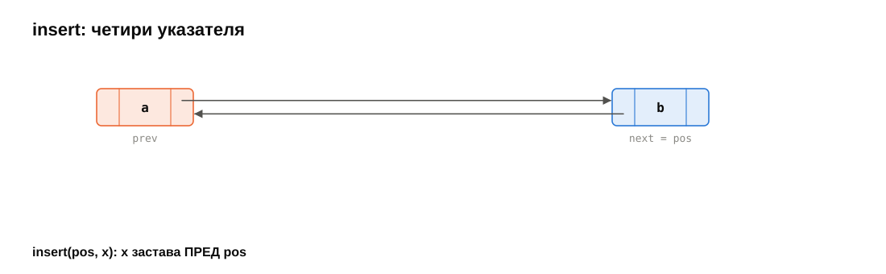
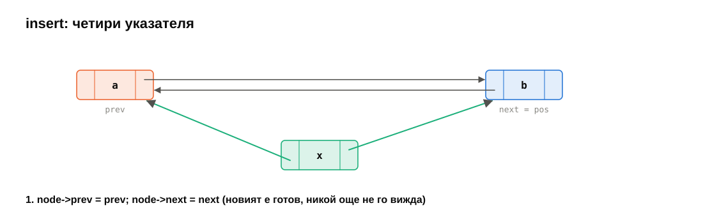
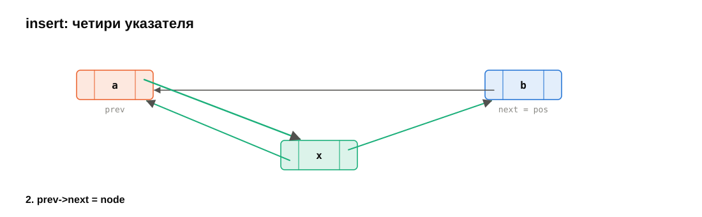
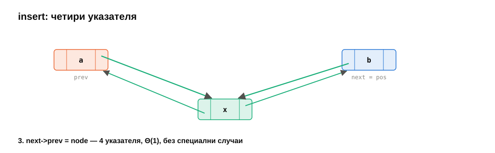

</details>

```cpp
iterator insert(const_iterator pos, const T& value) {   // преди pos
    NodeBase* next = pos.node_;
    NodeBase* prev = next->prev;
    Node* node = new Node(value);
    node->prev = prev;    node->next = next;    // 1. новият е готов
    prev->next = node;    next->prev = node;    // 2. съседите го виждат
    ++size_;
    return iterator(node);
}
```

Работи за вмъкване в празен списък (`prev == next == &sentinel_`), в началото (`prev` е фиктивният), в края (`pos == end()`, `next` е фиктивният) и в средата — без нито един `if`. `pushFront`, `pushBack` са `insert(begin(), x)` и `insert(end(), x)`.

Редът е избран нарочно: новият възел е **напълно** свързан, преди някой да сочи към него. Ако `new` или копирането на `T` хвърли, списъкът е непокътнат.

### 2.3. Изтриване

<details>
<summary>erase стъпка по стъпка</summary>

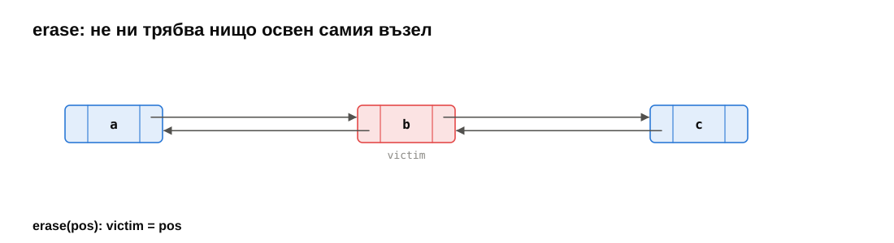
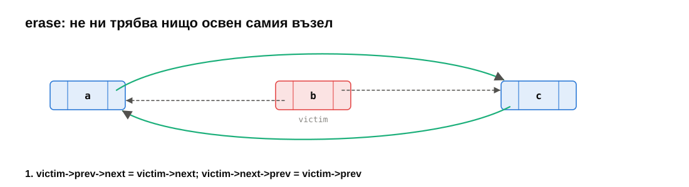
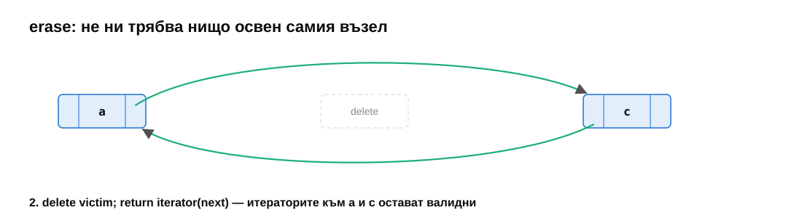

</details>

```cpp
iterator erase(const_iterator pos) {
    NodeBase* victim = pos.node_;
    NodeBase* next = victim->next;
    victim->prev->next = next;
    next->prev = victim->prev;
    delete static_cast<Node*>(victim);
    --size_;
    return iterator(next);
}
```

Не ни трябва нищо освен самия възел — `prev` е в него. Итераторите към **другите** елементи остават валидни (за разлика от `std::vector`).

### 2.4. Капан: фиктивният възел е поле

В нашата реализация (и в libstdc++) фиктивният възел е **поле на обекта**, не отделна алокация. Значи при преместване на списъка той **не се мести** заедно с възлите — първият и последният възел още сочат адреса на стария:

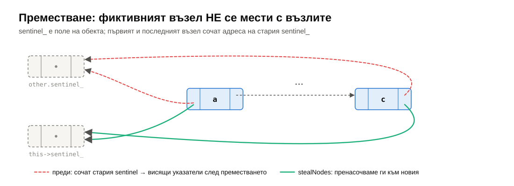

Затова преместващият конструктор не може просто да копира `sentinel_`. Трябва да пренасочи `first->prev` и `last->next` към новия фиктивен възел и да остави стария да сочи себе си (`stealNodes` в задача 3). Ако го забравите, списъкът изглежда наред, докато някой не направи `--end()`.

### 2.5. `splice` и `reverse`

Двусвързаният списък прави две операции, които масивът не може без копиране:

- **`splice(pos, other)`** премества **всички** възли на друг списък на дадено място за $\Theta(1)$ — четири указателя, независимо колко елемента има `other`.

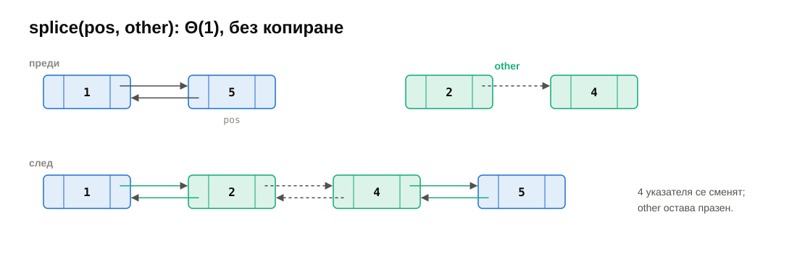

- **`reverse()`** обръща списъка, като във **всеки** възел (и във фиктивния) разменя `prev` и `next`. Без нито едно копиране на стойност.

---

## 3. Шаблонът Iterator

### 3.1. Проблемът

Имаме $N$ контейнера (масив, динамичен масив, списък, …) и $M$ алгоритъма (търсене, броене, обръщане, сума, …). Ако всеки алгоритъм се пише поотделно за всеки контейнер — $N \times M$ функции. Освен това алгоритъмът трябва да знае **вътрешността** на контейнера: индекси за масива, `next` указатели за списъка.

### 3.2. Решението

**Iterator** (един от 23-те шаблона за дизайн в книгата на „бандата на четиримата“, 1994) дава начин да се обхождат елементите на колекция **последователно, без да се разкрива вътрешното ѝ представяне**. Итераторът е малък обект, който:

- сочи към един елемент: `*it`;
- може да се придвижи към следващия: `++it`;
- може да се сравни с друг итератор: `it != end`.

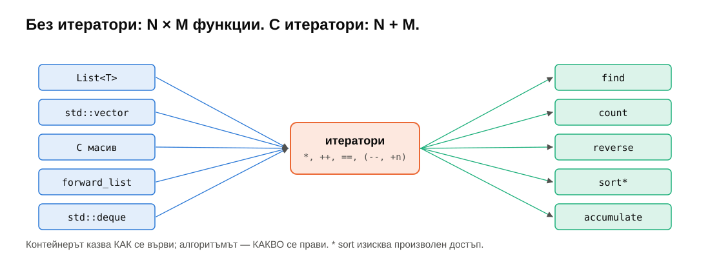

Всеки контейнер дава итератори; всеки алгоритъм работи само с итератори. $N + M$ вместо $N \times M$. Така е построена цялата стандартна библиотека на C++ (Alexander Stepanov, STL, 1994).

```cpp
template <typename It, typename T>
It findValue(It first, It last, const T& value) {
    for (; first != last; ++first)
        if (*first == value) break;
    return first;
}
// работи с List<int>, std::vector<int>, int[], std::forward_list<int>, …
```

### 3.3. Полуотвореният интервал

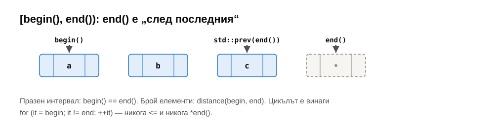

`begin()` сочи първия елемент; `end()` сочи **след** последния — при `List` това е фиктивният възел. Интервалът е $[\text{begin}, \text{end})$:

- празен контейнер: `begin() == end()`;
- броят елементи е `std::distance(begin(), end())`;
- последният елемент е `*std::prev(end())`;
- `*end()` е **недефинирано поведение**.

Цикълът е винаги `for (it = first; it != last; ++it)` — с `!=`, не с `<` (повечето итератори нямат `<`).

### 3.4. Указателят е итератор

За масиви вече ползваме итератори от седмица 03: `T*` поддържа `*`, `++`, `--`, `+ n`, `==` — точно интерфейса на итератор с произволен достъп. Затова `FixedArray::begin()` просто връща `data_`. Клас за итератор ни трябва едва когато следващият елемент **не е** на следващия адрес — както в списъка.

---

## 4. Итератор за `List<T>`

### 4.1. Какво пази и какво прави

```cpp
template <bool IsConst>
class Iterator {
    NodeBase* node_;   // текущият възел; за end() — фиктивният

public:
    reference operator*() const { return static_cast<Node*>(node_)->value; }
    Iterator& operator++()      { node_ = node_->next; return *this; }
    Iterator& operator--()      { node_ = node_->prev; return *this; }
    friend bool operator==(const Iterator& a, const Iterator& b) { return a.node_ == b.node_; }
    // …
};
```

`NodeBase` е възел без стойност (само `prev`, `next`) — от него наследяват и фиктивният възел, и истинските `Node`. Така фиктивният възел не изисква `T` да има конструктор по подразбиране. `operator*` прави `static_cast` до `Node*` — безопасно, защото `*` е позволен само за истински елементи.

### 4.2. Префиксно и постфиксно `++`

```cpp
Iterator& operator++()    { node_ = node_->next; return *this; }   // ++it: новата позиция
Iterator  operator++(int) { Iterator old = *this; ++*this; return old; }  // it++: старата
```

Фиктивният `int` параметър е само за да се различат двете. Постфиксната версия копира итератора — затова в цикли се пише `++it`.

### 4.3. `iterator` и `const_iterator`

`const_iterator` е итератор, през който **не може** да се променя елементът: `*it` връща `const T&`. Нужен е за `const List&` — `begin()` на константен обект връща `const_iterator`.

Вместо два почти еднакви класа — един шаблон с `bool IsConst` и `std::conditional_t`:

```cpp
using reference = std::conditional_t<IsConst, const T&, T&>;
```

Позволено е преобразуване `iterator → const_iterator` (да „отнемем“ правото на запис), но не и обратното. Затова `insert` и `erase` приемат `const_iterator` — работят и с двата.

### 4.4. Членовете-типове: как алгоритмите разпознават итератора

```cpp
using iterator_category = std::bidirectional_iterator_tag;
using value_type        = T;
using difference_type   = std::ptrdiff_t;
using pointer           = …;
using reference         = …;
```

`std::iterator_traits<It>` чете тези типове. Благодарение на тях `std::find`, `std::count`, `std::reverse`, `std::distance`, `std::prev`, `std::accumulate`, `std::max_element` работят с нашия `List` без нито един ред допълнителен код — тестът `works with standard algorithms` го проверява.

---

## 5. Категории итератори и алгоритми

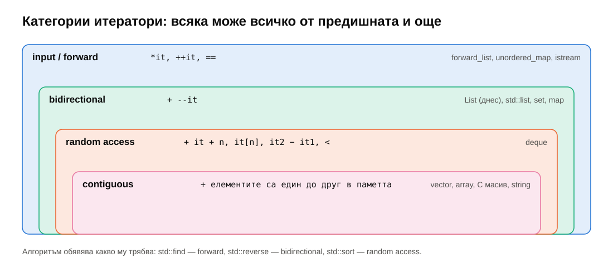

| Категория | Операции | Примери |
|---|---|---|
| input / forward | `*`, `++`, `==` | `forward_list`, `unordered_map` |
| bidirectional | + `--` | `List`, `std::list`, `set`, `map` |
| random access | + `it + n`, `it[n]`, `it2 - it1`, `<` | `deque` |
| contiguous (C++20) | + елементите са последователни в паметта | `vector`, `array`, C масив, `string` |

Всеки алгоритъм изисква определена категория: `std::find` — forward, `std::reverse` — bidirectional, `std::sort` и `std::lower_bound` (за $\Theta(\log n)$) — random access. Затова `std::sort(list.begin(), list.end())` **не компилира** — списъкът има собствен `list.sort()` (сортиране чрез сливане, седмица 12).

**Един алгоритъм — различна сложност според категорията.** `std::distance(first, last)` е $\Theta(1)$ за random access (`last - first`) и $\Theta(n)$ за останалите (брои стъпките). Изборът става **при компилация**:

```cpp
using Category = typename std::iterator_traits<It>::iterator_category;
if constexpr (std::is_base_of_v<std::random_access_iterator_tag, Category>)
    return last - first;                    // Θ(1)
else { /* брои ++ */ }                       // Θ(n)
```

`if constexpr` (C++17) изхвърля неприложимия клон — `last - first` изобщо не се компилира за итератор на списък. Задача 5.

> [!NOTE]
> **🔬 За напреднали.** Преди C++17 същото се правеше с **tag dispatch**: две претоварени функции, които приемат `std::random_access_iterator_tag` и `std::input_iterator_tag`, и извикване с `Category{}` — компилаторът избира по наследяването на таговете. В C++20 вместо таговете има **концепции** (`std::random_access_iterator<It>`).

### 5.1. Инвалидиране на итератори — сравнение

| Контейнер | `insert` | `erase` |
|---|---|---|
| `vector` | всички, ако преоразмери; иначе — от позицията нататък | от позицията нататък |
| `deque` | всички | всички (освен в краищата) |
| `list` / нашият `List` | **никой** | само изтрития |

---

## 6. Изтичане на памет и как се открива

### 6.1. Какво е изтичане

**Изтичане на памет** (memory leak) — памет, заделена с `new`, към която програмата вече няма указател, така че никога няма да я освободи. Програмата не се срива — просто паметта ѝ расте. При кратка програма това не се забелязва; при сървър, който работи седмици, или при игра — го убива.

Типични причини в свързани структури:

| Причина | Пример |
|---|---|
| забравен `delete` | `erase` отвързва възела, но не го изтрива |
| загубен единствен указател | грешен ред на присвояванията при вмъкване (седмица 05) |
| изключение между `new` и „поемането“ на паметта | копиращ конструктор, който хвърля по средата (задача 3) |
| деструктор, който не освобождава всичко | `clear()`, който трие само първия възел |
| 🔬 цикъл от `std::shared_ptr` | два обекта, които се сочат взаимно; броячът никога не стига 0 |
| 🔬 липсващ `virtual` деструктор | `delete` през указател към базов клас |

Свързани, но различни грешки: **двойно освобождаване** (`delete` два пъти), **използване след освобождаване** (use-after-free), **висящ указател** — те са UB и обикновено по-опасни; хващат ги същите инструменти.

### 6.2. Инструменти

**1. Броячи (инструментиране).** Тип, който брои живите си обекти: `++alive` в конструкторите, `--alive` в деструктора. В края на теста `alive` трябва да е 0. Така работи `Counted` в тестовете тази седмица. Просто и работи навсякъде, но засича само обектите от този тип.

**2. AddressSanitizer + LeakSanitizer** (GCC, Clang; preset `asan` в курса). Компилаторът добавя проверки към всеки достъп до паметта; при изход LeakSanitizer докладва всяка неосвободена алокация, със стека, където е заделена. Забавяне ~2×. Реален изход от [`demo/leak_demo.cpp`](demo/leak_demo.cpp) (`popFront`, който не изтрива възела):

```text
==12091==ERROR: LeakSanitizer: detected memory leaks

Direct leak of 24 byte(s) in 1 object(s) allocated from:
    #0 0x… in operator new(unsigned long)
    #1 0x… in TinyList::pushBack(int) leak_demo.cpp:22
    #2 0x… in main leak_demo.cpp:50

Indirect leak of 24 byte(s) in 1 object(s) allocated from:
    #0 0x… in operator new(unsigned long)
    #1 0x… in TinyList::pushBack(int) leak_demo.cpp:22
    #2 0x… in main leak_demo.cpp:50
```

**Direct leak** — към блока не сочи нищо. **Indirect leak** — към блока сочи само друг изтекъл блок (първият изтрит възел още пази `next` към втория). Поправете директните — индиректните обикновено изчезват с тях.

**3. Valgrind (Memcheck)** — на Linux; изпълнява непроменената програма в „емулатор“, който следи всеки байт. Не изисква прекомпилиране (но с `-g` показва редове), забавя ~20–50×. Същото демо:

```text
==…== HEAP SUMMARY:
==…==     in use at exit: 48 bytes in 2 blocks
==…==   total heap usage: 7 allocs, 5 frees, 77,944 bytes allocated
==…== 48 (24 direct, 24 indirect) bytes in 1 blocks are definitely lost in loss record 2 of 2
==…==    at 0x…: operator new(unsigned long)
==…==    by 0x…: TinyList::pushBack(int) (leak_demo.cpp:22)
==…==    by 0x…: main (leak_demo.cpp:50)
==…== LEAK SUMMARY:
==…==    definitely lost: 24 bytes in 1 blocks
==…==    indirectly lost: 24 bytes in 1 blocks
```

| Категория в Valgrind | Значение |
|---|---|
| definitely lost | няма указател към блока — сигурно изтичане |
| indirectly lost | достижим само през изтекъл блок |
| possibly lost | има указател в средата на блока — вероятно изтичане |
| still reachable | при изхода още има указател (напр. глобална променлива) — обикновено безобидно |

**4. По операционни системи:**

| Система | Инструмент |
|---|---|
| Linux | `-fsanitize=address` (LSan е включен по подразбиране) или `valgrind --leak-check=full ./program` |
| macOS | `-fsanitize=address` за грешки с паметта; за изтичане — `leaks --atExit -- ./program` (идва с Xcode), защото LSan не е наличен на всички версии на macOS |
| Windows (MSVC) | `/fsanitize=address` за грешки с паметта (без засичане на изтичане); за изтичане — CRT debug heap: `_CrtSetDbgFlag(_CRTDBG_ALLOC_MEM_DF \| _CRTDBG_LEAK_CHECK_DF)` в началото на `main`, отчетът излиза в Output на Visual Studio |

### 6.3. Най-добрият инструмент: да няма какво да изтече

Инструментите намират изтичане **след** като е станало. По-добре е да не може да стане:

- **RAII** (седмица 03): всеки ресурс има собственик, чийто деструктор го освобождава. `List` притежава възлите си; деструкторът вика `clear()`.
- **Правилото на петте / нулата** (седмица 04): клас, който управлява ресурс, дефинира петте операции; всички останали класове не дефинират нито една и ползват такива, които управляват ресурси.
- **`std::unique_ptr<T>`**: умен указател, който изтрива обекта си в деструктора. В приложен код почти никога не пишете `delete` сами. (Защо тогава `List` ползва сурови указатели? Защото реализираме **контейнера** — нивото, на което се пишат точно такива абстракции. Списък от `unique_ptr` има свои капани: рекурсивен деструктор, седмица 05, §4.3.)

> [!TIP]
> **💡 Любопитно.** Heartbleed (2014) — една от най-известните уязвимости в историята — е грешка от същото семейство: OpenSSL четеше паметта отвъд края на буфер, защото вярваше на дължина, подадена от другата страна. Сървърите изпращаха на атакуващия до 64 KB от собствената си памет — включително пароли и частни ключове. Инструмент като AddressSanitizer хваща такова четене извън буфер — но OpenSSL ползваше собствен алокатор, който преизползваше блокове и така скриваше грешката от подобни инструменти. Още един аргумент да не пишете собствено управление на паметта без нужда.

---

## 7. Списък или вектор — пак

Bjarne Stroustrup предлага експеримент: вмъкнете $n$ случайни числа в последователност, като я пазите **сортирана** — за всяко число намерете (с линейно търсене) първия по-голям елемент и вмъкнете пред него. За списъка вмъкването е $\Theta(1)$, за вектора — $\Theta(n)$ (местене). Изглежда, че списъкът трябва да спечели.

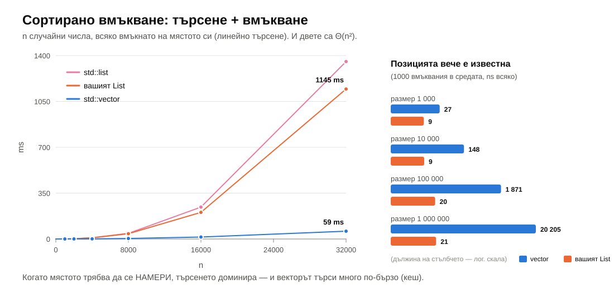

Не печели — векторът е ~19 пъти по-бърз при 32 000 елемента. И двата алгоритъма са $\Theta(n^2)$, защото **търсенето** е $\Theta(n)$ и за двата — и там векторът (последователна памет, кеш, предварително зареждане) е много по-бърз от гоненето на указатели в списъка. Местенето във вектора е `memmove` — също последователно и много бързо.

Дясната част на графиката показва обратния случай: когато **позицията вече е известна** (държим итератор към нея), вмъкването в списъка е ~20 ns при всякакъв размер, а във вектора расте с размера — до 20 µs при милион елемента.

Поуката от седмици 05–06: свързаният списък е правилният избор, когато **вече държите итератори** към местата, където вмъквате и изтривате, и когато ви трябват итератори, които не се инвалидират. Ако трябва да търсите мястото — почти винаги векторът печели.

---

## 8. Обобщение

| Тема | Да запомните |
|---|---|
| Двусвързан списък | `prev` + `next`; изтриване на даден възел и в края — $\Theta(1)$; инвариант `n->next->prev == n` |
| Фиктивен възел | кръг през възел без стойност → insert/erase без специални случаи; `end()` е фиктивният |
| Преместване | фиктивният възел е поле — първият и последният възел трябва да се пренасочат |
| `splice`, `reverse` | $\Theta(1)$ и $\Theta(n)$ без копиране на стойности |
| Iterator | обхождане без разкриване на представянето; $N + M$ вместо $N \times M$ |
| Интервал | $[\text{begin}, \text{end})$; `!=`, не `<`; `*end()` е UB |
| `const_iterator` | един шаблон с `bool IsConst`; `iterator → const_iterator` да, обратно — не |
| Категории | forward ⊂ bidirectional ⊂ random access ⊂ contiguous; алгоритъмът казва коя му трябва |
| `if constexpr` | избор на алгоритъм според категорията при компилация (`distanceBetween`) |
| Изтичане | броячи, ASan/LSan, Valgrind, `leaks`, CRT debug heap; direct срещу indirect |
| Предпазване | RAII, правило на петте/нулата, `unique_ptr` |
| Списък или вектор | вектор, освен ако вече държите итератора към мястото |

---

## 9. Речник

| Български | English |
|---|---|
| двусвързан списък | doubly linked list |
| фиктивен възел | sentinel (dummy) node |
| итератор | iterator |
| шаблон за дизайн | design pattern |
| полуотворен интервал | half-open range |
| константен итератор | const iterator |
| категория на итератора | iterator category |
| итератор с произволен достъп | random-access iterator |
| двупосочен итератор | bidirectional iterator |
| характеристики на итератор | iterator traits |
| разпределяне по етикет | tag dispatch |
| префиксен / постфиксен инкремент | prefix / postfix increment |
| изтичане на памет | memory leak |
| двойно освобождаване | double free |
| използване след освобождаване | use-after-free |
| пряко / непряко изтичане | direct / indirect leak |
| умен указател | smart pointer |
| прехвърляне на възли | splice |

---

## 10. Литература

- E. Gamma, R. Helm, R. Johnson, J. Vlissides. *Design Patterns: Elements of Reusable Object-Oriented Software*, 1994 — Iterator.
- A. Stepanov, P. McJones. *Elements of Programming*, 2009 — итераторите като математическа абстракция.
- T. Cormen и др. *Introduction to Algorithms* — §10.2 (двусвързани списъци с фиктивен възел).
- [cppreference — Iterator library](https://en.cppreference.com/w/cpp/iterator), [`std::list`](https://en.cppreference.com/w/cpp/container/list)
- [AddressSanitizer](https://github.com/google/sanitizers/wiki/AddressSanitizer), [LeakSanitizer](https://github.com/google/sanitizers/wiki/AddressSanitizerLeakSanitizer), [Valgrind Memcheck](https://valgrind.org/docs/manual/mc-manual.html)
- [Microsoft — Find memory leaks with the CRT library](https://learn.microsoft.com/en-us/cpp/c-runtime-library/find-memory-leaks-using-the-crt-library)
