# Седмица 07 — Шаблонът Proxy. Стек и опашка

> Семинар 7 · четвъртък, 19 ноември 2026 · [слайдове](https://mishomish.github.io/fmi-kn-sdp-2026-2027-seminar/slides/?w=07-proxy-stack-queue) · [задачи](exercises.md) · [starter код](starter/) · [тестове](tests/)

Тази седмица няма нова структура в паметта — има нови **интерфейси**. Стекът и опашката са най-използваните абстрактни типове данни в информатиката, а и двата се реализират върху вече познатите масив и списък. Шаблонът **Proxy** е за същото: обект, който стои **между** клиента и истинския обект и контролира достъпа до него. Двете теми се срещат в една дума: **адаптер**.

Блоковете **💡 Любопитно** и **🔬 За напреднали** са извън задължителния материал.

## Съдържание

1. [Шаблонът Proxy](#1-шаблонът-proxy)
2. [Стек](#2-стек)
3. [Опашка](#3-опашка)
4. [Дек](#4-дек)
5. [Адаптери в стандартната библиотека](#5-адаптери-в-стандартната-библиотека)
6. [Класически приложения](#6-класически-приложения)
7. [Колко струва всяка опашка](#7-колко-струва-всяка-опашка)
8. [Обобщение](#8-обобщение) · [Речник](#9-речник) · [Литература](#10-литература)

---

## 1. Шаблонът Proxy

### 1.1. Идеята

**Proxy** (заместител) е обект със **същия интерфейс** като друг обект, който клиентът ползва вместо него. Проксито препраща заявките към истинския обект — но може и да направи нещо преди или след това, или изобщо да не го направи.

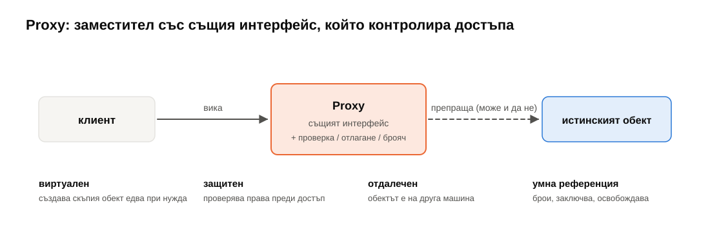

| Вид | Какво прави проксито | Пример |
|---|---|---|
| **виртуален** (virtual) | създава скъпия обект едва когато наистина потрябва | изображение в документ се зарежда от диска чак когато се покаже на екрана |
| **защитен** (protection) | проверява права преди всяко препращане | файл само за четене за някои потребители |
| **отдалечен** (remote) | обектът е на друга машина; проксито праща заявки по мрежата | RPC stub, клиентска библиотека за база данни |
| **умна референция** (smart reference) | брои, заключва или освобождава при достъп | `std::shared_ptr` брои собствениците; `std::unique_ptr` изтрива обекта |
| **кеширащ** / **записващ** | пази отговори или записва всяко извикване | HTTP кеш, профилиране |

Клиентът **не знае**, че говори с прокси — интерфейсът е същият. Затова проксито може да се добави или махне без промяна в клиента.

**Proxy, Adapter или Decorator?** И трите „обвиват“ друг обект; разликата е в **намерението**:

| | Интерфейсът спрямо обвития обект | Целта |
|---|---|---|
| **Proxy** | същият | контролира **достъпа** |
| **Adapter** | различен | **преобразува** един интерфейс в друг (стекът върху вектор, §5) |
| **Decorator** | същият | **добавя** поведение (напр. буфериран поток върху файл) |

### 1.2. Proxy в C++: обекти, които се държат като референции

В C++ най-честото прокси е малък обект, върнат от `operator[]`, когато истинска референция е **невъзможна**.

`BitVector` пази $n$ булеви стойности в $n$ **бита** — 64 в една дума `std::uint64_t`, осем пъти по-малко памет от `bool[]`. Но битът **няма адрес**: най-малката адресируема единица е байтът. Значи `operator[]` не може да върне `bool&`. Вместо това връща прокси `BitRef`, което помни **коя дума** и **кой бит**:

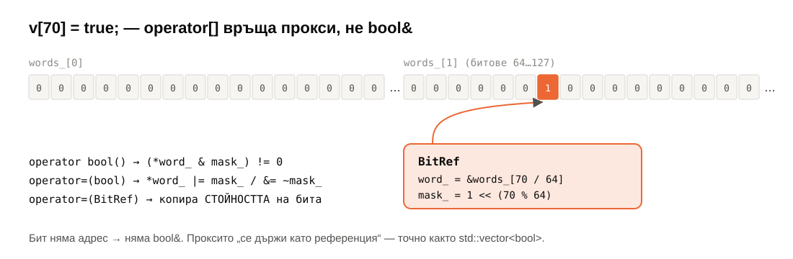

```cpp
class BitRef {
    std::uint64_t* word_;
    std::uint64_t mask_;   // точно един вдигнат бит
public:
    operator bool() const          { return (*word_ & mask_) != 0; }   // четене
    BitRef& operator=(bool value)  { if (value) *word_ |= mask_; else *word_ &= ~mask_; return *this; }
    BitRef& operator=(const BitRef& other) { return *this = static_cast<bool>(other); }
};
```

Сега `bool b = v[3];`, `v[3] = true;` и `v[3] = v[5];` изглеждат точно като с масив от `bool`.

**Капанът с копиращото присвояване.** Генерираният от компилатора `operator=(const BitRef&)` би копирал **полетата** на проксито: след `v[3] = v[5]` проксито вляво би сочело бит 5, а бит 3 — непроменен. Затова го пишем ръчно: копира **стойността** на бита.

**Капанът с `auto`.**

```cpp
auto r = v[1];   // r е BitRef, не bool!
r = true;        // променя v
bool b = v[1];   // това е истинско копие
```

С обикновен масив `auto r = a[1];` е копие; с прокси — „референция“. Същото важи за `std::vector<bool>` (седмица 04, §7.2), `std::bitset::reference` и за обекти, които „живеят“ по-кратко от проксито си: ако `v` бъде унищожен, `r` сочи освободена памет.

> [!TIP]
> **💡 Любопитно.** `std::vector<bool>` е може би най-критикуваното решение в стандартната библиотека — именно защото е „вектор“, чийто `operator[]` не връща `bool&`. Herb Sutter пише статия със заглавие „When Is a Container Not a Container?“ (1999), а предложения за премахването му има от над 20 години. Ако ви трябват битове — `std::bitset<N>` (размер при компилация) или собствен `BitVector`; ако ви трябват `bool`-ове — `std::vector<char>`.

---

## 2. Стек

### 2.1. АТД

**Стек** (stack) е колекция с достъп само до **един** край — върха. Последният добавен е първият премахнат: **LIFO** (last in, first out).

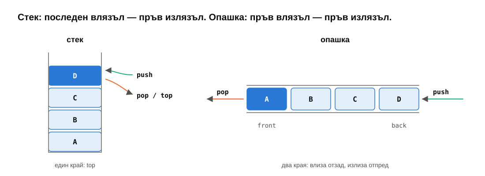

| Операция | Значение |
|---|---|
| `push(x)` | слага `x` на върха |
| `pop()` | маха върха |
| `top()` | върхът (без да го маха) |
| `empty()`, `size()` | |

Всички операции са $\Theta(1)$ — и това е цялата идея: стекът **забранява** всичко друго (обхождане, индекс, вмъкване в средата), за да гарантира, че тези операции са евтини и че кодът, който го ползва, не може да наруши реда.

### 2.2. Реализации

| Върху | `push` | `pop` | `top` | Бележка |
|---|---|---|---|---|
| динамичен масив (краят = върхът) | $\Theta(1)$ амортизирано | $\Theta(1)$ | $\Theta(1)$ | най-бързо (локалност); по подразбиране в курса |
| свързан списък (началото = върхът) | $\Theta(1)$ | $\Theta(1)$ | $\Theta(1)$ | алокация на всеки `push` |
| `std::deque` | $\Theta(1)$ | $\Theta(1)$ | $\Theta(1)$ | по подразбиране в `std::stack` |

Върхът на масива е **краят** (не началото!) — иначе всеки `push` би местил всичко.

### 2.3. Стекът, който ползвате всеки ден

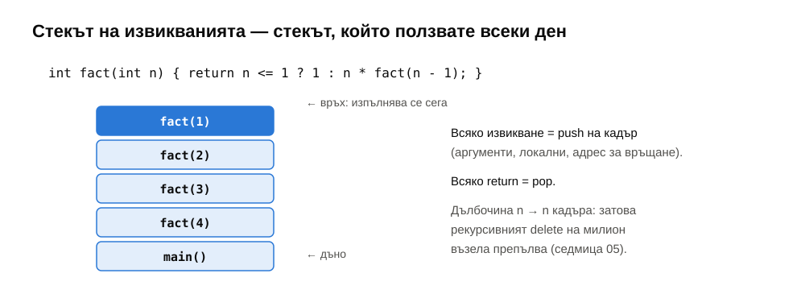

Всяко извикване на функция слага **кадър** (frame) на стека на извикванията: аргументи, локални променливи, адрес за връщане. Всяко `return` го маха. Затова рекурсията с дълбочина $n$ ползва $\Theta(n)$ памет и затова рекурсивният деструктор на милион възела препълва стека (седмица 05). И затова всеки рекурсивен алгоритъм може да се пренапише итеративно с **явен** стек — ще го направим за обхождането на дървета (седмица 09) и графи (седмица 13).

Други стекове наоколо: бутонът „назад“ на браузъра, `Ctrl+Z`, проверката на скоби (задача 5), пресмятането на изрази (седмица 08), търсенето с връщане назад (backtracking).

---

## 3. Опашка

### 3.1. АТД

**Опашка** (queue) — добавя се в единия край (`back`), маха се от другия (`front`). Първият добавен е първият премахнат: **FIFO** (first in, first out).

| Операция | Значение |
|---|---|
| `push(x)` | добавя отзад |
| `pop()` | маха отпред |
| `front()`, `back()` | първият и последният |

Опашки има навсякъде, където нещо чака да бъде обслужено по реда на пристигане: задачи за печат, пакети в мрежова карта, събития в графичен интерфейс, процеси в планировчика на ОС, и най-вече — обхождането в ширина (BFS, седмица 13).

### 3.2. Реализации

| Реализация | `push` | `pop` | Бележка |
|---|---|---|---|
| вектор с `erase(begin())` | $\Theta(1)$ аморт. | **$\Theta(n)$** | всеки `pop` мести всичко — грешката, която всеки прави веднъж |
| едносвързан списък с `tail_` | $\Theta(1)$ | $\Theta(1)$ | `push` в края, `pop` в началото — точно седмица 05 |
| **кръгов буфер** | $\Theta(1)$ аморт. | $\Theta(1)$ | нищо не се мести; най-бързото (задача 2) |
| **два стека** | $\Theta(1)$ | $\Theta(1)$ аморт. | изненадващо, но вярно (задача 3) |
| `std::deque` | $\Theta(1)$ | $\Theta(1)$ | по подразбиране в `std::queue` |

### 3.3. Кръгов буфер

Масив, в който началото **не е** на индекс 0. Пазим `head_` (индекса на първия) и `size_`; елементът на логическа позиция $i$ е на физически индекс $(\text{head} + i) \bmod \text{capacity}$. Когато стигнем края на масива — продължаваме от 0.

<details>
<summary>Кръгов буфер стъпка по стъпка</summary>

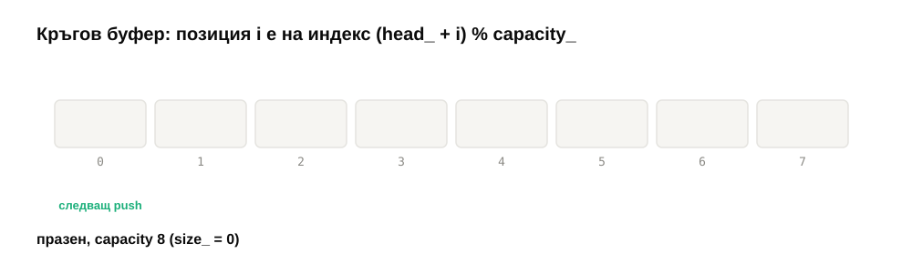
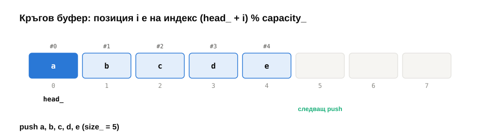
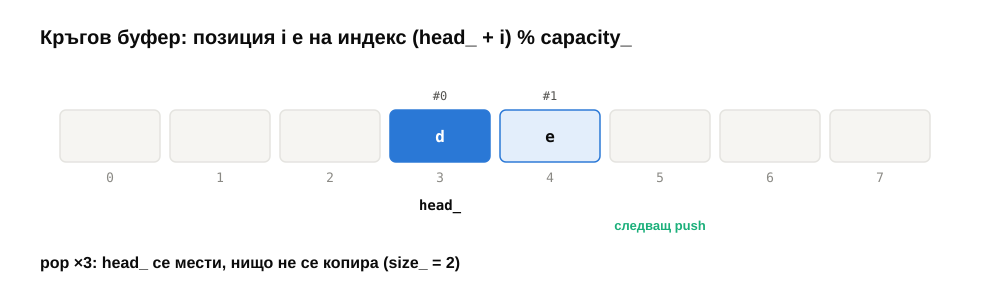
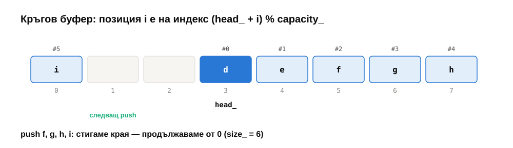
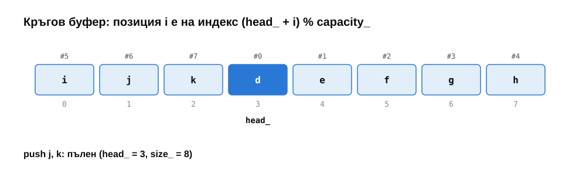

</details>

- `push`: пишем на индекс $(\text{head} + \text{size}) \bmod \text{capacity}$, `++size`.
- `pop`: `head = (head + 1) mod capacity`, `--size`. **Нищо не се мести.**
- Пълен буфер → нов масив с двоен капацитет, в който копираме елементите **в логически ред** от индекс 0 („разгъване“); `head = 0`.

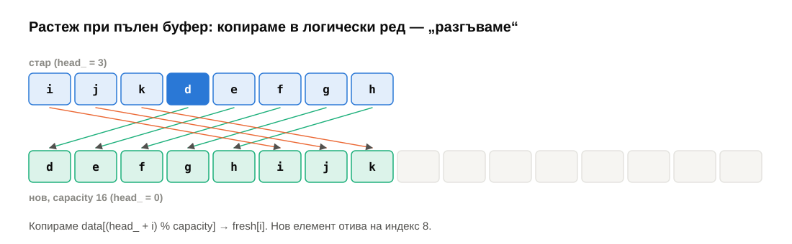

**Пълен или празен?** Ако пазим само `head` и `tail` (без `size`), при `head == tail` не знаем дали буферът е празен или пълен. Две решения: брояч `size_` (както при нас) или винаги едно празно място („пълен“ = `size == capacity − 1`).

**Модулът е скъп.** Целочисленото деление (`%`) струва десетки такта. Ако капацитетът е степен на двойката (а при удвояване от 1 винаги е), $x \bmod 2^k$ = `x & (2^k − 1)` — една инструкция. На примерната машина тази единствена промяна прави кръговия буфер **6 пъти** по-бърз (вижте §7). Връзка със седмица 02: константите, които асимптотиката крие, понякога са в една-единствена операция.

### 3.4. Опашка от два стека

`push` слага в стека `in`. `pop` и `front` вземат от стека `out`; ако `out` е празен, първо **преместват всичко** от `in` в `out` — а това обръща реда, така че най-старият елемент излиза на върха.

<details>
<summary>Опашка от два стека стъпка по стъпка</summary>

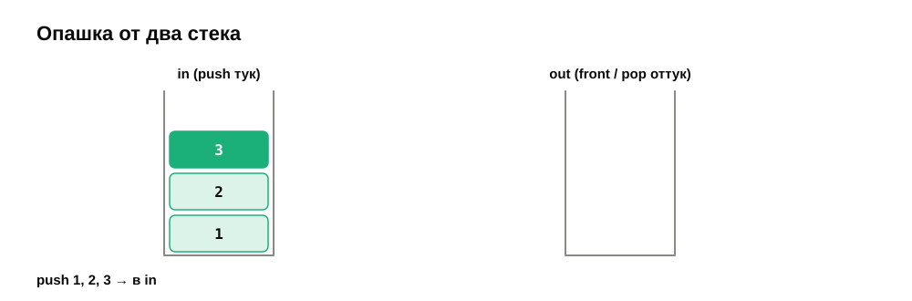
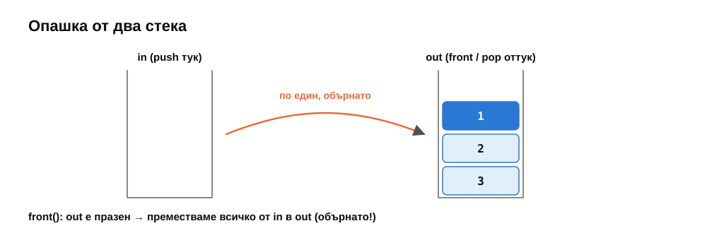
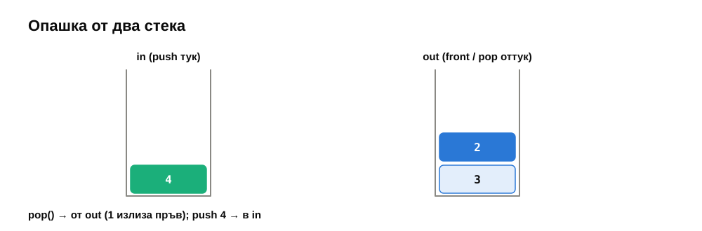
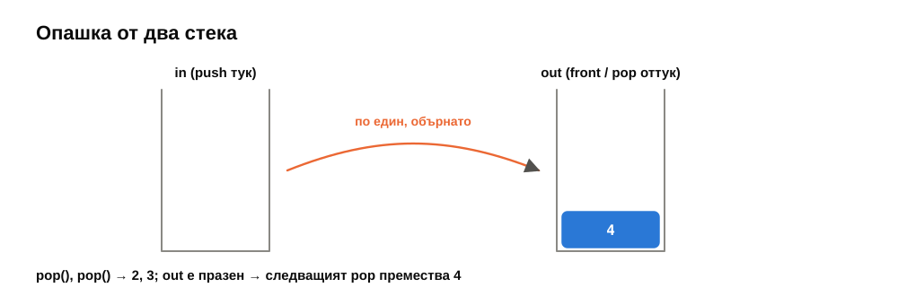

</details>

Едно `pop` може да струва $\Theta(n)$. Но всеки елемент се мести от `in` в `out` **най-много веднъж** за живота си (влиза в `in`, отива в `out`, излиза). Значи $n$ операции струват $\Theta(n)$ общо — **амортизирано $\Theta(1)$** (седмица 04, агрегатен метод). Тестът проверява точно това: броят прехвърляния никога не надминава броя `push`.

Защо някой би го правил? В **чисто функционални** езици (Haskell, OCaml) няма промяна на масив на място, но стекът е естествен (свързан списък). Двата стека са стандартната опашка там.

---

## 4. Дек

**Дек** (deque, double-ended queue) позволява добавяне и премахване и в **двата** края за $\Theta(1)$. Стекът и опашката са дек с ограничен интерфейс.

`std::deque` не е нито масив, нито списък: пази **масив от указатели към блокове** с фиксиран размер (в libstdc++ — 512 байта на блок). Нов елемент отпред или отзад отива в първия/последния блок; ако той е пълен — заделя се нов блок. Резултатът:

- `push_front`, `push_back`, `pop_front`, `pop_back` — $\Theta(1)$;
- достъп по индекс `d[i]` — $\Theta(1)$ (кой блок, коя позиция в него — две деления);
- вмъкване в края **не** инвалидира референциите към елементите (те не се местят), но инвалидира итераторите;
- една алокация на ~128 `int`-а вместо по една на елемент — затова е десетки пъти по-бърз от списък (седмица 05, §6).

---

## 5. Адаптери в стандартната библиотека

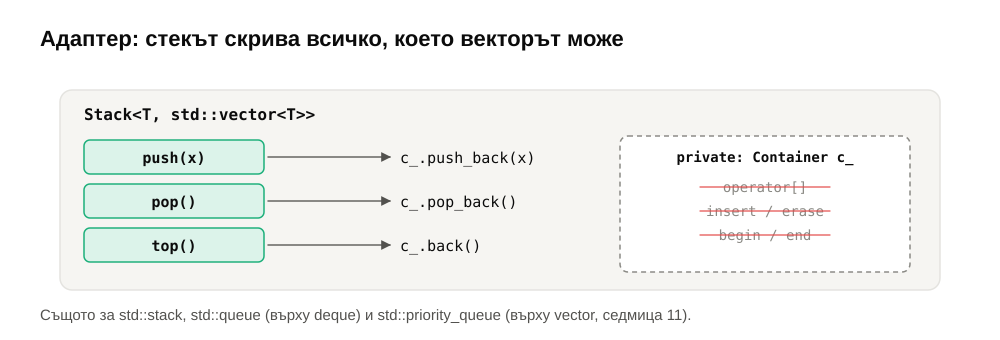

**Адаптер на контейнер** е клас, който обвива друг контейнер и показва само подмножество от операциите му. Самият той не съхранява нищо:

```cpp
template <typename T, typename Container = std::vector<T>>
class Stack {
    Container c_;                         // private: никой не стига до него
public:
    void push(const T& x) { c_.push_back(x); }
    void pop()            { c_.pop_back(); }
    T& top()              { return c_.back(); }
};
```

| Адаптер | Изисква от контейнера | По подразбиране върху | Може и върху |
|---|---|---|---|
| `std::stack` | `push_back`, `pop_back`, `back` | `std::deque` | `vector`, `list` |
| `std::queue` | `push_back`, `pop_front`, `front`, `back` | `std::deque` | `list` (не `vector` — няма `pop_front`) |
| `std::priority_queue` | произволен достъп + `push_back`, `pop_back` | `std::vector` | `deque` (седмица 11) |

Това е шаблонът **Adapter**: превръщаме интерфейса на вектор в интерфейса на стек. Вторият шаблонен параметър позволява да изберем реализацията, без да променяме кода, който ползва стека.

> [!IMPORTANT]
> **Защо `std::stack::pop()` връща `void`?** Изглежда по-удобно `T pop()` — махни и върни върха. Но върнатата стойност се **копира** при връщане. Ако копирането хвърли изключение, елементът вече е махнат от стека и е изгубен завинаги — няма как да се даде силна гаранция. Затова STL разделя „погледни“ (`top()`, връща референция, не копира) от „махни“ (`pop()`, не връща нищо). Анализът е на Tom Cargill (1994) и е класически пример за дизайн, воден от безопасността при изключения.

---

## 6. Класически приложения

### 6.1. Проверка на скоби

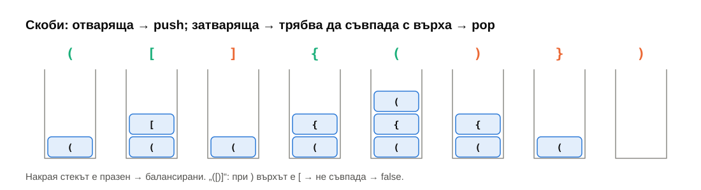

Отваряща скоба → `push`. Затваряща → върхът трябва да е съответната отваряща (иначе — небалансирано); `pop`. Накрая стекът трябва да е празен. $\Theta(n)$ време, $\Theta(n)$ памет в най-лошия случай. Така компилаторите и редакторите намират „несъответстваща скоба“. Следващата седмица същата идея пресмята аритметични изрази (Shunting-yard).

### 6.2. Стек с минимум

Как `min()` да е $\Theta(1)$, когато `pop()` може да махне точно минимума? Пазим **втори** стек, който на всяка височина помни минимума на всичко под и на нея. `push(x)` слага `min(x, текущ минимум)`; `pop()` маха и от двата. $\Theta(1)$ за всичко, на цената на двойна памет.

### 6.3. Монотонен дек: максимум в плъзгащ се прозорец

За всеки прозорец от $k$ поредни елемента — неговият максимум. Наивно: $\Theta(n \cdot k)$. С дек от **индекси**, чиито стойности намаляват от началото към края:

- Нов елемент $a_i$ маха от **края** на дека всички по-малки (те никога вече няма да са максимум — $a_i$ е по-голям и ще остане в прозореца по-дълго).
- Началото на дека излиза, когато се плъзне извън прозореца.
- Максимумът на прозореца е винаги **началото** на дека.

Всеки индекс влиза и излиза най-много веднъж: $\Theta(n)$ общо. Задача 5.

---

## 7. Колко струва всяка опашка

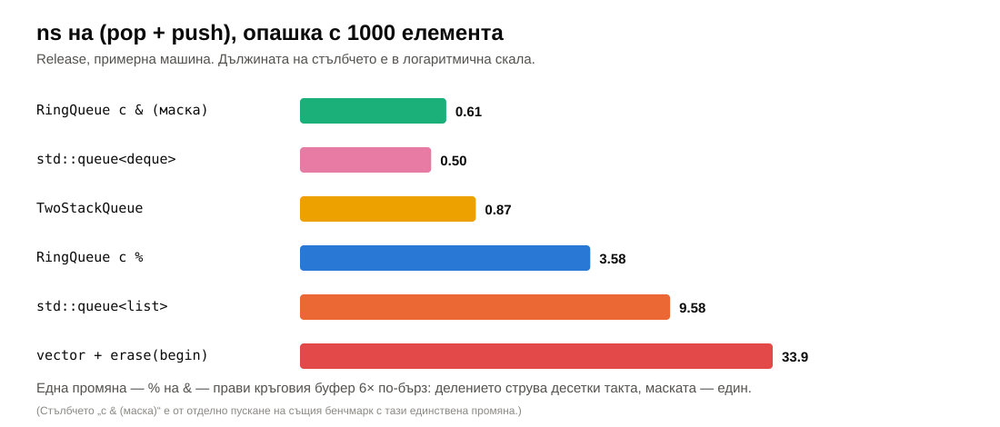

Бенчмаркът поддържа опашка с $n$ елемента и прави 2 милиона двойки `pop` + `push`.

- `std::deque` и кръговият буфер с маска — ~0.5–0.6 ns: последователна памет, нищо не се мести.
- Кръговият буфер с `%` — ~3.6 ns: същият алгоритъм, но едно деление на всяка операция.
- Двата стека — ~0.9 ns: амортизирано $\Theta(1)$, но всеки елемент се копира още веднъж.
- `std::queue` върху `std::list` — ~10 ns: една алокация и едно освобождаване на всяка операция.
- Вектор с `erase(begin())` — 34 ns при 1000 елемента и 3.5 **µs** при 100 000: $\Theta(n)$ на `pop`.

Всички без последния са $\Theta(1)$ — и все пак има разлика ~20× между тях. Асимптотиката избира алгоритъма; константите (алокации, деления, локалност) избират реализацията.

---

## 8. Обобщение

| Тема | Да запомните |
|---|---|
| Proxy | същият интерфейс, контролира достъпа: виртуален, защитен, отдалечен, умна референция |
| Прокси в C++ | `operator[]` връща прокси, когато референция е невъзможна (`BitRef`, `vector<bool>`); внимание с `auto` и с `operator=` |
| Proxy / Adapter / Decorator | контролира достъп / преобразува интерфейс / добавя поведение |
| Стек | LIFO; `push`, `pop`, `top` — $\Theta(1)$; върхът на масив е краят |
| Опашка | FIFO; никога `erase(begin())`; кръгов буфер, списък с `tail_`, два стека, `deque` |
| Кръгов буфер | индекс $(\text{head} + i) \bmod \text{cap}$; разгъване при растеж; маска вместо `%` при степен на 2 |
| Два стека | амортизирано $\Theta(1)$: всеки елемент се прехвърля най-много веднъж |
| Дек | блокове с фиксиран размер; $\Theta(1)$ в двата края и по индекс |
| Адаптери | `std::stack`, `std::queue`, `std::priority_queue` — обвиват контейнер; `pop()` връща `void` заради изключенията |
| Приложения | скоби, стек с минимум, монотонен дек, стекът на извикванията, BFS |

---

## 9. Речник

| Български | English |
|---|---|
| заместител, прокси | proxy |
| виртуален / защитен / отдалечен заместител | virtual / protection / remote proxy |
| умна референция | smart reference |
| адаптер | adapter (container adaptor) |
| декоратор | decorator |
| стек | stack |
| връх на стека | top |
| последен влязъл — пръв излязъл | LIFO |
| опашка | queue |
| пръв влязъл — пръв излязъл | FIFO |
| дек, двустранна опашка | deque (double-ended queue) |
| кръгов буфер | circular buffer, ring buffer |
| разгъване | unwrapping |
| стек на извикванията, кадър | call stack, stack frame |
| монотонен дек | monotonic deque |
| плъзгащ се прозорец | sliding window |

---

## 10. Литература

- E. Gamma и др. *Design Patterns*, 1994 — Proxy, Adapter, Decorator.
- D. Knuth. *The Art of Computer Programming*, том 1, §2.2.1–2.2.2 (стекове, опашки, декове, последователно разположение).
- T. Cargill. „Exception Handling: A False Sense of Security“, *C++ Report*, 1994 — защо `pop()` не връща стойност.
- H. Sutter. [„When Is a Container Not a Container?“](http://www.gotw.ca/publications/mill09.htm), *C++ Report*, 1999 — за `std::vector<bool>`.
- [cppreference — `std::stack`](https://en.cppreference.com/w/cpp/container/stack), [`std::queue`](https://en.cppreference.com/w/cpp/container/queue), [`std::deque`](https://en.cppreference.com/w/cpp/container/deque)
