<!-- .slide: class="title-slide" -->

<p class="kicker">СДП 2026/27 · Семинар 8 · 26 ноември</p>

# Shunting-yard, хеширане, хеш таблици

Два стека за всеки израз. Търсене за $\Theta(1)$ — средно.

<p class="small">Записки: <a href="notes.md">notes.md</a> · Задачи: <a href="exercises.md">exercises.md</a></p>

---

## План за днес

| Време | Какво правим |
|---|---|
| 10 мин | Загрявка: стек, опашка, Proxy |
| 15 мин | Преговор: RPN, хеш функции, вериги, пробване |
| 20 мин | На живо: Shunting-yard стъпка по стъпка, после в код |
| ☕ | почивка |
| 35 мин | Практика: изрази, хеш функции, хеш таблици |
| 10 мин | Разбор и какво следва |

---

## Загрявка

1. Защо опашка върху `vector` с `erase(begin())` е лоша идея? <span class="fragment answer">всеки <code>pop</code> е $\Theta(n)$</span>
2. Опашка от два стека — колко струва `pop`? <span class="fragment answer">$\Theta(1)$ амортизирано; всеки елемент се прехвърля най-много веднъж</span>
3. Защо `v[3] = v[5]` за `BitVector` изисква ръчен `operator=` в проксито? <span class="fragment answer">генерираният копира полетата на проксито, не бита</span>
4. Миналия път: как да пресметнем `3 + 4 * (2 - 1)` с един стек? <span class="fragment answer">→ днес: с два</span>

---

<!-- .slide: data-background-color="#e3eefb" -->

# Преговор

<p class="small">15 минути · записи на изрази, хеш функции, хеш таблици</p>

---

## Един израз, три записа

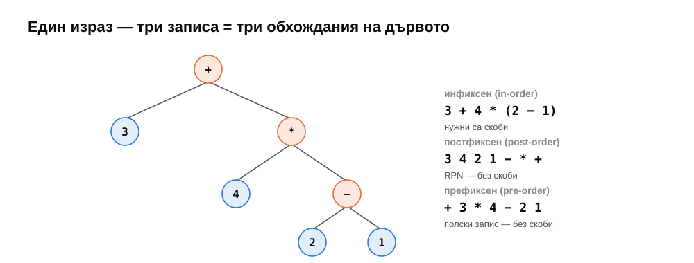

---

## Пресмятане на RPN: стек от числа

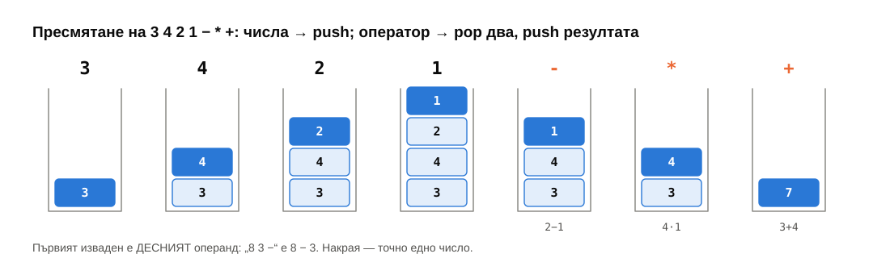

---

## Хеш функция → индекс

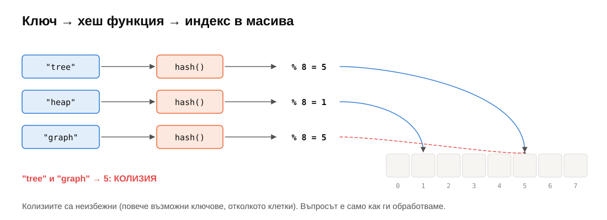

---

## Добра и лоша хеш функция

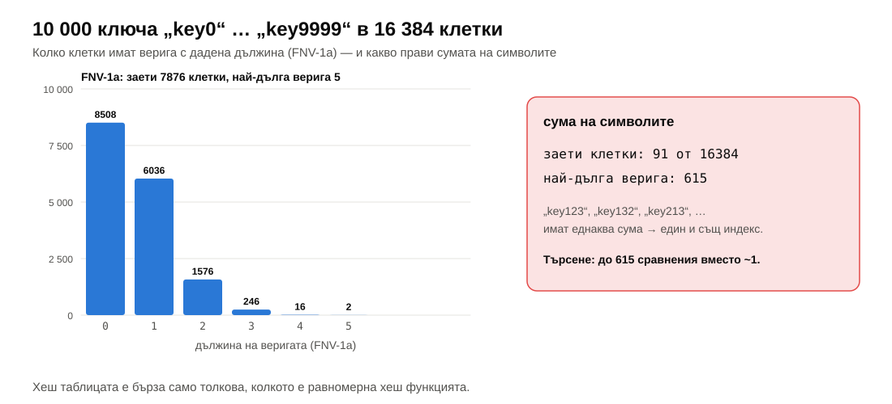

---

## Отделни вериги

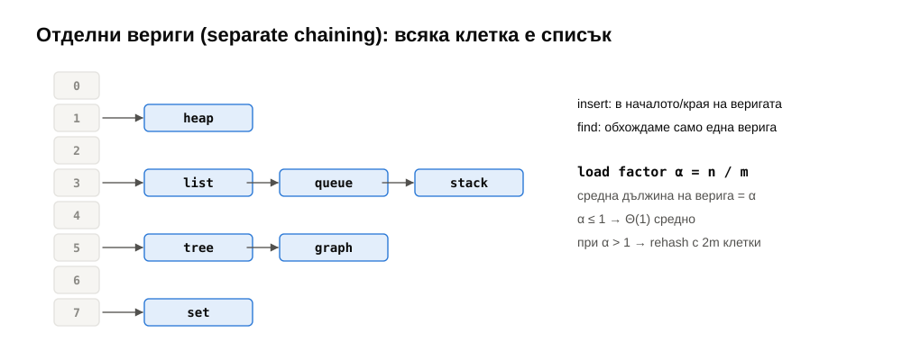

---

## Линейно пробване и надгробни камъни

<div class="r-stack">
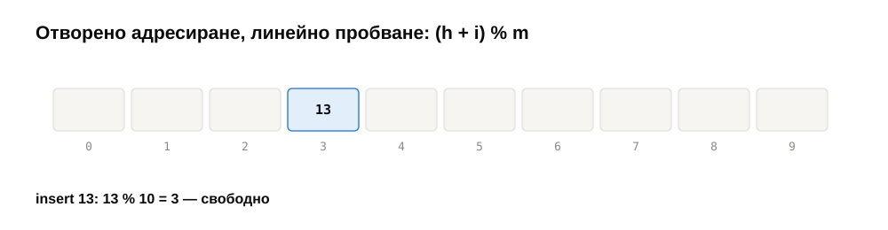
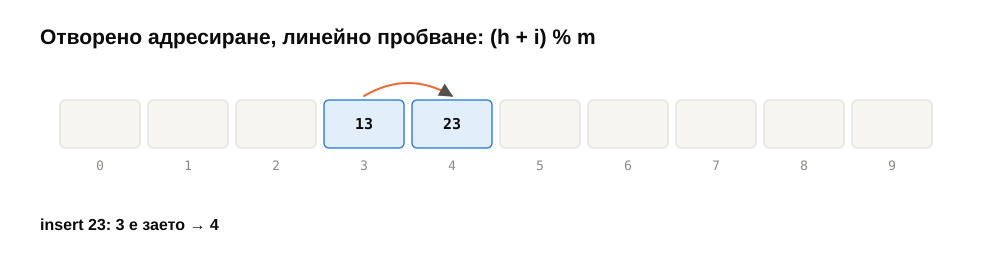
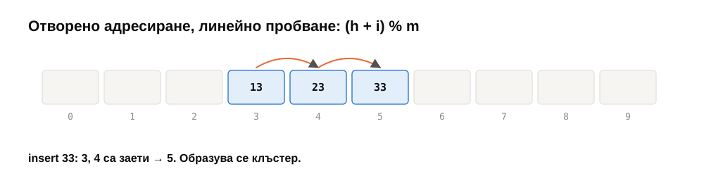
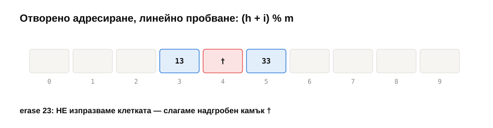
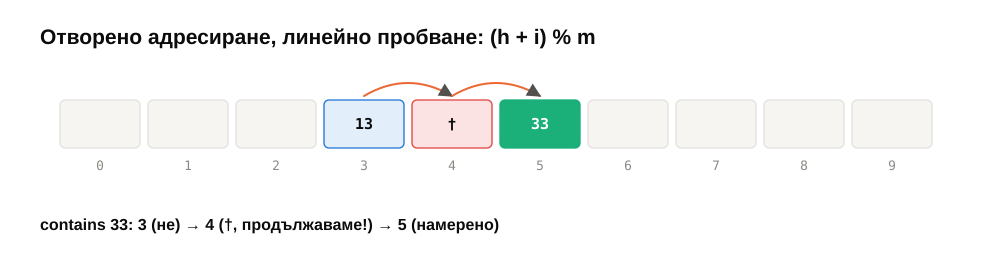
</div>

---

## Колко проби — и защо се преоразмерява рано

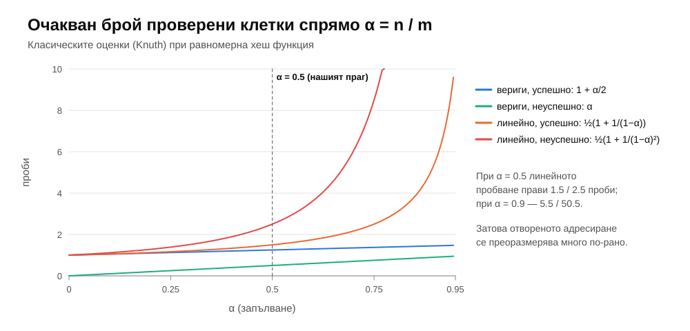

---

<!-- .slide: data-background-color="#dcf3ea" -->

# На живо: Shunting-yard

<p class="small">20 минути · първо на дъската, после в код</p>

---

## Правилата

| Символ | Действие |
|---|---|
| число | → изход |
| оператор `o` | изкарай от стека всички `t`, които са **по-силни**, или **равни и `o` е ляво-асоциативен**; после `push(o)` |
| `(` | `push` |
| `)` | изкарвай до `(`; махни `(` |
| край | изкарай всичко |

| `^` | `* /` | `+ -` |
|---|---|---|
| 3, дясна | 2, лява | 1, лява |

---

## `3 + 4 * (2 − 1)`

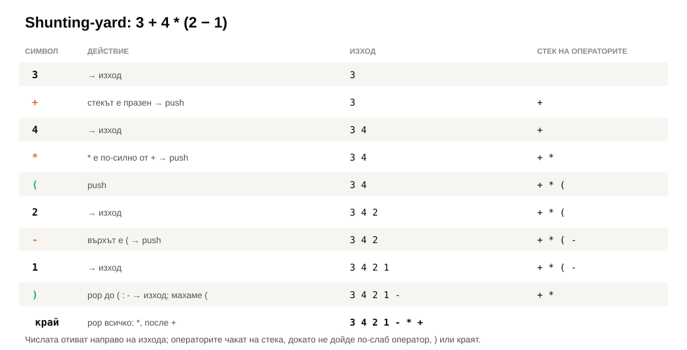

---

## Асоциативността в едно условие

```cpp
while (!ops.empty() && ops.top().kind == Operator &&
       (prec(ops.top().op) > prec(t.op) ||
        (prec(ops.top().op) == prec(t.op) && !rightAssociative(t.op)))) {
    output.push_back(ops.top());
    ops.pop();
}
ops.push(t);
```

<div class="cols fragment">
<div>

`8 − 3 − 2` → `8 3 − 2 −` = 3

</div>
<div>

`2 ^ 3 ^ 2` → `2 3 2 ^ ^` = 512

</div>
</div>

---

## Криптографски хеш функции — накратко

| | MD5 | SHA-1 | SHA-256 |
|---|---|---|---|
| размер | 128 бита | 160 бита | 256 бита |
| колизии | от 2004 г. | SHAttered, 2017 г. | няма известни |

<div class="box bad">

Пароли **никога** като `SHA-256(парола)` — твърде бързо за проверка на милиарди кандидати. Само bcrypt, scrypt, Argon2 + сол.

</div>

<p class="small">💡 Хеш DoS (2011): умишлено колидиращи ключове правят хеш таблицата на уеб сървър $\Theta(n)$ → SipHash с таен ключ (Python, Rust).</p>

---

<!-- .slide: data-background-color="#f6f5f2" -->

# ☕ Почивка

<p class="small"><code>git pull</code> · седмица 08 е в <code>weeks/08-shunting-yard-hashing</code></p>

---

<!-- .slide: data-background-color="#fde8df" -->

# Практика <span class="timer">35 мин</span>

<p class="small">По двойки. <a href="exercises.md">exercises.md</a> · <code>ctest --preset default -R "^w08/"</code></p>

---

## Задачи 1–3 — изрази

- **★ `evalRPN`** — стек от числа; грешки: `invalid_argument`, `domain_error`.
- **★★ `toRPN`** — Shunting-yard; тестовете: приоритет, лява и дясна асоциативност, скоби.
- **★ `evaluate`** — един ред; 500 случайни израза срещу независим парсер.

---

## Задачи 4–6 — хеширане

- **★ `polyHash`** (Хорнер) и **`fnv1a`** (публикувани контролни стойности).
- **★★ `ChainedHashMap`** — `insert`, `find`, `[]`, `erase`, `rehash` при $\alpha > 1$.
- **★★★ `ProbingHashSet`** — `Empty` / `Full` / `Deleted`; $\alpha \le 0.5$.

<div class="box warn">

`operator[]` вмъква → може да преоразмери → **указателят от преди е невалиден**. Потърсете наново.

</div>

---

## Задача 7 — бенчмарк

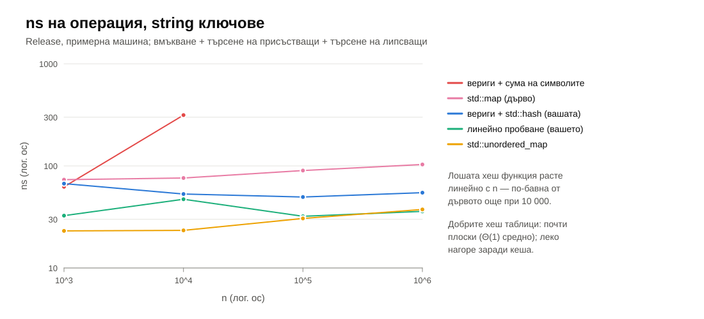

---

## Обобщение

- RPN: стек от числа. Shunting-yard: стек от оператори. Двете заедно — всеки израз за $\Theta(n)$.
- Хеш функция: детерминистична, бърза, **равномерна**. Колизиите са неизбежни.
- Вериги: $\alpha \le 1$, rehash ×2. Пробване: един масив, надгробни камъни, $\alpha \le 0.5$, локалност.
- $\Theta(1)$ **средно** — зависи от хеш функцията. Гаранция $\Theta(\log n)$ — само дървото.
- Криптографските хешове са за сигурност, не за хеш таблици. Пароли — Argon2.

---

## До следващия път

- Довършете задачи 1–5; 6–7 за любопитните.
- Прочетете [notes.md](notes.md).
- **Следващия четвъртък:** дървета — двоични и двоични наредени (BST).

<div class="box task">

**Изходен въпрос:** хеш таблицата намира ключ за $\Theta(1)$, но не може да отговори на „кой е най-малкият ключ, по-голям от 42?“. Каква структура би могла — и колко би струвало?

</div>
