<!-- .slide: class="title-slide" -->

<p class="kicker">СДП 2026/27 · Семинар 9 · 3 декември</p>

# Дървета I: двоични и двоични наредени дървета

Наляво или надясно — $\Theta(h)$. Колко е $h$ — това е въпросът.

<p class="small">Записки: <a href="notes.md">notes.md</a> · Задачи: <a href="exercises.md">exercises.md</a></p>

---

## План за днес

| Време | Какво правим |
|---|---|
| 10 мин | Загрявка: хеш таблици, Shunting-yard |
| 15 мин | Преговор: понятия, обхождания, BST, наредени заявки |
| 20 мин | На живо: BST за 50 реда — вмъкване, търсене, трите случая на изтриване |
| ☕ | почивка |
| 35 мин | Практика: рекурсия, обхождания, `isBST`, `BST<T>` с итератор |
| 10 мин | Разбор и какво следва |

---

## Загрявка

1. Защо отвореното адресиране не може да изтрие с `Empty`? <span class="fragment answer">търсене на ключ след него ще спре рано — затова надгробен камък</span>
2. `2 ^ 3 ^ 2` в RPN? <span class="fragment answer"><code>2 3 2 ^ ^</code> = 512 — дясна асоциативност</span>
3. Хеш таблица с 1 000 000 ключа: кой е най-малкият ключ > 42? <span class="fragment answer">$\Theta(n)$ — хеш таблицата не знае наредба</span>
4. Колко сравнения прави двоичното търсене в сортиран масив от $10^6$? А вмъкването? <span class="fragment answer">~20 сравнения; вмъкването мести $\Theta(n)$ елемента → днес: дърво</span>

---

<!-- .slide: data-background-color="#e3eefb" -->

# Преговор

<p class="small">15 минути · понятия, обхождания, BST</p>

---

## Понятия

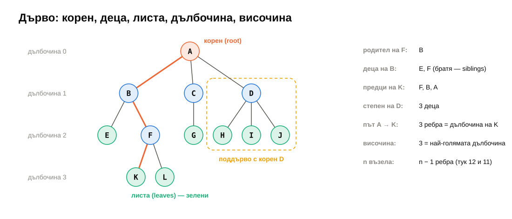

---

## Видове двоични дървета

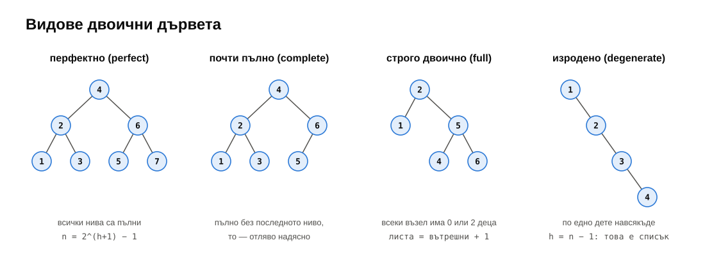

$\lfloor \log_2 n \rfloor \le h \le n - 1$ — при $n = 10^6$: между 19 и 999 999.
<!-- .element: class="small fragment" -->

---

## Представяне

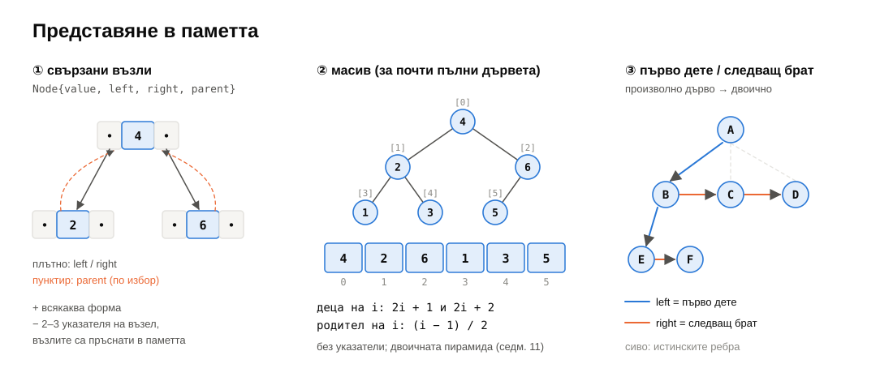

---

## Четири обхождания

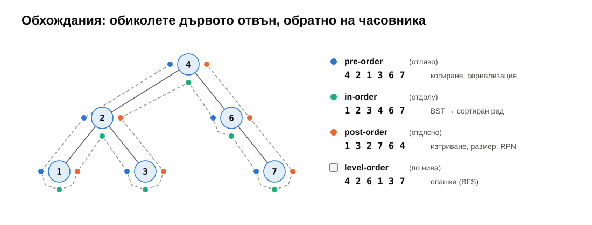

<p class="small fragment">Post-order на дървото на израза от миналия път: <code>3 4 2 1 − * +</code> — RPN.</p>

---

## Рекурсията има дъно

```cpp
int height(const Node<T>* t) {
    if (!t) return -1;
    return 1 + std::max(height(t->left), height(t->right));   // one frame per level
}
```

| Рекурсивен in-order, верига от | 200 000 | 400 000 | 1 000 000 |
|---|---|---|---|
| `-O0` (Debug) | ✓ | **SIGSEGV** | **SIGSEGV** |
| `-O2`, верига наляво | ✓ | ✓ | **SIGSEGV** |

<p class="small">Стек 8 MB (Linux, macOS), 1 MB (Windows). Изродено дърво → <strong>явен стек</strong> в динамичната памет.</p>

---

## BST: инвариантът — за цялото поддърво

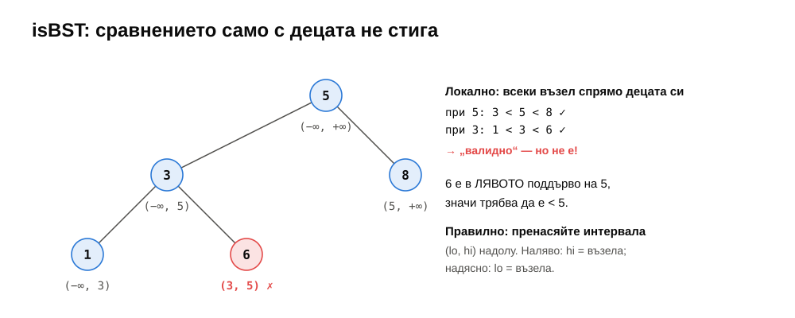

---

## Търсене: $\Theta(h)$

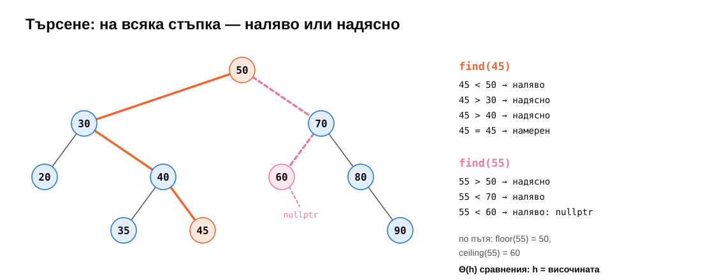

---

## Формата зависи от реда на вмъкване

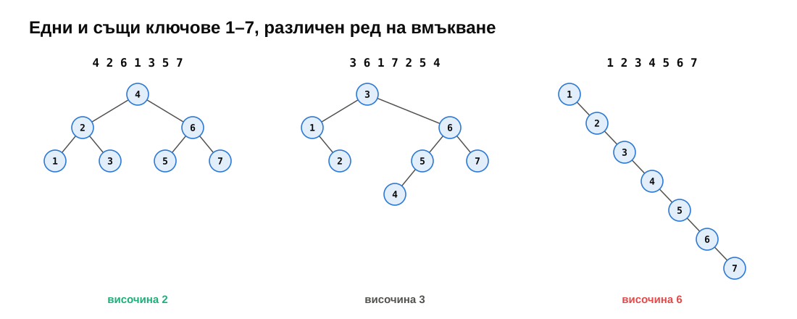

---

<!-- .slide: data-background-color="#dcf3ea" -->

# На живо: BST за 50 реда

<p class="small">20 минути · рекурсия и <code>Node*&amp;</code></p>

---

## `Node*&` — указателят, който сочи към поддървото

```cpp
void insert(Node*& t, int x) {
    if (!t) t = new Node{x};                  // t IS the parent's left/right (or root)
    else if (x < t->value) insert(t->left, x);
    else if (t->value < x) insert(t->right, x);
}
```

<div class="fragment">

```text
            90
        80
    70
        60
50              ← print(): корен вляво, дясното поддърво отгоре
            45
        40
            35
    30
        20
```

</div>

---

## Изтриване: три случая

<div class="r-stack">
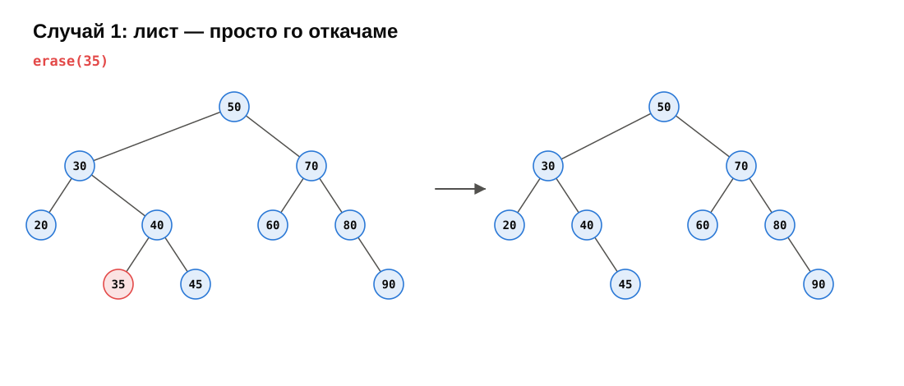
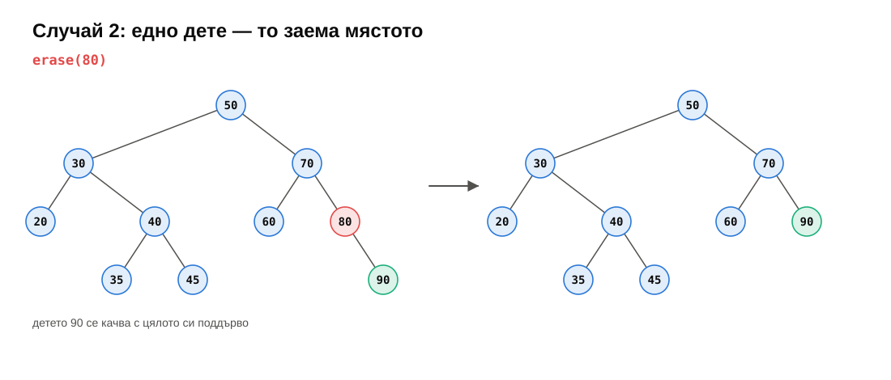
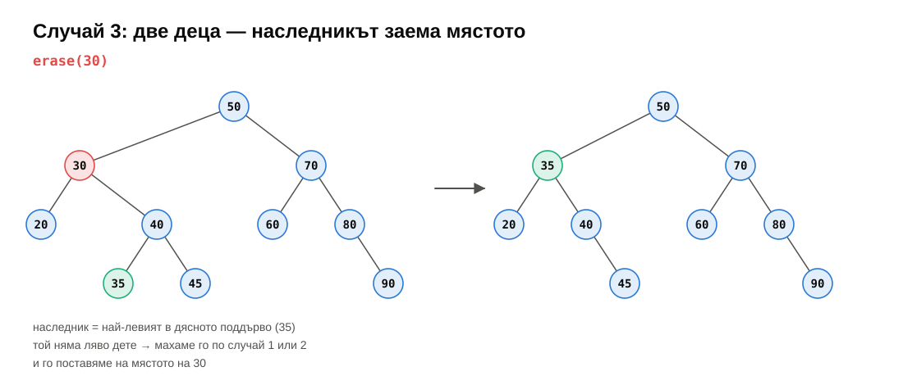
</div>

---

## Две деца: наследникът се мести

```cpp
Node* old = t;
if (!t->left) t = t->right;            // leaf or only a right child
else if (!t->right) t = t->left;       // only a left child
else {
    Node* s = extractMin(t->right);    // the successor: no left child
    s->left = t->left;
    s->right = t->right;
    t = s;                             // the NODE moves, not the value
}
delete old;
```

<p class="small fragment">Защо не просто <code>t->value = s->value</code>? Указателите и итераторите към ключа на <code>s</code> биха увиснали — <code>std::set</code> не го прави.</p>

---

## Следващият по големина: `++it`

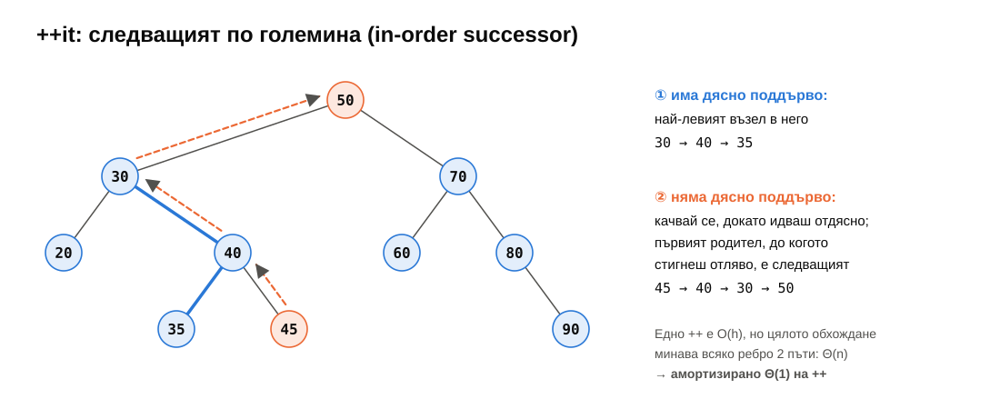

---

<!-- .slide: data-background-color="#f6f5f2" -->

# ☕ Почивка

<p class="small"><code>git pull</code> · седмица 09 е в <code>weeks/09-trees-1</code></p>

---

<!-- .slide: data-background-color="#fde8df" -->

# Практика <span class="timer">35 мин</span>

<p class="small">По двойки. <a href="exercises.md">exercises.md</a> · <code>ctest --preset default -R "^w09/"</code></p>

---

## Задачи 1–3 — `binary_tree.h`

- **★ рекурсия:** `size`, `height`, `countLeaves`, трите обхождания — по 2–4 реда.
- **★★ `levelOrder`** с опашка; **`inorderIterative`** със стек — тестът: верига от 1 000 000 нива.
- **★★ `isBST`** — интервалът $(lo, hi)$ надолу; **`buildBalanced`** — средният е коренът.

---

## Задачи 4–7 — `BST<T, Compare>`

- **★ `insert`, `contains`, `min`, `max`** — итеративно; `parent` на новия възел!
- **★★ `erase`** — `transplant(u, v)`; пренасочване, не копиране.
- **★★ `floor`, `ceiling`** — помнете най-добрия кандидат по пътя.
- **★★★ итератор** — `begin()` = най-левият, `++` = наследникът.

<div class="box warn">

`checkInvariants()` е `false`? Почти винаги — забравен `parent`. Всяко `x->left = y` иска и `y->parent = x`.

</div>

---

## Задача 8 — бенчмарк

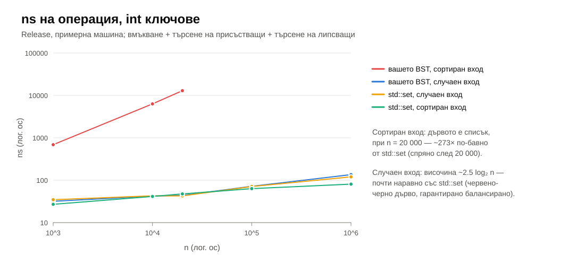

---

## Височина при случаен вход

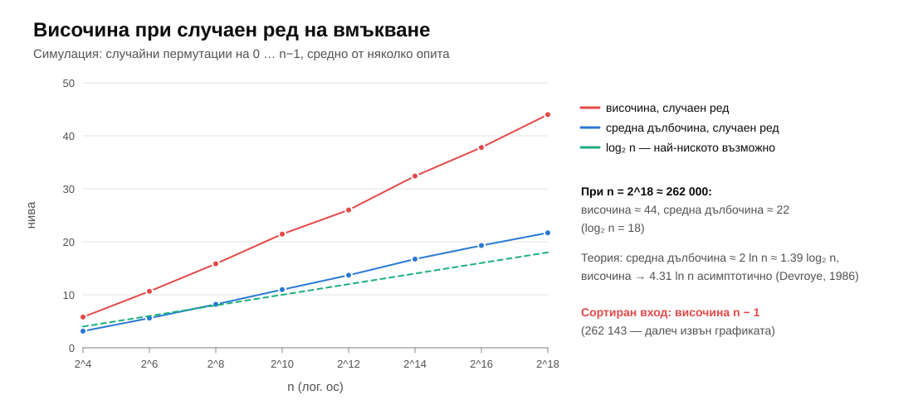

---

## Обобщение

- Дърво: $n$ възела, $n - 1$ ребра; височина — в ребра, празното е $-1$.
- Обхождания: pre (копиране), in (сортиран ред), post (освобождаване, RPN), level (опашка).
- Рекурсия дълбока колкото $h$; изродено дърво → явен стек.
- BST: **всички** вляво $<$ възела $<$ **всички** вдясно. Всичко е $\Theta(h)$.
- Изтриване: лист / едно дете / наследникът заема мястото.
- $h$ е между $\log_2 n$ и $n - 1$. Сортиран вход → свързан списък.

---

## До следващия път

- Довършете задачи 1–5; 6–8 за любопитните.
- Прочетете [notes.md](notes.md).
- **Следващия четвъртък:** балансирани дървета — ротации, AVL, червено-черни.

<div class="box task">

**Изходен въпрос:** вмъкнахте 1, 2, 3 в BST и получихте верига. Можете ли да „завъртите“ трите възела, така че 2 да стане корен — без да нарушите наредбата и само с няколко присвоявания на указатели?

</div>
