# Седмица 10 — Дървета II: балансирани дървета

> Семинар 10 · четвъртък, 10 декември 2026 · [слайдове](https://mishomish.github.io/fmi-kn-sdp-2026-2027-seminar/slides/?w=10-trees-2) · [задачи](exercises.md) · [starter код](starter/) · [тестове](tests/)

Миналата седмица: всяка операция на BST е $\Theta(h)$, а $h$ е между $\log_2 n$ и $n - 1$ — и сортираният вход, най-честият в практиката, дава $n - 1$. Тази седмица: как да **гарантираме** $h = \Theta(\log n)$ за всеки вход. Основният инструмент е **ротацията** — локална промяна на два указателя, която не разваля наредбата. Основната структура е **AVL дървото**; накрая — червено-черните дървета (`std::map`) и B-дърветата (базите данни).

Блоковете **💡 Любопитно** и **🔬 За напреднали** са извън задължителния материал.

## Съдържание

1. [Какво значи „балансирано“](#1-какво-значи-балансирано)
2. [Ротации](#2-ротации)
3. [AVL дървета: инвариантът](#3-avl-дървета-инвариантът)
4. [AVL: вмъкване](#4-avl-вмъкване)
5. [AVL: изтриване](#5-avl-изтриване)
6. [Разширени дървета: rank и select](#6-разширени-дървета-rank-и-select)
7. [Червено-черни дървета](#7-червено-черни-дървета)
8. [B-дървета](#8-b-дървета)
9. [Други подходи](#9-други-подходи)
10. [На практика](#10-на-практика)
11. [Обобщение](#11-обобщение) · [Речник](#12-речник) · [Литература](#13-литература)

---

## 1. Какво значи „балансирано“

Перфектно балансирано дърво (височина точно $\lfloor \log_2 n \rfloor$) не може да се поддържа евтино: едно вмъкване може да наложи да пренаредим почти цялото дърво. Затова „балансирано“ значи нещо по-слабо:

> Семейство дървета е **балансирано**, ако всяко дърво в него с $n$ възела има височина $O(\log n)$ — и след всяка операция можем да възстановим това за $O(\log n)$ време.

Има няколко начина да го постигнем:

| Подход | Инвариант | Пример |
|---|---|---|
| строг баланс по височина | поддърветата на всеки възел се различават с $\le 1$ | **AVL** (1962) |
| отпуснат баланс | най-дългият път $\le 2 \times$ най-краткия | **червено-черно** (1972/1978) — `std::map` |
| много ключове във възел | всички листа на една дълбочина | **2-3, 2-3-4, B-дървета** (1970) — бази данни |
| случайност | дървото изглежда като построено в случаен ред | **treap**, **skip list** |
| амортизация | без инвариант; всяка поредица от $m$ операции е $O(m \log n)$ | **splay дърво** |

Всички без B-дърветата възстановяват баланса с едно и също действие — ротация.

---

## 2. Ротации

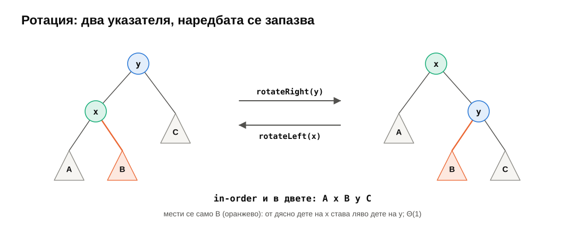

**Дясна ротация** около $y$: лявото дете $x$ се качва на мястото на $y$, $y$ става дясно дете на $x$, а дясното поддърво $B$ на $x$ става ляво поддърво на $y$. **Лявата** е огледалната — и обратната — операция.

```cpp
AvlNode<T>* rotateRight(AvlNode<T>* y) {
    AvlNode<T>* x = y->left;
    y->left = x->right;   // B moves from x to y
    x->right = y;
    update(y);            // y is below x now: first
    update(x);
    return x;             // the new root of this subtree
}
```

Три свойства:

1. **In-order не се променя**: $A\ x\ B\ y\ C$ и в двете. Значи BST инвариантът остава — няма как ротация да развали наредбата.
2. **$\Theta(1)$**: два указателя (плюс указателя от родителя, който сочи към върнатия корен).
3. **Височините се променят**: $A$ се качва с едно ниво, $C$ слиза с едно, $B$ остава. Ротацията „прехвърля“ височина от едната страна на другата.

Функцията **връща новия корен** на поддървото, а извикващият го закача: `n->left = rotateRight(n->left);` или `root_ = rotateRight(root_);`. Това е стилът на цялата седмица — всяка рекурсивна функция връща „как изглежда поддървото сега“.

Отговорът на изходния въпрос от миналата седмица: верига $1 \to 2 \to 3$ (всичко надясно) с **една лява ротация** около 1 става $2(1, 3)$.

---

## 3. AVL дървета: инвариантът

**AVL дърво** (Адельсон-Велски и Ландис, 1962): BST, в което за **всеки** възел височините на лявото и дясното поддърво се различават най-много с 1.

**Фактор на баланса** (balance factor): $bf(v) = h(v.\text{left}) - h(v.\text{right}) \in \{-1, 0, +1\}$.

Всеки възел пази височината си (и тази седмица — размера на поддървото си), за да не я преизчисляваме:

```cpp
template <typename T>
struct AvlNode {
    T value;
    AvlNode* left = nullptr;
    AvlNode* right = nullptr;
    int height = 0;          // leaf: 0; nullptr counts as -1
    std::size_t size = 1;    // nodes in this subtree (Section 6)
};

void update(AvlNode<T>* n) {  // from the children's (correct) fields
    n->height = 1 + std::max(heightOf(n->left), heightOf(n->right));
    n->size = 1 + sizeOf(n->left) + sizeOf(n->right);
}
```

### 3.1. Защо височината е логаритмична

Кое е **най-тънкото** AVL дърво с височина $h$ — с най-малко възли $N(h)$? Коренът, едно поддърво с височина $h - 1$ и — за да има възможно най-малко възли — другото с височина $h - 2$. И двете на свой ред са най-тънки:

$$N(h) = N(h - 1) + N(h - 2) + 1, \qquad N(0) = 1,\; N(1) = 2.$$

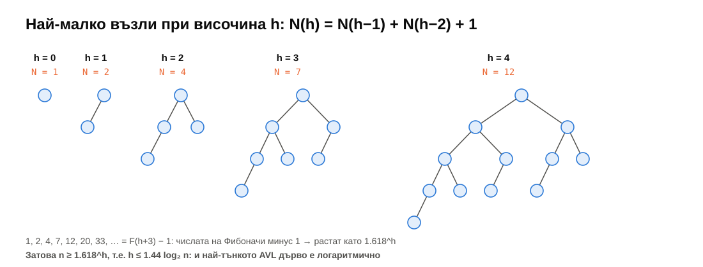

$1, 2, 4, 7, 12, 20, 33, \dots$ — това са числата на Фибоначи минус 1: $N(h) = F_{h+3} - 1$. Числата на Фибоначи растат като $\varphi^h$, където $\varphi = \frac{1 + \sqrt 5}{2} \approx 1.618$. Значи всяко AVL дърво с височина $h$ има поне $\approx \varphi^h$ възела, и обратно:

$$h < \log_\varphi n \approx 1.44 \log_2 n \quad \text{(точно: } h < 1.4405 \log_2(n + 2) - 0.3277\text{)}.$$

При милион ключа: $h \le 28$. На практика AVL дърветата са много по-близо до перфектните — при случаен вход тестовете и бенчмаркът дават 23 при $\log_2 n \approx 20$.

> [!TIP]
> **💡 Любопитно.** Георгий Адельсон-Велски и Евгений Ландис публикуват идеята през 1962 г. в кратка статия от 4 страници („Един алгоритъм за организация на информация“, *Доклады АН СССР*). Адельсон-Велски е и един от авторите на шахматната програма „Каиса“, световен шампион по компютърен шах през 1974 г.

---

## 4. AVL: вмъкване

Вмъкваме като в обикновено BST. Новият лист увеличава височините само **по пътя си до корена** — и само там може да се наруши балансът. Затова **на връщане от рекурсията** проверяваме всеки възел по пътя:

```cpp
Node* insertAt(Node* n, const T& x, bool& inserted) {
    if (!n) { inserted = true; return new Node(x); }
    if (x < n->value) n->left = insertAt(n->left, x, inserted);
    else if (n->value < x) n->right = insertAt(n->right, x, inserted);
    else return n;                 // already there
    return rebalance(n);           // the only new line compared to last week
}
```

### 4.1. Четирите случая

`rebalance(n)` обновява `n`; ако $bf(n) = \pm 2$, едната страна е с 2 по-висока. Кой случай е, зависи от **коя страна на по-високото дете** е височината:

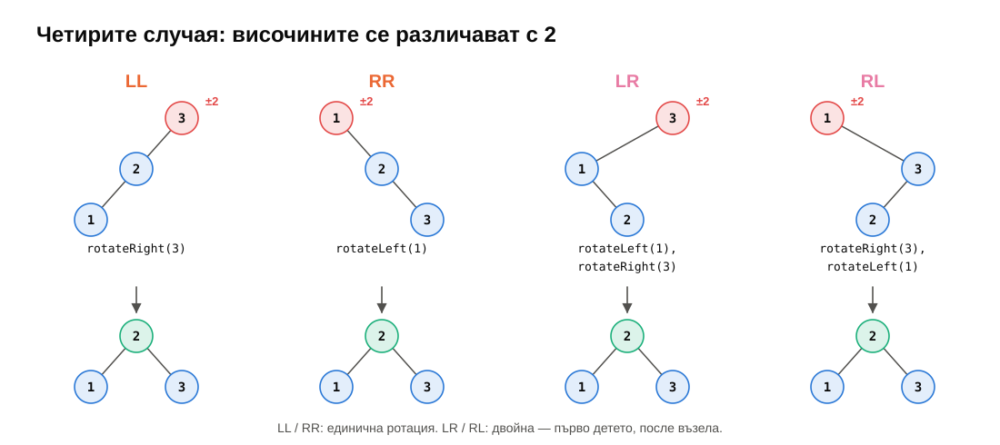

| Случай | Условие | Поправка |
|---|---|---|
| **LL** | $bf(n) = +2$, $bf(n.\text{left}) \ge 0$ | `rotateRight(n)` |
| **RR** | $bf(n) = -2$, $bf(n.\text{right}) \le 0$ | `rotateLeft(n)` |
| **LR** | $bf(n) = +2$, $bf(n.\text{left}) < 0$ | `n->left = rotateLeft(n->left)`, после `rotateRight(n)` |
| **RL** | $bf(n) = -2$, $bf(n.\text{right}) > 0$ | `n->right = rotateRight(n->right)`, после `rotateLeft(n)` |

```cpp
Node* rebalance(Node* n) {
    update(n);
    if (balanceFactor(n) > 1) {
        if (balanceFactor(n->left) < 0) n->left = rotateLeft(n->left);    // LR -> LL
        return rotateRight(n);
    }
    if (balanceFactor(n) < -1) {
        if (balanceFactor(n->right) > 0) n->right = rotateRight(n->right); // RL -> RR
        return rotateLeft(n);
    }
    return n;
}
```

### 4.2. Защо двойна ротация

При LR височината е в **средата** — в дясното поддърво $y$ на лявото дете $x$. Единична дясна ротация около $z$ би преместила $y$ под $z$ — пак твърде високо, само от другата страна. Първата ротация (лява около $x$) изнася $y$ навън и превръща случая в LL; втората го решава:

<div align="center">

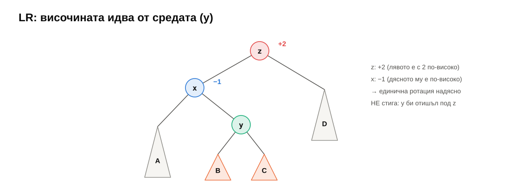

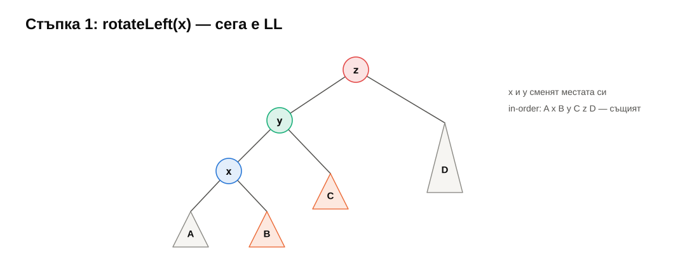

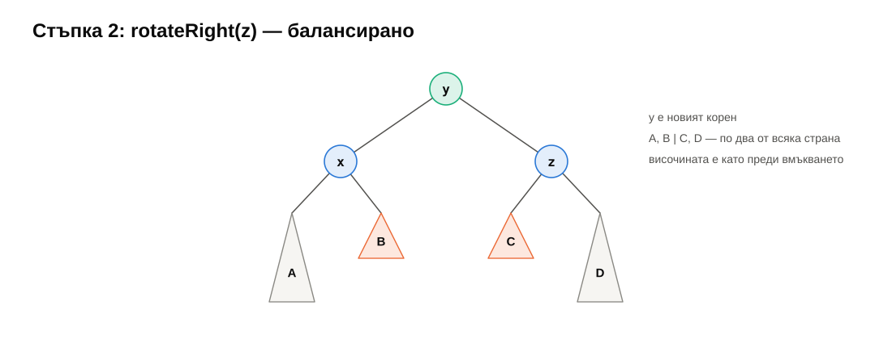

</div>

Резултатът: $y$ е корен, $A, B$ — под $x$, $C, D$ — под $z$. Наредбата $A\,x\,B\,y\,C\,z\,D$ е запазена.

### 4.3. Колко ротации

След ротацията поддървото има **същата височина като преди вмъкването**. Значи предците над него не разбират, че нещо се е случило — балансът им е какъвто беше. **Вмъкването прави най-много една (единична или двойна) ротация.** (`rebalance` се вика на всяко ниво, но над точката на ротация само обновява полетата.)

Сортираният вход — най-лошият случай за BST — тук е безобиден:

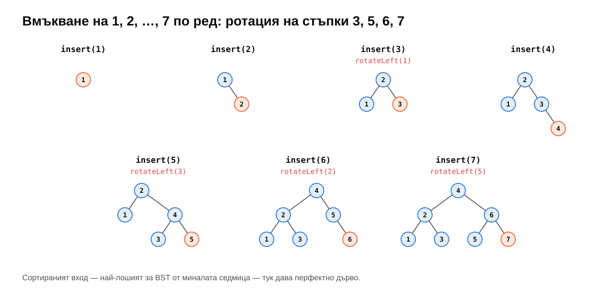

Всъщност при вмъкване на $1, 2, \dots, 2^k - 1$ по ред AVL дървото е **перфектно** (тестът `sorted input gives perfect trees` го проверява за $2^{15} - 1$).

---

## 5. AVL: изтриване

Трите случая от седмица 09 (лист, едно дете, две деца — наследникът заема мястото), а после `rebalance` на всеки възел по пътя нагоре. Тъй като нямаме `parent`, случаят с две деца ползва помощна функция, която **откача** най-малкия възел от поддърво — и балансира по пътя си:

```cpp
Node* extractMin(Node* n, Node*& minNode) {
    if (!n->left) { minNode = n; return n->right; }
    n->left = extractMin(n->left, minNode);
    return rebalance(n);
}

// in eraseAt, when n holds x and has two children:
Node* s = nullptr;
Node* right = extractMin(n->right, s);   // the successor, unlinked
s->left = n->left;
s->right = right;
delete n;
return rebalance(s);
```

Две разлики от вмъкването:

- **Може да има ротация на всяко ниво.** Ротацията след изтриване често **намалява** височината на поддървото — и тогава родителят може да се окаже небалансиран. В най-тънкото AVL дърво изтриването на един лист предизвиква ротации по целия път:

  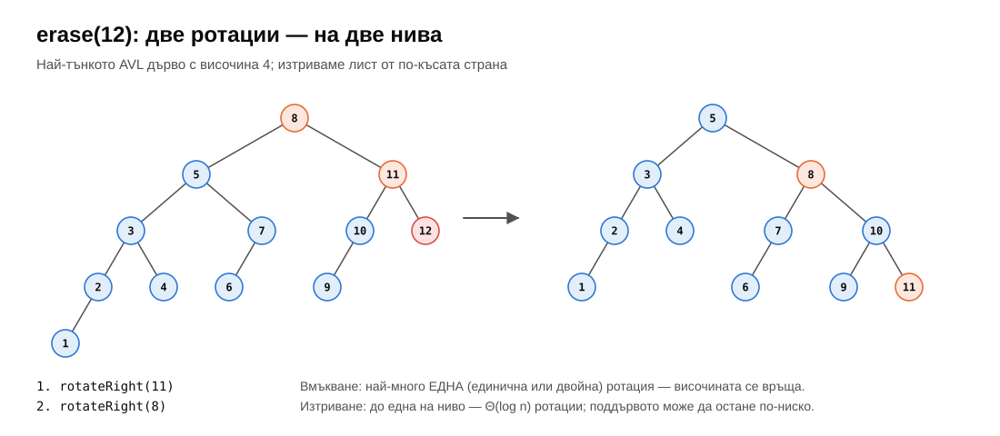

  Общо $O(\log n)$ ротации — пак $O(\log n)$ време.
- **Случаят $bf(\text{дете}) = 0$.** При вмъкване не се случва, при изтриване — да. Тогава **единична** ротация е правилната (затова в таблицата условието за LL е $\ge 0$, не $> 0$). Тестът `child balanced` в задача 2 е точно това.

---

## 6. Разширени дървета: rank и select

Полето `size` превръща дървото в **дърво на наредените статистики** (order statistic tree):

- `select(k)` — $k$-тият най-малък ключ (от 0): ако лявото поддърво има $L$ възела, при $k < L$ отиваме наляво, при $k = L$ сме намерили, иначе — надясно с $k - L - 1$;
- `rank(x)` — колко ключа са $< x$: слизаме като при търсене и при всяко „надясно“ добавяме $L + 1$;
- `countRange(lo, hi)` — $\text{rank}(hi) - \text{rank}(lo)$ (+1, ако $hi$ е в дървото).

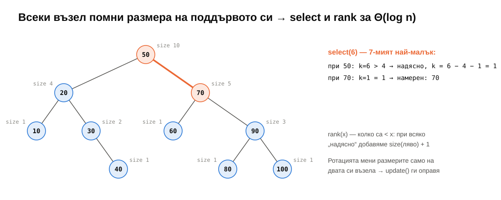

Всичко е $\Theta(h) = \Theta(\log n)$. Цената: `size` трябва да е верен **след всяка промяна** — но ротацията променя поддърветата само на двата си възела, и `update()` вече ги оправя. Хеш таблица не може нищо от това по-бързо от $\Theta(n)$; сортиран масив може `select` и `rank` за $\Theta(1)$ и $\Theta(\log n)$, но вмъкването е $\Theta(n)$.

Това е общ принцип: ако една стойност във възел зависи **само от децата му** (размер, сума, минимум, максимум на поддървото…), тя се поддържа през ротации безплатно. Така се строят интервални дървета, дървета на сегменти и много други.

> [!NOTE]
> **🔬 За напреднали.** GCC има нестандартно разширение `__gnu_pbds::tree<…, tree_order_statistics_node_update>` (`<ext/pb_ds/assoc_container.hpp>`) с `find_by_order(k)` и `order_of_key(x)` — точно `select` и `rank`. Популярно е в състезателното програмиране. В стандартната библиотека такова нещо няма: `std::distance(s.begin(), s.lower_bound(x))` е $\Theta(n)$.

---

## 7. Червено-черни дървета

`std::map` и `std::set` в libstdc++, libc++ и MSVC; `TreeMap` в Java; `SortedDictionary` в C#; планировчикът на процеси в Linux. Червено-черните дървета са най-разпространеното балансирано BST.

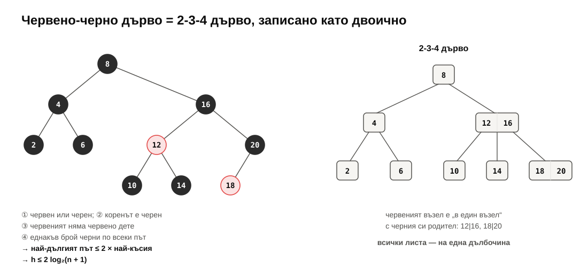

**Инвариантите:**

1. всеки възел е червен или черен;
2. коренът е черен;
3. червен възел няма червено дете;
4. всеки път от възел надолу до `nullptr` минава през **еднакъв брой черни** възли.

От (3) и (4): най-дългият път (черно, червено, черно, червено…) е най-много два пъти по-дълъг от най-краткия (само черни). Оттук $h \le 2 \log_2(n + 1)$ — по-слаба граница от $1.44 \log_2 n$ на AVL.

**Защо работят:** червено-черното дърво е **2-3-4 дърво**, записано като двоично. 2-3-4 дървото има възли с 1, 2 или 3 ключа и **всички листа на една дълбочина** — това е истинският баланс. Червеният възел е „в един възел“ с черния си родител (вдясно на фигурата: 12|16 и 18|20). Инвариант (4) казва точно „всички листа на една дълбочина“ в 2-3-4 дървото.

Вмъкването и изтриването пребоядисват възли и правят ротации; правилата са повече от тези на AVL (около 4–6 случая, в зависимост от това как се броят), но:

| | AVL | червено-черно |
|---|---|---|
| височина | $\le 1.44 \log_2 n$ | $\le 2 \log_2 n$ |
| търсене | малко по-бързо (по-ниско) | малко по-бавно |
| ротации при вмъкване | $\le 1$ (единична или двойна) | $\le 2$ |
| ротации при изтриване | $O(\log n)$ | $\le 3$ |
| допълнително поле | височина (или $bf$ в 2 бита) | 1 бит цвят |

Червено-черните печелят, когато промените са чести — и затова са по подразбиране в стандартните библиотеки. Разликата в практиката е малка.

> [!TIP]
> **💡 Любопитно.** Rudolf Bayer описва структурата през 1972 г. като „симетрични двоични B-дървета“. Името „червено-черно“ идва от Leonidas Guibas и Robert Sedgewick (1978) — по разказа на Sedgewick, защото това са били цветовете, които са можели да печатат или рисуват най-добре. През 2008 г. Sedgewick публикува **ляво-наклонените червено-черни дървета** (LLRB) — вариант, при който вмъкването е около 10 реда код.

---

## 8. B-дървета

Всички двоични дървета дотук имат един проблем, който видяхме в седмица 02: всяко слизане надолу е **промах в кеша** — нов възел, някъде другаде в паметта. Двадесет нива = двадесет промаха. На диск е много по-лошо: всяко четене на блок е ~0.1 ms на SSD и ~10 ms на въртящ се диск.

**B-дърво** (Bayer и McCreight, 1970): във всеки възел има **много** ключове — колкото събира един блок (4–16 KB на диск, няколко кеш линии в паметта). Възел с $k$ ключа има $k + 1$ деца; ключовете в него са сортирани и разделят интервала на децата. **Всички листа са на една дълбочина.**

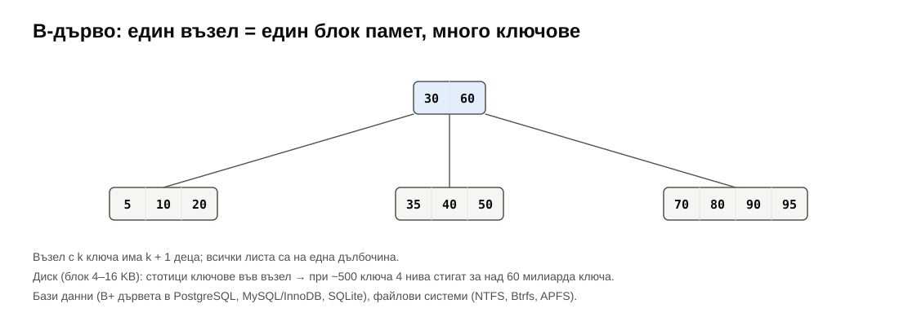

Височината е $\log_m n$ при $m$ ключа на възел. При $m \approx 500$: 3 нива → над 100 милиона ключа, 4 нива → над 60 милиарда. Коренът и първото ниво обикновено са в паметта — едно търсене е 1–2 четения от диска.

- **Бази данни**: индексите в PostgreSQL, MySQL (InnoDB), SQLite, Oracle са **B+ дървета** (данните са само в листата, а листата са свързани в списък — за бързи интервални заявки).
- **Файлови системи**: NTFS, Btrfs, APFS, XFS.
- **В паметта**: `absl::btree_map` на Google — същият интерфейс като `std::map`, но с по-малко памет и по-малко промахи в кеша. В Linux 6.1 червено-черното дърво за областите на виртуалната памет е заменено с **maple tree** — вариант на B-дърво — по същата причина.

2-3 дървото (Hopcroft, 1970) и 2-3-4 дървото са B-дървета с $m = 2$ и $m = 3$.

---

## 9. Други подходи

> [!NOTE]
> **🔬 За напреднали: без строг инвариант.**
> - **Treap** (Seidel, Aragon, 1989): всеки възел получава случаен **приоритет**; дървото е BST по ключ и пирамида (седмица 11) по приоритет. Формата е като на BST, построено в случаен ред, **независимо** от реда на вмъкване → очаквана височина $\Theta(\log n)$. Кратко за писане; поддържа split и merge.
> - **Skip list** (Pugh, 1990): не е дърво, а свързан списък с „експресни ленти“ — всеки елемент е и в следващото ниво с вероятност 1/2. Очаквано $\Theta(\log n)$. Ползва се в Redis (sorted sets) и в много конкурентни структури.
> - **Splay дърво** (Sleator, Tarjan, 1985): при всеки достъп ключът се изкачва до корена с ротации. Без никакъв инвариант, но всяка поредица от $m$ операции е $O(m \log n)$ — амортизирано (седмица 04). Често търсените ключове стоят близо до корена.
> - **Scapegoat дърво** (Galperin, Rivest, 1993): позволява дисбаланс, а когато поддърво стане твърде небалансирано, го построява наново перфектно (`buildBalanced` от седмица 09!). Амортизирано $O(\log n)$, без допълнителни полета във възлите.

---

## 10. На практика

### 10.1. Рекурсията отново е безопасна

Миналата седмица рекурсията на изродено дърво препълваше стека. При AVL дълбочината е $\le 1.44 \log_2 n$: 28 нива при милион ключа, 42 при милиард. Затова тази седмица всичко е рекурсивно — и деструкторът също.

### 10.2. Бенчмарк

Измерено (задача 6, release, примерна машина — AMD Ryzen 7 7800X3D):

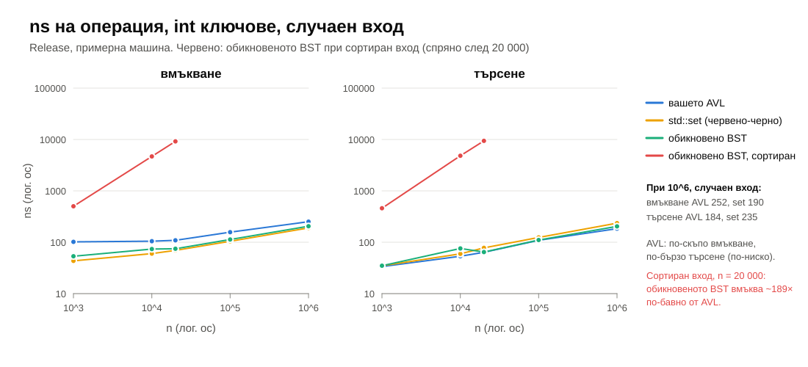

| $n = 10^6$, случаен вход | вмъкване | търсене | височина |
|---|---|---|---|
| вашето AVL | 252 ns | **184 ns** | 23 |
| `std::set` (червено-черно) | **190 ns** | 235 ns | — |
| обикновено BST | 205 ns | 203 ns | ~50 |

И при сортиран вход, $n = 20\,000$: обикновеното BST вмъква за 9 180 ns, AVL — за 49 ns (~**190×**).

Какво показват числата:

- **AVL търси най-бързо** — най-ниското дърво, най-малко промахи в кеша.
- **AVL вмъква най-бавно.** Нашето вмъкване е рекурсивно и вика `rebalance` (с `update`) на **всяко** ниво по пътя, дори когато нищо не се е променило. `std::set` е итеративно, спира рано и прави $\le 2$ ротации. Ако четете много повече, отколкото пишете — AVL; ако пишете много — червено-черно.
- **При случаен вход обикновеното BST не е лошо** — но балансираните дървета плащат малко, за да **гарантират**, че 190× никога не се случва.

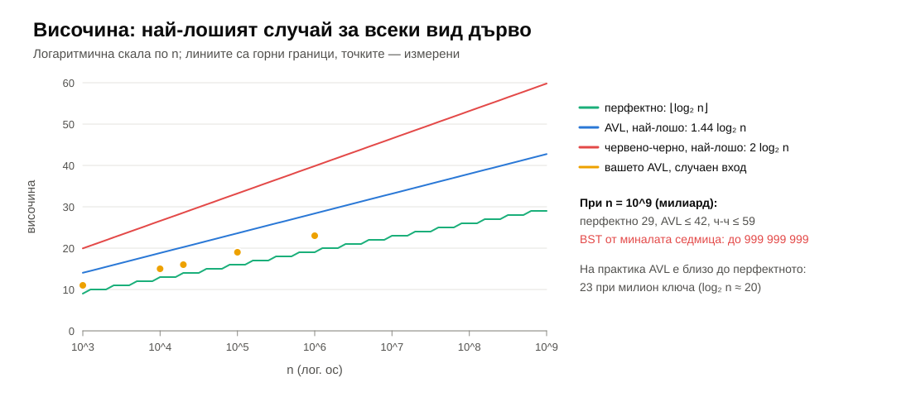

> [!TIP]
> **💡 Любопитно: една и съща идея, два пъти по-бързо.** Първата версия на бенчмарка пишеше търсенето в обикновеното BST като `n = x < n->value ? n->left : n->right;`, а в AVL — с `if`/`else if`. При $n = 1000$ обикновеното дърво търсеше за **~20 ns** срещу ~37–40 ns на AVL, въпреки че е по-високо. Причината (проверена в асемблерния код): тернарният оператор се компилира до `cmov` — условно копиране **без разклонение** — и процесорът никога не греши в предсказването. С `if`/`else` всяко ниво е разклонение, което при случайни ключове не може да се предскаже — процесорът греши в около половината случаи. Сега двете ползват един и същ цикъл (и двете търсят за ~35 ns). Поуката от седмица 02 отново: константите зависят от неща, които асимптотиката не вижда.

---

## 11. Обобщение

| Тема | Да запомните |
|---|---|
| Балансирано | височина $O(\log n)$ гарантирано, възстановима за $O(\log n)$ след всяка операция |
| Ротация | два указателя, $\Theta(1)$, in-order не се променя; връща новия корен |
| AVL инвариант | $\lvert h(\text{left}) - h(\text{right}) \rvert \le 1$ за всеки възел; възелът пази височината си |
| Граница | най-тънките AVL дървета са Фибоначи → $h < 1.44 \log_2 n$ |
| Вмъкване | BST вмъкване + `rebalance` на връщане; LL, RR — единична ротация; LR, RL — двойна; $\le 1$ ротация |
| Изтриване | три случая + `rebalance` на връщане; до $O(\log n)$ ротации; $bf(\text{дете}) = 0$ → единична |
| Разширяване | `size` в поддървото → `select`, `rank`, брой в интервал за $\Theta(\log n)$ |
| Червено-черно | 4 инварианта, $h \le 2 \log_2 n$; 2-3-4 дърво в двоичен вид; `std::map` |
| B-дърво | много ключове във възел, всички листа на една дълбочина; бази данни, файлови системи |

---

## 12. Речник

| Български | English |
|---|---|
| балансирано дърво | balanced (self-balancing) tree |
| ротация (лява / дясна) | (left / right) rotation |
| единична / двойна ротация | single / double rotation |
| фактор на баланса | balance factor |
| AVL дърво | AVL tree |
| дърво на Фибоначи | Fibonacci tree |
| разширено дърво | augmented tree |
| дърво на наредените статистики | order statistic tree |
| ранг / k-ти по големина | rank / select (k-th smallest) |
| червено-черно дърво | red-black tree |
| черна височина | black height |
| пребоядисване | recoloring |
| 2-3 / 2-3-4 дърво | 2-3 / 2-3-4 tree |
| B-дърво / B+ дърво | B-tree / B+ tree |
| блок (на диск) | block, page |
| приоритет (в treap) | priority |
| списък с прескачане | skip list |
| splay дърво | splay tree |

---

## 13. Литература

- T. Cormen и др. *Introduction to Algorithms* — гл. 13 „Red-Black Trees“, гл. 14 „Augmenting Data Structures“ (order statistic trees), гл. 18 „B-Trees“; задача 13-3 — AVL дървета.
- R. Sedgewick, K. Wayne. *Algorithms*, 4th ed. — §3.3 „Balanced Search Trees“ (2-3 дървета, ляво-наклонени червено-черни); [онлайн материали](https://algs4.cs.princeton.edu/33balanced/).
- D. Knuth. *The Art of Computer Programming*, том 3, §6.2.3 „Balanced Trees“ (AVL, границата $1.4405 \log_2(n+2) - 0.3277$), §6.2.4 „Multiway Trees“ (B-дървета).
- Г. М. Адельсон-Вельский, Е. М. Ландис. „Один алгоритм организации информации“, *Доклады АН СССР* 146(2), 1962.
- L. Guibas, R. Sedgewick. „A dichromatic framework for balanced trees“, FOCS 1978.
- R. Bayer, E. McCreight. „Organization and maintenance of large ordered indexes“, *Acta Informatica* 1, 1972.
- R. Sedgewick. [„Left-leaning Red-Black Trees“](https://www.cs.princeton.edu/~rs/talks/LLRB/LLRB.pdf), 2008.
- [VisuAlgo — AVL Tree](https://visualgo.net/en/bst) (изберете AVL) — анимации на ротациите.
