# Седмица 11 — Двоична пирамида. Сортиране I

> Семинар 11 · четвъртък, 17 декември 2026 · [слайдове](https://mishomish.github.io/fmi-kn-sdp-2026-2027-seminar/slides/?w=11-heap-sorting-1) · [задачи](exercises.md) · [starter код](starter/) · [тестове](tests/) · [визуализация: пирамида](https://mishomish.github.io/fmi-kn-sdp-2026-2027-seminar/widgets/heap.html) · [сортировки](https://mishomish.github.io/fmi-kn-sdp-2026-2027-seminar/widgets/sorting.html)

Две теми, свързани с една структура. **Двоичната пирамида** (binary heap) отговаря на изходния въпрос от миналия път: когато ви трябва само **най-големият** (или най-малкият) елемент — постоянно, докато добавяте нови, — не е нужно цяло балансирано дърво. Стига масив и едно по-слабо правило. После — **сортиране**: първо прости алгоритми ($\Theta(n^2)$), Shell sort между тях и бързите, и **heapsort**, който е просто пирамидата, приложена докрай. Втората част (merge sort, quicksort, сортиране без сравнения) е следващия път.

Блоковете **💡 Любопитно** и **🔬 За напреднали** са извън задължителния материал.

## Съдържание

1. [Опашка с приоритет](#1-опашка-с-приоритет)
2. [Двоична пирамида](#2-двоична-пирамида)
3. [push и pop](#3-push-и-pop)
4. [Построяване за Θ(n)](#4-построяване-за-θn)
5. [Приложения](#5-приложения)
6. [Сортиране: понятия](#6-сортиране-понятия)
7. [Selection sort](#7-selection-sort)
8. [Bubble sort и shaker sort](#8-bubble-sort-и-shaker-sort)
9. [Insertion sort](#9-insertion-sort)
10. [Shell sort](#10-shell-sort)
11. [Heapsort](#11-heapsort)
12. [Сравнение и бенчмарк](#12-сравнение-и-бенчмарк)
13. [Обобщение](#13-обобщение) · [Речник](#14-речник) · [Литература](#15-литература)

---

## 1. Опашка с приоритет

**Опашка с приоритет** (priority queue) е абстрактен тип с три операции:

- `push(x)` — добави елемент;
- `top()` — най-приоритетният (най-големият) елемент;
- `pop()` — махни го.

Без търсене по ключ, без обхождане в ред — само „кой е следващият“. Навсякъде е: планировчик на процеси (кой процес да тръгне), симулация на събития (кое събитие е най-рано), алгоритъмът на Дейкстра за най-кратък път (седмица 14), компресия на Huffman, „10-те най-…“ от поток данни.

| Реализация | `push` | `top` | `pop` |
|---|---|---|---|
| несортиран масив | $\Theta(1)$ | $\Theta(n)$ | $\Theta(n)$ |
| сортиран масив | $\Theta(n)$ | $\Theta(1)$ | $\Theta(1)$ (от края) |
| балансирано BST (седмица 10) | $\Theta(\log n)$ | $\Theta(\log n)$ | $\Theta(\log n)$ |
| **двоична пирамида** | $\Theta(\log n)$ | $\Theta(1)$ | $\Theta(\log n)$ |

Асимптотично пирамидата и AVL дървото са равни. Но пирамидата е **масив** — без указатели, без алокации на възел, без ротации; около 10 реда код. Цената: не може нищо друго (търсене, минимум и максимум едновременно, обхождане в ред).

---

## 2. Двоична пирамида

**Двоична пирамида** е:

1. **по форма** — почти пълно двоично дърво (седмица 09): всички нива са пълни, освен последното, което се пълни отляво надясно. Затова се записва в масив **без дупки** и височината е винаги $\lfloor \log_2 n \rfloor$;
2. **по наредба** — всеки родител е $\ge$ децата си (**max-heap**). Значи коренът `a[0]` е най-големият. (Или навсякъде $\le$ — **min-heap**.)

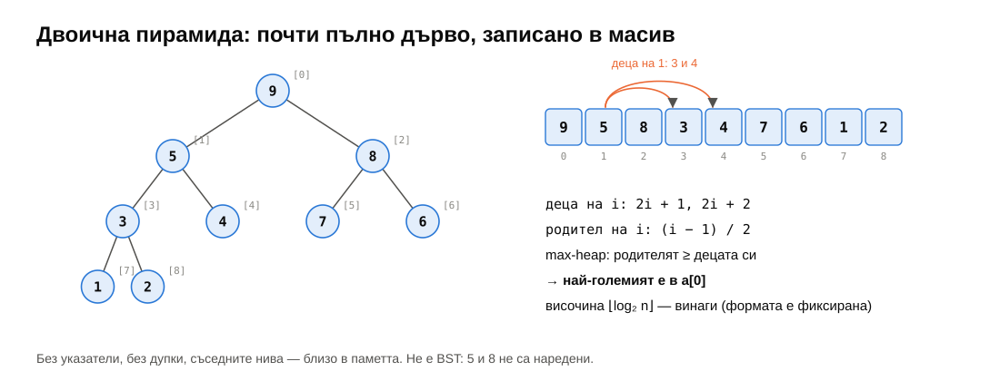

| | Индекс |
|---|---|
| деца на $i$ | $2i + 1$, $2i + 2$ |
| родител на $i$ | $\lfloor (i - 1)/2 \rfloor$ |

Пирамидата **не е** BST: между братя няма наредба (5 и 8 на фигурата). Правилото е само по вертикала — „родителят е по-голям“. Това е достатъчно, за да знаем максимума, и достатъчно слабо, за да се поправя евтино.

> [!TIP]
> **💡 Любопитно.** „Heap“ като структура от данни (Williams, 1964) и „heap“ като динамичната памет, от която `new` взима блокове, нямат нищо общо — съвпадение на имената. Някои ранни алокатори са ползвали пирамиди, но днешните — не.

---

## 3. push и pop

### 3.1. push: siftUp

Новият елемент отива на първото свободно място — края на масива (формата се запазва). После, докато е по-голям от родителя си, ги разменяме: **изплува нагоре** (sift up).

<div align="center">

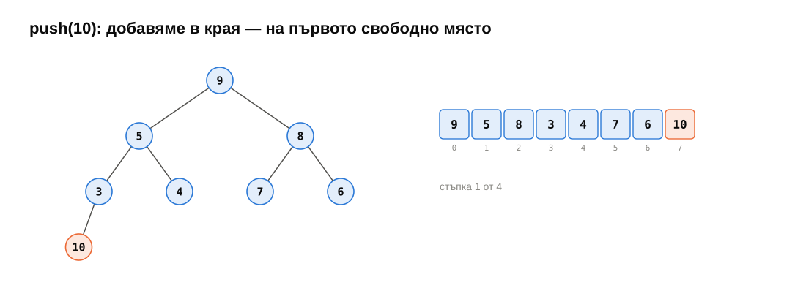

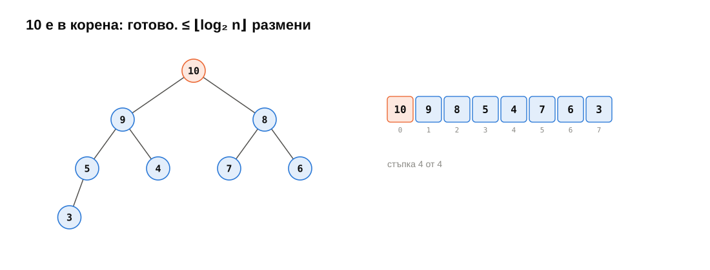

</div>

```cpp
template <typename RandomIt, typename Compare>
void siftUp(RandomIt first, std::size_t i, Compare comp) {
    while (i > 0) {
        const std::size_t parent = (i - 1) / 2;
        if (!comp(first[parent], first[i])) return;  // parent is not less: done
        std::iter_swap(first + parent, first + i);
        i = parent;
    }
}
```

Най-много $\lfloor \log_2 n \rfloor$ размени, по едно сравнение на ниво.

### 3.2. pop: siftDown

Махаме корена. Дупката запълваме с **последния** елемент (пак за да запазим формата) — той почти сигурно е малък. После, докато е по-малък от някое от децата си, го разменяме с **по-голямото** дете: **потъва надолу** (sift down).

<div align="center">

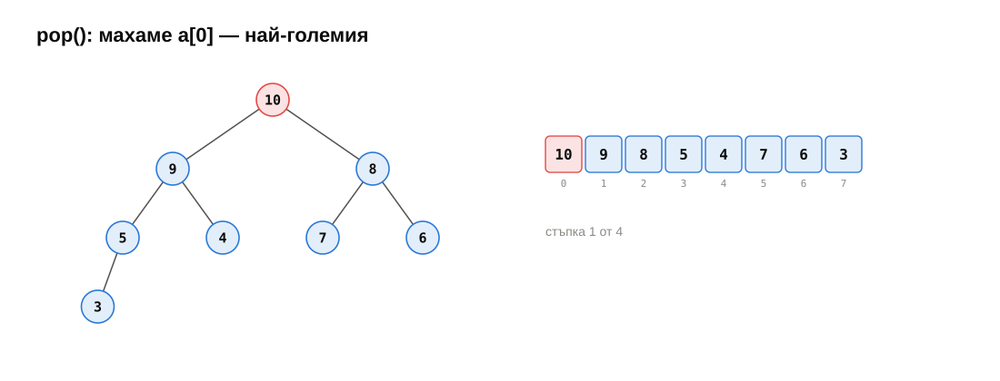

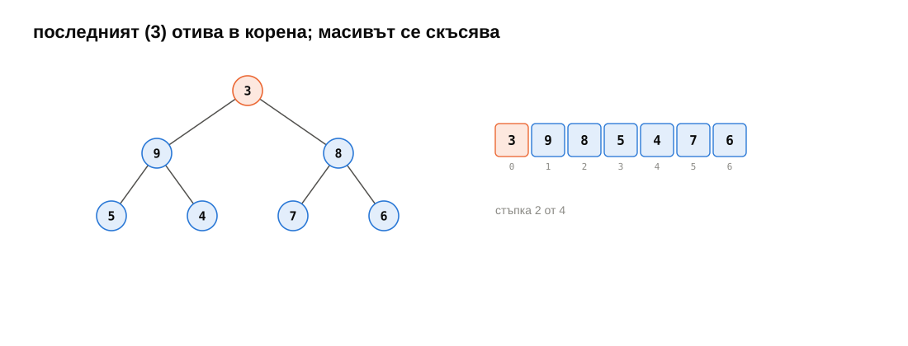

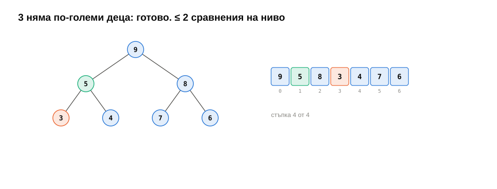

</div>

Защо с по-голямото дете? То става родител на другото — трябва да е $\ge$ него. Два сравнения на ниво (кое дете е по-голямо; по-голямо ли е от нас): $\le 2 \lfloor \log_2 n \rfloor$.

```cpp
template <typename RandomIt, typename Compare>
void siftDown(RandomIt first, std::size_t i, std::size_t n, Compare comp) {
    while (true) {
        const std::size_t left = 2 * i + 1;
        if (left >= n) return;                                  // a leaf
        std::size_t child = left;
        if (left + 1 < n && comp(first[left], first[left + 1])) child = left + 1;
        if (!comp(first[i], first[child])) return;
        std::iter_swap(first + i, first + child);
        i = child;
    }
}
```

И двете функции работят върху **произволен random-access диапазон** — `std::vector`, `std::deque`, обикновен масив — и с произволен `Compare`. Точно така са направени `std::push_heap` и `std::pop_heap` в `<algorithm>`.

### 3.3. В стандартната библиотека

```cpp
std::priority_queue<int> maxQ;                                       // top() = the greatest
std::priority_queue<int, std::vector<int>, std::greater<int>> minQ;  // top() = the smallest
```

Внимание: с `std::less` (по подразбиране) отгоре е **най-големият** — обратното на `std::sort`, където `std::less` значи „най-малкият отпред“. Логиката: `std::less` казва кой е „по-малък“, а пирамидата пази най-„големия“ отгоре. Със `std::greater` — обратно.

`std::priority_queue` няма `decrease-key` (промяна на приоритета на елемент, който е вътре) и няма обхождане. Ако трябват — `std::set` или собствена пирамида с индекси (седмица 14).

---

## 4. Построяване за Θ(n)

Как да направим пирамида от $n$ дадени елемента? Очевидно: $n$ пъти `push` — $\Theta(n \log n)$. Floyd (1964) прави по-добре:

> Листата (половината масив) вече са пирамиди от по един елемент. За всеки **вътрешен** възел, **отзад напред**, викаме `siftDown` — двете поддървета под него вече са пирамиди.

```cpp
for (std::size_t i = n / 2; i-- > 0;) siftDown(first, i, n, comp);
```

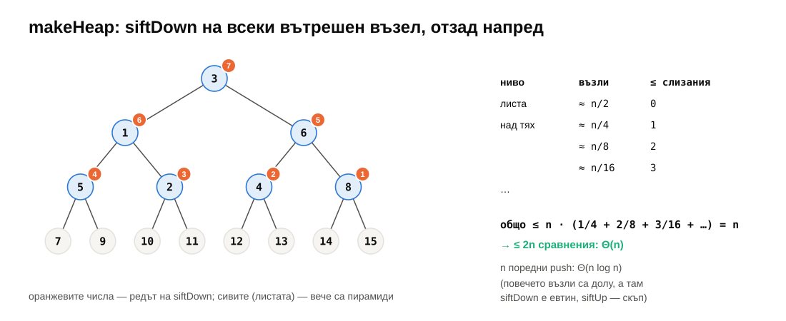

**Защо $\Theta(n)$:** `siftDown` от възел на височина $h$ струва $\le h$ стъпки. Около $n/4$ възела са на височина 1, $n/8$ — на 2, $n/16$ — на 3…

$$\sum_{h \ge 1} \frac{n}{2^{h+1}} \cdot h = n \sum_{h \ge 1} \frac{h}{2^{h+1}} = n.$$

Значи $\le n$ слизания и $\le 2n$ сравнения. Тестът на задача 3 го проверява с брояч: при $n = 65\,536$ във възходящ ред (най-лошото за повтарящ се `push`) Floyd прави **131 040** сравнения — точно под $2n = 131\,072$. С `push` биха били около милион.

Интуицията: повечето възли са **долу**. `siftDown` е евтин за тях (малко надолу), `siftUp` — скъп (много нагоре). Floyd пуска евтината операция на многото възли.

---

## 5. Приложения

### 5.1. Най-големите k (top-k)

$k$-те най-големи от $n$ елемента (или от **поток**, който не се побира в паметта):

- сортиране — $\Theta(n \log n)$ време, $\Theta(n)$ памет;
- **пирамида с размер $k$** — с **най-малкия** от досегашните кандидати отгоре (min-heap!). Всеки нов елемент: ако е по-голям от върха — `pop`, `push`. $\Theta(n \log k)$ време, $\Theta(k)$ памет.

При случаен вход повечето елементи са по-малки от върха и струват **едно** сравнение. Топ 10 от 100 000 случайни числа: **100 569** сравнения — почти точно по едно на елемент; сортирането би направило ~1 700 000. (Тестът на задача 6 допуска до $2n$.) (В STL: `std::partial_sort` и `std::nth_element`.)

### 5.2. Сливане на k сортирани списъка

$k$ сортирани списъка с общо $N$ елемента → един сортиран: min-heap с по един елемент от всеки списък. Вадим най-малкия, слагаме следващия от неговия списък. $\Theta(N \log k)$. Така бази данни и `sort` в Unix сортират данни, по-големи от паметта (външно сортиране): сортират парчета, после ги сливат.

### 5.3. Медиана на поток

Две пирамиди: max-heap с по-малката половина и min-heap с по-голямата, с размери, различаващи се с $\le 1$. Медианата е на върха на едната. Всяко добавяне — $\Theta(\log n)$.

> [!NOTE]
> **🔬 За напреднали: d-арни и други пирамиди.** С $d$ деца на възел (деца на $i$: $di + 1 \dots di + d$) пирамидата е по-ниска ($\log_d n$) — `push` е по-бърз, `pop` сравнява $d$ деца на ниво. 4-арните често са по-бързи от двоичните заради кеша. **Пирамидите на Фибоначи** (Fredman, Tarjan, 1984) имат `decrease-key` за $\Theta(1)$ амортизирано — теоретично подобряват Дейкстра; на практика рядко печелят заради константите. **Pairing heaps** са по-прост компромис.

---

## 6. Сортиране: понятия

Сортирането е може би най-изучаваният проблем в компютърните науки. Тази седмица — **сравнителни** сортировки: единственото, което правят с елементите, е `comp(a, b)` и размяна или преместване.

| Понятие | Значение |
|---|---|
| **на място** (in-place) | $O(1)$ (или $O(\log n)$) допълнителна памет |
| **стабилно** (stable) | равните елементи запазват относителния си ред |
| **адаптивно** (adaptive) | по-бързо, когато входът е почти сортиран |
| **инверсия** | двойка $i < j$ с $a_i > a_j$ — двойка „не на място“ |

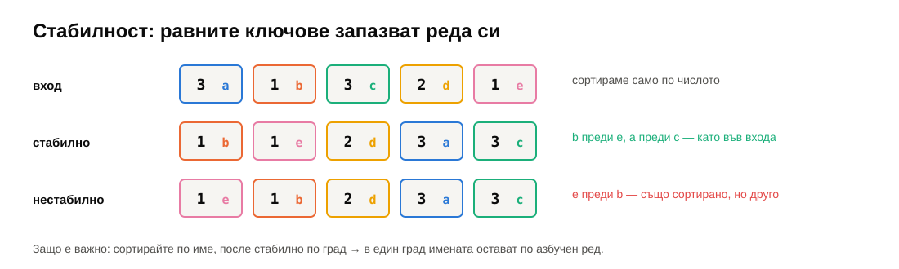

**Стабилност** има значение, когато сортирате записи по едно поле, а реда по друго поле искате да запазите: сортирайте по име, после **стабилно** по град — в рамките на един град имената остават по азбучен ред. `std::sort` не е стабилен; `std::stable_sort` е.

**Инверсии.** Сортиран масив има 0, обратно сортиран — $\binom{n}{2} = n(n-1)/2$, случаен — средно $n(n-1)/4$. Размяната на **съседи** махва точно една инверсия. Значи всеки алгоритъм, който разменя само съседи (bubble, insertion), прави $\ge$ брой инверсии стъпки — средно $\Theta(n^2)$.

Тестовете тази седмица ползват **брояч на сравненията** — `CountingLess` в `tests/counting.h`, — за да проверят не само че сортирате, а и **колко работа** вършите.

---

## 7. Selection sort

**Намери най-малкия, сложи го отпред; повтори за останалите.**

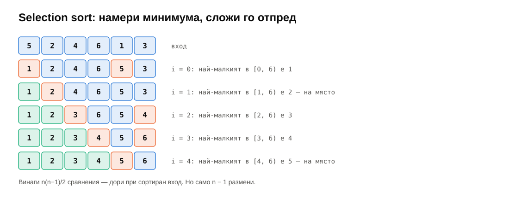

```cpp
for (RandomIt i = first; i != last; ++i) {
    RandomIt smallest = i;
    for (RandomIt j = i + 1; j != last; ++j)
        if (comp(*j, *smallest)) smallest = j;
    if (smallest != i) std::iter_swap(i, smallest);
}
```

- **Винаги** $n(n-1)/2$ сравнения — сортиран вход не помага (не е адаптивен).
- Най-много $n - 1$ размени — **минимум записи**. Полезно, когато записът е много по-скъп от четенето (флаш памет, огромни обекти). Тестът брои записите с `Tracked`: $\le 3(n-1)$.
- **Не е стабилен**: `[2a, 2b, 1]` → разменяме `2a` с `1` → `[1, 2b, 2a]`.

---

## 8. Bubble sort и shaker sort

**Bubble sort:** минаваме отляво надясно и разменяме съседи, които не са наред. След първия проход най-големият е в края („изплувал“); след $k$ прохода — последните $k$ са на място. Ако проход не направи **нито една** размяна — масивът е сортиран, спираме.

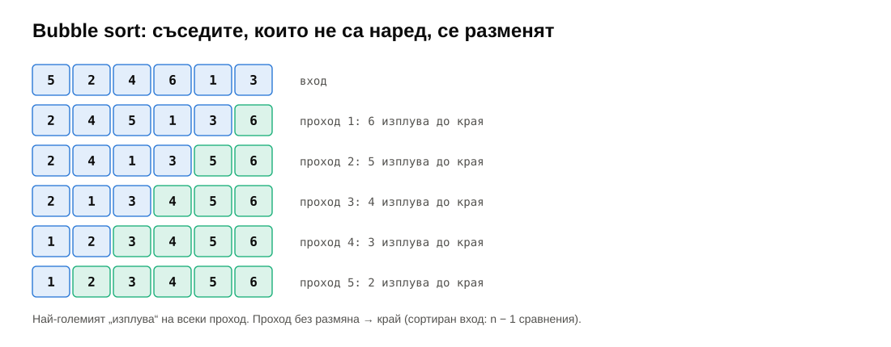

- $\le n(n-1)/2$ сравнения; размените са **точно** броя инверсии.
- Стабилен — ако разменяме само при строго `comp(right, left)`.
- Адаптивен донякъде: сортиран вход — един проход, $n - 1$ сравнения.

**Костенурки и зайци.** Голям елемент в началото („заек“) изплува за един проход. Малък елемент в края („костенурка“) се мести **с една позиция на проход** — $n - 1$ прохода за един-единствен елемент не на място.

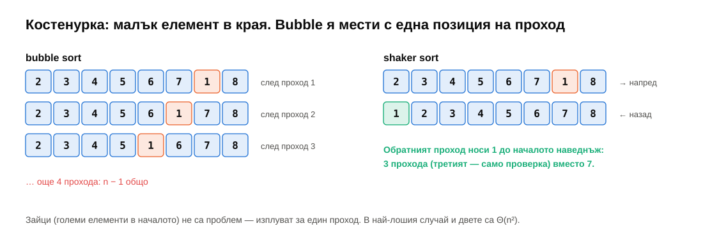

**Shaker (cocktail) sort** редува посоките: напред (най-големият отива в края), назад (най-малкият — в началото). Костенурките изчезват. Но в най-лошия случай — пак $\Theta(n^2)$, и на практика е почти толкова бавен, колкото bubble sort.

> [!TIP]
> **💡 Любопитно.** Knuth (TAOCP, том 3): „bubble sort не изглежда да има с какво да се препоръча, освен закачливото име и това, че води до някои интересни теоретични задачи“. През 2007 г. в Google тогавашният кандидат за президент Барак Обама е попитан кой е най-ефективният начин да се сортират милион 32-битови числа и отговаря: „Мисля, че bubble sort би бил грешният начин.“ Беше прав: при $n = 20\,000$ bubble sort е **25 пъти** по-бавен от insertion sort (§12).

---

## 9. Insertion sort

**Както подреждате карти в ръката:** началото е сортирано; вземете следващия елемент и го вмъкнете на мястото му, като изместите по-големите надясно.

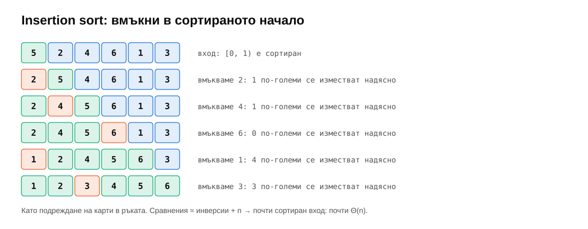

```cpp
for (RandomIt i = first + 1; i != last; ++i) {
    auto value = std::move(*i);
    RandomIt j = i;
    while (j != first && comp(value, *(j - 1))) {   // strictly less: stable
        *j = std::move(*(j - 1));                   // shift, do not swap
        --j;
    }
    *j = std::move(value);
}
```

- Всяко изместване маха точно една инверсия: $\Theta(n + I)$, където $I$ е броят инверсии. Сортиран вход: $n - 1$ сравнения; почти сортиран: почти линейно; случаен: $\approx n^2/4$.
- **Измества, не разменя**: едно присвояване на стъпка вместо три (тестът го проверява с `Tracked`).
- Стабилен, на място, адаптивен, прост, бърз при малки $n$.

Insertion sort е **най-добрият от квадратичните** и се ползва в реалния свят: `std::sort` в libstdc++ довършва с insertion sort парчетата под 16 елемента; Timsort (Python, Java) сортира с него къси серии. Подробно — следващия път.

> [!NOTE]
> **🔬 За напреднали: двоично вмъкване.** Мястото за вмъкване може да се намери с двоично търсене (седмица 03) — $O(\log i)$ сравнения вместо $O(i)$. Сравненията стават $O(n \log n)$, но **преместванията** остават $\Theta(n^2)$. Полезно, когато сравнението е скъпо (дълги низове); Timsort го прави.

---

## 10. Shell sort

Insertion sort е бавен, защото мести елементите **с една позиция на стъпка**. Shell (1959): първо направете insertion sort на елементи **през разстояние** `gap` — те се местят с големи скокове, — после с по-малко разстояние, и накрая с `gap = 1` (обикновен insertion sort), който получава почти сортиран масив.

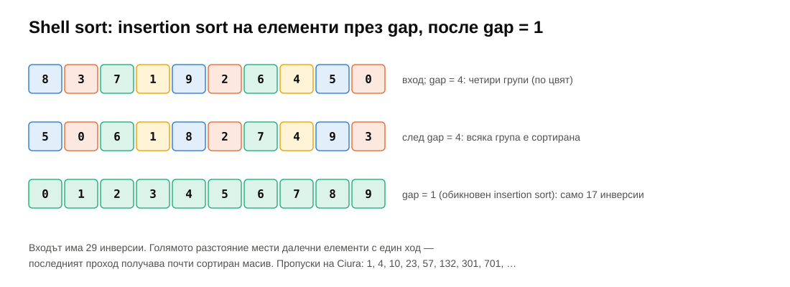

Сложността зависи от **редицата от разстояния** и за много от тях не е известна точно:

| Редица | Най-лош случай |
|---|---|
| $n/2, n/4, \dots, 1$ (Shell, 1959) | $\Theta(n^2)$ |
| $1, 4, 13, 40, \dots$ ($3h + 1$, Knuth) | $O(n^{3/2})$ |
| $2^p 3^q$ (Pratt, 1971) | $\Theta(n \log^2 n)$ — но много проходи |
| **1, 4, 10, 23, 57, 132, 301, 701** (Ciura, 2001) | неизвестна; емпирично най-добрата |

Тестът брои: при $n = 100\,000$ случайни числа Shell sort с редицата на Ciura (продължена с $\times 2.25$) прави около **2.5 милиона** сравнения — insertion sort би направил около **2.5 милиарда**. Shell sort не е стабилен, но е на място, кратък и без рекурсия — затова се среща във вградени системи (а и в uClibc за `qsort`).

---

## 11. Heapsort

Пирамидата дава сортиране почти безплатно (Williams, 1964; Floyd, 1964):

1. `makeHeap` — максимумът е в `a[0]`. $\Theta(n)$.
2. Разменете `a[0]` с последния елемент на пирамидата — максимумът отива на окончателното си място в края. Пирамидата се смалява с 1; `siftDown(0)`. Повторете $n - 1$ пъти.

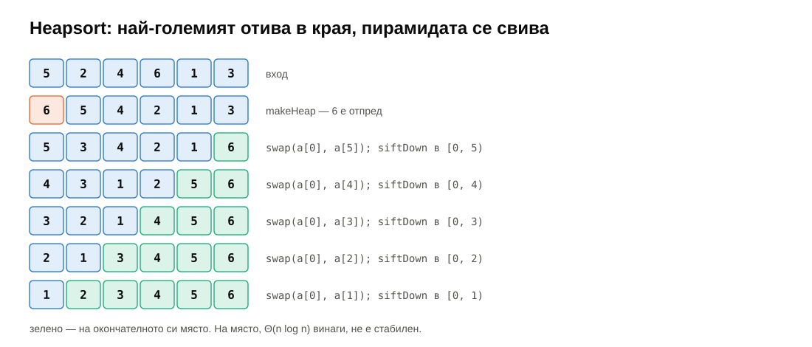

- $\Theta(n \log n)$ **винаги** — няма лош вход.
- **На място** — $O(1)$ допълнителна памет.
- **Не е стабилен** и **не е адаптивен**.
- **Лоша локалност**: `siftDown` скача от $i$ до $2i + 1$ — при голямо $n$ всяко ниво е промах в кеша. Затова при $10^6$ е почти два пъти по-бавен от `std::sort`, въпреки еднаквата асимптотика.

Heapsort е застраховката в `std::sort` (introsort, следващия път): ако quicksort започне да се изражда, `std::sort` превключва на heapsort, за да гарантира $O(n \log n)$.

---

## 12. Сравнение и бенчмарк

| Алгоритъм | Сравнения (най-лошо) | Най-добро | Памет | Стабилен | Адаптивен |
|---|---|---|---|---|---|
| selection | $n^2/2$ | $n^2/2$ | $O(1)$ | не | не |
| bubble | $n^2/2$ | $n$ | $O(1)$ | да | да |
| shaker | $n^2/2$ | $n$ | $O(1)$ | да | да |
| insertion | $n^2/2$ | $n$ | $O(1)$ | да | да ($n + I$) |
| Shell (Ciura) | ? | $\approx n \log n$ | $O(1)$ | не | да |
| heapsort | $2n \log_2 n$ | $\approx n \log n$ | $O(1)$ | не | не |

Измерено (задача 7, release, примерна машина — AMD Ryzen 7 7800X3D):

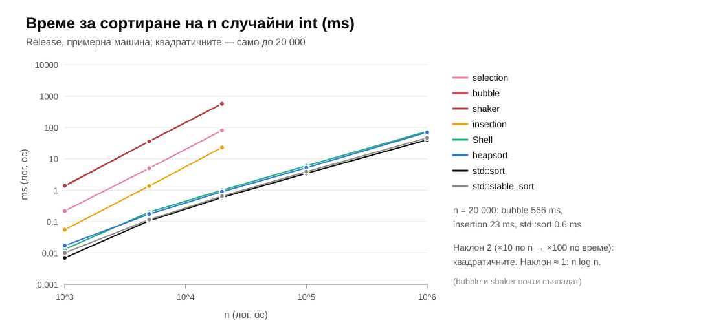

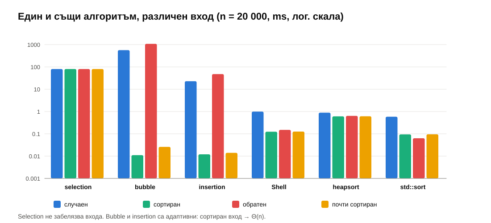

| $n = 20\,000$, ms | случаен | сортиран | обратен | почти сортиран |
|---|---|---|---|---|
| selection | 80 | 80 | 80 | 80 |
| bubble | 566 | 0.01 | 1 083 | 0.03 |
| insertion | 23 | 0.01 | 48 | 0.01 |
| Shell | 1.0 | 0.12 | 0.15 | 0.13 |
| heapsort | 0.9 | 0.6 | 0.6 | 0.6 |
| `std::sort` | 0.6 | 0.09 | 0.07 | 0.09 |

При $n = 10^6$ случайни: Shell 75 ms, heapsort 70 ms, `std::sort` 40 ms.

Защо bubble sort е 25 пъти по-бавен от insertion sort, при еднаква асимптотика? (1) Прави **два пъти повече** сравнения ($n^2/2$ срещу $\approx n^2/4$). (2) Разменя, вместо да измества — три записа вместо един. (3) Разклонението „да разменя ли“ при случаен вход е непредсказуемо — процесорът греши в половината случаи (седмица 10, 💡). Insertion sort има едно предсказуемо разклонение: „спри, когато стигнеш мястото“.

Selection sort е **точно** еднакъв на всеки вход — винаги $n^2/2$ сравнения. Bubble и insertion летят при сортиран вход. „Почти сортиран“ тук значи 1% от съседите разменени — без костенурки; ако малки елементи бяха далеч в края, bubble sort щеше да е бавен, а insertion — не.

---

## 13. Обобщение

| Тема | Да запомните |
|---|---|
| Опашка с приоритет | `push`, `top`, `pop`; `std::priority_queue` — с `less` отгоре е най-големият |
| Пирамида | почти пълно дърво в масив; родител $\ge$ деца; деца $2i + 1$, $2i + 2$ |
| push / pop | добави в края + `siftUp`; последният в корена + `siftDown` с по-голямото дете; $\Theta(\log n)$ |
| Floyd | `siftDown` отзад напред от $n/2 - 1$; $\Theta(n)$, $\le 2n$ сравнения |
| Приложения | top-k за $\Theta(n \log k)$; сливане на $k$ списъка; медиана на поток |
| Понятия | на място, стабилно, адаптивно, инверсия |
| Selection | винаги $n^2/2$ сравнения, $\le n - 1$ размени; не е стабилен |
| Bubble / shaker | съседни размени, ранен край; костенурки; на практика най-бавни |
| Insertion | $\Theta(n + I)$; стабилен, адаптивен; най-добрият за малки и почти сортирани |
| Shell | insertion sort през намаляващи разстояния; Ciura; далеч под $n^2$ |
| Heapsort | `makeHeap` + $n - 1$ пъти „максимумът отзад“; $\Theta(n \log n)$ винаги, на място, нестабилен |

---

## 14. Речник

| Български | English |
|---|---|
| опашка с приоритет | priority queue |
| двоична пирамида | binary heap |
| max-пирамида / min-пирамида | max-heap / min-heap |
| изплуване / потъване | sift up / sift down |
| построяване на пирамида | heapify, build heap |
| пирамидално сортиране | heapsort |
| сортиране чрез избор | selection sort |
| метод на мехурчето | bubble sort |
| шейкър сортиране | shaker sort, cocktail sort |
| сортиране чрез вмъкване | insertion sort |
| сортиране на Шел | Shell sort |
| разстояние (в Shell sort) | gap, increment |
| сортиране на място | in-place sorting |
| стабилно сортиране | stable sort |
| адаптивен алгоритъм | adaptive algorithm |
| инверсия | inversion |
| външно сортиране | external sorting |
| медиана | median |

---

## 15. Литература

- T. Cormen и др. *Introduction to Algorithms* — гл. 2.1 „Insertion sort“, гл. 6 „Heapsort“ (пирамиди, опашки с приоритет, доказателството за $\Theta(n)$ построяване).
- R. Sedgewick, K. Wayne. *Algorithms*, 4th ed. — §2.1 „Elementary Sorts“ (selection, insertion, Shell), §2.4 „Priority Queues“; [онлайн материали](https://algs4.cs.princeton.edu/24pq/).
- D. Knuth. *The Art of Computer Programming*, том 3, §5.2.1 (insertion, Shell), §5.2.2 (bubble, shaker), §5.2.3 (selection, heapsort).
- J. W. J. Williams. „Algorithm 232: Heapsort“, *Communications of the ACM* 7(6), 1964.
- R. W. Floyd. „Algorithm 245: Treesort 3“, *Communications of the ACM* 7(12), 1964.
- D. L. Shell. „A high-speed sorting procedure“, *Communications of the ACM* 2(7), 1959.
- M. Ciura. „Best Increments for the Average Case of Shellsort“, FCT 2001.
- [cppreference — `std::priority_queue`](https://en.cppreference.com/w/cpp/container/priority_queue), [`std::make_heap`](https://en.cppreference.com/w/cpp/algorithm/make_heap)
- [VisuAlgo — Binary Heap](https://visualgo.net/en/heap), [Sorting](https://visualgo.net/en/sorting) — анимации.
