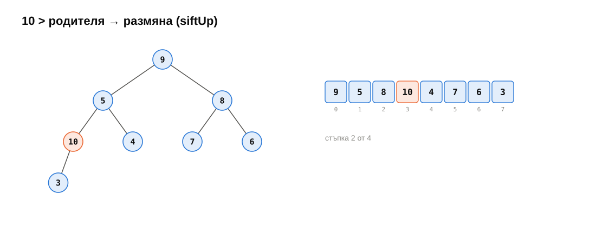
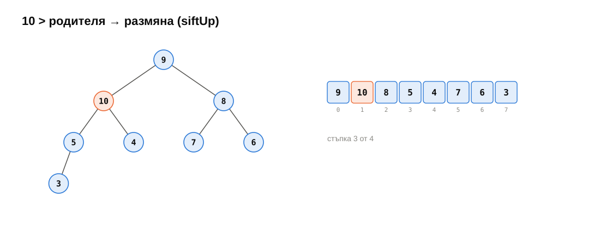
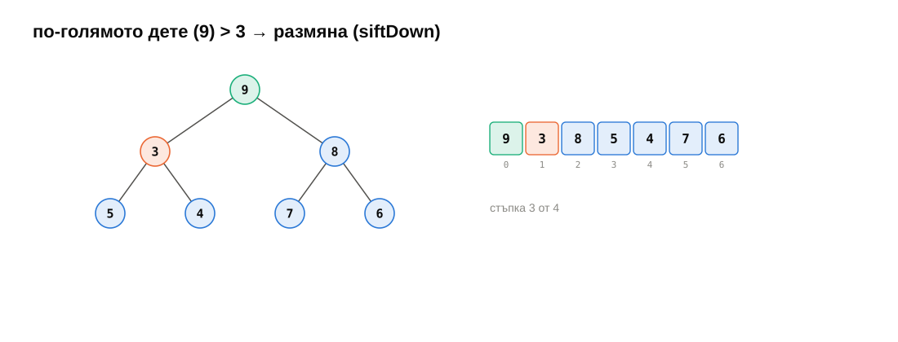

<!-- .slide: class="title-slide" -->

<p class="kicker">СДП 2026/27 · Семинар 11 · 17 декември</p>

# Двоична пирамида. Сортиране I

Масив, едно правило — и най-големият винаги е отпред.

<p class="small">Записки: <a href="notes.md">notes.md</a> · Задачи: <a href="exercises.md">exercises.md</a></p>

---

## План за днес

| Време | Какво правим |
|---|---|
| 10 мин | Загрявка: дървета, масив вместо указатели |
| 15 мин | Преговор: пирамида, siftUp/siftDown, Floyd, простите сортировки |
| 20 мин | На живо: пирамида от нулата → heapsort със същите две функции |
| ☕ | почивка |
| 35 мин | Практика: пирамида, сортировки, броене на сравнения |
| 10 мин | Бенчмарк, обобщение и какво следва |

---

## Загрявка

1. Почти пълно дърво в масив: деца и родител на $i$? <span class="fragment answer">$2i+1$, $2i+2$; $(i-1)/2$ — седмица 09</span>
2. AVL намира максимума за…? <span class="fragment answer">$\Theta(\log n)$ — най-десният възел</span>
3. Колко инверсии има `[2, 3, 1]`? <span class="fragment answer">2: (2, 1) и (3, 1)</span>
4. Изходният въпрос: най-малкият елемент, постоянно, с масив, без указатели? <span class="fragment answer">→ днес: пирамида</span>

---

<!-- .slide: data-background-color="#e3eefb" -->

# Преговор

<p class="small">15 минути · пирамида, Floyd, простите сортировки</p>

---

## Пирамида: форма + наредба


---

## push: siftUp

<div class="r-stack">




</div>

---

## pop: siftDown с по-голямото дете

<div class="r-stack">




</div>

---

## Floyd: пирамида за $\Theta(n)$


---

## Стабилност


---

## Selection и insertion

<div class="r-stack">


</div>

---

## Bubble — и костенурките

<div class="r-stack">


</div>

---

## Shell sort


---

<!-- .slide: data-background-color="#dcf3ea" -->

# На живо: пирамида от нулата

<p class="small">20 минути · две функции, три употреби</p>

---

## siftUp и siftDown

```cpp
void siftUp(std::vector<int>& a, std::size_t i) {
    while (i > 0 && a[(i - 1) / 2] < a[i]) {
        std::swap(a[(i - 1) / 2], a[i]);
        i = (i - 1) / 2;
    }
}

void siftDown(std::vector<int>& a, std::size_t i, std::size_t n) {
    while (2 * i + 1 < n) {
        std::size_t child = 2 * i + 1;
        if (child + 1 < n && a[child] < a[child + 1]) ++child;  // the greater child
        if (!(a[i] < a[child])) return;
        std::swap(a[i], a[child]);
        i = child;
    }
}
```

---

## Heapsort със същите две функции


---

## `std::priority_queue` — внимание с компаратора

```cpp
std::priority_queue<int> maxQ;                                       // top() = the GREATEST
std::priority_queue<int, std::vector<int>, std::greater<int>> minQ;  // top() = the smallest
```

<div class="box warn">

`std::sort(…, std::less)` → най-малкият **отпред**. `std::priority_queue<…, std::less>` → най-големият **отгоре**. Компараторът казва кой е „по-малък“; пирамидата пази „най-големия“.

</div>

---

<!-- .slide: data-background-color="#f6f5f2" -->

# ☕ Почивка

<p class="small"><code>git pull</code> · седмица 11 е в <code>weeks/11-heap-sorting-1</code></p>

---

<!-- .slide: data-background-color="#fde8df" -->

# Практика <span class="timer">35 мин</span>

<p class="small">По двойки. <a href="exercises.md">exercises.md</a> · <code>ctest --preset default -R "^w11/"</code></p>

---

## Тестовете броят

```cpp
std::size_t count = 0;
makeHeap(a.begin(), a.end(), CountingLess{&count});
REQUIRE(count <= 2 * n);   // Floyd: Theta(n). n pushes would be ~900 000.
```

- Сравнявайте **само** с `comp(a, b)` — никога с `<`.
- Индексирайте с `first[i]`; разменяйте със `std::iter_swap`.
- `for (std::size_t i = n / 2 - 1; i >= 0; --i)` — **безкраен** цикъл. `for (std::size_t i = n / 2; i-- > 0;)`.

---

## Задачи

| | Пирамида — `heap.h` | | Сортиране — `sorts.h` |
|---|---|---|---|
| ★ 1 | `siftUp`, `siftDown` | ★ 4 | selection, bubble, insertion |
| ★ 2 | `BinaryHeap` | ★★ 5 | shaker, Shell |
| ★★ 3 | `makeHeap`, `heapSort` | | |
| ★★ 6 | `topK`, ★★★ `mergeSortedLists` | | |

<p class="small">Ред: 1 → 2 → 4 за всички; 3, 5, 6 — после.</p>

---

## Задача 7 — бенчмарк


---

## Входът има значение


---

## Обобщение

- **Пирамида**: почти пълно дърво в масив; родител $\ge$ деца. `push`, `pop` — $\Theta(\log n)$; `top` — $\Theta(1)$.
- **Floyd**: `siftDown` отзад напред — $\Theta(n)$.
- **Top-k** с пирамида от $k$ — $\Theta(n \log k)$.
- **Selection**: $n^2/2$ сравнения винаги, $\le n - 1$ размени. **Bubble**: бавен. **Insertion**: $\Theta(n + I)$ — най-добрият прост.
- **Shell**: insertion sort през разстояния — далеч под $n^2$.
- **Heapsort**: $\Theta(n \log n)$ винаги, на място, нестабилен.

---

## До следващия път

- Довършете задачи 1, 2, 4; останалите за любопитните.
- Прочетете [notes.md](notes.md).
- **Следващият семинар — 7 януари:** сортиране II — merge sort, quicksort, сортиране без сравнения.

<div class="box task">

**Изходен въпрос:** имате два **сортирани** масива с по $n$ елемента. Как да ги слеете в един сортиран за $\Theta(n)$? И как това дава сортиране за $\Theta(n \log n)$?

</div>

<p class="small">Весели празници! 🎄</p>
