# Седмица 12 — Сортиране II

> Семинар 12 · четвъртък, 7 януари 2027 · [слайдове](https://mishomish.github.io/fmi-kn-sdp-2026-2027-seminar/slides/?w=12-sorting-2) · [задачи](exercises.md) · [starter код](starter/) · [тестове](tests/)

Миналия път: простите сортировки ($\Theta(n^2)$), Shell sort и heapsort. Днес: двата големи алгоритъма „разделяй и владей“ — **merge sort** и **quicksort**; **долната граница** $\Omega(n \log n)$ за всяко сортиране със сравнения; и как да я **заобиколим**, когато ключовете са малки цели числа — сортиране чрез броене, поразрядно и с кофи. Накрая: какво всъщност има в `std::sort`, Python и Java.

Блоковете **💡 Любопитно** и **🔬 За напреднали** са извън задължителния материал.

## Съдържание

1. [Разделяй и владей](#1-разделяй-и-владей)
2. [Merge sort](#2-merge-sort)
3. [Броене на инверсии](#3-броене-на-инверсии)
4. [Quicksort](#4-quicksort)
5. [Quickselect](#5-quickselect)
6. [Долна граница](#6-долна-граница)
7. [Сортиране без сравнения](#7-сортиране-без-сравнения)
8. [В стандартните библиотеки](#8-в-стандартните-библиотеки)
9. [Бенчмарк и сравнение](#9-бенчмарк-и-сравнение)
10. [Обобщение](#10-обобщение) · [Речник](#11-речник) · [Литература](#12-литература)

---

## 1. Разделяй и владей

Схемата **разделяй и владей** (divide and conquer):

1. **раздели** задачата на по-малки задачи от същия вид;
2. **реши** ги рекурсивно;
3. **комбинирай** решенията.

Двоичното търсене (седмица 03) е най-простият пример: една подзадача с половин размер, $T(n) = T(n/2) + \Theta(1) = \Theta(\log n)$. Двата алгоритъма днес правят **две** подзадачи с половин размер и $\Theta(n)$ работа за разделяне или комбиниране:

$$T(n) = 2T(n/2) + \Theta(n) = \Theta(n \log n).$$

Защо: дървото на рекурсията има $\log_2 n$ нива; на всяко ниво подзадачите заедно имат $n$ елемента и струват $\Theta(n)$. Merge sort върши работата си при **комбинирането** (сливане), quicksort — при **разделянето** (partition).

---

## 2. Merge sort

### 2.1. Сливане

Изходният въпрос от миналия път: два **сортирани** масива → един сортиран за $\Theta(n)$. Гледаме „върховете“ им; по-малкият отива на изхода; повтаряме. Когато единият свърши, копираме остатъка от другия.

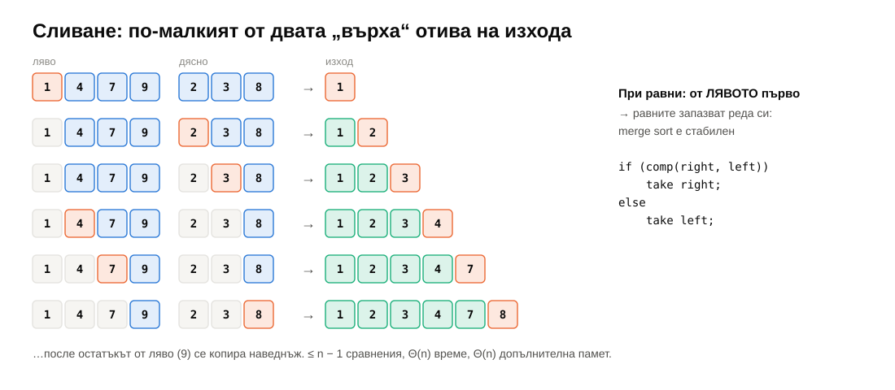

```cpp
while (first1 != last1 && first2 != last2) {
    if (comp(*first2, *first1)) *out++ = std::move(*first2++);  // strictly less: stable
    else *out++ = std::move(*first1++);
}
out = std::move(first1, last1, out);
return std::move(first2, last2, out);
```

Най-много $n - 1$ сравнения. **Стабилно**, ако при равни взимаме от **левия** масив — затова условието е „дясното е строго по-малко“.

### 2.2. Сортиране чрез сливане

Масив от един елемент е сортиран. Значи: раздели наполовина, сортирай всяка половина рекурсивно, слей.

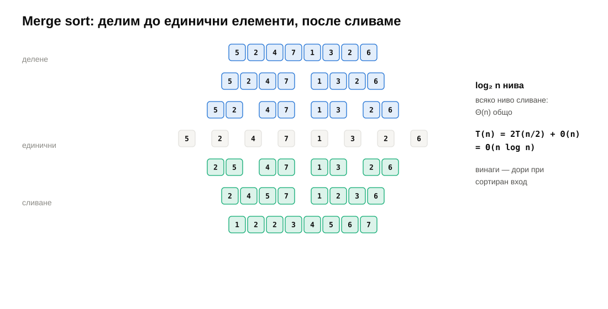

```cpp
void mergeSortWithBuffer(RandomIt first, RandomIt last, BufIt buffer, Compare comp) {
    if (last - first < 2) return;
    RandomIt mid = first + (last - first) / 2;
    mergeSortWithBuffer(first, mid, buffer, comp);
    mergeSortWithBuffer(mid, last, buffer, comp);
    BufIt end = mergeRanges(first, mid, mid, last, buffer, comp);  // into the buffer
    std::move(buffer, end, first);                                 // and back
}
```

| Свойство | |
|---|---|
| време | $\Theta(n \log n)$ **винаги** — няма лош вход |
| сравнения | $\le n \lceil \log_2 n \rceil$; на случаен вход — **на 1% от долната граница** (§6) |
| памет | $\Theta(n)$ допълнителна — буферът (алокиран **веднъж**, не при всяко сливане!) |
| стабилен | да |
| локалност | отлична — сливането чете и пише последователно |

Допълнителната памет е цената. Затова `std::sort` не е merge sort, а `std::stable_sort` е.

Merge sort е естественият избор за **свързани списъци**: сливането на два списъка е само пренасочване на указатели — без допълнителна памет и без произволен достъп (`std::list::sort` е merge sort). И за **външно сортиране** — данни, по-големи от паметта: сортирайте парчета, после ги слейте (седмица 11, $k$-пътно сливане с пирамида).

> [!TIP]
> **💡 Любопитно.** Merge sort е описан от Джон фон Нойман през 1945 г. — един от първите програми, писани изобщо, за компютъра EDVAC.

> [!NOTE]
> **🔬 За напреднали: отдолу нагоре.** Без рекурсия: слейте двойки съседни елементи, после двойки съседни отрязъци с дължина 2, после 4… $\log_2 n$ прохода по целия масив. **Естественият** merge sort първо намира вече сортираните отрязъци („серии“, runs) във входа и слива тях — почти сортиран вход се сортира почти линейно. Това е основата на Timsort (§8).

---

## 3. Броене на инверсии

Инверсия е двойка $i < j$ с $a_i > a_j$ (седмица 11). Директно — $\Theta(n^2)$ двойки. С merge sort — $\Theta(n \log n)$:

> Когато при сливането елемент от **дясната** половина излиза преди всички останали от **лявата**, той е по-малък от всички тях — това са `mid - i` инверсии наведнъж.

```cpp
if (v[j] < v[i]) {
    inv += mid - i;   // v[j] jumps over every element still waiting in the left half
    buf[k++] = v[j++];
} else {
    buf[k++] = v[i++];
}
```

Броят инверсии мери „колко далеч“ е една подредба от друга — разстоянието на Кендъл между две класации (колко двойки филми двама потребители подреждат различно). Тестът в задача 2 брои $\binom{200\,000}{2} \approx 2 \cdot 10^{10}$ инверсии — повече, отколкото събира 32-битово число.

---

## 4. Quicksort

### 4.1. Идеята

Hoare (1959): изберете елемент — **pivot**; **разделете** масива на по-малки от pivot-а, после pivot-а, после по-големи; сортирайте двете части рекурсивно. Никакво сливане — частите вече са на местата си.

Цялата работа е в **разделянето** (partition): един проход, $\Theta(n)$, **на място**.

### 4.2. Тристранно разделяне

Класическото разделяне има две части: $\le$ и $>$ (Lomuto) или $\le$ и $\ge$ (Hoare). Проблемът е при много **равни** елементи: ако всичко е еднакво, Lomuto всеки път отделя само pivot-а — $\Theta(n^2)$.

Дейкстра (задачата за **холандското знаме**): три части — **по-малки, равни, по-големи**. Три указателя:

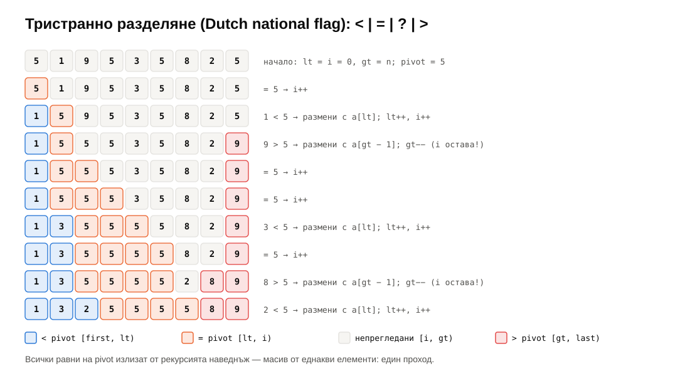

```cpp
RandomIt lt = first, i = first, gt = last;
while (i != gt) {
    if (comp(*i, pivot)) std::iter_swap(lt++, i++);
    else if (comp(pivot, *i)) std::iter_swap(i, --gt);  // do not advance i: the new *i is unseen
    else ++i;
}
return {lt, gt};
```

Рекурсията продължава само в „<“ и „>“. Всички равни на pivot-а излизат наведнъж — масив от еднакви елементи се сортира с **един** проход ($n$ сравнения в теста на задача 3). При 10 различни стойности тристранният quicksort е **2 пъти по-бърз от `std::sort`** (§9).

### 4.3. Изборът на pivot

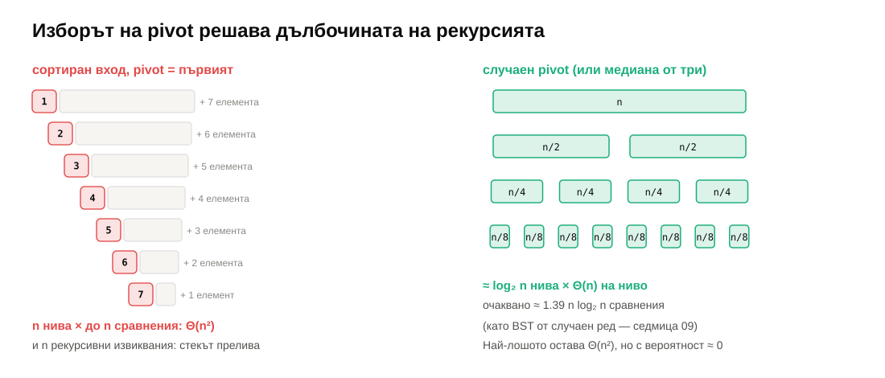

- **Първият елемент**: на сортиран вход всяко разделяне отделя един елемент → $n$ нива, $\Theta(n^2)$, и $n$ рекурсивни извиквания — препълване на стека (седмица 09). А сортиран вход е **често** срещан.
- **Случаен**: очаквано $\Theta(n \log n)$ за **всеки** вход — лошият случай зависи от късмета, не от данните. Очакваният брой сравнения е $2n \ln n \approx 1.39 n \log_2 n$ — същата сметка като средната дълбочина на BST от случаен ред (седмица 09).
- **Медиана от три** (първия, средния, последния) — евтино и добро на сортиран вход; `std::sort` го ползва.

### 4.4. Дълбочината на рекурсията

Дори със случаен pivot може да имаме лош късмет. Трикът (Sedgewick): **рекурсия в по-малката част, цикъл за по-голямата**. По-малката е най-много $n/2$, значи дълбочината е $\le \log_2 n$ — винаги.

```cpp
while (last - first > 1) {
    const auto pivot = *randomPivot(first, last);   // a copy: partition moves elements
    const auto [lt, gt] = partition3(first, last, pivot, comp);
    if (lt - first < last - gt) { quickSort(first, lt, comp); first = gt; }
    else                        { quickSort(gt, last, comp);  last = lt; }
}
```

Забележете `const auto pivot = *...` — **копие**. Ако пазехме итератор към pivot-а, разделянето щеше да премести елемента под него.

| Свойство | |
|---|---|
| време | $\Theta(n \log n)$ очаквано; $\Theta(n^2)$ в най-лошия (с вероятност, пренебрежимо малка при случаен pivot) |
| памет | $O(\log n)$ — само стекът |
| стабилен | **не** — размените прескачат равни елементи |
| локалност | добра — разделянето чете последователно от двата края |

> [!TIP]
> **💡 Любопитно.** Тони Хоар измисля quicksort през 1959 г. в Москва, като студент, който работи по машинен превод: трябвало да сортира думите на изречение, преди да ги търси в речник на магнитна лента. Получава наградата „Тюринг“ през 1980 г. Години по-късно нарича **null указателя**, който въвежда в Algol W през 1965 г., своята „грешка за милиард долара“.

> [!NOTE]
> **🔬 За напреднали: противникът убиец.** McIlroy (1999) показва, че за **всяка** реализация на quicksort с детерминистичен избор на pivot (включително медиана от три) може да се построи вход, който я прави квадратична — компараторът „решава“ стойностите на елементите в движение, винаги така, че pivot-ът да е лош. Затова `std::sort` има застраховка (introsort, §8), а библиотеки, изложени на външен вход, избират pivot-а случайно.

---

## 5. Quickselect

**$k$-тият по големина** (медианата, 90-ия персентил…) без сортиране: разделете като в quicksort, но продължете **само в частта, която съдържа $k$**.

```cpp
while (last - first > 1) {
    const auto pivot = *randomPivot(first, last);
    const auto [lt, gt] = partition3(first, last, pivot, comp);
    if (nth < lt) last = lt;
    else if (nth >= gt) first = gt;
    else return;               // nth is among the elements equal to the pivot
}
```

Очаквано: $n + n/2 + n/4 + \dots = 2n$ прегледани елемента — **$\Theta(n)$**. Медианата на 65 536 случайни числа: 452 619 сравнения $\approx 6.9n$ (сортирането би направило ~1 000 000). В STL: `std::nth_element`.

> [!NOTE]
> **🔬 За напреднали: гарантирано линейно.** Blum, Floyd, Pratt, Rivest и Tarjan (1973) — „медиана от медианите“: групи по 5, медиана на всяка група, рекурсивно медианата на медианите като pivot. Гарантира, че всяка част е $\le 7n/10$ → $\Theta(n)$ в **най-лошия** случай. Константата е голяма; на практика — случаен pivot.

---

## 6. Долна граница

Може ли сортиране само със сравнения да е по-бързо от $n \log n$? **Не.**

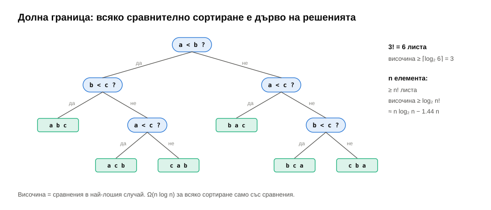

Всеки алгоритъм, който само сравнява, е **дърво на решенията**: всеки вътрешен възел е сравнение, всеки лист — една наредба на входа. За $n$ различни елемента има $n!$ възможни наредби, и всяка трябва да е различен лист — иначе два различни входа ще бъдат пренаредени еднакво и единият ще излезе грешно. Двоично дърво с $n!$ листа има височина $\ge \log_2 n!$, а височината е броят сравнения в най-лошия случай. По Стирлинг:

$$\log_2 n! = n \log_2 n - n \log_2 e + O(\log n) \approx n \log_2 n - 1.44\,n.$$

Значи **всяко** сравнително сортиране прави $\Omega(n \log n)$ сравнения в най-лошия случай (и средно — същият аргумент с усредняване по листата).

Колко близо са реалните алгоритми? Преброено с `CountingLess` при $n = 65\,536$:

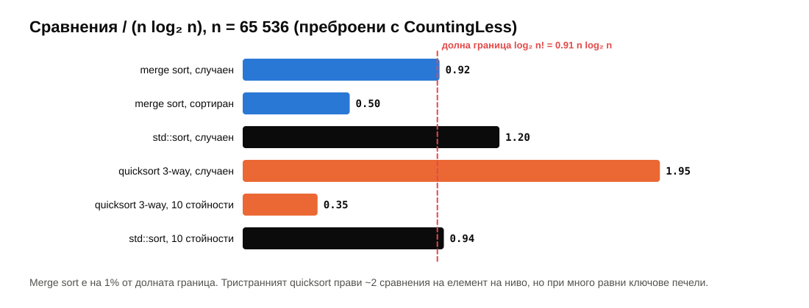

Merge sort е на **1%** от границата. `std::sort` прави 30% повече — но е по-бърз (по-малко местене на данни, всичко на място). Броят сравнения не е всичко.

---

## 7. Сортиране без сравнения

Долната граница важи само за алгоритми, които **сравняват**. Ако ключовете са малки цели числа, можем да ги ползваме като **индекси**.

### 7.1. Сортиране чрез броене

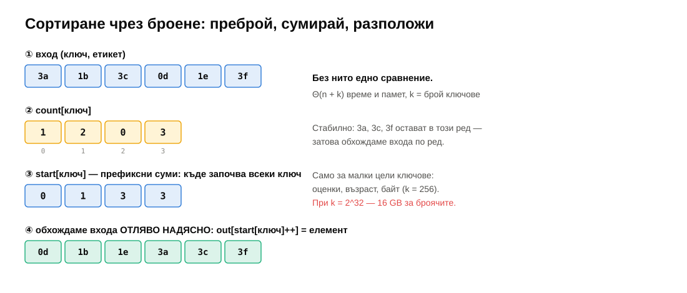

Ключове в $[0, k)$:

1. `count[key]` за всеки елемент;
2. **префиксни суми**: `start[key]` = колко елемента имат по-малък ключ = къде започва този ключ;
3. обхождаме входа **отляво надясно** и слагаме всеки елемент на `out[start[key]++]`.

$\Theta(n + k)$ време и памет; **стабилно** — заради обхождането по ред. Полезно, когато $k$ е малко: оценки (2–6), възраст (0–150), байт (0–255). Безполезно при $k = 2^{32}$.

### 7.2. Поразрядно сортиране (radix sort)

Ключ с $d$ цифри в база $b$: сортирайте **стабилно** по най-младата цифра, после по следващата… по най-старата (**LSD** — least significant digit first).

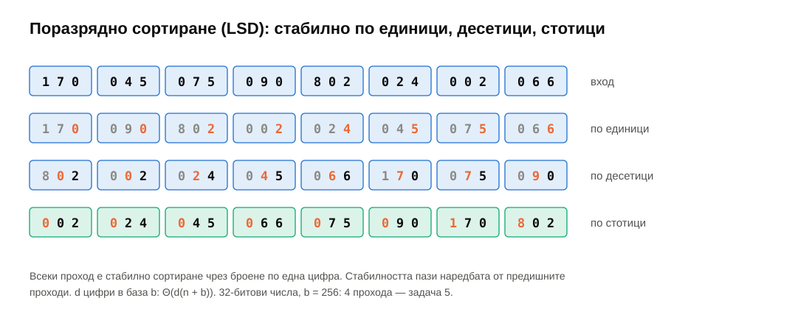

Защо работи: след прохода по цифра $i$ числата са наредени по последните $i$ цифри — защото проходът по цифра $i$ е **стабилен** и пази наредбата от предишните проходи между числата с еднаква цифра $i$. Без стабилност — не работи.

$\Theta(d(n + b))$. За 32-битови числа и $b = 256$: 4 прохода по $n$ + 256. При $10^7$ числа: **45 ms срещу 467 ms на `std::sort`** — 10 пъти по-бързо (§9). Цената: $\Theta(n)$ допълнителна памет, само за цели числа (или низове, или ключове, които могат да се превърнат в такива), и константи, които не се изплащат при малки $n$.

> [!TIP]
> **💡 Любопитно.** Поразрядното сортиране е по-старо от компютрите: машините за сортиране на перфокарти от началото на XX век (компанията на Херман Холерит, чиито табулатори обработват преброяването на САЩ от 1890 г.) сортират по една колона наведнъж — и за многоцифрени ключове операторът минава тестето от последната колона към първата, $d$ пъти. Компанията на Холерит по-късно става IBM.

### 7.3. Сортиране с кофи (bucket sort)

Числа в $[0, 1)$, равномерно разпределени: $n$ кофи, $x$ отива в кофа $\lfloor x \cdot n \rfloor$, всяка кофа се сортира (с insertion sort — малки са), после се долепят.

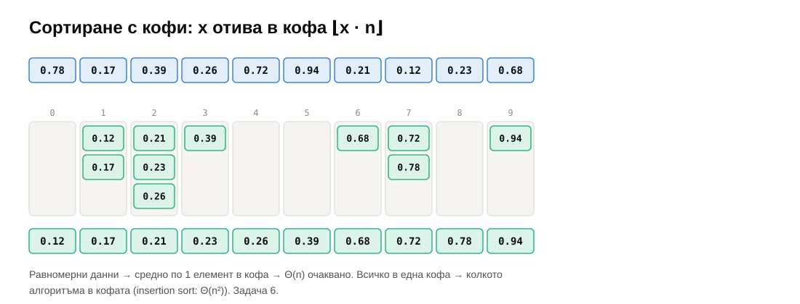

Очаквано $\Theta(n)$ — средно по един елемент в кофа. Но предположението за равномерност е всичко: ако всички числа са в $[0, 0.001)$, всичко е в една кофа и сме на insertion sort — $\Theta(n^2)$. Тестът на задача 6 проверява, че тогава поне **работи**.

---

## 8. В стандартните библиотеки

Никоя реална библиотека не ползва „чист“ алгоритъм — всички са **хибриди**.

| Библиотека | Алгоритъм |
|---|---|
| `std::sort` (libstdc++, libc++, MSVC) | **introsort** (Musser, 1997): quicksort с медиана от три; ако рекурсията стане по-дълбока от $2 \log_2 n$ — heapsort за тази част (гаранция $O(n \log n)$); парчета под 16 елемента — insertion sort накрая |
| `std::stable_sort` | merge sort с буфер; ако няма памет — сливане на място за $O(n \log^2 n)$ |
| `std::nth_element` | introselect: quickselect със застраховка |
| `std::partial_sort` | пирамида (седмица 11) |
| Python `sorted`, Java `Arrays.sort(Object[])` | **Timsort** (Tim Peters, 2002): естествен merge sort — намира серии, удължава късите с двоично вмъкване, слива по правила, които пазят баланса |
| Java `Arrays.sort(int[])` | двупивотен quicksort (Yaroslavskiy, 2009) |
| Go `sort.Sort` (от 1.19), Rust `sort_unstable` (до 1.81) | **pdqsort** (Orson Peters): quicksort, който разпознава сортиран вход и лоши pivot-и |

Обща идея: quicksort за средния случай, heapsort като застраховка, insertion sort за малките парчета, разпознаване на вече сортирани серии.

> [!TIP]
> **💡 Любопитно.** През 2015 г. Stijn de Gouw и колеги се опитват **формално да докажат** коректността на Timsort в Java (с инструмента KeY) — и не успяват, защото откриват бъг: при определени входове инвариантът на стека от серии се нарушава и `Arrays.sort` хвърля `ArrayIndexOutOfBoundsException`. Входът, който го задейства, е с над 67 милиона елемента. Бъгът е в кода от 2002 г. — 13 години в Python, Java и Android, незабелязан от тестове.

---

## 9. Бенчмарк и сравнение

Измерено (задача 7, release, примерна машина — AMD Ryzen 7 7800X3D, `uint32`):

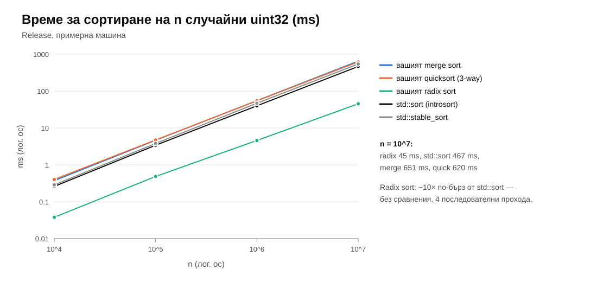

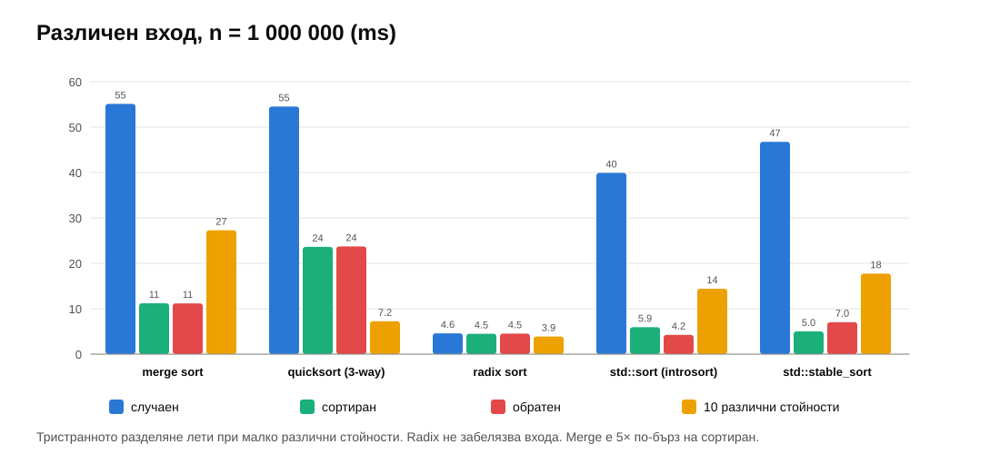

| $n = 10^7$, ms | случаен | сортиран | обратен | 10 стойности |
|---|---|---|---|---|
| вашият merge sort | 651 | 123 | 118 | 293 |
| вашият quicksort (3-way) | 620 | 260 | 259 | **76** |
| вашият radix sort | **45** | **45** | **46** | **41** |
| `std::sort` | 467 | 74 | 52 | 166 |
| `std::stable_sort` | 544 | 56 | 77 | 187 |

Какво показват числата:

- **Radix sort** е 10× по-бърз от всичко останало и **не забелязва входа** — винаги 4 прохода.
- **Тристранният quicksort** е 2× по-бърз от `std::sort` при 10 различни стойности — всички равни излизат наведнъж.
- **Merge sort** е 5× по-бърз на сортиран вход: сливането на сортирани половини е само копиране (и сравненията падат на $0.5\,n \log_2 n$), а предсказването на разклонения е перфектно.
- **`std::sort`** е ~30% по-бърз от нашите на случаен вход — медиана от три, insertion sort за малките парчета, години оптимизации.

| Алгоритъм | Време | Памет | Стабилен | Кога |
|---|---|---|---|---|
| insertion | $\Theta(n + I)$ | $O(1)$ | да | малки или почти сортирани |
| heapsort | $\Theta(n \log n)$ | $O(1)$ | не | гаранция без памет |
| merge sort | $\Theta(n \log n)$ | $\Theta(n)$ | да | стабилност, списъци, външна памет |
| quicksort | $\Theta(n \log n)$ очаквано | $O(\log n)$ | не | общ случай, на място |
| counting | $\Theta(n + k)$ | $\Theta(n + k)$ | да | малки цели ключове |
| radix | $\Theta(d(n + b))$ | $\Theta(n + b)$ | да | цели числа, много данни |
| bucket | $\Theta(n)$ очаквано | $\Theta(n)$ | зависи | равномерни реални числа |

---

## 10. Обобщение

| Тема | Да запомните |
|---|---|
| Разделяй и владей | $T(n) = 2T(n/2) + \Theta(n) = \Theta(n \log n)$ |
| Сливане | по-малкият връх на изхода; при равни — от левия (стабилност); $\le n - 1$ сравнения |
| Merge sort | $\Theta(n \log n)$ винаги, стабилен, $\Theta(n)$ памет; буферът — веднъж |
| Инверсии | при сливане: десен елемент излиза → `mid - i` инверсии; $\Theta(n \log n)$ |
| Quicksort | pivot, разделяне, рекурсия; очаквано $1.39 n \log_2 n$; най-лошо $\Theta(n^2)$ |
| Тристранно разделяне | `<` · `=` · `>`; равните излизат наведнъж |
| Pivot | никога първия на сортиран вход; случаен или медиана от три; копие на стойността |
| Дълбочина | рекурсия в по-малката част, цикъл за по-голямата → $\le \log_2 n$ |
| Quickselect | само в частта с $k$; $\Theta(n)$ очаквано; `std::nth_element` |
| Долна граница | дърво на решенията с $n!$ листа → $\log_2 n! \approx n \log_2 n - 1.44n$ |
| Броене | `count` → префиксни суми → разполагане по ред; стабилно; $\Theta(n + k)$ |
| Radix (LSD) | стабилни проходи от младата към старата цифра; 4 прохода за `uint32` |
| `std::sort` | introsort: quicksort + heapsort при дълбока рекурсия + insertion sort за < 16 |

---

## 11. Речник

| Български | English |
|---|---|
| разделяй и владей | divide and conquer |
| сливане | merge |
| сортиране чрез сливане | merge sort |
| бързо сортиране | quicksort |
| разделяне | partition |
| опорен елемент | pivot |
| тристранно разделяне | three-way partition, Dutch national flag |
| медиана от три | median of three |
| k-ти по големина | k-th smallest, selection |
| бърз избор | quickselect |
| дърво на решенията | decision tree |
| долна граница | lower bound |
| сортиране чрез броене | counting sort |
| префиксна сума | prefix sum |
| поразрядно сортиране | radix sort (LSD / MSD) |
| сортиране с кофи | bucket sort |
| серия (вече сортиран отрязък) | run |
| хибриден алгоритъм | hybrid algorithm |
| външно сортиране | external sorting |

---

## 12. Литература

- T. Cormen и др. *Introduction to Algorithms* — гл. 2.3 „Merge sort“, гл. 4 (рекурентни уравнения), гл. 7 „Quicksort“, гл. 8 „Sorting in Linear Time“ (долна граница, counting, radix, bucket), гл. 9 „Medians and Order Statistics“.
- R. Sedgewick, K. Wayne. *Algorithms*, 4th ed. — §2.2 „Mergesort“, §2.3 „Quicksort“ (тристранно разделяне, дълбочина на рекурсията), §5.1 „String Sorts“ (LSD, MSD); [онлайн материали](https://algs4.cs.princeton.edu/23quicksort/).
- C. A. R. Hoare. „Quicksort“, *The Computer Journal* 5(1), 1962.
- J. Bentley, M. D. McIlroy. „Engineering a Sort Function“, *Software: Practice and Experience* 23(11), 1993.
- D. Musser. „Introspective Sorting and Selection Algorithms“, *Software: Practice and Experience* 27(8), 1997.
- M. D. McIlroy. „A Killer Adversary for Quicksort“, *Software: Practice and Experience* 29(4), 1999.
- S. de Gouw и др. „OpenJDK's java.utils.Collection.sort() is broken: The good, the bad and the worst case“, CAV 2015.
- O. Peters. „Pattern-defeating Quicksort“, 2021 ([arXiv:2106.05123](https://arxiv.org/abs/2106.05123)).
- [cppreference — `std::sort`](https://en.cppreference.com/w/cpp/algorithm/sort), [`std::nth_element`](https://en.cppreference.com/w/cpp/algorithm/nth_element)
- [VisuAlgo — Sorting](https://visualgo.net/en/sorting) — анимации.
