<!-- .slide: class="title-slide" -->

<p class="kicker">СДП 2026/27 · Семинар 13 · 14 януари</p>

# Графи I: представяне и обхождане

Опашка — в ширина. Стек — в дълбочина. Всичко — за $\Theta(n + m)$.

<p class="small">Записки: <a href="notes.md">notes.md</a> · Задачи: <a href="exercises.md">exercises.md</a></p>

---

## План за днес

| Време | Какво правим |
|---|---|
| 10 мин | Загрявка: опашка, стек, дървета |
| 15 мин | Преговор: понятия, представяне, BFS, DFS, топологична подредба |
| 20 мин | На живо: BFS с нива и път, DFS със стека, лабиринт |
| ☕ | почивка |
| 35 мин | Практика: BFS, лабиринт, DFS, компоненти, цикли, двуделност |
| 10 мин | Бенчмарк, обобщение, последният семинар |

---

## Загрявка

1. Обхождане по нива на дърво — с каква структура? <span class="fragment answer">опашка (седмица 09)</span>
2. Колко ребра има дърво с $n$ възела? <span class="fragment answer">$n - 1$</span>
3. Рекурсивен in-order на верига от $10^6$ възела? <span class="fragment answer">препълва стека → явен стек</span>
4. Изходният въпрос: цикли, много пътища — как в паметта? Как без да минем два пъти? <span class="fragment answer">→ днес: списъци на съседство и масив `seen`</span>

---

<!-- .slide: data-background-color="#e3eefb" -->

# Преговор

<p class="small">15 минути · понятия, представяне, BFS, DFS</p>

---

## Понятия

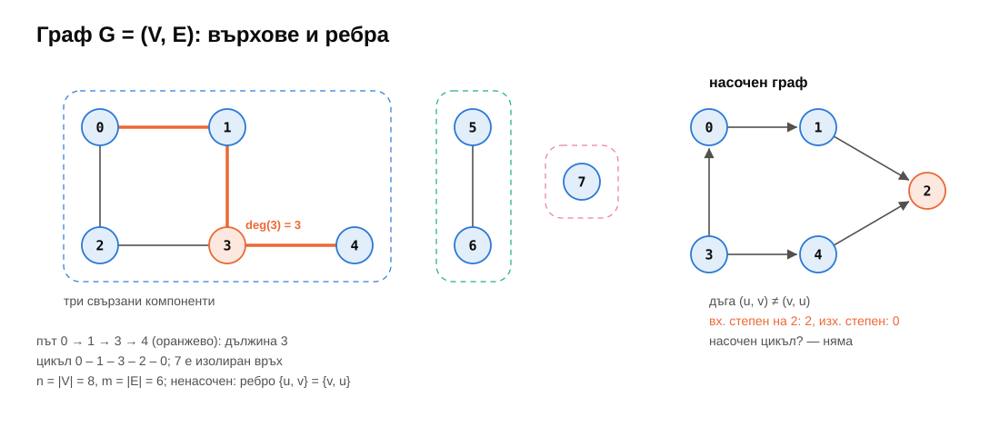

---

## Представяне

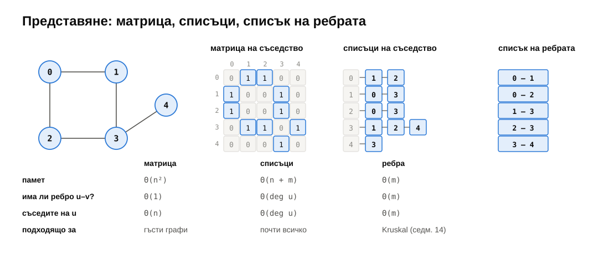

---

## BFS: вълни около $s$

<div class="r-stack">
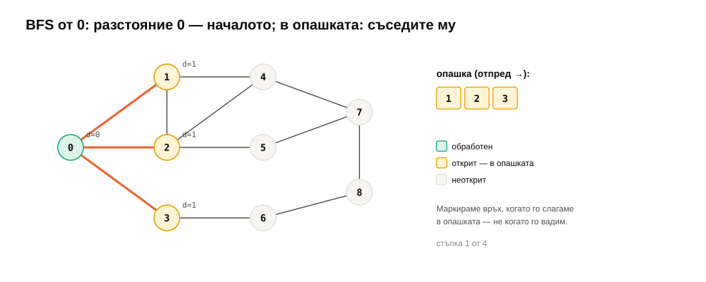
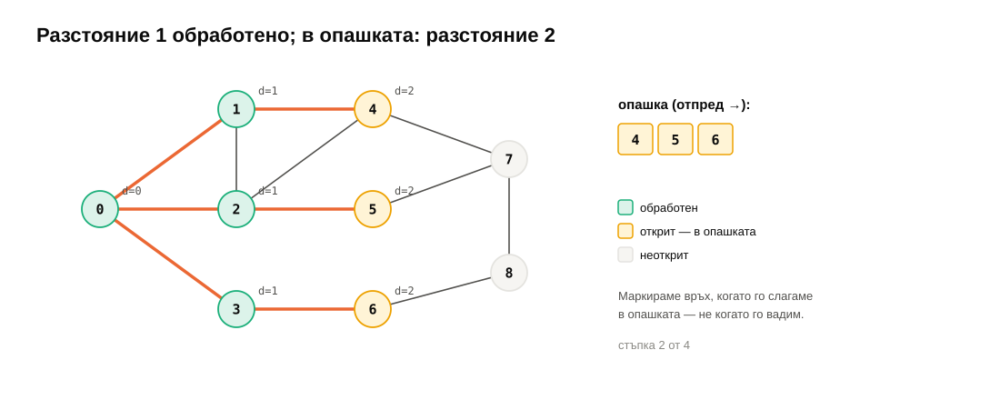
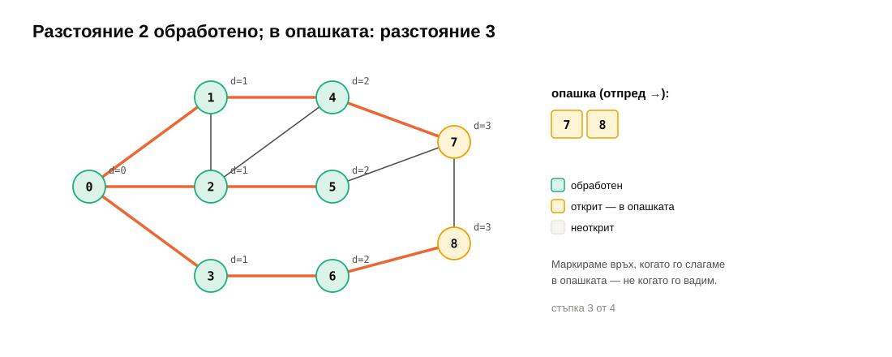
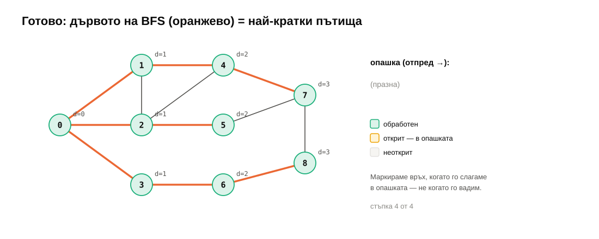
</div>

---

## DFS: навътре, после назад

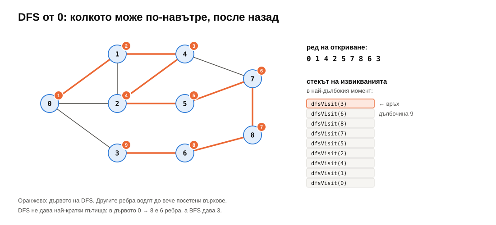

---

## Цикли: три цвята

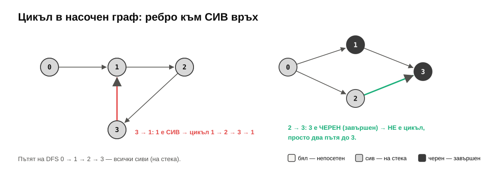

---

## Топологична подредба (Kahn)

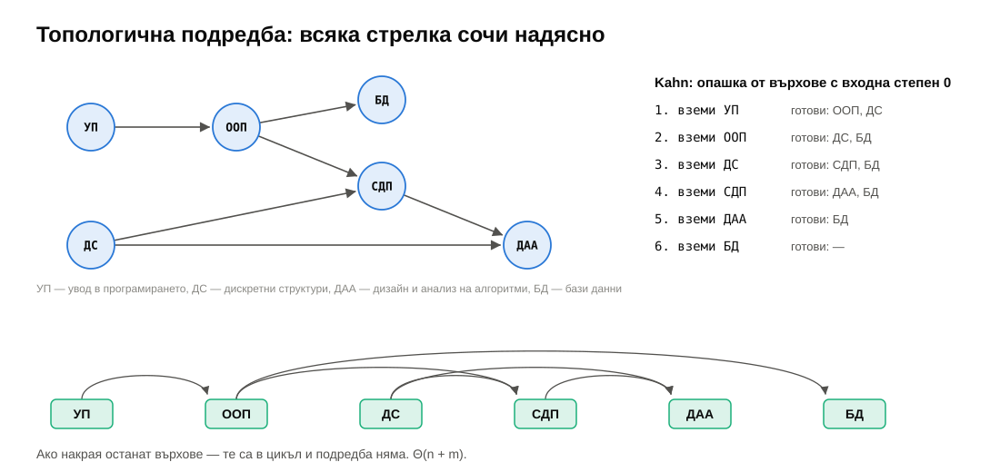

---

<!-- .slide: data-background-color="#dcf3ea" -->

# На живо: BFS, DFS, лабиринт

<p class="small">20 минути · списъци на съседство от нулата</p>

---

## BFS — маркирай при слагане

```cpp
std::vector<int> dist(n, -1), parent(n, -1);
std::queue<int> q;
dist[s] = 0;
q.push(s);
while (!q.empty()) {
    int u = q.front(); q.pop();
    for (int v : adj[u])
        if (dist[v] == -1) {          // first time: mark NOW
            dist[v] = dist[u] + 1;
            parent[v] = u;
            q.push(v);
        }
}
```

```text
path 0 -> 8: 0 3 6 8  (3 edges)
```
<!-- .element: class="fragment" -->

---

## DFS — стекът на извикванията

<div class="cols">
<div>

```cpp
void dfs(const Adj& adj, int u,
         std::vector<char>& seen, int depth) {
    seen[u] = 1;
    printf("%*senter %d\n", 2 * depth, "", u);
    for (int v : adj[u])
        if (!seen[v]) dfs(adj, v, seen, depth + 1);
    printf("%*sleave %d\n", 2 * depth, "", u);
}
```

</div>
<div>

```text
enter 0
  enter 1
    enter 4
      enter 2
        enter 5
          enter 7
            enter 8
              enter 6
                enter 3
                leave 3
              leave 6
            …
```

</div>
</div>

---

## Лабиринт: неявен граф

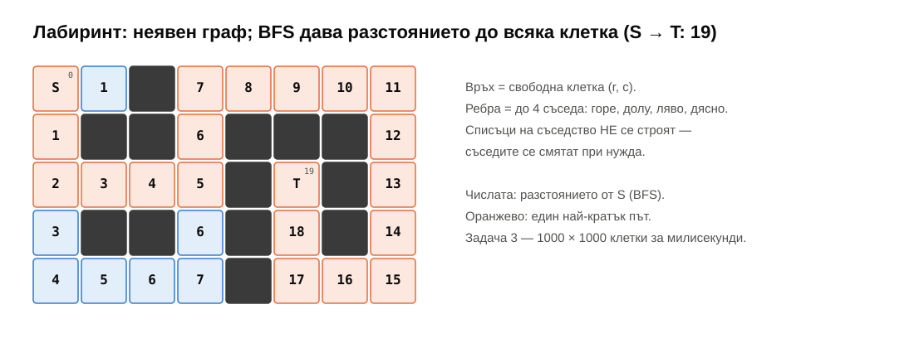

---

<!-- .slide: data-background-color="#f6f5f2" -->

# ☕ Почивка

<p class="small"><code>git pull</code> · седмица 13 е в <code>weeks/13-graphs-1</code></p>

---

<!-- .slide: data-background-color="#fde8df" -->

# Практика <span class="timer">35 мин</span>

<p class="small">По двойки. <a href="exercises.md">exercises.md</a> · <code>ctest --preset default -R "^w13/"</code></p>

---

## Задачи

| | | |
|---|---|---|
| ★ 1 | `adjacencyMatrix`, `inDegrees`, `reversed` | загрявка |
| ★ 2 | `bfsDistances`, `shortestPath` | опашка, `parent` |
| ★★ 3 | `gridShortestPath` | неявен граф; 1000 × 1000 |
| ★ 4 | `dfsOrder`, `connectedComponents` | точният ред на DFS |
| ★★ 5 | `hasCycle`, `topologicalSort` | три цвята; Kahn |
| ★★ 6 | `isBipartite` | несвързан граф! |
| ★★★ 7 | `dfsOrderIterative` | стек от (връх, индекс) |

<p class="small">Ред: 1 → 2 → 4 за всички; 3, 5, 6, 7 — после.</p>

---

## Капани

- Маркиране при **вадене** от опашката → върхът влиза многократно.
- `hasCycle` с два цвята → „два пътя до един връх“ става „цикъл“.
- Рекурсивен DFS на път от $10^6$ → стекът прелива (задача 7).
- „DFS“ = BFS със `std::stack` → **друг ред** — тестът на задача 7 го хваща.
- `grid[nr][nc]` **преди** проверката на границите → извън масива (ASan).

---

## Задача 8 — бенчмарк

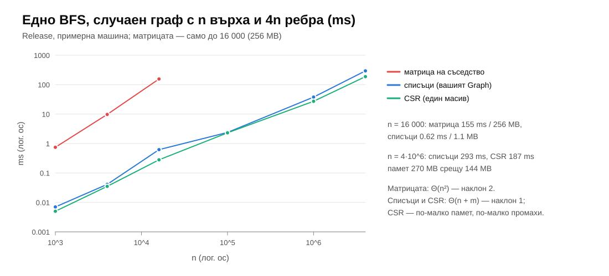

---

## Двуделни графи

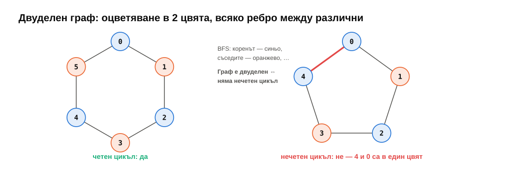

---

## Обобщение

- **Списъци на съседство** — $\Theta(n + m)$ памет; матрица — само за гъсти графи.
- **BFS**: опашка, маркирай при слагане → **най-кратки пътища** без тегла; `parent` → самият път.
- **DFS**: рекурсия или стек от (връх, индекс); дълбочина до $n$.
- **Компоненти**: обхождане от всеки неозначен връх.
- **Цикъл**: ребро към **сив**. **Топологична подредба**: Kahn или обратен ред на завършване.
- **Двуделен** ⇔ няма нечетен цикъл.

---

## До следващия път — последният семинар

- Довършете задачи 1, 2, 4; останалите за любопитните.
- Прочетете [notes.md](notes.md).
- **21 януари:** графи II — тегла, Дейкстра, минимално покриващо дърво; побитови операции; ретроспекция на курса.

<div class="box task">

**Изходен въпрос:** BFS намира най-краткия път, ако всички ребра са еднакво дълги. Ако едно ребро е 10 km, а три други — по 1 km, BFS ще избере грешно. Каква структура от седмица 11 ще ни помогне да вземаме винаги **най-близкия** непосетен връх?

</div>
