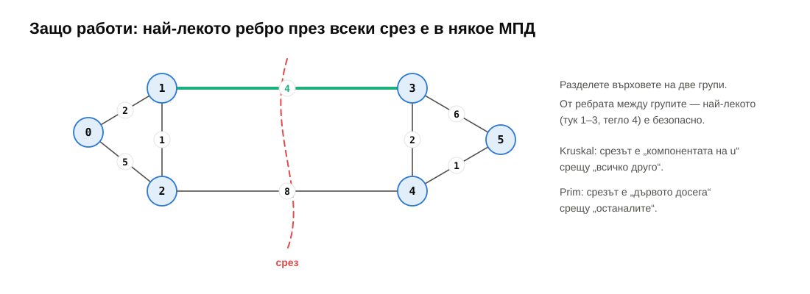

# Седмица 14 — Графи II: най-къси пътища с тегла, минимално покриващо дърво

> Семинар 14 · четвъртък, 21 януари 2027 · [слайдове](https://mishomish.github.io/fmi-kn-sdp-2026-2027-seminar/slides/?w=14-graphs-2) · [задачи](exercises.md) · [starter код](starter/) · [тестове](tests/) · [визуализация](https://mishomish.github.io/fmi-kn-sdp-2026-2027-seminar/widgets/pathfinding.html)
>
> Последният семинар е общ за две седмици: тази (графи II) и [седмица 15 — побитови операции и ретроспекция](../15-bitwise-retrospective/notes.md).

Миналия път BFS даде най-кратките пътища — ако всички ребра са еднакво дълги. Днес ребрата имат **тегла**: километри, минути, цена. Два въпроса: **най-краткият път** между два града (алгоритъмът на Дейкстра — BFS с пирамида от седмица 11 вместо опашка) и **най-евтината мрежа**, която свързва всички градове (минимално покриващо дърво — Kruskal с нова структура, **обединение на множества**, и Prim).

Блоковете **💡 Любопитно** и **🔬 За напреднали** са извън задължителния материал.

## Съдържание

1. [Претеглени графи](#1-претеглени-графи)
2. [Алгоритъмът на Дейкстра](#2-алгоритъмът-на-дейкстра)
3. [Защо работи — и кога не](#3-защо-работи--и-кога-не)
4. [Тегла 0 и 1: 0-1 BFS](#4-тегла-0-и-1-0-1-bfs)
5. [Обединение на множества (union-find)](#5-обединение-на-множества-union-find)
6. [Минимално покриващо дърво](#6-минимално-покриващо-дърво)
7. [Бенчмарк](#7-бенчмарк)
8. [Обобщение](#8-обобщение) · [Речник](#9-речник) · [Литература](#10-литература)

---

## 1. Претеглени графи

Всяко ребро има **тегло** $w(u, v)$ — число. Дължината на път е **сумата** от теглата по него, не броят ребра. Представянето е същото като в седмица 13, само съседът идва с тегло:

```cpp
struct Edge { int to; long long w; };
std::vector<std::vector<Edge>> adj(n);
```


BFS намира пътя с **най-малко ребра**. С тегла това вече не е най-краткият: мостът от 10 km губи от три пътя по 1 km. Трябва ни нещо, което винаги разширява от **най-близкия** връх.

---

## 2. Алгоритъмът на Дейкстра

Идея: като BFS, но вместо опашка — **min-пирамида** по разстояние (седмица 11). На всяка стъпка вадим непосетения връх с най-малко `dist`; той е **готов** — по-кратък път до него няма. После **обновяваме** (relax) съседите му: ако през $u$ до $v$ е по-кратко, отколкото знаем, записваме новото разстояние.

```cpp
using Item = std::pair<long long, int>;    // (distance, vertex): compared by distance first
std::vector<long long> dist(n, kInf);
std::priority_queue<Item, std::vector<Item>, std::greater<Item>> heap;   // a MIN-heap
dist[s] = 0;
heap.push({0, s});
while (!heap.empty()) {
    auto [d, u] = heap.top();
    heap.pop();
    if (d > dist[u]) continue;             // stale entry: u was already finished cheaper
    for (const Edge& e : adj[u]) {
        if (d + e.w < dist[e.to]) {        // relax
            dist[e.to] = d + e.w;
            heap.push({dist[e.to], e.to});
        }
    }
}
```

<div align="center">


</div>

**Мързеливо изтриване** (lazy deletion). Когато намерим по-кратък път до $v$, в идеалния случай бихме **намалили** приоритета на $v$ в пирамидата (decrease-key). `std::priority_queue` не може това. Вместо това слагаме **нова** двойка и оставяме старата; когато по-късно извадим двойка с разстояние по-голямо от `dist[v]` — тя е остаряла и я пропускаме (`if (d > dist[u]) continue;`). Пирамидата може да стане с до $m$ елемента, но това не променя сложността.

**Сложност:** всяко ребро може да сложи една двойка: $O(m)$ операции с пирамидата, всяка $O(\log m) = O(\log n)$. Общо $\Theta((n + m) \log n)$.

**Пътят:** пазете `parent[v] = u` при всяко успешно обновяване; накрая вървете назад от $t$ — като при BFS.

> [!WARNING]
> `std::priority_queue<Item>` **без** `std::greater` е **max**-пирамида (седмица 11) — вадите **най-далечния**. Коварното: с мързеливото изтриване разстоянията накрая пак са **верни** — върховете просто се „завършват“ многократно, докато всичко се успокои. Тестовете минават. Но работата експлодира: на случаен граф с $n = 100\,000$ и $m = 4n$ изважданията са **180 хиляди** с min-пирамида и **3.7 милиарда** с max-пирамида — 20 000 пъти повече. Бъг в бързодействието, не в коректността — затова всяка седмица има и бенчмарк.

> [!TIP]
> **💡 Любопитно.** Едсхер Дейкстра измисля алгоритъма през 1956 г. „за 20 минути“, седейки с годеницата си на тераса на кафене в Амстердам — без лист и молив, което, казва по-късно, го е принудило да избегне всяка ненужна сложност. Целта е била да демонстрира новия компютър ARMAC с въпрос, който всеки разбира: най-краткият път между два холандски града. Публикува го чак през 1959 г., в статия от 3 страници, която описва и алгоритъм за минимално покриващо дърво.

---

## 3. Защо работи — и кога не

**Инвариантът:** когато извадим $u$ от пирамидата (не остаряла двойка), `dist[u]` е окончателното най-кратко разстояние.

Защо: да допуснем, че има по-кратък път до $u$. Той тръгва от готовите върхове и в някакъв момент ги напуска — през ребро към връх $x$, който още не е готов. Но $x$ е в пирамидата с `dist[x]` $\le$ дължината на онзи път до $x$, а останалата част от пътя от $x$ до $u$ е с **неотрицателна** дължина. Значи `dist[x]` $\le$ (по-краткия път до $u$) $<$ `dist[u]` — тогава щяхме да извадим $x$ преди $u$. Противоречие.

Ключовата дума е **неотрицателна**. С отрицателно ребро продължението на пътя може да го **скъси**:


> [!NOTE]
> **🔬 За напреднали.** **Bellman–Ford** (1956–58): $n - 1$ прохода, на всеки обновява **всички** ребра. $\Theta(n \cdot m)$, работи с отрицателни тегла, а ако $n$-тият проход още обновява нещо — има **отрицателен цикъл** (по него можем да обикаляме и пътят става безкрайно къс). **A\*** (Hart, Nilsson, Raphael, 1968): Дейкстра, който подрежда по `dist[v] + h(v)`, където $h$ е оценка на остатъка (например разстоянието по права линия) — разширява към целта, не във всички посоки; навигациите в игрите. Картите в телефона ползват и предварителна обработка (contraction hierarchies), за да отговорят за милисекунди в граф с милиони кръстовища.

---

## 4. Тегла 0 и 1: 0-1 BFS

Ако теглата са само 0 и 1 (например „преминаването по пътя е безплатно, смяната на линия струва 1“), пирамида не е нужна. Дек (седмица 07): обновяване по ребро с тегло 0 слага върха **отпред** (същото разстояние — обработи го веднага), с тегло 1 — **отзад**. Декът винаги съдържа върхове с разстояния $d$ и $d + 1$, подредени — като опашката в BFS. $\Theta(n + m)$. Задача 4.

---

## 5. Обединение на множества (union-find)

Следващата задача (минимално покриващо дърво) пита постоянно: „$u$ и $v$ свързани ли са вече?“, докато добавяме ребра. BFS всеки път би бил $\Theta(n + m)$. **Обединение на множества** (disjoint set union) отговаря почти за $\Theta(1)$:

- `find(x)` — представителят на множеството на $x$;
- `unite(a, b)` — слей множествата на $a$ и $b$;
- „свързани ли са“ = `find(a) == find(b)`.

Всяко множество е **дърво**, в което всеки елемент сочи родителя си; коренът е представителят. `find` върви нагоре до корена; `unite` закача единия корен под другия.


Наивно дърветата могат да станат вериги — `find` е $\Theta(n)$. Две оптимизации:

1. **Обединяване по размер:** по-малкото дърво отива под по-голямото. Дълбочината на елемент расте само когато дървото му се слее с поне толкова голямо → размерът поне се удвоява → **височина $\le \log_2 n$**. Тестът на задача 2 проверява точно това с `height()`.
2. **Свиване на пътя:** след `find(x)` всички възли по пътя сочат директно корена — следващият `find` е една стъпка.

```cpp
int find(int x) {
    int root = x;
    while (parent[root] != root) root = parent[root];
    while (x != root) { int next = parent[x]; parent[x] = root; x = next; }   // compress
    return root;
}
bool unite(int a, int b) {
    int ra = find(a), rb = find(b);
    if (ra == rb) return false;
    if (size[ra] < size[rb]) std::swap(ra, rb);
    parent[rb] = ra;                 // the smaller under the larger
    size[ra] += size[rb];
    return true;
}
```

С двете заедно $m$ операции струват $O(m \cdot \alpha(n))$, където $\alpha$ е обратната функция на Акерман — расте толкова бавно, че $\alpha(n) \le 4$ за всяко $n$, което може да се запише във Вселената (Tarjan, 1975). На практика — константа.

> [!TIP]
> **💡 Любопитно.** Union-find е амортизирана структура (седмица 04): един `find` може да е дълъг, но той „изправя“ пътя за всички следващи. Анализът на Тарджан за $\alpha(n)$ е един от най-известните в теорията на алгоритмите — и доказано оптимален: нищо не може да е по-бързо в този модел.

---

## 6. Минимално покриващо дърво

**Покриващо дърво** на свързан ненасочен граф: подмножество от ребра, което свързва всички върхове без цикли — значи точно $n - 1$ ребра (седмица 09). **Минимално** (МПД, minimum spanning tree): с най-малка обща тежест. Най-евтината пътна, електрическа или оптична мрежа, която свързва всички градове.

### 6.1. Свойството на среза



Разделете върховете на две групи. **Най-лекото** ребро между групите е в някое МПД: ако МПД не го съдържа, добавете го — получава се цикъл, който минава през среза поне още веднъж, по по-тежко ребро; махнете него → по-леко покриващо дърво. И двата алгоритъма по-долу просто избират такива ребра.

### 6.2. Kruskal

Сортирайте ребрата по тегло; вземете всяко, което **не затваря цикъл** — т.е. краищата му са в различни компоненти. „Различни компоненти ли са?“ — union-find.


```cpp
std::sort(edges.begin(), edges.end(), byWeight);
UnionFind uf(n);
for (const auto& e : edges)
    if (uf.unite(e.u, e.v)) tree.push_back(e);   // different components: safe (cut property)
```

$\Theta(m \log m)$ — сортирането доминира. На несвързан граф дава **минимална покриваща гора**.

### 6.3. Prim

Отглеждайте **едно** дърво от връх 0: на всяка стъпка добавете най-лекото ребро, което излиза от дървото към нов връх. Min-пирамида от (тегло, връх), с мързеливо изтриване — почти същият код като Дейкстра, но приоритетът е **теглото на реброто**, не разстоянието от началото. $\Theta((n + m) \log n)$.

| | Kruskal | Prim |
|---|---|---|
| идея | ребрата по тегло, без цикли | расте едно дърво |
| структура | сортиране + union-find | пирамида |
| сложност | $\Theta(m \log m)$ | $\Theta((n + m) \log n)$ |
| добър за | разредени графи, ребрата са дадени като списък | гъсти графи, списъци на съседство |

> [!TIP]
> **💡 Любопитно.** Задачата е по-стара от компютрите: Ото Борувка я решава през 1926 г. за електрическата мрежа на Моравия. Войтех Ярник — 1930 г. (днес наричаме алгоритъма му „Prim“, по Робърт Прим, 1957). Джоузеф Крускал — 1956 г. МПД се ползва и за **клъстеризация**: махнете $k - 1$ най-тежки ребра от МПД и получавате $k$ групи от „близки“ точки.

---

## 7. Бенчмарк

Дейкстра с пирамида (вашият) срещу оригиналната версия от 1959 г. — без пирамида, $n$ пъти линейно търсене на най-близкия незавършен връх, $\Theta(n^2)$ (задача 5, release, примерна машина — AMD Ryzen 7 7800X3D):


| граф | $n$ | пирамида | масив |
|---|---|---|---|
| разреден, $m = 4n$ | 10 000 | 2.0 ms | 69 ms |
| разреден, $m = 4n$ | 100 000 | **21 ms** | **16.5 s** |
| разреден, $m = 4n$ | 1 000 000 | 331 ms | — |
| пълен, $m \approx n^2/2$ | 4 000 | 13 ms | 23 ms |

На разредени графи пирамидата е **~800 пъти** по-бърза при $n = 100\,000$. Учебникът казва, че на **пълен** граф масивът трябва да е по-добър ($\Theta(n^2)$ срещу $\Theta(n^2 \log n)$) — но измерено, пирамидата пак печели ~1.8×. Причината: $\Theta(m \log n)$ е **най-лошият** случай — всяко ребро подобрява разстояние. При случайни тегла повечето ребра водят до вече по-близки върхове и не слагат нищо в пирамидата. Пак: асимптотиката е граница, не прогноза.

---

## 8. Обобщение

| Тема | Да запомните |
|---|---|
| Тегла | дължина на път = сума от теглата; BFS вече не стига |
| Дейкстра | min-пирамида (`std::greater`!); вади най-близкия; обнови съседите; $\Theta((n + m) \log n)$ |
| Мързеливо изтриване | нова двойка вместо decrease-key; пропусни, ако `d > dist[u]` |
| Коректност | изваденият връх е окончателен — **само** при тегла $\ge 0$ |
| Отрицателни тегла | Bellman–Ford, $\Theta(nm)$; открива отрицателни цикли |
| 0-1 BFS | дек: тегло 0 → отпред, 1 → отзад; $\Theta(n + m)$ |
| Union-find | дървета към корена; обединяване по размер (височина $\le \log_2 n$) + свиване на пътя; почти $\Theta(1)$ |
| МПД | $n - 1$ ребра, минимална сума; свойството на среза |
| Kruskal | сортирай ребрата; вземи, ако union-find казва „различни“; $\Theta(m \log m)$ |
| Prim | расте едно дърво; пирамида по тегло на ребро; $\Theta((n + m) \log n)$ |

---

## 9. Речник

| Български | English |
|---|---|
| претеглен граф, тегло | weighted graph, weight |
| най-къс път | shortest path |
| обновяване (на разстояние) | relaxation |
| мързеливо изтриване | lazy deletion |
| намаляване на ключ | decrease-key |
| отрицателен цикъл | negative cycle |
| обединение на множества | union-find, disjoint set union (DSU) |
| представител (на множество) | representative |
| обединяване по размер / ранг | union by size / rank |
| свиване на пътя | path compression |
| обратна функция на Акерман | inverse Ackermann function |
| покриващо дърво | spanning tree |
| минимално покриващо дърво (МПД) | minimum spanning tree (MST) |
| покриваща гора | spanning forest |
| срез | cut |

---

## 10. Литература

- T. Cormen и др. *Introduction to Algorithms* — гл. 21 „Data Structures for Disjoint Sets“, гл. 23 „Minimum Spanning Trees“, гл. 24 „Single-Source Shortest Paths“ (Дейкстра, Bellman–Ford).
- R. Sedgewick, K. Wayne. *Algorithms*, 4th ed. — §1.5 „Union-Find“, §4.3 „Minimum Spanning Trees“, §4.4 „Shortest Paths“; [онлайн материали](https://algs4.cs.princeton.edu/44sp/).
- E. W. Dijkstra. „A note on two problems in connexion with graphs“, *Numerische Mathematik* 1, 1959.
- J. B. Kruskal. „On the shortest spanning subtree of a graph and the traveling salesman problem“, *Proceedings of the AMS* 7(1), 1956.
- R. E. Tarjan. „Efficiency of a Good But Not Linear Set Union Algorithm“, *Journal of the ACM* 22(2), 1975.
- [VisuAlgo — SSSP](https://visualgo.net/en/sssp), [MST](https://visualgo.net/en/mst), [Union-Find](https://visualgo.net/en/ufds) — анимации.
