<!-- .slide: class="title-slide" -->

<p class="kicker">СДП 2026/27 · Семинар 14 · 21 януари · последният</p>

# Графи II, битове и целият курс

Дейкстра, union-find, минимално покриващо дърво — и поглед назад.

<p class="small">Графи: <a href="notes.md">notes.md</a> · <a href="exercises.md">exercises.md</a> · Битове и ретроспекция: <a href="../15-bitwise-retrospective/notes.md">notes.md</a> · <a href="../15-bitwise-retrospective/exercises.md">exercises.md</a></p>

---

## План за днес

| Време | Какво правим |
|---|---|
| 5 мин | Загрявка: BFS, пирамида |
| 15 мин | Преговор: Дейкстра, union-find, MST — и битовете за 3 минути |
| 20 мин | На живо: Дейкстра — и бъгът, който тестовете не хващат |
| ☕ | почивка |
| 35 мин | Практика: Дейкстра, union-find, битове |
| 15 мин | Ретроспекция: курсът на една страница |

---

## Загрявка

1. BFS дава най-кратки пътища, ако…? <span class="fragment answer">всички ребра са еднакво дълги</span>
2. `std::priority_queue<int>` — кой е отгоре? <span class="fragment answer">най-големият (седмица 11)</span>
3. Колко ребра има дърво с $n$ върха? <span class="fragment answer">$n - 1$</span>
4. Изходният въпрос: 10 km срещу 3 × 1 km — коя структура? <span class="fragment answer">min-пирамида → Дейкстра</span>

---

<!-- .slide: data-background-color="#e3eefb" -->

# Преговор

<p class="small">15 минути · Дейкстра, union-find, MST, битове</p>

---

## Тегла: BFS вече не стига

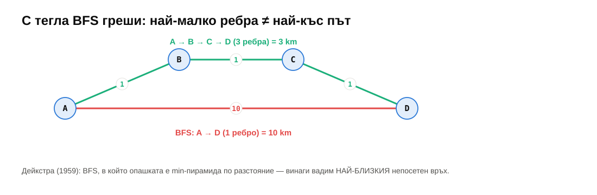

---

## Дейкстра стъпка по стъпка

<div class="r-stack">
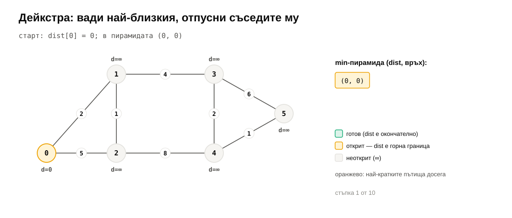
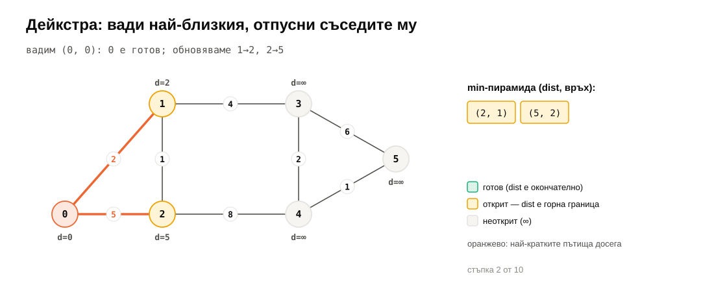
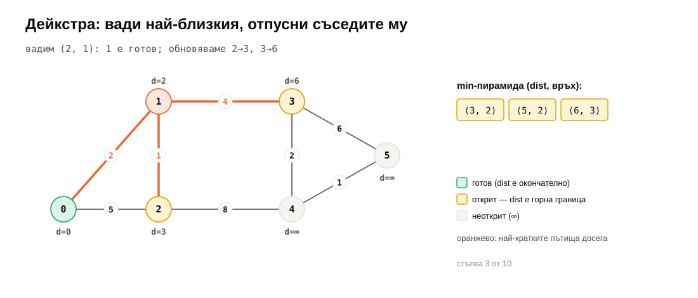
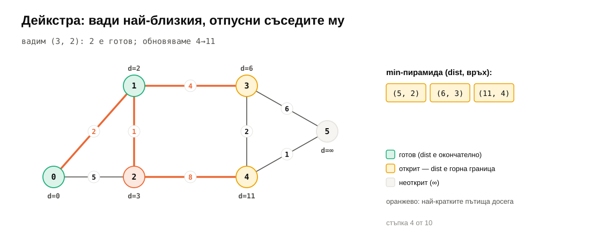
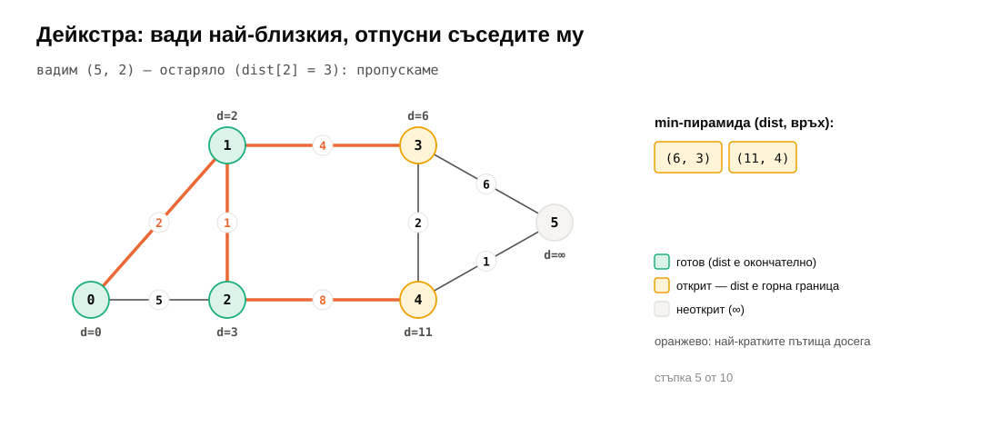
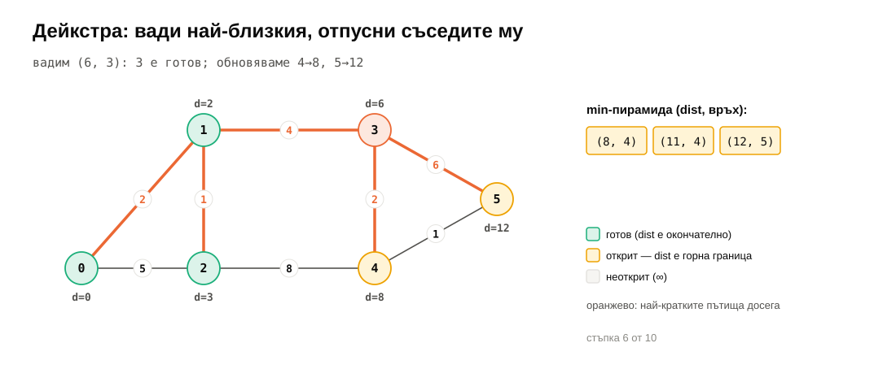
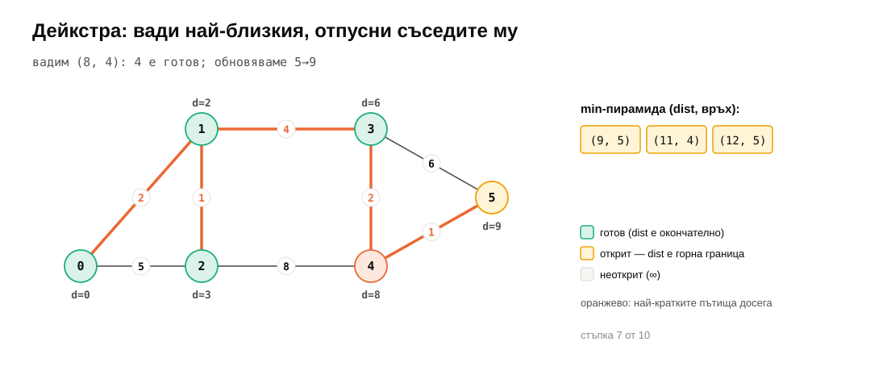
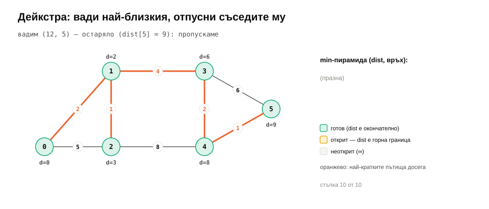
</div>

---

## Само тегла $\ge 0$

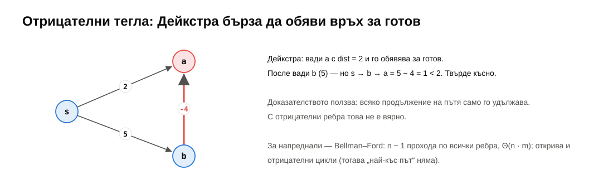

---

## Union-find

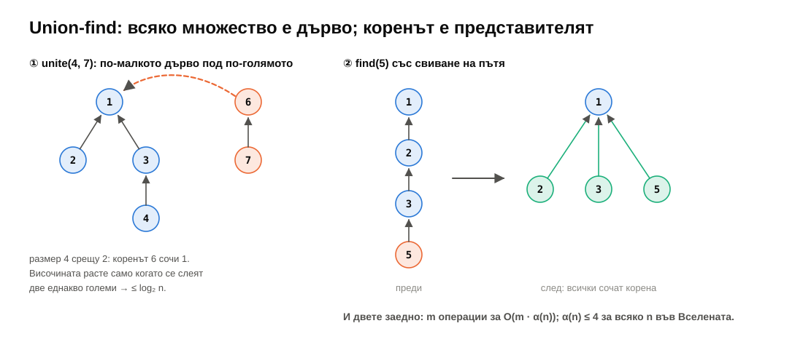

---

## Kruskal

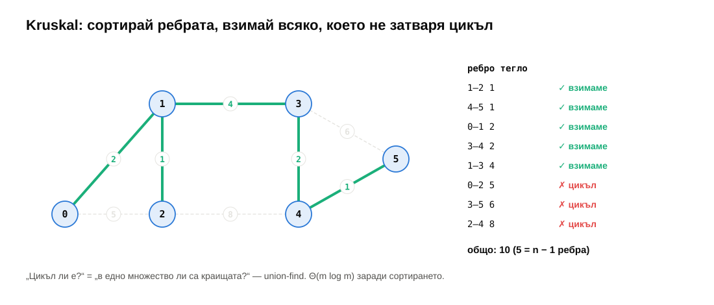

---

## Битовете за 3 минути

<div class="r-stack">


</div>

<p class="small">Подробно: <a href="../15-bitwise-retrospective/notes.md">записки за седмица 15</a></p>

---

<!-- .slide: data-background-color="#dcf3ea" -->

# На живо: Дейкстра

<p class="small">20 минути · BFS с пирамида · бъгът, който тестовете не хващат</p>

---

## BFS с пирамида

```cpp
using Item = std::pair<long long, int>;   // (distance, vertex)
std::priority_queue<Item, std::vector<Item>, std::greater<Item>> heap;   // MIN-heap
dist[s] = 0;
heap.push({0, s});
while (!heap.empty()) {
    auto [d, u] = heap.top(); heap.pop();
    if (d > dist[u]) continue;              // stale: lazy deletion
    for (const Edge& e : adj[u])
        if (d + e.w < dist[e.to]) {          // relax
            dist[e.to] = d + e.w;
            heap.push({dist[e.to], e.to});
        }
}
```

---

## Забравено `std::greater`

```text
                     min-пирамида          max-пирамида       разстоянията
n = 1 000              1 807 pops            391 280 pops       еднакви
n = 100 000          180 324 pops      3 683 567 181 pops       еднакви
```

<div class="box warn fragment">

Разстоянията са **верни** — тестовете минават. Работата е **20 000 пъти** повече. Бъг в бързодействието — хваща го само бенчмаркът.

</div>

---

<!-- .slide: data-background-color="#f6f5f2" -->

# ☕ Почивка

<p class="small"><code>git pull</code> · седмици 14 и 15</p>

---

<!-- .slide: data-background-color="#fde8df" -->

# Практика <span class="timer">35 мин</span>

<p class="small">По двойки · <code>ctest --preset default -R "^w1[45]/"</code></p>

---

## Задачи

| | Графи — `graphs2.h` | | Битове — `bits.h` |
|---|---|---|---|
| ★★ 1 | `dijkstra`, `dijkstraPath` | ★ 1 | двоично, get/set/clear/toggle |
| ★ 2 | `UnionFind` | ★ 2 | `popcount`, `isPowerOfTwo` |
| ★★ 3 | `kruskal`, `prim` | ★★ 3 | `nextPowerOfTwo`, XOR трик |
| ★★★ 4 | 0-1 BFS | ★★ 4 | подмножества, код на Грей |
| | | ★★★ 5 | N цариците с маски |

<p class="small">Ред: графи 1 → 2, после битове 1 → 2. Останалото — вкъщи.</p>

---

## Капани

- `std::priority_queue<Item>` без `std::greater` → max-пирамида (верни, но 20 000× по-бавно).
- `unite` без обединяване по размер → `height()` е $n - 1$, тестът пада.
- Kruskal без сортиране; Prim без проверка „вече в дървото“.
- `1 << 40` → недефинирано поведение. `u64{1} << 40`.
- `x & -x` с `unsigned` → MSVC предупреждава; `x & (~x + 1)` е същото.

---

## Бенчмарк: пирамида срещу масив

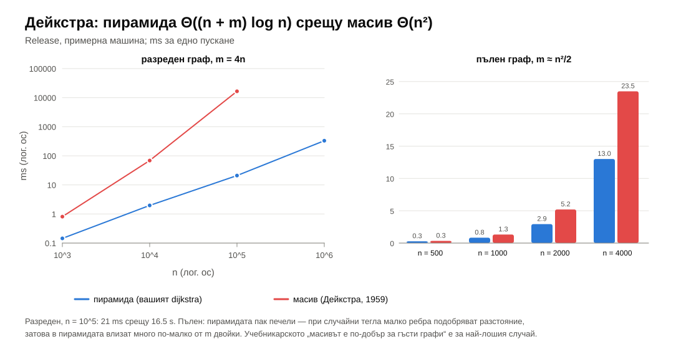

---

<!-- .slide: data-background-color="#e3eefb" -->

# Ретроспекция

<p class="small">15 минути · 14 седмици на една страница</p>

---

## Курсът на една страница


---

## Идеите, които се повтаряха

- **Сложността е граница, не прогноза** — векторът бие списъка; Дейкстра „за разредени“ бие „за гъсти“. *Мерете.*
- **Амортизация** — вектор ×2, два стека, итератор на BST, union-find.
- **Инварианти** — BST, AVL, пирамида, „готовите са окончателни“ в Дейкстра.
- **Локалност** — колони срещу редове, вектор срещу списък, B-дървета, CSR.
- **Компромиси** — памет/време, гаранция/среден случай, простота/скорост.
- **Тестове + ASan + бенчмарк** — всяка седмица.

---

## Коя структура?


---

## Какво следва

- **Изпитът:** таблиците „Обобщение“ и „Речник“ в края на всяка седмица; решенията и отговорите — в `solutions/` на всяка седмица.
- **Дизайн и анализ на алгоритми:** алчни алгоритми (Kruskal, Дейкстра), динамично програмиране, потоци.
- **ОС, бази данни, компилатори:** кеш, B-дървета, хеш таблици, дървета и графи на зависимости.
- **Практика:** Codeforces, LeetCode, AtCoder.

---

<!-- .slide: class="title-slide" -->

# Благодаря!

„Алгоритми + структури от данни = програми“ — Никлаус Вирт, 1976

<p class="small">Въпроси, бележки, грешки в материалите — в repo-то или директно. Успех на изпита!</p>
