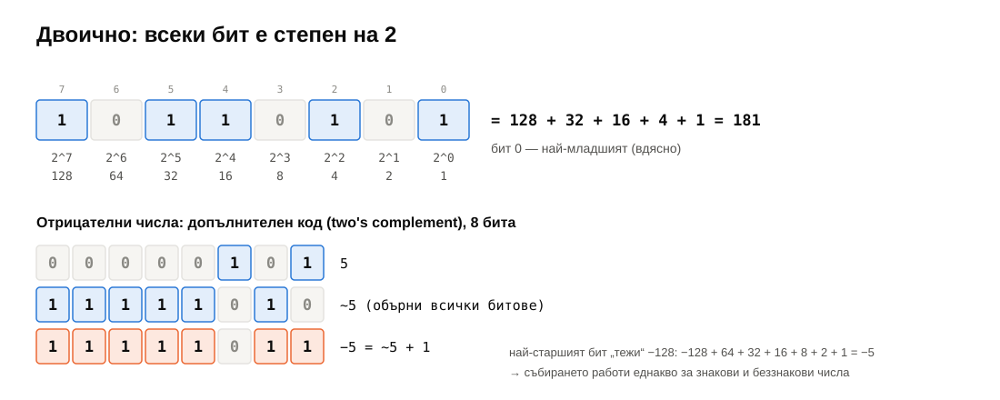
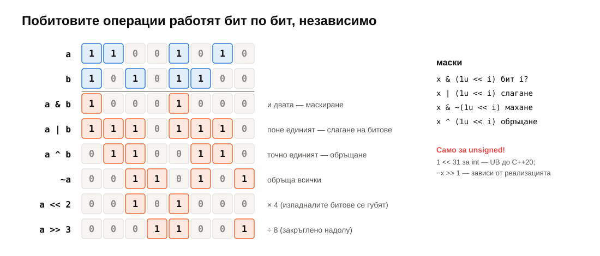
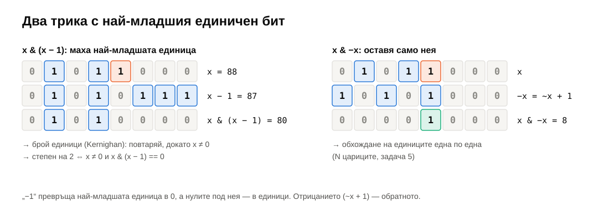
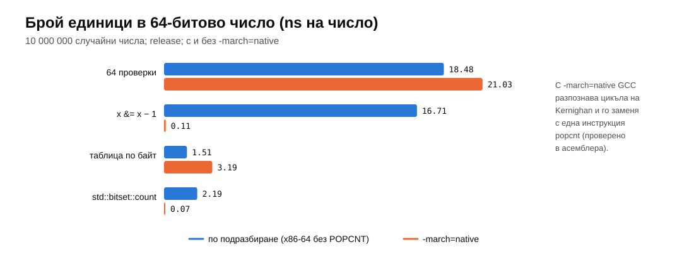
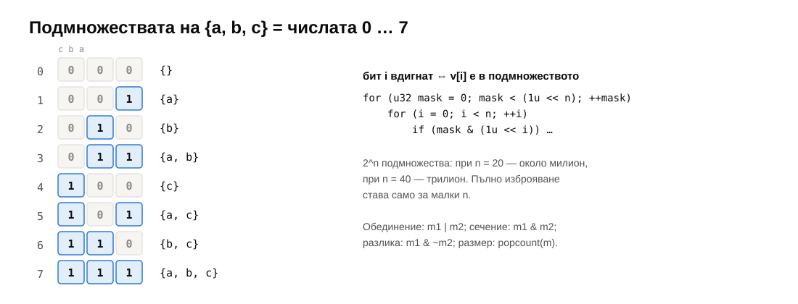
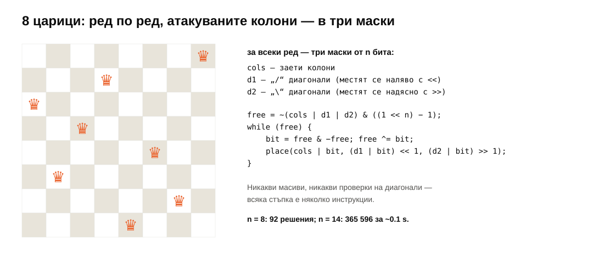
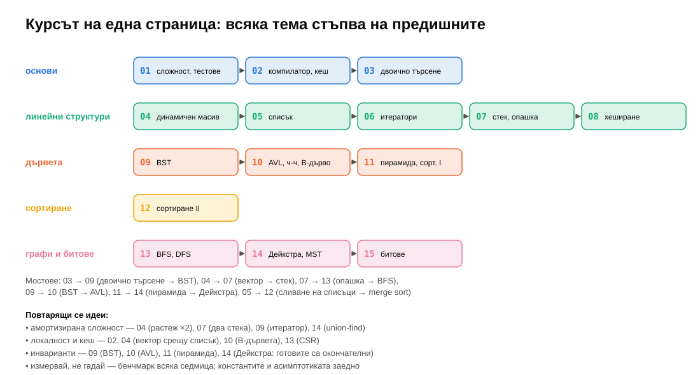
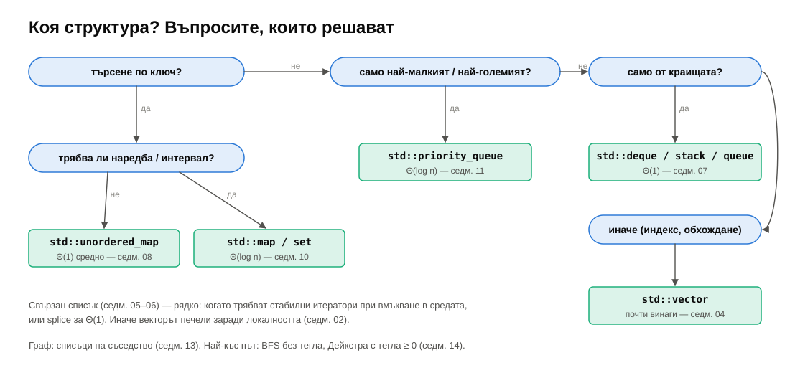

# Седмица 15 — Побитови операции. Ретроспекция на курса

> Семинар 14 (общ с [седмица 14](../14-graphs-2/notes.md)) · четвъртък, 21 януари 2027 · [слайдове](https://mishomish.github.io/fmi-kn-sdp-2026-2027-seminar/slides/?w=15-bitwise-retrospective) · [задачи](exercises.md) · [starter код](starter/) · [тестове](tests/)

Две части. Първата — **битовете**: как числата изглеждат отвътре, шестте побитови операции и няколко трика, които превръщат цикли в една-две инструкции (и които видяхме разпръснати из курса: кръговият буфер в седмица 07, `BitVector`, radix sort, хешовете). Втората — **ретроспекция**: целият курс на една страница, идеите, които се повтарят, и как да изберете структура за нова задача.

Блоковете **💡 Любопитно** и **🔬 За напреднали** са извън задължителния материал.

## Съдържание

1. [Двоична бройна система](#1-двоична-бройна-система)
2. [Побитови операции](#2-побитови-операции)
3. [Трикове](#3-трикове)
4. [Множества като битове](#4-множества-като-битове)
5. [В курса и в C++](#5-в-курса-и-в-c)
6. [Ретроспекция](#6-ретроспекция)
7. [Коя структура?](#7-коя-структура)
8. [Какво следва](#8-какво-следва)
9. [Речник](#9-речник) · [Литература](#10-литература)

---

## 1. Двоична бройна система



Число с битове $b_{k-1} \dots b_1 b_0$ е $\sum b_i \cdot 2^i$. Бит 0 е най-младшият (вдясно). Преобразуване към двоично: остатъкът при деление на 2 е най-младшият бит; делим и повтаряме (задача 1).

**Отрицателни числа — допълнителен код** (two's complement). В $k$ бита най-старшият бит „тежи“ $-2^{k-1}$ вместо $+2^{k-1}$. Затова $-x = \sim x + 1$ (обърни всички битове, добави 1), а $-1$ е „всички единици“. Предимството: събиране, изваждане и умножение работят **еднакво** за знакови и беззнакови числа — процесорът има една инструкция за събиране. Затова `int` е от $-2^{31}$ до $2^{31} - 1$: несиметрично — $-2^{31}$ няма положителен двойник, и `std::abs(INT_MIN)` е недефинирано поведение.

> [!NOTE]
> Шестнайсетичният запис е съкращение на двоичния: всяка шестнайсетична цифра е точно 4 бита. `0xFF` = `1111 1111`, `0x80000000` = единица в бит 31. Затова маските се пишат шестнайсетично. В C++14 и нататък има и двоични литерали: `0b1011`, с разделители `0b1011'0110`.

---

## 2. Побитови операции



| Операция | Бит по бит | Типична употреба |
|---|---|---|
| `a & b` | 1, ако и двата | **маскиране**: вземи само някои битове |
| `a \| b` | 1, ако поне единият | **слагане** на битове |
| `a ^ b` | 1, ако точно единият | **обръщане** на битове; „различни ли са?“ |
| `~a` | обратното | маска „всичко без …“ |
| `a << k` | измести наляво с $k$ | $a \cdot 2^k$ (изпадналите битове се губят) |
| `a >> k` | измести надясно с $k$ | $\lfloor a / 2^k \rfloor$ за беззнакови |

С маска `1u << i` (единица само в бит $i$):

```cpp
bool get   = (x >> i) & 1u;
x |=  (1u << i);    // set bit i
x &= ~(1u << i);    // clear bit i
x ^=  (1u << i);    // toggle bit i
```

> [!WARNING]
> **Само с `unsigned`.** При знакови числа: `1 << 31` за `int` е недефинирано поведение до C++20 (препълване); `x >> k` за отрицателно `x` до C++20 зависи от реализацията; изместване с $k \ge$ ширината на типа е **винаги** UB (`1u << 32` за 32-битов `unsigned`). Пишете `u32{1} << i` или `1u << i`, а за 64 бита — `u64{1} << i` (`1u << 40` е UB!).

---

## 3. Трикове



**`x & (x - 1)`** маха най-младшата единица: изваждането на 1 я превръща в 0, а нулите под нея — в единици; `&` нулира всичко от нея надолу.

- **Брой единици** (Kernighan): `while (x) { x &= x - 1; ++count; }` — толкова итерации, колкото са единиците, не 64.
- **Степен на 2** ⇔ точно една единица ⇔ `x != 0 && (x & (x - 1)) == 0`.

**`x & -x`** (за беззнакови: `x & (~x + 1)`) оставя **само** най-младшата единица. С `free ^= bit` обхождаме единиците една по една — N цариците (задача 5) и дърветата на Fenwick.

**Следващата степен на 2:** „размажете“ най-старшата единица надясно — `x |= x >> 1; x |= x >> 2; x |= x >> 4; …` — и всички битове под нея стават 1; добавете 1. Пет-шест инструкции вместо цикъл (задача 3). Така `std::vector` и хеш таблиците (седмица 08) закръглят капацитета.

**XOR трикът:** $a \oplus a = 0$, $a \oplus 0 = a$, и XOR е комутативен и асоциативен. XOR на всички елементи на масив, в който всеки е два пъти, освен един — дава този един. $O(n)$ време, $O(1)$ памет (задача 3).

> [!TIP]
> **💡 Любопитно: компилаторът разпознава цикъла.** В бенчмарка на задача 6 Kernighan брои 10 милиона числа за ~17 ns на число. Със `-march=native` — за **0.11 ns**: GCC разпознава `while (x) { x &= x - 1; ++c; }` като „брой единици“ и го заменя с **една** инструкция `popcnt` (проверено в асемблерния код), а после и векторизира. Седмица 02 отново: пишете ясен код, компилаторът знае идиомите.



---

## 4. Множества като битове

Подмножество на $\{0, \dots, n-1\}$ при $n \le 64$ е **едно число**: бит $i$ е вдигнат ⇔ $i$ е в множеството.

| Операция | С битове |
|---|---|
| обединение / сечение / разлика | `a \| b`, `a & b`, `a & ~b` |
| принадлежност | `(a >> i) & 1` |
| размер | `popcount(a)` |
| всички подмножества | `for (mask = 0; mask < (1u << n); ++mask)` |



$2^n$ подмножества — при $n = 20$ около милион, при $n = 40$ — трилион. Пълното изброяване е за малки $n$ (задача 4); за по-големи — динамично програмиране върху маски (курсът „Дизайн и анализ на алгоритми“).

**Код на Грей:** наредба на всички $n$-битови числа, в която съседните се различават в **един** бит: $g(i) = i \oplus (i \gg 1)$. Ползва се в енкодери на въртящи се оси (при прехода никога не се „виждат“ два бита наведнъж, значи няма грешно междинно четене) и за обхождане на подмножества с по една промяна на стъпка.

**N цариците с битове** (задача 5): ред по ред; три маски — заетите колони и двата вида диагонали. Свободните колони в реда са `~(cols | d1 | d2) & full`; при преминаване към следващия ред диагоналите се изместват с една позиция наляво/надясно. Никакви масиви, никакви проверки — $n = 14$ (365 596 решения) за ~0.1 s.



---

## 5. В курса и в C++

Битовете се появяваха през целия курс:

| Седмица | Къде |
|---|---|
| 02 | пробвайте в Compiler Explorer: `x * 8` става `x << 3`, а `x % 8` за `unsigned` — `x & 7` |
| 07 | кръговият буфер: `% capacity` → `& (capacity - 1)` при степен на 2 — 6× по-бързо |
| 07 | `BitVector` и проксито `BitRef` — 64 bool-а в една дума |
| 08 | хеш функции: FNV-1a (XOR и умножение), смесване на битове |
| 10 | на червено-черното дърво му трябва 1 бит за цвета (някои реализации го крият в указател) |
| 12 | radix sort по байтове: `(x >> shift) & 0xFF` |

В C++: `std::bitset<N>` (фиксиран размер, `count()`, `&`, `|`, `<<`), `std::vector<bool>` (седмица 07 — прокси), а в C++20 — `<bit>`: `std::popcount`, `std::countr_zero`, `std::has_single_bit`, `std::bit_ceil`, `std::rotl`. Права за файлове в Linux (`chmod 755` — три тройки битове `rwx`), флагове на `std::ios`, мрежови маски (`255.255.255.0`) — все битови маски.

> [!NOTE]
> **🔬 За напреднали: битбордове.** Шахматните програми пазят позицията като 12 числа по 64 бита — по едно за всеки вид фигура и цвят, по бит за всяко поле. Всички полета, атакувани от всички коне, са няколко измествания и `|`. Бързината на Stockfish до голяма степен идва оттам.

---

## 6. Ретроспекция



Четиринайсет седмици, около четиринайсет структури и два пъти повече алгоритми. Някои идеи обаче се повтаряха всеки път — те са по-ценни от всяка отделна структура.

**1. Сложността е граница, не прогноза.** $\Theta$ казва как расте времето; константите решават кое е по-бързо при вашето $n$. Видяхме го всяка седмица: векторът бие списъка, въпреки еднаквите $\Theta$ (седмица 02, 05); insertion sort бие quicksort под 16 елемента (седмица 11–12); Дейкстра с пирамида бие „по-добрата“ версия на гъсти графи (седмица 14). **Мерете.**

**2. Амортизация.** Някои операции са скъпи, но рядко, и плащат за много евтини: растежът на вектора ×2 (04), опашка от два стека (07), итераторът на BST (09), union-find (14). „Средно на операция за дълга поредица“ — не „средно по входове“.

**3. Инварианти.** Структура = данни + **правило**, което винаги е вярно: BST — всички вляво са по-малки (09); AVL — разлика във височините $\le 1$ (10); пирамида — родителят е по-голям (11); Дейкстра — извадените върхове са окончателни (14). Всяка операция е: наруши правилото локално, поправи го локално (ротация, siftDown).

**4. Локалност.** Кешът наказва скачането в паметта: колони срещу редове (02), вектор срещу списък (04–05), B-дървета (10), CSR (13). Масивът е често най-добрата структура дори когато асимптотиката казва друго.

**5. Компромиси.** Памет срещу време (хеш таблица, буфер в merge sort), гаранция срещу среден случай (балансирано дърво срещу хеш таблица, quicksort срещу heapsort), простота срещу скорост. Няма „най-добра“ структура — има най-подходяща за **въпросите**, които задавате.

**6. Тестове и инструменти.** Тест за всяка функция, сравнение с проста (бавна) реализация върху случайни входове, AddressSanitizer за всяка грешка в паметта, бенчмарк в release. Всяка седмица от курса беше построена така — и така се пише софтуер, на който може да се вярва.

---

## 7. Коя структура?



| Ви трябва… | Структура | Седмица |
|---|---|---|
| списък по индекс, обхождане | `std::vector` | 03–04 |
| добавяне/махане от краищата | `std::deque`, `stack`, `queue` | 07 |
| търсене по точен ключ | `std::unordered_map` / `set` | 08 |
| наредба, „следващият след x“, интервали | `std::map` / `set` | 09–10 |
| постоянно най-малкият / най-големият | `std::priority_queue` | 11 |
| $k$-тият, медиана | `std::nth_element` | 12 |
| връзки „кой с кого“ | списъци на съседство | 13 |
| „свързани ли са“, докато се добавят връзки | union-find | 14 |
| множество от малки числа | битова маска, `std::bitset` | 15 |

---

## 8. Какво следва

- **Изпитът.** Прегледайте записките на седмиците — таблиците „Обобщение“ и „Речник“ в края на всяка са най-краткият преговор. Отговорите на задачите са публикувани в `solutions/answers.md` на всяка седмица.
- **Дизайн и анализ на алгоритми** — алчни алгоритми (Kruskal и Дейкстра бяха такива), динамично програмиране (включително по битови маски), потоци в мрежи, NP-пълнота.
- **Операционни системи, бази данни, компилатори** — кешът и паметта (02), B-дърветата (10), хеш таблиците (08), синтактичните дървета и графите на зависимостите (09, 13).
- **Практика.** Codeforces, LeetCode, AtCoder — задачите там са точно структурите от курса под различни имена. Най-добрият начин да ги запомните е да ги ползвате.

> [!TIP]
> **💡 Любопитно.** „Алгоритми + структури от данни = програми“ — заглавието на книгата на Никлаус Вирт от 1976 г. (създателят на Pascal). Половин век по-късно е все така вярно.

---

## 9. Речник

| Български | English |
|---|---|
| бит, байт, дума | bit, byte, word |
| най-младши / най-старши бит | least / most significant bit (LSB / MSB) |
| допълнителен код | two's complement |
| побитово И / ИЛИ / изключващо ИЛИ / НЕ | bitwise AND / OR / XOR / NOT |
| изместване наляво / надясно | left / right shift |
| маска | mask |
| вдигане / сваляне / обръщане на бит | set / clear / toggle a bit |
| брой единици | population count (popcount), Hamming weight |
| код на Грей | Gray code |
| битово поле, битов вектор | bit field, bitset |
| амортизирана сложност | amortized complexity |
| инвариант | invariant |
| локалност | locality |
| компромис | trade-off |

---

## 10. Литература

- H. S. Warren. *Hacker's Delight*, 2nd ed., 2012 — библията на битовите трикове.
- S. E. Anderson. [„Bit Twiddling Hacks“](https://graphics.stanford.edu/~seander/bithacks.html), Stanford — стотици трикове с обяснения.
- D. Knuth. *The Art of Computer Programming*, том 4A, §7.1.3 „Bitwise Tricks and Techniques“.
- [cppreference — `<bit>`](https://en.cppreference.com/w/cpp/header/bit) (C++20), [`std::bitset`](https://en.cppreference.com/w/cpp/utility/bitset).
- N. Wirth. *Algorithms + Data Structures = Programs*, 1976.
- За целия курс: T. Cormen и др. *Introduction to Algorithms*; R. Sedgewick, K. Wayne. *Algorithms*, 4th ed.; S. Skiena. *The Algorithm Design Manual*.
